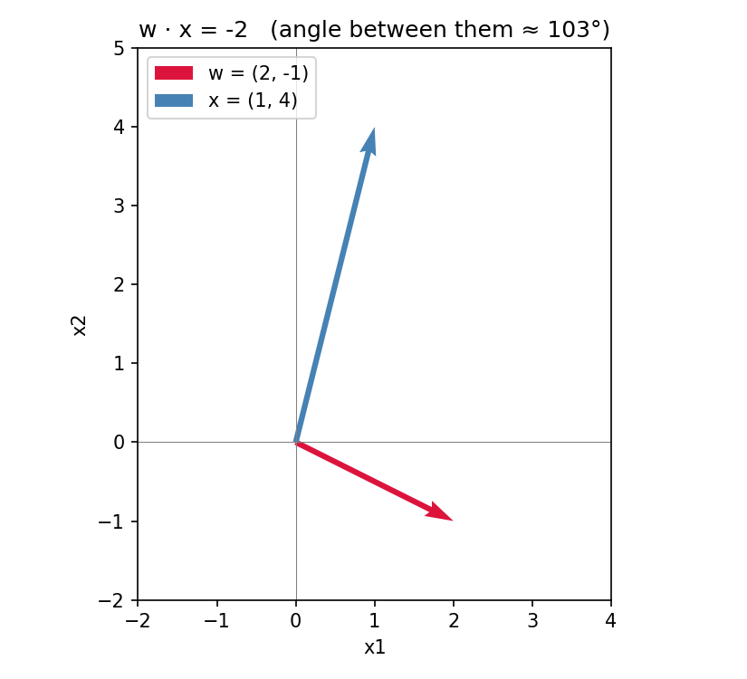
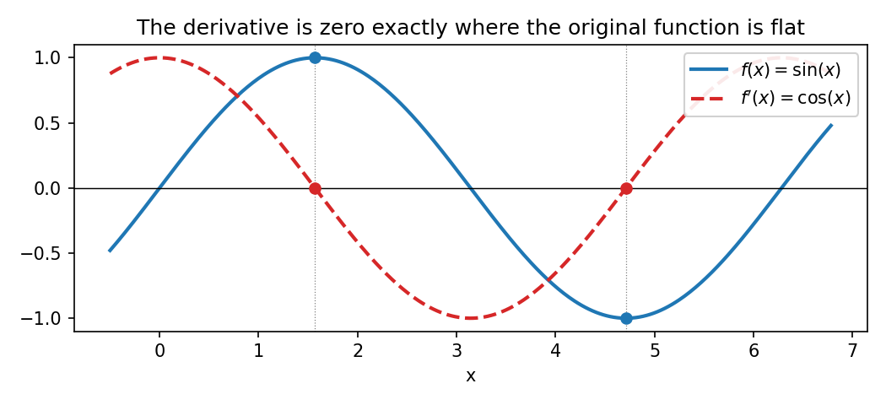
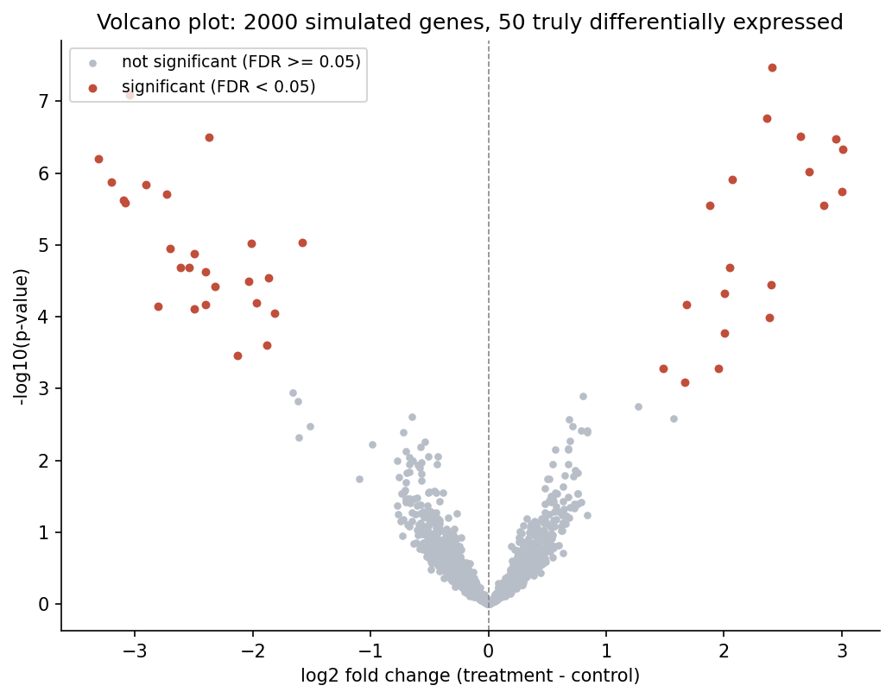

::: callout-note
**Sources for this page:** d2l.ai, *Dive into Deep Learning*, [Preliminaries](https://d2l.ai/chapter_preliminaries/index.html) (§2.3 Linear Algebra, §2.5 Calculus, §2.6 Probability and Statistics) — CC BY-SA 4.0; Wikipedia, [Dot product](https://en.wikipedia.org/wiki/Dot_product), [Norm (mathematics)](https://en.wikipedia.org/wiki/Norm_(mathematics)), [Matrix norm](https://en.wikipedia.org/wiki/Matrix_norm), [Cross product](https://en.wikipedia.org/wiki/Cross_product), [Unit vector](https://en.wikipedia.org/wiki/Unit_vector), [Eigenvalues and eigenvectors](https://en.wikipedia.org/wiki/Eigenvalues_and_eigenvectors), [Tensor](https://en.wikipedia.org/wiki/Tensor), [Gradient](https://en.wikipedia.org/wiki/Gradient), [Chain rule](https://en.wikipedia.org/wiki/Chain_rule), [Bayes' theorem](https://en.wikipedia.org/wiki/Bayes%27_theorem), [P-value](https://en.wikipedia.org/wiki/P-value), [Student's t-test](https://en.wikipedia.org/wiki/Student%27s_t-test), [Multiple comparisons problem](https://en.wikipedia.org/wiki/Multiple_comparisons_problem), [False discovery rate](https://en.wikipedia.org/wiki/False_discovery_rate), [Volcano plot (statistics)](https://en.wikipedia.org/wiki/Volcano_plot_(statistics)), [Exponential function](https://en.wikipedia.org/wiki/Exponential_function), [Logarithm](https://en.wikipedia.org/wiki/Logarithm), [Sigmoid function](https://en.wikipedia.org/wiki/Sigmoid_function), [Integral](https://en.wikipedia.org/wiki/Integral), [Variance](https://en.wikipedia.org/wiki/Variance), [Standard deviation](https://en.wikipedia.org/wiki/Standard_deviation), [Normal distribution](https://en.wikipedia.org/wiki/Normal_distribution) — CC BY-SA 4.0. Text below is written from scratch, not copied, following these ideas; standard results (the geometric dot-product formula, the chain rule, Bayes' theorem, the t-test formula) are stated in the conventional way found in any of these sources. The volcano-plot figure uses simulated data, generated for this book.
:::

# Day 1: Math Prerequisites

This is a refresher, not a first encounter. The goal isn't to re-teach linear algebra, calculus, or probability from zero — it's to consolidate exactly the pieces this course actually uses, work through them with real numbers, and show you *where* each one shows up later, so none of it feels like disconnected math-for-its-own-sake. There's no coding today; that's Day 2 — though the notebook linked at the bottom lets you check today's by-hand answers in code if you're curious.

The session is in three parts: vectors and matrices (including the dot product, cross product, eigenvalues, and a first look ahead to tensors), derivatives and gradient descent, then probability and Bayes' rule. Each part ends with a practice problem, a quick self-check, and a short video if you'd like the idea animated.

## Learning goals

By the end of this session you should be able to compute the length of a vector and the Frobenius norm of a matrix, compute a dot product by hand and interpret it geometrically, normalize a vector and compute a cross product, find the eigenvalues of a small matrix by hand, take a partial derivative of a simple multivariable function and use it to run a step of gradient descent, recall the derivative of the handful of functions that come up constantly in this course, explain integration as the reverse of differentiation, compute the variance and standard deviation of a simple random variable and describe the 68-95-99.7 rule for a normal distribution, apply Bayes' rule to a concrete conditional-probability problem, explain what a p-value does and doesn't mean, run a two-sample t-test, explain why testing thousands of genes at once requires correcting for multiple testing, and explain why logarithms turn multiplication into addition and what the sigmoid function does.

## Part 1: Vectors and matrices

::: {.callout-tip icon="false"}
## A more villainous definition

> "It's a mathematical term, represented by an arrow with both direction and magnitude. Vector! That's me, because I commit crimes with both direction and magnitude." — Vector, in *Despicable Me* (2010)

He's not wrong — that's exactly the geometric picture of a vector this session builds on.
:::

A vector is just an ordered list of numbers. You already know how to add two vectors (add corresponding entries) and how to scale one (multiply every entry by the same number).

### Length, absolute value, and size

For a single number, $|x|$ measures its distance from zero — how big it is, ignoring sign. Vectors and matrices generalize this the same way they generalize everything else in this session.

For a vector, the natural generalization is its **length** (also called its **norm**), written $\lVert \mathbf{v} \rVert$: a direct extension of the Pythagorean theorem to more than two dimensions,

$$
\lVert \mathbf{v} \rVert = \sqrt{v_1^2 + v_2^2 + \dots + v_n^2}
$$

**Worked example.** For $\mathbf{v} = (3, 4)$:

$$
\lVert \mathbf{v} \rVert = \sqrt{3^2 + 4^2} = \sqrt{25} = 5
$$

— literally the hypotenuse of a 3-4-5 right triangle.

Matrices generalize the same idea once more: treat every entry as part of one long vector, and the same formula gives the matrix's **Frobenius norm**,

$$
\lVert A \rVert_F = \sqrt{\textstyle\sum_{i,j} a_{ij}^2}
$$

a single number measuring how "big" a matrix is overall. This turns out to be useful throughout the rest of this course — for instance, for measuring how much two matrices differ (the norm of their difference), or how large a set of learned weights has grown during training.

The one operation worth slowing down on next is the **dot product**:

$$
\mathbf{w} \cdot \mathbf{x} = w_1 x_1 + w_2 x_2 + \dots + w_n x_n
$$

This is nothing more than "multiply corresponding entries, then add everything up" — but it's worth naming because it shows up constantly. It's a **weighted sum**: each $x_i$ contributes to the total in proportion to its own weight $w_i$.

**Worked example.** For $\mathbf{w} = (2, -1)$ and $\mathbf{x} = (1, 4)$:

$$
\mathbf{w} \cdot \mathbf{x} = (2)(1) + (-1)(4) = 2 - 4 = -2
$$

The dot product also has a geometric meaning that's worth having in your head, not just the arithmetic definition:

$$
\mathbf{w} \cdot \mathbf{x} = \lVert \mathbf{w} \rVert \, \lVert \mathbf{x} \rVert \cos\theta
$$

where $\theta$ is the angle between the two vectors and $\lVert \cdot
\rVert$ is the length defined above. This tells you the *sign* of a dot product for free, without computing anything: it's positive when the angle between the vectors is less than 90° (they point in broadly the same direction), zero when they're exactly perpendicular, and negative when the angle exceeds 90° (they point in broadly opposite directions). In the worked example above, $\mathbf{w}$ and $\mathbf{x}$ are about 103° apart — just past perpendicular — which is exactly why their dot product came out negative:

{width="55%"}

Why does this one specific computation deserve a whole session's worth of attention before we've even started the course proper? Because it reappears, unchanged, in two very different-looking places later in this course. A **profile score** (Day 5) — the standard way of asking "how well does this sequence match a known family?" — is computed by multiplying each position's observed value by a position-specific weight and summing. And a **perceptron** (Day 6), the simplest kind of artificial neuron, computes its output the exact same way: a dot product between a weight vector and an input vector. When we get there, you'll already know the arithmetic *and* the geometric intuition; the only new part will be what to *do* with the result.

### Normalization

Dividing a vector by its own length produces a **unit vector** — a vector pointing the same direction, but with length exactly 1:

$$
\hat{\mathbf{w}} = \frac{\mathbf{w}}{\lVert \mathbf{w} \rVert}
$$

**Worked example.** For $\mathbf{w} = (2, -1)$ from above, the length formula gives $\lVert \mathbf{w} \rVert = \sqrt{5} \approx 2.236$, so

$$
\hat{\mathbf{w}} = \left( \frac{2}{\sqrt{5}}, \frac{-1}{\sqrt{5}} \right) \approx (0.894, -0.447)
$$

Normalizing is exactly what removes the $\lVert \mathbf{w} \rVert$ factor from the geometric dot-product formula above, leaving only the angle behind. This matters in practice: two "profile" weight vectors that point in the same direction but were written down at different scales — say, one is exactly ten times the other — give wildly different raw dot products, even though they represent the same underlying match; normalizing both to unit vectors first makes their scores directly comparable. (This is exactly the surprise in this session's in-class discussion problem, if you've done it.)

### Cross product

The dot product isn't the only way to combine two vectors. For vectors in three dimensions specifically, the **cross product** $\mathbf{a}
\times \mathbf{b}$ produces a *new vector* — not a number — perpendicular to both $\mathbf{a}$ and $\mathbf{b}$:

$$
\mathbf{a} \times \mathbf{b} = \begin{pmatrix} a_2 b_3 - a_3 b_2 \\ a_3 b_1 - a_1 b_3 \\ a_1 b_2 - a_2 b_1 \end{pmatrix}
$$

**Worked example.** For $\mathbf{a} = (2, -1, 3)$ and $\mathbf{b} = (1,
4, 0)$:

$$
\mathbf{a} \times \mathbf{b} = \big((-1)(0) - (3)(4),\ \ (3)(1) - (2)(0),\ \ (2)(4) - (-1)(1)\big) = (-12,\ 3,\ 9)
$$

Its length equals $\lVert \mathbf{a} \rVert \, \lVert \mathbf{b} \rVert
\sin\theta$ — the *sine*, where the dot product uses *cosine* — so the cross product is largest when the two vectors are perpendicular and zero when they're parallel, the opposite pattern from the dot product. Unlike the dot product, the cross product doesn't generalize to arbitrary dimensions the same way — it's specifically a 3-dimensional operation. It shows up in structural biology whenever a direction perpendicular to a plane is needed, e.g. the normal to the plane defined by three backbone atoms.

### Matrices

A matrix is a rectangular grid of numbers — you can think of it as a table, or as a stack of vectors (its rows, or equally its columns). Matrix–vector and matrix–matrix multiplication are the dot product done many times at once: a matrix–vector product is just a batch of dot products, one per row of the matrix. For example,

$$
\begin{pmatrix} 2 & -1 \\ 0 & 3 \end{pmatrix}
\begin{pmatrix} 1 \\ 4 \end{pmatrix}
=
\begin{pmatrix} (2)(1) + (-1)(4) \\ (0)(1) + (3)(4) \end{pmatrix}
=
\begin{pmatrix} -2 \\ 12 \end{pmatrix}
$$

— the first entry of the result is exactly the worked-example dot product from above; the second is a new dot product between the matrix's second row and the same vector.

This "many dot products in one operation" view is exactly how Day 6's perceptron code is written: instead of looping over training examples one at a time and computing $w_1 x_1 + w_2 x_2 + b$ by hand for each, stacking every example as a row of a matrix $X$ and computing `X @ w` performs all of those weighted sums — one matrix-vector product, no explicit loop. Same arithmetic as above, just applied to many rows at once.

### Eigenvalues and eigenvectors

A matrix $A$ transforms any vector it multiplies — usually changing both its length and its direction. For most matrices, though, a handful of special directions are left *unchanged in orientation* by the transformation — only stretched or shrunk. Such a vector $\mathbf{v}$ is an **eigenvector** of $A$, and the factor it's scaled by is the corresponding **eigenvalue** $\lambda$:

$$
A \mathbf{v} = \lambda \mathbf{v}
$$

**Worked example.** For $A = \begin{pmatrix} 2 & 1 \\ 1 & 2 \end{pmatrix}$, solving $\det(A - \lambda I) = 0$:

$$
(2-\lambda)^2 - 1 = 0 \quad\Rightarrow\quad 2 - \lambda = \pm 1 \quad\Rightarrow\quad \lambda = 1 \text{ or } 3
$$

For $\lambda = 3$: $(A - 3I)\mathbf{v} = 0$ gives $\mathbf{v} = (1, 1)$ (any scalar multiple works just as well — eigenvectors are only defined up to scale, which is exactly why normalizing them, as above, is standard practice: $\hat{\mathbf{v}} = (1/\sqrt2,\, 1/\sqrt2)$). For $\lambda = 1$: $\mathbf{v} = (1, -1)$.

Geometrically: multiplying any vector along the direction $(1,1)$ by $A$ just stretches it by 3; multiplying any vector along $(1,-1)$ stretches it by only 1. Every other vector gets rotated toward $(1,1)$ as well as stretched, because it's some mixture of both eigenvectors. Eigenvalues and eigenvectors turn up throughout data analysis and machine learning wherever you need to understand what a matrix *does* to space — for instance, dimensionality-reduction methods like PCA find the directions of greatest variance in a dataset by finding the eigenvectors of its covariance matrix.

### A first look ahead: tensors

Vectors and matrices are the first two members of a bigger family called **tensors**: a single number is a 0-dimensional tensor, a vector is 1-dimensional, a matrix is 2-dimensional, and a tensor can keep going to 3 dimensions (a stack of matrices) or higher still. Day 2 introduces tensors properly — as the one data structure PyTorch uses for everything, precisely because the same operations used throughout this page (addition, scaling, the dot product) generalize cleanly to any number of dimensions.

**Practice problems.**

1.  Compute the length of $\mathbf{v} = (1, 2, 2)$ and the Frobenius norm of $A = \begin{pmatrix} 1 & 0 \\ 0 & 1 \end{pmatrix}$.
2.  Compute $(2, -1, 3) \cdot (1, 4, 0)$.
3.  Normalize $\mathbf{v} = (3, 4)$.
4.  Compute $(1, 2, 0) \times (0, 1, 3)$.
5.  Find the eigenvalues of $A = \begin{pmatrix} 1 & 2 \\ 2 & 1 \end{pmatrix}$.

::: {.callout-note collapse="true"}
## Solutions

1.  $\lVert \mathbf{v} \rVert = \sqrt{1^2+2^2+2^2} = \sqrt{9} = 3$; $\lVert A \rVert_F = \sqrt{1^2+0^2+0^2+1^2} = \sqrt{2} \approx 1.414$.
2.  $(2)(1) + (-1)(4) + (3)(0) = 2 - 4 + 0 = -2$.
3.  $\lVert \mathbf{v} \rVert = \sqrt{3^2+4^2} = 5$, so $\hat{\mathbf{v}} = (0.6, 0.8)$.
4.  $\big((2)(3)-(0)(1),\ (0)(0)-(1)(3),\ (1)(1)-(2)(0)\big) = (6, -3, 1)$.
5.  $(1-\lambda)^2 - 4 = 0 \Rightarrow 1-\lambda = \pm 2 \Rightarrow \lambda = 3$ or $\lambda = -1$.
:::

**Check your understanding:**

```{=html}
<div id="day01-quiz-1"></div>
<script>
renderQuiz("day01-quiz-1", [
  {
    question: "What is the length (norm) of the vector (0, 3, 4)?",
    choices: ["7", "5", "25", "3.5"],
    correctIndex: 1,
    explanation: "‖(0,3,4)‖ = &radic;(0² + 3² + 4²) = &radic;25 = 5."
  },
  {
    question: "What is the dot product of (3, 2) and (-1, 4)?",
    choices: ["-11", "5", "11", "-5"],
    correctIndex: 1,
    explanation: "(3)(-1) + (2)(4) = -3 + 8 = 5."
  },
  {
    question: "Two nonzero vectors point in broadly opposite directions (the angle between them exceeds 90°). Without computing anything, what can you say about their dot product?",
    choices: ["It must be positive", "It must be negative", "It must be exactly zero", "Its sign can't be determined from the angle alone"],
    correctIndex: 1,
    explanation: "cos(&theta;) is negative for any angle past 90°, so the whole dot product is negative."
  },
  {
    question: "What is the unit vector in the same direction as (3, 4)?",
    choices: ["(0.6, 0.8)", "(3, 4)", "(1, 1)", "(0.8, 0.6)"],
    correctIndex: 0,
    explanation: "‖(3,4)‖ = 5, so the unit vector is (3/5, 4/5) = (0.6, 0.8)."
  },
  {
    question: "For two vectors in 3D, what does their cross product a × b represent, geometrically?",
    choices: [
      "A new vector perpendicular to both a and b",
      "The angle between a and b",
      "The projection of a onto b",
      "A scalar equal to ‖a‖‖b‖cos(&theta;)"
    ],
    correctIndex: 0,
    explanation: "Unlike the dot product (a number), the cross product produces a new vector, perpendicular to both inputs."
  },
  {
    question: "For A = [[2,1],[1,2]], which of the following is an eigenvector of A?",
    choices: ["(1, 1)", "(1, 0)", "(0, 1)", "(2, 1)"],
    correctIndex: 0,
    explanation: "A(1,1) = (2+1, 1+2) = (3,3) = 3×(1,1) — same direction, scaled by 3."
  },
  {
    question: "If Av = λv for some nonzero vector v, what does λ represent?",
    choices: [
      "The factor v is scaled by under the transformation A, with its direction unchanged",
      "The determinant of A",
      "The number of dimensions of v",
      "The angle between v and Av"
    ],
    correctIndex: 0,
    explanation: "That's the definition of an eigenvalue — v is an eigenvector, λ is how much A stretches or shrinks it."
  }
]);
</script>
```

### Further reading

- Wikipedia, [Norm (mathematics)](https://en.wikipedia.org/wiki/Norm_(mathematics)) and [Matrix norm](https://en.wikipedia.org/wiki/Matrix_norm)
- Wikipedia, [Dot product](https://en.wikipedia.org/wiki/Dot_product) — the algebra in more generality than needed here (complex vectors, function spaces)
- Wikipedia, [Unit vector](https://en.wikipedia.org/wiki/Unit_vector) and [Cross product](https://en.wikipedia.org/wiki/Cross_product)
- Wikipedia, [Eigenvalues and eigenvectors](https://en.wikipedia.org/wiki/Eigenvalues_and_eigenvectors) — diagonalization and the general N×N case, beyond the 2×2 worked example above
- Wikipedia, [Tensor](https://en.wikipedia.org/wiki/Tensor) — the general mathematical object; Day 2 covers the practical, code-first version
- d2l.ai, [Linear Algebra](https://d2l.ai/chapter_preliminaries/linear-algebra.html) — matrices and norms at the same level as above, with code

### Further watching

[*Dot products and duality*](https://www.youtube.com/watch?v=LyGKycYT2v0) (3Blue1Brown, Essence of Linear Algebra, ch. 9), animating the geometric picture above:

```{=html}
<div style="position:relative;padding-bottom:56.25%;height:0;overflow:hidden;max-width:100%;margin-bottom:1em;">
<iframe src="https://www.youtube.com/embed/LyGKycYT2v0" style="position:absolute;top:0;left:0;width:100%;height:100%;border:0;" allowfullscreen title="Dot products and duality, 3Blue1Brown"></iframe>
</div>
```

[*Cross products*](https://www.youtube.com/watch?v=eu6i7WJeinw) (3Blue1Brown, Essence of Linear Algebra, ch. 10):

```{=html}
<div style="position:relative;padding-bottom:56.25%;height:0;overflow:hidden;max-width:100%;margin-bottom:1em;">
<iframe src="https://www.youtube.com/embed/eu6i7WJeinw" style="position:absolute;top:0;left:0;width:100%;height:100%;border:0;" allowfullscreen title="Cross products, 3Blue1Brown"></iframe>
</div>
```

[*Eigenvectors and eigenvalues*](https://www.youtube.com/watch?v=PFDu9oVAE-g) (3Blue1Brown, Essence of Linear Algebra, ch. 14):

```{=html}
<div style="position:relative;padding-bottom:56.25%;height:0;overflow:hidden;max-width:100%;margin-bottom:1em;">
<iframe src="https://www.youtube.com/embed/PFDu9oVAE-g" style="position:absolute;top:0;left:0;width:100%;height:100%;border:0;" allowfullscreen title="Eigenvectors and eigenvalues, 3Blue1Brown"></iframe>
</div>
```

## Part 2: Derivatives, the gradient, and gradient descent

A derivative tells you how much a function's output changes for a small change in its input — the slope of the tangent line at a point. If you've seen this before, that's the whole idea; what's worth reviewing is what happens once there's more than one input.

A **partial derivative** of a function of several variables, written $\partial y / \partial x_i$, is computed by treating every variable except $x_i$ as a constant and differentiating as usual. If you stack all of a function's partial derivatives into a single vector, you get its **gradient**:

$$
\nabla y = \left( \frac{\partial y}{\partial x_1}, \dots, \frac{\partial y}{\partial x_n} \right)
$$

**Worked example.** For $f(x_1, x_2) = 3x_1^2 + 2x_1 x_2$:

$$
\frac{\partial f}{\partial x_1} = 6x_1 + 2x_2, \qquad \frac{\partial f}{\partial x_2} = 2x_1
$$

(For $\partial f/\partial x_1$, $x_2$ is held constant, so $2x_1 x_2$ differentiates like $2x_2 \cdot x_1$, giving $2x_2$; for $\partial
f/\partial x_2$, $x_1$ is held constant, so $3x_1^2$ contributes nothing and $2x_1 x_2$ differentiates to $2x_1$.) At the point $(1, 2)$:

$$
\nabla f(1, 2) = (6(1) + 2(2), \ 2(1)) = (10, 2)
$$

Geometrically, the gradient at a point tells you two things at once: the *direction* in which the function increases fastest, and (via its length) *how steeply*. Point yourself in the opposite direction, and you're headed downhill as fast as possible from where you're standing.

That last sentence is the entire idea behind **gradient descent**, which Day 6 uses to train the perceptron introduced above. Given a function that measures how wrong a model's predictions are (a *loss function*), repeatedly step a small amount in the direction opposite its gradient, and the error goes down. Concretely, the update rule is

$$
x_{n+1} = x_n - \eta \, f'(x_n)
$$

where $\eta$ (eta) is a small positive **learning rate** controlling the step size. Let's watch this actually converge, one step at a time, for the one-variable function $f(x) = (x - 3)^2$, whose derivative is $f'(x) =
2(x-3)$, starting from $x_0 = 0$ with $\eta = 0.3$:

| $n$ | $x_n$ | $f(x_n)$ | $f'(x_n)$ | $x_{n+1} = x_n - 0.3 f'(x_n)$ |
|-----|-------|----------|-----------|-------------------------------|
| 0   | 0.000 | 9.00     | -6.00     | 1.800                         |
| 1   | 1.800 | 1.44     | -2.40     | 2.520                         |
| 2   | 2.520 | 0.23     | -0.96     | 2.808                         |
| 3   | 2.808 | 0.037    | -0.384    | 2.923                         |

Notice two things: $x_n$ is closing in on 3 (the true minimum, where $f'(x) = 0$), and the *steps themselves* shrink as it gets closer, purely because the derivative shrinks — nobody had to manually decrease $\eta$. This exact table-of-iterations idea is what you'll watch happen inside a real model's training loop, starting Day 6, except with many weights being updated at once via the gradient vector instead of one number via a single derivative.

One more idea from calculus matters more than any other for this course: the **chain rule**. For a composite function $y = f(g(x))$, its derivative is

$$
\frac{dy}{dx} = \frac{df}{dg} \cdot \frac{dg}{dx}
$$

— the derivative of a function of a function is the product of their individual derivatives. It looks unremarkable written down, but it is, quite literally, the one idea backpropagation (Day 9) is built from: a neural network's output is a function of a function of a function of its weights, and the chain rule is what lets us compute how each weight, however deeply buried, should change, by multiplying together the derivatives of every function it passes through on the way to the output.

### Derivative cheat sheet

A short table of the derivatives that come up constantly throughout this course — worth having memorized rather than re-derived every time:

| $f(x)$                     | $f'(x)$                    |
|----------------------------|----------------------------|
| constant $c$               | $0$                        |
| $x^n$                      | $n x^{n-1}$                |
| $e^x$                      | $e^x$                      |
| $\ln(x)$                   | $1/x$                      |
| $\sin(x)$                  | $\cos(x)$                  |
| $\cos(x)$                  | $-\sin(x)$                 |
| $\sigma(z) = 1/(1+e^{-z})$ | $\sigma(z)\,(1-\sigma(z))$ |

The last row is worth flagging specifically: it's the exact derivative Day 9's backpropagation needs for every sigmoid-activated unit in a network, and the reason it's usually written in terms of $\sigma(z)$ itself (rather than re-expanded in $e^{-z}$) is that, once you've already computed $\sigma(z)$ on the forward pass, its derivative costs nothing extra to get.

A derivative is zero exactly where a function is momentarily flat — at a peak, a trough, or an inflection with a horizontal tangent. $\sin(x)$ and its derivative $\cos(x)$ make this visible directly:

{width="85%"}

### Integrals

Integration is differentiation run backwards: given a derivative, find the function it came from. Geometrically, the **definite integral** $\int_a^b f(x)\,dx$ is the area under $f$'s curve between $a$ and $b$; the **indefinite integral** $\int f(x)\,dx$ recovers a whole family of functions differing only by a constant $C$ (since a constant's own derivative is always zero, per the cheat sheet above, integration alone can never tell which constant the original function had).

**Worked example.** This page already differentiated $f(x) = (x-3)^2$ into $f'(x) = 2(x-3)$, for the gradient-descent table further up. Integrating goes the other direction and should recover $f$ itself, up to a constant:

$$
\int 2(x-3)\,dx = (x-3)^2 + C
$$

— exactly the $f(x)$ this whole worked example started from. This is the informal **Fundamental Theorem of Calculus**: integration and differentiation are inverse operations.

Two places this shows up later in the course, both without ever needing to solve an integral symbolically by hand: a continuous probability density (introduced in Part 3 below) is not itself a probability — it's the *area under* a stretch of it, i.e. its integral over that range, that gives an actual probability. And starting Day 8, "area under the ROC curve" (AUROC) and "area under the precision-recall curve" (AUPR) are two of this course's standard classifier-evaluation metrics — both literally integrals, computed numerically (the trapezoidal rule, summing up thin strips under a finite set of points) rather than solved in closed form, since a real ROC curve isn't a tidy algebraic function.

**Practice problem.** For $f(x) = 4x^3$, find $f'(x)$ using the cheat sheet above, then integrate your answer and confirm you recover (a constant multiple of) $f(x)$ itself.

::: {.callout-note collapse="true"}
## Solution

$f'(x) = 12x^2$, by the power rule $\frac{d}{dx}x^n = nx^{n-1}$ with $n = 3$, times the constant factor 4: $\frac{d}{dx}(4x^3) = 4 \cdot 3x^2 = 12x^2$. Integrating back: $\int 12x^2\,dx = 4x^3 + C$ — exactly $f(x)$, up to the constant integration can never recover.
:::

**Practice problem.** For $f(x_0, x_1) = 3x_0^2 + 2x_0 x_1$, compute $\nabla f$ at the point $(1, 2)$.

::: {.callout-note collapse="true"}
## Solution

$\partial f/\partial x_0 = 6x_0 + 2x_1 = 6(1) + 2(2) = 10$; $\partial f/\partial x_1 = 2x_0 = 2(1) = 2$. So $\nabla f(1,2) = (10, 2)$.
:::

**Check your understanding:**

```{=html}
<div id="day01-quiz-2"></div>
<script>
renderQuiz("day01-quiz-2", [
  {
    question: "For f(x&#8320;, x&#8321;) = x&#8320;&sup2;x&#8321; + 3x&#8321;, what is the gradient at the point (2, 1)?",
    choices: ["(4, 7)", "(2, 7)", "(4, 3)", "(7, 4)"],
    correctIndex: 0,
    explanation: "&part;f/&part;x&#8320; = 2x&#8320;x&#8321; = 2(2)(1) = 4; &part;f/&part;x&#8321; = x&#8320;&sup2; + 3 = 4 + 3 = 7."
  },
  {
    question: "In the gradient descent worked example, x_n moves toward the minimum in ever-smaller steps, even though the learning rate &eta; never changes. Why?",
    choices: [
      "Because the derivative itself shrinks as x_n approaches the minimum, so &eta; times a smaller number is a smaller step",
      "Because &eta; automatically decays after each step behind the scenes",
      "Because the function f(x) changes shape near the minimum",
      "Because gradient descent always takes geometrically decreasing steps, regardless of the function"
    ],
    correctIndex: 0,
    explanation: "f'(x) = 2(x-3) gets smaller as x approaches 3, and the update is always &eta; times that shrinking value."
  },
  {
    question: "Using the derivative cheat sheet, what is the derivative of &sigma;(z) = 1/(1+e&#8315;&#7611;)?",
    choices: ["&sigma;(z)(1 &minus; &sigma;(z))", "e&#8315;&#7611;", "&minus;e&#8315;&#7611;", "1/(1+e&#8315;&#7611;)&sup2;"],
    correctIndex: 0,
    explanation: "The sigmoid's derivative is conventionally written in terms of &sigma;(z) itself -- &sigma;(z)(1-&sigma;(z)) -- exactly the form Day 9's backpropagation uses."
  },
  {
    question: "If f'(x) = 2(x-3), what is &int; f'(x) dx?",
    choices: ["(x-3)&sup2; + C", "2(x-3)&sup2; + C", "x&sup2; - 3 + C", "2x - 6"],
    correctIndex: 0,
    explanation: "Integration undoes differentiation, up to an unrecoverable additive constant -- exactly the f(x) = (x-3)&sup2; this page's own gradient-descent example started from."
  }
]);
</script>
```

### Further reading

- Wikipedia, [Gradient](https://en.wikipedia.org/wiki/Gradient) and [Chain rule](https://en.wikipedia.org/wiki/Chain_rule) — further into multivariate calculus (Jacobians, the generalized chain rule) than this course needs
- Wikipedia, [Integral](https://en.wikipedia.org/wiki/Integral) — the formal definition and techniques of integration, beyond the informal treatment above
- d2l.ai, [Calculus](https://d2l.ai/chapter_preliminaries/calculus.html) — the same gradient-descent idea, with code

### Further watching

[*Visualizing the chain rule and product rule*](https://www.youtube.com/watch?v=YG15m2VwSjA) (3Blue1Brown, Essence of Calculus, ch. 4):

```{=html}
<div style="position:relative;padding-bottom:56.25%;height:0;overflow:hidden;max-width:100%;margin-bottom:1em;">
<iframe src="https://www.youtube.com/embed/YG15m2VwSjA" style="position:absolute;top:0;left:0;width:100%;height:100%;border:0;" allowfullscreen title="Visualizing the chain rule and product rule, 3Blue1Brown"></iframe>
</div>
```

[*The paradox of the derivative*](https://www.youtube.com/watch?v=9vKqVkMQHKk) (3Blue1Brown, Essence of Calculus, ch. 2) — what "instantaneous rate of change" actually means, resolving the apparent paradox that change needs two moments to compare, not one:

```{=html}
<div style="position:relative;padding-bottom:56.25%;height:0;overflow:hidden;max-width:100%;margin-bottom:1em;">
<iframe src="https://www.youtube.com/embed/9vKqVkMQHKk" style="position:absolute;top:0;left:0;width:100%;height:100%;border:0;" allowfullscreen title="The paradox of the derivative, 3Blue1Brown"></iframe>
</div>
```

[*Derivative formulas through geometry*](https://www.youtube.com/watch?v=S0_qX4VJhMQ) (3Blue1Brown, Essence of Calculus, ch. 3) — where the derivative cheat-sheet formulas above actually come from, visually:

```{=html}
<div style="position:relative;padding-bottom:56.25%;height:0;overflow:hidden;max-width:100%;margin-bottom:1em;">
<iframe src="https://www.youtube.com/embed/S0_qX4VJhMQ" style="position:absolute;top:0;left:0;width:100%;height:100%;border:0;" allowfullscreen title="Derivative formulas through geometry, 3Blue1Brown"></iframe>
</div>
```

[*Integration and the fundamental theorem of calculus*](https://www.youtube.com/watch?v=rfG8ce4nNh0) (3Blue1Brown, Essence of Calculus, ch. 8):

```{=html}
<div style="position:relative;padding-bottom:56.25%;height:0;overflow:hidden;max-width:100%;margin-bottom:1em;">
<iframe src="https://www.youtube.com/embed/rfG8ce4nNh0" style="position:absolute;top:0;left:0;width:100%;height:100%;border:0;" allowfullscreen title="Integration and the fundamental theorem of calculus, 3Blue1Brown"></iframe>
</div>
```

[*What does area have to do with slope?*](https://www.youtube.com/watch?v=FnJqaIESC2s) (3Blue1Brown, Essence of Calculus, ch. 9) — a second, complementary view of why integration and differentiation are inverses:

```{=html}
<div style="position:relative;padding-bottom:56.25%;height:0;overflow:hidden;max-width:100%;margin-bottom:1em;">
<iframe src="https://www.youtube.com/embed/FnJqaIESC2s" style="position:absolute;top:0;left:0;width:100%;height:100%;border:0;" allowfullscreen title="What does area have to do with slope?, 3Blue1Brown"></iframe>
</div>
```

## Part 3: Probability basics

A **random variable** takes on different values with different probabilities — a discrete one (like a die roll) has a countable list of outcomes, each with a probability; a continuous one (like a measured concentration) has a probability *density* instead. The **expectation** of a random variable is its probability-weighted average value:

$$
\mathbb{E}[X] = \sum_i x_i \, P(X = x_i)
$$

**Worked example.** For a fair six-sided die, each outcome has probability $1/6$, so

$$
\mathbb{E}[X] = \frac{1+2+3+4+5+6}{6} = 3.5
$$

Note that 3.5 isn't even a possible outcome of a single roll — expectation is a long-run average, not a prediction of any one result.

### Variance, standard deviation, and the normal distribution

The mean alone doesn't say how *spread out* a distribution is. Two datasets can share the same mean while looking completely different — one tightly clustered, one scattered widely. **Variance** measures that spread, as the expected squared distance from the mean:

$$
\text{Var}(X) = \mathbb{E}\big[(X-\mu)^2\big]
$$

Squaring keeps positive and negative deviations from cancelling out, but it also changes the units (a variance in, say, squared micrograms is awkward to interpret). **Standard deviation** fixes that by undoing the square:

$$
\sigma = \sqrt{\text{Var}(X)}
$$

— back in the same units as $X$ itself, and directly comparable to the mean.

**Worked example.** The same fair six-sided die as above, with mean $\mu = 3.5$:

$$
\text{Var}(X) = \frac{(1-3.5)^2+(2-3.5)^2+(3-3.5)^2+(4-3.5)^2+(5-3.5)^2+(6-3.5)^2}{6} = \frac{35}{12} \approx 2.917
$$

$$
\sigma = \sqrt{35/12} \approx 1.708
$$

Standard deviation is the same quantity the t-test uses further down this page: its $s_1$ and $s_2$ are exactly this, standard deviations estimated from real sample data rather than computed exactly from a known die.

The single most common continuous distribution is the **normal** (Gaussian) distribution — the familiar bell curve, fully described by just its mean $\mu$ and standard deviation $\sigma$:

$$
f(x) = \frac{1}{\sigma\sqrt{2\pi}} \, e^{-\frac{1}{2}\left(\frac{x-\mu}{\sigma}\right)^2}
$$

(notice the $e^x$ sitting inside this formula — the next section below explains exactly why exponentials show up here and almost everywhere else in this course.) A normal distribution's spread follows the **68-95-99.7 rule**: about 68% of values fall within one standard deviation of the mean, 95% within two, and 99.7% within three — worth having as a rough intuition for "how surprising is this value" without running any calculation.

### Logarithms and exponential functions

Two more functions are worth having solid, since they appear constantly from here on: the **exponential function** $e^x$ (where $e \approx
2.718$) — you just saw it inside the normal distribution's own formula above — and its inverse, the **logarithm** $\log(x)$ — asking "$e$ to what power gives $x$?" Different bases are common: $\log_{10}$ and $\log_2$ (both used below, for a volcano plot's axes) are the same idea with a different base, related to the natural log by a constant factor.

The property that matters most: logarithms turn multiplication into addition,

$$
\log(xy) = \log(x) + \log(y)
$$

This is exactly why substitution-matrix scores (Day 4) and profile scores (Day 5) are **sums** of per-position log-odds terms rather than products of odds ratios — adding numbers is easier to reason about (and far less prone to numerical underflow) than multiplying many small probabilities together, and the log turns one into the other without changing which alignment or match scores best.

**Worked example.** $\log_{10}(0.001) = -3$, since $10^{-3} = 0.001$ — exactly why a p-value of 0.001 gives $-\log_{10}(p) = 3$ on a volcano plot's y-axis (introduced further down this page): smaller p-values (stronger evidence) become larger, more-positive bars.

The exponential function shows up just as often, usually to turn an unbounded number into a positive one (since $e^x > 0$ for every $x$) or into a probability. Day 6's perceptron uses exactly this: the **sigmoid function**, $\sigma(z) = 1/(1+e^{-z})$, squashes any real-valued $z$ into the range $(0, 1)$. That alone does not make the output a probability: squashing an arbitrary score into $(0, 1)$ gives a number between 0 and 1, not a calibrated probability. The output can be interpreted as a probability when the model is built and trained for it, as in logistic regression or a binary classifier trained with the matching loss (Day 8). (Its derivative is on the cheat sheet in Part 2 above.)

**Conditional probability** — the probability of one event given that another has occurred, written $P(A \mid B)$ — and **Bayes' rule**, which lets you flip a conditional probability around, are worth having solid before Day 5, where they're exactly the machinery underneath a Hidden Markov Model. Bayes' rule follows directly from the definition of conditional probability ($P(A \mid B) = P(A \cap B)/P(B)$, applied both ways round) and reads:

$$
P(A \mid B) = \frac{P(B \mid A) \, P(A)}{P(B)}
$$

**Worked example** (the classic illustration of why this matters): a diagnostic test for a rare condition affecting 1% of a population is 95% accurate on people who have it ($P(\text{positive} \mid \text{disease}) =
0.95$) and gives a false positive 5% of the time on people who don't ($P(\text{positive} \mid \text{no disease}) = 0.05$). If someone tests positive, what's the actual probability they have the condition?

$$
P(\text{disease} \mid \text{positive}) = \frac{P(\text{positive} \mid \text{disease}) \, P(\text{disease})}{P(\text{positive})}
$$

The denominator, $P(\text{positive})$, has to account for positives from *both* groups: $P(\text{positive}) = (0.95)(0.01) + (0.05)(0.99) =
0.0095 + 0.0495 = 0.059$. So

$$
P(\text{disease} \mid \text{positive}) = \frac{(0.95)(0.01)}{0.059} \approx 0.161
$$

Despite a 95%-accurate test, a positive result only means about a 16% chance of actually having the condition — because the condition is rare, false positives from the large healthy population outnumber true positives from the small affected one. This is what Bayes' rule does: it combines a prior belief (1% of people have the condition) with evidence (a positive test). A related but different idea runs through the loss functions used from Day 6 onward. Many of them can be understood as **negative log-likelihoods**: minimizing the loss finds the model parameters under which the observed data are most probable (maximum likelihood). That uses the likelihood, $P(\text{data} \mid \text{parameters})$, but no prior, so it is not Bayes' rule itself.

### p-values and hypothesis testing

Statistical testing starts from a **null hypothesis** ($H_0$) — the assumption that there's no real effect, and any difference you observe is just chance. A **p-value** is the probability of seeing a result at least as extreme as what you actually observed, *if the null hypothesis were true*. By convention, $p < 0.05$ is often treated as "statistically significant," but that threshold is a convention, not a law of nature. What the threshold guarantees is this: if the null hypothesis is true and the assumptions of the test hold, a test using a significance threshold of 0.05 has a 5% probability of rejecting the null hypothesis.

This is a genuinely easy idea to misread, and worth contrasting directly with the disease-test example above: a p-value is $P(\text{data this
extreme} \mid H_0)$, *not* $P(H_0 \mid \text{data})$ — exactly the same kind of "backwards" conditional-probability confusion. A small p-value tells you the data would be surprising if there were truly no effect; it does not, by itself, tell you the probability that there's no effect.

### Comparing two group means: the t-test

The biostatistics course covers this in depth, so here is only a reminder.
A classical test for comparing two group means is the **t-test**; Welch's
version is usually preferred when equal variances cannot be assumed, and
it is a safer default for most biological data. Welch's t-statistic is

$$
t = \frac{\bar{x}_1 - \bar{x}_2}{\sqrt{s_1^2/n_1 + s_2^2/n_2}}
$$

where $\bar{x}_1, \bar{x}_2$ are the two sample means, $s_1, s_2$ their
sample standard deviations and $n_1, n_2$ their sample sizes. (Student's
original version pools $s_1$ and $s_2$ into one standard deviation, which
assumes the two groups are equally variable.) Larger differences between
the means, or less noisy data, push $|t|$ up, and a bigger $|t|$ gives a
smaller p-value.

**Worked example.** Four expression measurements in a control condition, $(5.1, 4.9, 5.3, 5.0)$, and four in a treatment condition, $(7.2, 6.8,
7.5, 7.0)$:

$$
\bar{x}_{\text{control}} = 5.075, \qquad \bar{x}_{\text{treatment}} = 7.125, \qquad t \approx -11.9, \qquad p \approx 0.0001
$$

With means this far apart relative to how little the four replicates in each group vary, the difference is extremely unlikely to be chance — matching the tiny p-value.

### The multiple testing problem

A p-value threshold of 0.05 means: if the null hypothesis is true and the test's assumptions hold, there's a 5% chance of a false positive *for that one test*. That's a fine risk to accept once. It's a very different story once the same test runs on every gene in a genome. Simulate 2000 genes, none of which are actually differentially expressed, test each one at $p<0.05$, and you get roughly $2000 \times 0.05 = 100$ "significant" genes purely by chance — a wall of false positives, not a list of real findings.

The fix is a **multiple testing correction**. Bonferroni's is the simplest — divide the significance threshold by the number of tests — but it's often needlessly conservative for genomics, where thousands of tests are routine. The standard alternative is to control the **false discovery rate (FDR)**: rather than the chance of *any* false positive, the *expected proportion* of false positives among everything called significant. The Benjamini-Hochberg procedure is commonly used to control the false discovery rate. It does so under specified assumptions (independent or positively correlated tests), and it stays informative even with tens of thousands of tests.

### Worked example: RNA-seq differential expression and the volcano plot

Put all three ideas together on a realistic-shaped problem: comparing gene expression between a treatment and a control condition across 2000 genes, of which 50 are simulated to be genuinely differentially expressed and the rest are pure noise. For each gene, a t-test gives a p-value, and the **fold change** — how many-fold higher or lower its expression is in treatment vs. control, usually reported as $\log_2$ of that ratio — measures the size of the effect, independently of its statistical significance.

A **volcano plot** shows both at once: $\log_2$ fold change on the x-axis, $-\log_{10}(p\text{-value})$ on the y-axis (so smaller p-values — stronger evidence — plot higher up). Genes that are both far from the centre (a big effect) and high up (strong evidence) are the interesting ones — the shape that gives the plot its name:

{width="85%"}

Applying just the naive $p<0.05$ threshold to this simulated data (Welch's t-test for each gene) flags 135 genes as "significant" — but 85 of those are false positives among the 1950 genes with no real effect, close to the \~97.5 expected by chance. Applying the Benjamini-Hochberg procedure at an FDR of 5% instead brings that down to 44 flagged genes, all 44 of them among the 50 real differentially expressed genes, with no false positives — recovering the large majority of the true effects while controlling the false-positive flood the naive threshold let straight through.

**Practice problems.**

1.  A fair six-sided die is rolled once. What is $P(\text{even} \mid X >
    3)$ — the probability of an even result, given that the result exceeds 3?
2.  If you test 100 genes with no real difference at $p<0.05$ and apply no correction, about how many false positives should you expect by chance alone?
3.  A gene has a p-value of $10^{-6}$. What is its height on a volcano plot's y-axis, $-\log_{10}(p)$?
4.  A random variable takes value 2 with probability 0.5 and value 6 with probability 0.5. Compute its mean, variance, and standard deviation.

::: {.callout-note collapse="true"}
## Solutions

1.  $X > 3$ means the outcome is 4, 5, or 6 — three equally likely outcomes. Of those, 4 and 6 are even: two out of three. So $P(\text{even} \mid X > 3) = 2/3$.
2.  $100 \times 0.05 = 5$ false positives expected, even though every one of the 100 genes is truly non-differentially-expressed.
3.  $-\log_{10}(10^{-6}) = 6$.
4.  $\mu = 0.5(2) + 0.5(6) = 4$. $\text{Var}(X) = 0.5(2-4)^2 + 0.5(6-4)^2
    = 0.5(4) + 0.5(4) = 4$. $\sigma = \sqrt{4} = 2$.
:::

**Check your understanding:**

```{=html}
<div id="day01-quiz-3"></div>
<script>
renderQuiz("day01-quiz-3", [
  {
    question: "A diagnostic test for a disease affecting 2% of a population is 90% accurate on people who have it, and gives a false positive 10% of the time on people who don't. If someone tests positive, is the probability they actually have the disease closest to 90%, 68%, 15%, or 2%?",
    choices: ["90%", "68%", "15%", "2%"],
    correctIndex: 2,
    explanation: "P(positive) = 0.9×0.02 + 0.10×0.98 = 0.116; P(disease|positive) = 0.018/0.116 &asymp; 15%."
  },
  {
    question: "What does a p-value actually represent?",
    choices: [
      "P(data at least this extreme | the null hypothesis is true)",
      "P(the null hypothesis is true | the data)",
      "The probability that the null hypothesis is false",
      "The probability the experiment was conducted correctly"
    ],
    correctIndex: 0,
    explanation: "A p-value is a statement about how surprising the data would be under the null hypothesis -- not a statement about the probability the null hypothesis itself is true."
  },
  {
    question: "You test 1000 genes, and in truth NONE of them are differentially expressed. Using p&lt;0.05 with no correction, about how many will appear 'significant' just by chance?",
    choices: ["0", "5", "50", "1000"],
    correctIndex: 2,
    explanation: "1000 &times; 0.05 = 50 false positives expected, even with zero real effects anywhere in the data."
  },
  {
    question: "In a volcano plot (log2 fold change vs. -log10(p-value)), which genes are the most interesting?",
    choices: [
      "Genes far from the center (large effect) AND high up (strong statistical evidence)",
      "Only genes far from the center, regardless of height",
      "Only genes high up, regardless of horizontal position",
      "Genes exactly at the center of the plot"
    ],
    correctIndex: 0,
    explanation: "Being far out on the x-axis alone can just mean noisy data with few replicates; being high on the y-axis alone can mean a tiny, unimportant effect measured very precisely. The interesting genes are both."
  },
  {
    question: "Why is Benjamini-Hochberg FDR correction usually preferred over Bonferroni correction when testing thousands of genes at once?",
    choices: [
      "FDR controls the expected proportion of false discoveries rather than the chance of any single false positive, giving more power to detect real effects among many tests",
      "FDR ignores the multiple-testing problem entirely, which is simpler",
      "Bonferroni correction only works for continuous-valued data",
      "FDR requires testing fewer genes than Bonferroni does"
    ],
    correctIndex: 0,
    explanation: "Bonferroni's stricter guarantee (controlling any false positive at all) becomes extremely conservative at genome-scale; FDR's weaker, more useful guarantee stays informative with thousands of tests."
  },
  {
    question: "What is log&#8321;&#8320;(0.0001)?",
    choices: ["-4", "4", "0.0001", "-0.0001"],
    correctIndex: 0,
    explanation: "10&#8315;&#8308; = 0.0001, so log&#8321;&#8320;(0.0001) = -4."
  },
  {
    question: "Why are substitution-matrix and profile scores computed as SUMS of log-odds terms rather than PRODUCTS of odds ratios?",
    choices: [
      "Because log(xy) = log(x) + log(y), so summing logs is equivalent to multiplying the underlying probabilities, while avoiding numerical underflow",
      "Because sums are always more biologically meaningful than products",
      "Because logarithms make small probabilities larger",
      "Because addition is only possible for positive numbers"
    ],
    correctIndex: 0,
    explanation: "Multiplying many small probabilities together quickly underflows to zero; taking logs turns that product into a sum, which is numerically stable and picks out the same best-scoring alignment or match."
  },
  {
    question: "What range of values does the sigmoid function &sigma;(z) = 1/(1+e&#8315;&#7611;) always produce, no matter what z is?",
    choices: ["(0, 1)", "(-1, 1)", "(0, &infin;)", "Any real number"],
    correctIndex: 0,
    explanation: "The sigmoid squashes any real-valued input into the open interval (0, 1). That makes it suitable as the output of a model trained to predict probabilities, such as logistic regression, but squashing an arbitrary score does not by itself make it a calibrated probability."
  },
  {
    question: "For a normal distribution with mean &mu; and standard deviation &sigma;, roughly what fraction of values fall within 2&sigma; of the mean?",
    choices: ["68%", "95%", "99.7%", "50%"],
    correctIndex: 1,
    explanation: "The 68-95-99.7 rule: about 95% of a normal distribution's values fall within two standard deviations of the mean."
  }
]);
</script>
```

### Further reading

- Wikipedia, [Bayes' theorem](https://en.wikipedia.org/wiki/Bayes%27_theorem) — more worked examples and the different interpretations of probability behind it
- Wikipedia, [P-value](https://en.wikipedia.org/wiki/P-value), [Student's t-test](https://en.wikipedia.org/wiki/Student%27s_t-test) and [Welch's t-test](https://en.wikipedia.org/wiki/Welch%27s_t-test)
- Wikipedia, [Multiple comparisons problem](https://en.wikipedia.org/wiki/Multiple_comparisons_problem), [False discovery rate](https://en.wikipedia.org/wiki/False_discovery_rate), and [Volcano plot (statistics)](https://en.wikipedia.org/wiki/Volcano_plot_(statistics))
- Wikipedia, [Exponential function](https://en.wikipedia.org/wiki/Exponential_function), [Logarithm](https://en.wikipedia.org/wiki/Logarithm), and [Sigmoid function](https://en.wikipedia.org/wiki/Sigmoid_function)
- d2l.ai, [Probability and Statistics](https://d2l.ai/chapter_preliminaries/probability.html) — connects this directly to how machine-learning models are evaluated

### Further watching

[*But what is the Central Limit Theorem?*](https://www.youtube.com/watch?v=zeJD6dqJ5lo) (3Blue1Brown) — why sums/averages of many random variables tend toward a normal distribution regardless of the shape of the individual variables, directly extending the variance/normal-distribution section above:

```{=html}
<div style="position:relative;padding-bottom:56.25%;height:0;overflow:hidden;max-width:100%;margin-bottom:1em;">
<iframe src="https://www.youtube.com/embed/zeJD6dqJ5lo" style="position:absolute;top:0;left:0;width:100%;height:100%;border:0;" allowfullscreen title="But what is the Central Limit Theorem?, 3Blue1Brown"></iframe>
</div>
```

[*Binomial distributions \| Probabilities of probabilities, part 1*](https://www.youtube.com/watch?v=8idr1WZ1A7Q) (3Blue1Brown) — the natural extension of this page's die-roll example: repeating a yes/no trial many times and counting successes:

```{=html}
<div style="position:relative;padding-bottom:56.25%;height:0;overflow:hidden;max-width:100%;margin-bottom:1em;">
<iframe src="https://www.youtube.com/embed/8idr1WZ1A7Q" style="position:absolute;top:0;left:0;width:100%;height:100%;border:0;" allowfullscreen title="Binomial distributions, Probabilities of probabilities part 1, 3Blue1Brown"></iframe>
</div>
```

[*Why "probability of 0" does not mean "impossible" \| Probabilities of probabilities, part 2*](https://www.youtube.com/watch?v=ZA4JkHKZM50) (3Blue1Brown) — the same series' follow-up, on continuous distributions (like the normal distribution above), where any single exact value has probability zero without being impossible:

```{=html}
<div style="position:relative;padding-bottom:56.25%;height:0;overflow:hidden;max-width:100%;margin-bottom:1em;">
<iframe src="https://www.youtube.com/embed/ZA4JkHKZM50" style="position:absolute;top:0;left:0;width:100%;height:100%;border:0;" allowfullscreen title="Why probability of 0 does not mean impossible, Probabilities of probabilities part 2, 3Blue1Brown"></iframe>
</div>
```

[*Bayes theorem, the geometry of changing beliefs*](https://www.youtube.com/watch?v=HZGCoVF3YvM) (3Blue1Brown):

```{=html}
<div style="position:relative;padding-bottom:56.25%;height:0;overflow:hidden;max-width:100%;margin-bottom:1em;">
<iframe src="https://www.youtube.com/embed/HZGCoVF3YvM" style="position:absolute;top:0;left:0;width:100%;height:100%;border:0;" allowfullscreen title="Bayes theorem, the geometry of changing beliefs, 3Blue1Brown"></iframe>
</div>
```

[*What Is A P-Value? - Clearly Explained*](https://www.youtube.com/watch?v=ukcFrzt6cHk) (Steven Bradburn):

```{=html}
<div style="position:relative;padding-bottom:56.25%;height:0;overflow:hidden;max-width:100%;margin-bottom:1em;">
<iframe src="https://www.youtube.com/embed/ukcFrzt6cHk" style="position:absolute;top:0;left:0;width:100%;height:100%;border:0;" allowfullscreen title="What Is A P-Value? - Clearly Explained, Steven Bradburn"></iframe>
</div>
```

[*False Discovery Rates, FDR, clearly explained*](https://www.youtube.com/watch?v=L3nlGfSyHV0) (StatQuest with Josh Starmer):

```{=html}
<div style="position:relative;padding-bottom:56.25%;height:0;overflow:hidden;max-width:100%;margin-bottom:1em;">
<iframe src="https://www.youtube.com/embed/L3nlGfSyHV0" style="position:absolute;top:0;left:0;width:100%;height:100%;border:0;" allowfullscreen title="False Discovery Rates, FDR, clearly explained, StatQuest with Josh Starmer"></iframe>
</div>
```

## The notebook

`notebooks/day01-math-in-code.ipynb` recomputes every worked example and practice problem above in code — vector length and the Frobenius norm, the dot product, cross product, and normalization, the eigenvalues of a small matrix, the gradient (checked two ways: by hand and via automatic differentiation), the die-roll probabilities (checked two ways: exactly, and by simulating a few hundred thousand rolls), the t-test worked example, the full simulated RNA-seq/volcano-plot analysis (reproducing the figure above from scratch), and logarithms/the sigmoid function — so you can confirm code and math agree before Day 2 introduces the code side properly. The version below is a static, read-only copy; open it in [Google Colab](https://colab.research.google.com/github/ElofssonLab/kb8029-book/blob/main/notebooks/day01-math-in-code.ipynb) via the badge at the top of the notebook page to edit and run it yourself.

## What's next

Day 2 takes every idea above and writes it in code the idiomatic way: the dot product becomes a line of PyTorch, and the gradient becomes something the framework computes for you automatically.