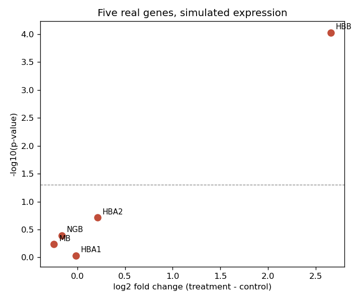

::: {.callout-note}
**Sources for this page:** Swaroop, C. H., *A Byte of Python*,
<https://python.swaroopch.com/> — CC BY-SA 4.0, commercial use permitted.
Python fundamentals. The notebook's tensor/autograd sections are reused
from this course's own existing teaching material
(`notebooks/pytorch_bio_intro.ipynb`), not newly written. The
scientific-stack sections name Biopython, NumPy, pandas, Matplotlib,
seaborn, SciPy, and scikit-learn as tools, with usage demonstrated in
original example code — no text is reused from any of their
documentation. Which of those tools get a light refresher versus fuller
treatment here is informed by `slides/course_compendium (2).pdf`, the
prerequisite DA7066 course's own compendium (Arvestad, Helanow, Mörtberg
& Sahlin) — an internal planning reference, not excerpted or linked as
further reading. The closing worked example fetches five real human
globin-gene records live from NCBI via `Bio.Entrez` while writing this
page (accessions verified below), then, separately, plots a real
published differential-expression dataset: Becares, N. et al. (2019),
["Impaired LXRα Phosphorylation Attenuates Progression of Fatty Liver
Disease"](https://doi.org/10.1016/j.celrep.2018.12.094), *Cell Reports*
26(4):984-995 — loaded directly from its public source as shared example
data by [VolcaNoseR](https://huygens.science.uva.nl/VolcaNoseR/)
(Goedhart, J. & Luijsterburg, M.S., 2020,
["VolcaNoseR is a web app for creating, exploring, labeling and sharing
volcano plots"](https://doi.org/10.1038/s41598-020-76603-3), *Scientific
Reports* 10:20560), a tool built for this kind of plot.
:::

# Day 2: Programming Prerequisites

## Learning goals

By the end of this session you should be able to explain what a
notebook actually is and why cell execution order matters, import and
use an external Python library rather than writing everything from
scratch, create and manipulate PyTorch tensors, explain what automatic
differentiation computes and why it matters for everything from Day 6
onward, fetch and parse real biological sequence data with Biopython,
and open compressed files such as `.zip` and `.gz` in Python.

## NumPy, pandas, and Matplotlib: a quick recap

A handful of libraries underlie almost everything else in this session.
**NumPy** provides the array — a grid of numbers, indexed and sliced
efficiently — that PyTorch's own tensors (below), pandas' tables, and
most scientific Python code are built on top of. **pandas** builds a
labeled, tabular data structure (the `DataFrame`) on top of NumPy
arrays: the natural format for a table of many genes and their
properties, rather than one at a time. **Matplotlib** is the base
plotting library nearly every figure in this book's notebooks
ultimately goes through, directly or via a higher-level interface like
**seaborn**, which plugs directly into pandas DataFrames.

If you've taken DA7066 ("Programming techniques for Life Sciences"),
all of these are already familiar from its own NumPy/pandas/Matplotlib
material — treat this as a quick refresher, not new material, and move
straight on to the next section.

**Worked example**, reused for the rest of this page: a synthetic table
of 50 toy "genes" — lengths drawn at random, with a GC content that
increases with length plus noise (not biologically meaningful, just a
real, recoverable relationship):

```python
import numpy as np
import pandas as pd

rng = np.random.default_rng(seed=0)
n_genes = 50
lengths = rng.integers(100, 1000, size=n_genes)
gc_content = np.clip(0.3 + 0.0003 * lengths + rng.normal(0, 0.03, size=n_genes), 0, 1)

genes = pd.DataFrame({"name": [f"gene_{i}" for i in range(n_genes)],
                       "length": lengths, "gc_content": gc_content})
print(genes.head())
```

```python
import matplotlib.pyplot as plt
import seaborn as sns

sns.scatterplot(data=genes, x="length", y="gc_content")
plt.show()
```

### Further reading

- NumPy, [quickstart](https://numpy.org/doc/stable/user/quickstart.html)
- pandas, [10 minutes to pandas](https://pandas.pydata.org/docs/user_guide/10min.html)
- Matplotlib, [Quick start guide](https://matplotlib.org/stable/users/explain/quick_start.html)

## What notebooks are for

Every notebook in this book — including the one below — runs in
[Google Colab](https://colab.research.google.com/), not as a plain
`.py` script. That's a deliberate choice, not an accident, and it's
worth understanding *why* before diving into more code.

A notebook is a sequence of **cells** — code or text — each run
independently, in whatever order you choose, with their outputs
(numbers, plots, errors) shown directly underneath. That's what makes
it suited to exploratory, scientific work in a way a plain script
isn't: you can run one small piece, look at the result, adjust it, and
re-run just that piece, without re-running everything from the top each
time — and the surrounding prose (like this page's own notebook
companion) can explain *why* a cell does what it does, right next to
the code itself.

**The real gotcha, and a genuinely common one**: a notebook's *variables*
persist in memory across cells, independently of where those cells sit
*on the page*. If you run cell 3, then cell 7, then go back and edit
cell 3 without re-running it, cell 7 is still using cell 3's *old*
value — the notebook looks like it says one thing but is actually
running on stale state. The fix is simple but easy to forget under
deadline pressure: when in doubt, use your notebook environment's
"restart and run all" option, which clears all memory and re-executes
every cell top-to-bottom in the order they're written — the only way to
be certain what you're looking at matches what's on the page.

**Colab specifically**: it's a notebook environment that runs entirely
in your browser, with free (rate-limited) access to a GPU — relevant
starting Day 6, and essential from Day 8 onward — and no local Python
installation required. Every notebook page in this book has an "Open in
Colab" badge at the top for this reason. See
[Course Information & Logistics](course-info.qmd) for Colab's practical
limits (it disconnects an idle session; don't leave one open and
unattended for a long stretch).

## Biopython: sequences and databases

**Biopython** is the one library on this page you haven't seen in any
prerequisite course, and the one that matters most going forward: Day
3's database work, and most later labs' data loading, build directly on
it.

Its core object is `Seq` — a biological sequence, with the operations
you'd actually want (translation, reverse complement) built in, so you
never hand-roll a complement-lookup dictionary yourself. This example
uses a real 30-nucleotide fragment of human beta-globin (*HBB*, the
running example this course returns to starting Day 3), fetched live
from NCBI (accession `NM_000518.5`) while writing this page:

```python
from Bio.Seq import Seq
from Bio.SeqUtils import gc_fraction

bio_seq = Seq("ATGGTGCATCTGACTCCTGAGGAGAAGTCT")
print("length:            ", len(bio_seq))
print("GC fraction:       ", gc_fraction(bio_seq))
print("reverse complement:", bio_seq.reverse_complement())
print("translated:        ", bio_seq.translate())
```

A single `Seq` is the building block; real work means parsing a *file*
of them. `Bio.SeqIO` does that for any common format (FASTA here, but
the same call works for GenBank, and more) — the mechanism
Day 3's database work builds on, just applied there to files fetched
live from NCBI/UniProt at real scale instead of a small local example.

And for actually *reaching* NCBI, rather than working from a sequence
already typed in: `Bio.Entrez` is Biopython's interface to NCBI's own
programmatic access point. The same five real human globin genes used
in this page's closing example are fetched this way — `Entrez.efetch`
asks a specific NCBI database for a specific accession and hands back
the real record, live, over the network.

`record.seq`, `record.id`, `record.description` — these are
*attributes* of an *object*, which is worth a brief, proper mention
rather than just a pattern to recognize (there isn't course time for a
full treatment, so this is the one paragraph it gets). A Python
**class** is a blueprint for objects like `record`: it bundles *data*
(the attributes each object carries — here, a sequence, an ID, a
description) together with the *functions that act on that data*
(called **methods** — `record.seq.translate()` above is one). A class's
`__init__` method runs once, when a new object is created, to set up
that object's starting data; every other method automatically receives
the specific object it was called on (conventionally named `self`) so
it knows *whose* data to work with. `Bio.Entrez.efetch` doesn't hand
back a plain dictionary of values — it hands back a real `SeqRecord`
object, built from a class Biopython defines, with sequence-specific
methods already attached. This pattern — an object that owns its
data and knows how to compute things about itself — becomes taught,
hands-on material on Day 8, when a PyTorch model is itself written as a
class you define yourself; for now, recognizing the shape of it here is
enough.

### Further reading

- Biopython, [Tutorial and Cookbook](https://biopython.org/docs/latest/Tutorial/index.html) — this library's own standard starting point, well beyond what's shown here
- NCBI, [Entrez Programming Utilities](https://www.ncbi.nlm.nih.gov/books/NBK25501/) — the actual API `Bio.Entrez` wraps

## SciPy: for statistics

**SciPy** extends NumPy with ready-made scientific routines —
statistical tests, hierarchical clustering, optimization, and much
more — so you're not re-implementing standard methods by hand. Three
examples, each tied to something this course actually does elsewhere:

**`scipy.stats.pearsonr`** checks whether a relationship is
statistically significant — here, on the synthetic 50-"gene"
length/GC-content table from the NumPy/pandas/Matplotlib recap above:

```python
from scipy import stats

r, p_value = stats.pearsonr(genes["length"], genes["gc_content"])
print(f"Pearson r = {r:.3f}, p = {p_value:.2e}")
```

**`scipy.stats.ttest_ind`** computes a two-sample t-test, the test
Day 1 reminded you of. Reusing Day 1's numbers ($5.1, 4.9, 5.3, 5.0$
control vs. $7.2, 6.8, 7.5, 7.0$ treatment) reproduces Day 1's
$t \approx -11.9,\ p \approx 0.0001$. Pass `equal_var=False` to get
Welch's test, as on Day 1; SciPy's default, `equal_var=True`, is
Student's original test, which assumes equal variances:

```python
control = [5.1, 4.9, 5.3, 5.0]
treatment = [7.2, 6.8, 7.5, 7.0]

t_stat, p_value = stats.ttest_ind(control, treatment, equal_var=False)   # Welch's t-test
print(f"t = {t_stat:.2f}, p = {p_value:.5f}")
```

**`scipy.cluster.hierarchy`** builds a guide tree from a distance
matrix by repeatedly merging the closest pair of clusters — the
algorithm behind Day 4's own guide-tree worked example (built there
by hand, on five small toy sequences) and progressive multiple sequence
alignment generally. `linkage` does the merging, `dendrogram` draws the
result:

```python
from scipy.cluster.hierarchy import linkage, dendrogram
from scipy.spatial.distance import pdist

# Same shape of input Day 4's guide-tree example builds by hand: a
# distance matrix between items (here, the 50 toy genes' length/GC
# features standing in for a real pairwise sequence-distance matrix).
distances = pdist(genes[["length", "gc_content"]])
merge_order = linkage(distances, method="average")
dendrogram(merge_order, no_labels=True)
```

### Further reading

- SciPy, [`scipy.stats`](https://docs.scipy.org/doc/scipy/reference/stats.html) — every distribution and test this module provides
- SciPy, [Hierarchical clustering](https://docs.scipy.org/doc/scipy/reference/cluster.hierarchy.html) — the full `scipy.cluster.hierarchy` reference

## scikit-learn

**scikit-learn** provides ready-made, well-tested implementations of
standard machine-learning models. Day 6 deliberately builds a linear
model "by hand" with raw tensors and gradient descent, precisely so you
see every step of the mechanics — but for a plain linear regression, in
practice you would normally just call scikit-learn's implementation
directly, on the same synthetic gene data above:

```python
from sklearn.linear_model import LinearRegression

X = genes[["length"]]  # scikit-learn expects a 2D array of features
y = genes["gc_content"]

model = LinearRegression()
model.fit(X, y)
print("slope:", model.coef_[0], " intercept:", model.intercept_)
```

`LinearRegression` is one model among many scikit-learn provides
ready-made — worth knowing what else is there, since this course
returns to several of them later, again "by hand" first for the
mechanics, with the library version always available as the practical
alternative:

- **`LogisticRegression`** — despite the name, a *classifier*, not a
  regressor (it fits a linear score through a sigmoid, exactly Day 6's
  perceptron). The library version of what Day 6 and Day 8 build from
  scratch.
- **`sklearn.model_selection.train_test_split` and `KFold`** — the
  library versions of the train/validation/test splitting and
  cross-validation Day 8 builds and explains by hand.
- **`sklearn.neural_network.MLPClassifier`** — a genuine multilayer
  perceptron with hidden layers, trained with backpropagation, all
  inside scikit-learn. Day 9 builds one from scratch (raw tensors,
  explicit backprop) specifically so the mechanics are visible; this is
  what you'd reach for once they don't need to be.
- **XGBoost** (`xgboost.XGBClassifier`/`XGBRegressor`) — not part of
  scikit-learn itself, but a hugely popular separate library that
  deliberately mimics scikit-learn's `.fit()`/`.predict()` interface.
  Gradient-boosted decision trees, not neural networks at all — a
  genuinely different, often extremely strong approach this course
  doesn't cover hands-on, but worth knowing exists as the thing people
  reach for on structured/tabular data when a neural network is
  overkill.

None of these get their own worked example on this page — the point
here is knowing they exist and roughly what each is for, not using them
yet.

### Further reading

- scikit-learn, [Linear Models](https://scikit-learn.org/stable/modules/linear_model.html) user guide
- scikit-learn, [Neural network models (supervised)](https://scikit-learn.org/stable/modules/neural_networks_supervised.html) — `MLPClassifier`/`MLPRegressor`
- scikit-learn, [Cross-validation](https://scikit-learn.org/stable/modules/cross_validation.html) user guide
- XGBoost, [Get Started](https://xgboost.readthedocs.io/en/stable/get_started.html) — outside this course, but the standard starting point if you need it later

## PyTorch: tensors and autograd

Day 1 worked with vectors and matrices. A **tensor** is the general
version of both: a container for numbers with any number of dimensions
— a single number (0-dimensional), a vector (1-dimensional), a matrix
(2-dimensional), or higher still. Every deep-learning framework,
including PyTorch, represents all of its data — inputs, weights,
gradients — as tensors, precisely so the same operations (add,
multiply, reshape, ...) work regardless of how many dimensions the data
happens to have. The notebook below builds tensors out of a small
DNA-encoded toy dataset, then works through indexing, slicing, and
reshaping — the same operations already used on Day 1's vectors and
matrices, just generalized.

Day 1 also introduced the gradient and worked it out by hand using the
chain rule. Doing that by hand does not scale to a function with
thousands or millions of variables — what a neural network's
weights are. **Automatic differentiation** (autograd) is the mechanism
that makes this practical: PyTorch tracks every operation performed on
a tensor, and when you ask for the gradient of some final result, it
replays those operations backward, applying the chain rule
automatically at every step. You never write a derivative by hand again
after this point in the course — you only ever call `.backward()`.

**Closing the loop with Day 1**: Day 1's practice problems were done
entirely by hand. Here they are again, this time in PyTorch — the
notebook confirms the dot product and the gradient computed in code
match the by-hand answers exactly.

### Further reading

- PyTorch, [A Gentle Introduction to torch.autograd](https://pytorch.org/tutorials/beginner/blitz/autograd_tutorial.html) — more detail on how the computation graph is built and freed

## Opening compressed and archive files

One small, practical thing worth knowing before it becomes a
mid-deadline problem: downloaded datasets — including this course's own
capstone project data (see `capstone.qmd`) — routinely arrive compressed
in one of a few standard formats, and past students have specifically
gotten stuck on opening and extracting these. None of them need a
separate program; Python's standard library handles all of them.

**`.zip`** archives (this course's capstone data, most software
downloads): the `zipfile` module opens, lists, and extracts one in three
lines — open with `zipfile.ZipFile(path)`, list contents with
`.namelist()`, pull everything out with `.extractall()` (or one named
file with `.extract(name)`).

**`.gz`** (gzip) files are the one you'll see constantly in
bioinformatics specifically — real sequence data is almost always
distributed as `something.fasta.gz` or `something.fastq.gz`, since
sequence files compress extremely well and downloads/storage both
benefit. Unlike a zip archive, a `.gz` file isn't a container of
multiple files — it's a single compressed stream — so the pattern is
different and, once you know it, simpler: `gzip.open(path, "rt")` gives
you a regular *readable text file handle*, with no separate extraction
step at all. That matters for this course specifically because
`Bio.SeqIO.parse` (introduced earlier on this page) doesn't care whether
the file handle it's given is compressed or not — hand it a
`gzip.open(...)` handle directly, and it parses records out of the
compressed file as if it had been decompressed to disk first.

Two more, briefly, since you'll meet them eventually: **`.tar`** and
**`.tar.gz`**/**`.tgz`** files (common from Linux-world bioinformatics
tools) bundle many files together the way `.zip` does, but compress the
whole bundle as one stream the way `.gz` does — the standard-library
`tarfile` module handles them with the same `.namelist()`-style API as
`zipfile` (`.getnames()` and `.extractall()`). **`.bz2`** and **`.xz`**
are further alternative compression algorithms (better compression
ratio, slower) you'll occasionally see instead of `.gz` — same idea,
different standard-library module (`bz2`, `lzma`), same `.open(path,
"rt")` pattern.

### Further reading

- Python docs, [`zipfile` — Work with ZIP archives](https://docs.python.org/3/library/zipfile.html)
- Python docs, [`gzip` — Support for gzip files](https://docs.python.org/3/library/gzip.html)
- Python docs, [`tarfile` — Read and write tar archive files](https://docs.python.org/3/library/tarfile.html)

## Connecting to the shared course server

Colab covers most of this course, but a few labs (starting with Day 5's)
use real command-line bioinformatics tools and databases too large to
install on your own laptop — for those, this course provides a shared
server, `students.bioinfo.se`, reachable over SSH (see [Course
Information & Logistics](course-info.qmd)'s "Coding environment" section
for the policy: you'll be asked to generate a key and send it in). Worth
setting this up now, before Day 5's lab actually needs it.

1. **Generate an SSH keypair**, if you don't already have one:
   ```
   ssh-keygen -t ed25519 -C "your-email@example.com"
   ```
   Accept the default file location; a passphrase is optional but
   recommended. This creates two files in `~/.ssh/`: `id_ed25519` (your
   **private** key — never share this) and `id_ed25519.pub` (your
   **public** key — safe to share, this is what you send in).
2. **Send the contents of `id_ed25519.pub`** (not the private key) the
   way your teachers ask for it, so it can be added to the server's
   authorized keys.
3. **Test plain SSH access** once your key's been added:
   ```
   ssh your-username@students.bioinfo.se
   ```
4. **Connect from VSCode directly**, rather than just a bare terminal:
   install the **Remote - SSH** extension (`ms-vscode-remote.remote-ssh`),
   then either use the Command Palette (Ctrl/Cmd+Shift+P) →
   "Remote-SSH: Connect to Host..." and enter
   `your-username@students.bioinfo.se`, or add an entry to `~/.ssh/config`
   first so you can just pick it from a list:
   ```
   Host students
       HostName students.bioinfo.se
       User your-username
   ```
   Once connected, VSCode's file explorer, terminal, and editor all
   operate on the *server*, not your laptop — including every real tool
   Day 5's lab uses.

## Putting it together: from database to plot

A last, real worked example, assembling most of this page's tools
across two independent real-data demos — and a chance to actually
*feel* the notebook advantage from earlier, not just read about it.

**Step 1 — Biopython, for real data.** Fetch five real human globin
genes live from NCBI via `Bio.Entrez`/`Bio.SeqIO` — the same paralogous
family (all descended from ancient gene duplications) already
introduced on Day 4 and used throughout this course:

| Gene | Protein | RefSeq accession |
|---|---|---|
| *HBB* | beta-globin | `NM_000518.5` |
| *HBA1* | alpha-globin 1 | `NM_000558.5` |
| *HBA2* | alpha-globin 2 | `NM_000517.6` |
| *MB* | myoglobin | `NM_001382809.1` |
| *NGB* | neuroglobin | `NM_021257.4` |

**Step 2 — pandas, SciPy, and Matplotlib, on a real published dataset.**
Rather than simulating expression values (Day 1's approach, needed there
because it's a from-scratch worked example), this step uses **real**
differential-expression data: mouse liver RNA-seq, high-fat/high-
cholesterol diet vs. control, from Becares et al. (2019, *Cell Reports*)
— already processed with DESeq2, and shared as example data by
[VolcaNoseR](https://huygens.science.uva.nl/VolcaNoseR/) (Goedhart &
Luijsterburg, 2020, *Scientific Reports*), a web app built specifically
for exploring volcano plots like this one. `pandas.read_csv` loads it
directly from its public GitHub source — 3,001 real genes, each with a
real log2 fold change and p-value already computed by the original
study. `scipy.stats.pearsonr` checks the dataset's own two significance
columns (`pvalue` and its precomputed `minus_log10_pvalue`) agree with
each other — a real sanity check, not a formality, on data this page
didn't generate itself — before Matplotlib plots all 3,001 genes at
once and Day 1's honesty about a "wall of points" becomes visible for
real, not just described:

{width=80%}

**Step 3 — the notebook payoff.** The notebook re-runs the plotting cell
twice more on this same real data: once with a different color scheme,
once highlighting a *different* gene by name — the one with the single
largest fold change, which (worth noticing) isn't the same gene as the
most statistically significant one from the first plot. Each re-plot is
one small edit and a re-run of a single cell — a few seconds, not a
from-scratch rebuild — which is the "run a piece, look, adjust,
re-run" workflow the notebooks section above described, now made
concrete instead of asserted.

## The notebook

`notebooks/day02-tensors-and-a-first-class.ipynb` follows this page in
order: tensor creation/indexing/slicing/reshaping and a first autograd
example (reused from this course's own existing PyTorch material), a
notebook cell-order demonstration, real Biopython usage (a `Seq` object,
`Bio.SeqIO` parsing a small FASTA file, and a live `Bio.Entrez` fetch),
a SciPy statistical test and a scikit-learn linear regression on
synthetic gene data, Day 1's dot-product/gradient practice problems
recomputed in PyTorch, opening `.zip` and `.gz` files, and finally the
from-database-to-plot worked example above, plotted three times over to
show the notebook advantage directly. Open it in
[Google Colab](https://colab.research.google.com/github/ElofssonLab/kb8029-book/blob/main/notebooks/day02-tensors-and-a-first-class.ipynb)
via the badge at the top of the notebook page to edit and run it
yourself.

## Check your understanding

Immediate-feedback questions covering the sections above — the same style
used for this course's live in-class peer-instruction quizzes (see
`quizzes/day02.md` in the repository for the full question bank).

```{=html}
<div id="day02-quiz"></div>
<script>
renderQuiz("day02-quiz", [
  {
    question: "You run cell 3, then cell 7. You edit cell 3 but do NOT re-run it, then look at cell 7's old output again. What does it reflect?",
    choices: [
      "Cell 3's OLD value, since cell 7 was run before cell 3 was edited and hasn't been re-run since",
      "Cell 3's NEW value automatically, since notebooks always stay in sync",
      "An error, since editing an earlier cell invalidates every later one",
      "Nothing -- cell 7's output is cleared automatically when an earlier cell changes"
    ],
    correctIndex: 0,
    explanation: "A notebook's variables reflect whatever was last actually run, not the current text on the page -- 'restart and run all' is the only way to be sure they match."
  },
  {
    question: "Why does this book's every notebook run in Google Colab specifically, rather than assuming a local Python install?",
    choices: [
      "No local installation needed, and it gives free (rate-limited) access to a GPU, relevant from Day 6 and essential from Day 8 onward",
      "Colab is the only place Python notebooks can run at all",
      "Colab automatically fixes bugs in submitted code",
      "It's required for Biopython specifically to work"
    ],
    correctIndex: 0,
    explanation: "Colab's GPU access is the real reason -- Day 8 onward needs it for anything beyond a toy model size."
  },
  {
    question: "What does calling <code>.backward()</code> on a PyTorch tensor actually do?",
    choices: [
      "It computes gradients by replaying the tensor's recorded operations backward and applying the chain rule",
      "It undoes the last operation performed on the tensor",
      "It reverses the order of the elements stored in the tensor",
      "It converts the tensor back into a plain Python list"
    ],
    correctIndex: 0,
    explanation: "Autograd tracks every operation as it happens, then applies Day 1's chain rule automatically when you call backward()."
  },
  {
    question: "In the closing worked example, how do Step 1 (the globin genes) and Step 2 (the volcano plot) relate to each other?",
    choices: [
      "They're two independent real-data demos -- the volcano plot's mouse-liver data has nothing to do with the fetched human globin genes",
      "The five fetched globin genes are the ones plotted in the volcano plot",
      "The volcano plot's expression values are simulated from the fetched genes' sequences",
      "NCBI provides matched control/treatment expression data for any gene on request, which Step 2 uses"
    ],
    correctIndex: 0,
    explanation: "Both halves are real, but from unrelated sources: Bio.Entrez (Step 1) demonstrates live database access; the volcano plot (Step 2) reuses an already-published dataset. Fetching a real record live and verifying a real published dataset you didn't generate yourself are two different, both-worth-demonstrating skills -- not one pipeline feeding the other."
  },
  {
    question: "What does a pandas DataFrame add on top of a plain NumPy array?",
    choices: [
      "Labeled rows and columns, so a table's columns can be referred to by name instead of position",
      "GPU acceleration that NumPy arrays lack",
      "Automatic differentiation of every stored value",
      "The ability to store more than two dimensions of data"
    ],
    correctIndex: 0,
    explanation: "genes[\"length\"] works because pandas labels columns by name; the underlying numbers are still a NumPy array."
  }
]);
</script>
```

## The lab

A separate, dedicated lab notebook —
[`notebooks/day02-lab.ipynb`](https://colab.research.google.com/github/ElofssonLab/kb8029-book/blob/main/notebooks/day02-lab.ipynb) —
not a complete notebook to just run, but one with several `...`
placeholders to fill in and run instead. It reuses this page's own
running examples (the same 50 toy genes, the same live-fetch pattern
for a globin-family gene) on new data this page didn't already work
out, so copying an answer straight from this page won't get you
anywhere. Once every cell runs and prints a real value, answer the Day
2 lab quiz on Canvas using your own notebook's actual output.

### Submitting this lab

This lab is administered through Canvas, not this book — see the
course's Canvas page for the current quiz, deadline, and submission
mechanism.

## What's next

Day 3 puts Biopython's database access to real, full-scale use:
retrieving and cross-referencing real sequences across multiple
biological databases. The tensor and autograd mechanics introduced here
resurface directly in Day 6's gradient-descent lab, and Python's `class`
syntax — introduced briefly here through Biopython's own objects, not
yet practiced hands-on — becomes real, taught material on Day 8, when a
PyTorch model is written as one.
