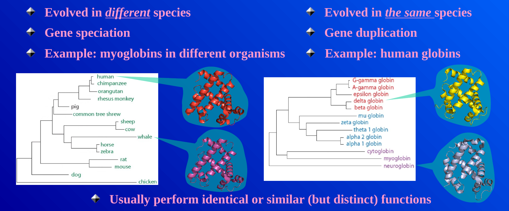
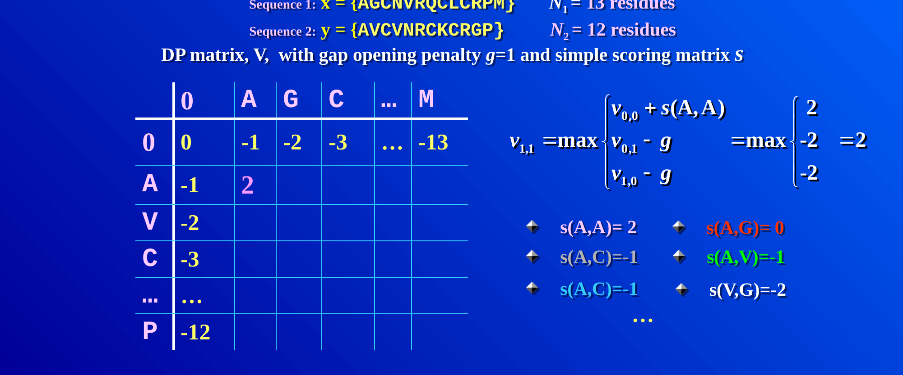
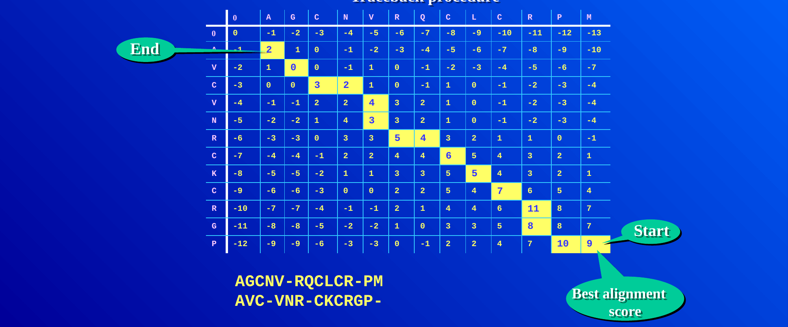
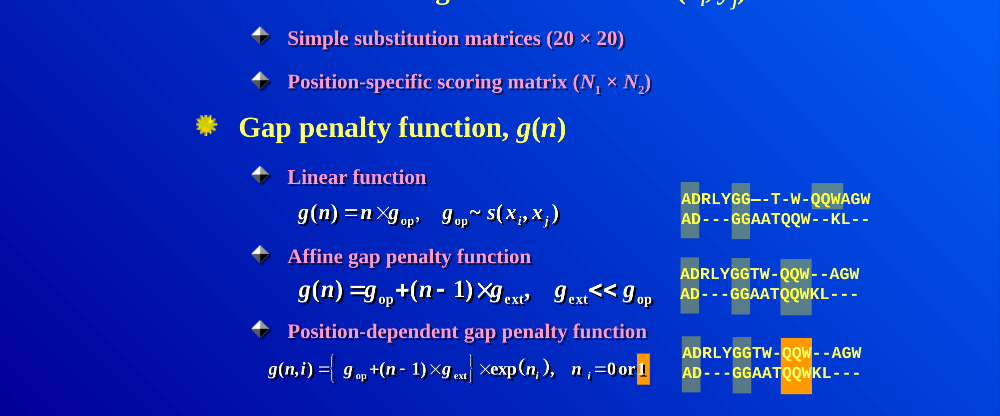

::: {.callout-note}
**Sources for this page:** Petras Kundrotas's KB8029 lecture "Sequence
Alignment" (Feb 2026) — this page follows its structure and worked
examples, adapted and shortened for this book, not copied verbatim; the
four figures below (orthologs/paralogs; filling one DP cell; the
completed Needleman-Wunsch traceback; linear vs. affine gap penalties)
are taken directly from that lecture's slides;
Dayhoff, Schwartz & Orcutt (1978), *Atlas of Protein Sequence and
Structure*, pp. 345-352 (origin of the PAM matrices); Henikoff & Henikoff
(1992), *PNAS* 89:10915-10919 (origin of the BLOSUM matrices); Wikipedia,
[Needleman–Wunsch algorithm](https://en.wikipedia.org/wiki/Needleman%E2%80%93Wunsch_algorithm),
[Smith–Waterman algorithm](https://en.wikipedia.org/wiki/Smith%E2%80%93Waterman_algorithm),
[Gap penalty](https://en.wikipedia.org/wiki/Gap_penalty)
— CC BY-SA 4.0; the notebook's core algorithm code is adapted from Lukas
Käll's [*bibook*](https://github.com/statisticalbiotechnology/bibook)
— CC BY 4.0.
:::

# Day 4: Sequence Alignment

## Learning goals

By the end of this session you should be able to explain why sequence
alignment needs a dedicated algorithm rather than brute-force comparison,
work a small global alignment by hand using dynamic programming, explain
the difference between global and local alignment, explain why an affine
gap penalty is usually preferred over a linear one, and explain what
distinguishes the PAM and BLOSUM families of substitution matrices.

## Why alignment needs an algorithm

Two sequences are called **homologous** if they share a common
evolutionary origin — a qualitative, yes/no property. **Identity** and
**similarity** are how homology gets measured in practice: identity is
the fraction of positions with the exact same residue; similarity is
looser, also counting positions with residues that share physicochemical
properties (e.g. two hydrophobic residues). Homologous proteins found in
different species are **orthologs**; homologous proteins found within the
same genome (arising from gene duplication) are **paralogs**. Orthologous
myoglobins across mammals, and the family of paralogous human globins
(hemoglobin, myoglobin, neuroglobin, and others, all descended from gene
duplications), are the standard example:

{width=90%}

When two sequences happen to be the same length, measuring identity is
trivial — just place one under the other and count matches. Real
sequences, though, differ in length because of insertions and deletions
over evolutionary time, and where you choose to place one sequence under
the other changes the answer dramatically. Two example globin sequences
that are 21.5% identical when aligned correctly can look as low as 4%
identical if placed naively.

Could you just try every possible placement and keep the best one? For
two sequences of length $n$, allowing gaps, the number of possible
alignments grows so fast that for $n = 100$ it's already around
$10^{59}$ — utterly infeasible to search exhaustively. This is exactly
why **dynamic programming** algorithms exist for this problem: they find
the guaranteed-optimal alignment without ever checking most of the
possibilities.

## Dynamic programming: Needleman-Wunsch and Smith-Waterman

The idea: build a matrix $V$ with one extra row and column (for handling
the sequence starts), fill it in using a simple rule, then trace back
through it to read off the best alignment. Every cell $V(i,j)$ is filled
as the best of three options — extend a match/mismatch diagonally, or
open a gap from above or from the left:

$$
V(i,j) = \max \begin{cases} V(i-1,j-1) + s(x_i, y_j) \\ V(i-1,j) + g \\ V(i,j-1) + g \end{cases}
$$

where $s(x_i, y_j)$ is a substitution score (see below) and $g$ is a gap
penalty. Concretely, filling one cell means computing all three
candidates and keeping the largest — here's cell $V(1,1)$ for a pair of
13/12-residue sequences, with a gap penalty of $g=1$:

{width=90%}

Every other cell is filled the exact same way; the only thing that
changes is which numbers go into the three candidates. **Worked
example**, small enough to do completely by hand: align $x =
\texttt{GCAT}$ against $y = \texttt{GAC}$, with match $= +1$, mismatch $=
-1$, gap $= -1$:

|       |   | G  | A  | C  |
|---|---|---|---|---|
|       | 0 | -1 | -2 | -3 |
| **G** | -1 | 1 | 0 | -1 |
| **C** | -2 | 0 | 0 | 1 |
| **A** | -3 | -1 | 1 | 0 |
| **T** | -4 | -2 | 0 | 0 |

Tracing back from the bottom-right corner (score 0) gives the optimal
global alignment:

```
G C A T
G - A C
```

— G matches G, C is deleted, A matches A, and T is (mis)matched to C, for
a total score of $1 - 1 + 1 - 1 = 0$.

The same idea, at the scale it's actually used: two 12-13 residue protein
sequences, with the completed matrix and its full traceback path
highlighted:

{width=95%}

This particular algorithm — **Needleman-Wunsch** — produces a *global*
alignment: the entire length of both sequences is forced into the result,
gaps and all. **Smith-Waterman** is the same idea adapted for *local*
alignment — finding the best-matching sub-region rather than aligning
end-to-end — achieved with one change: negative values in the matrix are
reset to zero, and the traceback starts from the highest-scoring cell
anywhere in the matrix (not necessarily the bottom-right corner) and stops
as soon as it hits a zero.

## Gap penalties: linear vs. affine

So far $g$ has been a single flat number charged per gap position, but
that choice matters more than it might seem. A **linear** gap penalty —
$g(n) = n \times g_{\text{op}}$ for $n$ consecutive gaps — charges exactly
the same total whether those gaps are spread out or bunched together.
Since insertions/deletions in real evolution tend to happen as one event
removing/adding a whole stretch at once, a linear penalty can produce
biologically implausible alignments that scatter single gaps throughout,
breaking up motifs that are actually conserved as a block.

The fix is an **affine** gap penalty: a larger cost $g_{\text{op}}$ to
*open* a new gap, plus a much smaller cost $g_{\text{ext}}$ to *extend*
an already-open one ($g_{\text{ext}} \ll g_{\text{op}}$):

$$
g(n) = g_{\text{op}} + (n-1) \times g_{\text{ext}}
$$

This makes a single long gap cheaper than the same number of gaps
scattered as many separate short ones, which is exactly the behavior you
want. The example below makes this concrete: the same two sequences,
aligned once with a linear penalty (top pair — gaps scattered, breaking up
the shared "QQW" motif) and once with an affine penalty (bottom pair —
gaps consolidated into contiguous stretches, keeping "QQW" together):

{width=90%}

*(Further reading: Wikipedia's [Gap penalty](https://en.wikipedia.org/wiki/Gap_penalty) article covers this in more depth, including the position-dependent variant shown at the bottom of the figure above, which is beyond what this course needs.)*

## Substitution matrices: PAM and BLOSUM

The scores $s(x_i, y_j)$ above aren't arbitrary — they come from
observing real evolutionary substitutions. Two families dominate:

- **PAM** (Point Accepted Mutations; Dayhoff, Schwartz & Orcutt, 1978)
  is based on **global** alignments of **closely related** proteins, built
  from an *explicit* evolutionary model: sequences are arranged into
  phylogenetic trees, ancestral sequences are inferred, and substitutions
  are counted along the tree's branches. Only PAM1 (calibrated so 99% of
  residues are unchanged over that evolutionary distance) is derived
  directly from data — every other PAM matrix is extrapolated from it by
  repeated matrix multiplication ($\mathbf{M}^{250}$ for PAM250, etc.).
- **BLOSUM** (BLOcks SUbstitution Matrix; Henikoff & Henikoff, 1992) is
  based on **local**, ungapped alignments of **distantly related**
  proteins instead: substitution frequencies are counted directly from
  conserved blocks of real multiple alignments, with no phylogenetic tree
  and no extrapolation — each BLOSUM matrix (BLOSUM45, BLOSUM62, BLOSUM80,
  ...) is derived independently from the others.

One easy source of confusion: the two families' numbering runs in
*opposite* directions. A **higher** PAM number means a **more distant**
comparison (PAM250 suits more divergent sequences than PAM100); a
**higher** BLOSUM number means a **closer** comparison (BLOSUM80 suits
more similar sequences than BLOSUM45) — the opposite trend.

## Multiple sequence alignment

Extending pairwise alignment to more than two sequences at once has four
main strategies:

| Approach | Programs | Speed | Accuracy | Guide-tree dependence | Refinement |
|---|---|---|---|---|---|
| **Exact** — extend dynamic programming to $N$ dimensions; only feasible for $N \le 5$ sequences | — | — | Optimal (for small $N$) | None | — |
| **Progressive** — align the most similar pair first, then progressively add sequences/profiles, guided by a tree built from all pairwise distances | ClustalW | Fast | Moderate | High | No |
| **Iterative** — start from a progressive alignment, then repeatedly re-score and re-align subsets to improve it | MUSCLE | Medium | High | Moderate | Yes |
| **Consistency-based** — favor alignments that agree with each other transitively (if A aligns with B and B aligns with C, prefer an alignment where A also aligns with C accordingly) | T-Coffee | Slow | Very high | Low | Yes |

The pattern is a genuine speed/accuracy tradeoff: progressive is fast but
an early mistake in the guide tree propagates forward uncorrected;
iterative and consistency-based methods spend more computation to correct
exactly that weakness.

Building the guide tree for progressive alignment uses exactly the kind
of hierarchical clustering you'd use on any distance matrix: treat every
sequence as its own cluster, repeatedly merge the closest pair of
clusters, and stop once only one cluster remains — the merge order *is*
the order sequences get aligned in.

## The notebook

`notebooks/day04-alignment-in-code.ipynb` implements Needleman-Wunsch and
Smith-Waterman from scratch (adapted from Lukas Käll's open-access
[*bibook*](https://github.com/statisticalbiotechnology/bibook), CC BY
4.0), reproduces the $\texttt{GCAT}$/$\texttt{GAC}$ matrix above exactly,
and visualizes both algorithms' matrices with the traceback path
highlighted — including a global-vs-local comparison on two sequences
that share one strong region but differ elsewhere, making the practical
difference between the two algorithms directly visible rather than just
described. Open it in
[Google Colab](https://colab.research.google.com/github/ElofssonLab/kb8029-book/blob/main/notebooks/day04-alignment-in-code.ipynb)
via the badge at the top of the notebook page to edit and run it
yourself.

## The lab

A light, tool-based exercise rather than a full lab (Day 5 gets the full
lab, once BLAST is covered too): use EMBL-EBI's pairwise and multiple
alignment tools on real sequences, and confirm that a tool's reported
score and alignment match what the dynamic-programming matrix above would
predict for a small case.

## What's next

Day 5 asks a different question about the same underlying problem: exact
dynamic programming like Needleman-Wunsch doesn't scale to searching a
new sequence against an entire database — that's what BLAST's heuristic
is for. Day 6 goes a step further and asks what to do once you have many
aligned sequences rather than two: build a *profile*.
