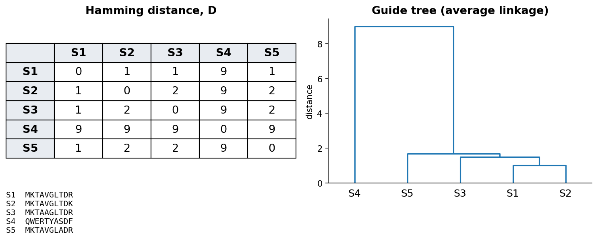

::: {.callout-note}
**Sources for this page:** Petras Kundrotas's KB8029 lecture "Sequence
Alignment" (Feb 2026) — this page follows its structure and worked
examples, adapted and shortened for this book, not copied verbatim; the
four figures below (orthologs/paralogs; filling one DP cell; the
completed Needleman-Wunsch traceback; linear vs. affine gap penalties)
are taken directly from that lecture's slides;
Dayhoff, Schwartz & Orcutt (1978), *Atlas of Protein Sequence and
Structure*, pp. 345-352 (origin of the PAM matrices); Henikoff & Henikoff
(1992), *PNAS* 89:10915-10919 (origin of the BLOSUM matrices); Wikipedia,
[Needleman–Wunsch algorithm](https://en.wikipedia.org/wiki/Needleman%E2%80%93Wunsch_algorithm),
[Smith–Waterman algorithm](https://en.wikipedia.org/wiki/Smith%E2%80%93Waterman_algorithm),
[Gap penalty](https://en.wikipedia.org/wiki/Gap_penalty),
[Dot plot (bioinformatics)](https://en.wikipedia.org/wiki/Dot_plot_(bioinformatics)),
[Standard score](https://en.wikipedia.org/wiki/Standard_score),
[Kullback–Leibler divergence](https://en.wikipedia.org/wiki/Kullback%E2%80%93Leibler_divergence),
[Sequence homology](https://en.wikipedia.org/wiki/Sequence_homology),
[Point accepted mutation](https://en.wikipedia.org/wiki/Point_accepted_mutation),
[BLOSUM](https://en.wikipedia.org/wiki/BLOSUM),
[Multiple sequence alignment](https://en.wikipedia.org/wiki/Multiple_sequence_alignment)
— CC BY-SA 4.0; the notebook's core algorithm code is adapted from Lukas
Käll's [*bibook*](https://github.com/statisticalbiotechnology/bibook)
— CC BY 4.0. The guide-tree worked-example figure is original to this
book, not from the lecture.
:::

# Day 4: Sequence Alignment

## Learning goals

By the end of this session you should be able to explain why sequence
alignment needs a dedicated algorithm rather than brute-force comparison,
work a small global alignment by hand using dynamic programming, explain
the difference between global and local alignment, explain why an affine
gap penalty is usually preferred over a linear one, explain what
distinguishes the PAM and BLOSUM families of substitution matrices, and
explain what it means for an alignment score to be statistically
significant rather than just high.

## Why alignment needs an algorithm

Two sequences are called **homologous** if they share a common
evolutionary origin — a qualitative, yes/no property. **Identity** and
**similarity** are how homology gets measured in practice: identity is
the fraction of positions with the same residue; similarity is
looser, also counting positions with residues that share physicochemical
properties (e.g. two hydrophobic residues). Homologous proteins found in
different species are **orthologs**; homologous proteins found within the
same genome (arising from gene duplication) are **paralogs**. Orthologous
myoglobins across mammals, and the family of paralogous human globins
(hemoglobin, myoglobin, neuroglobin, and others, all descended from gene
duplications), are the standard example:

{width=90%}

When two sequences happen to be the same length, measuring identity is
trivial — just place one under the other and count matches. Real
sequences, though, differ in length because of insertions and deletions
over evolutionary time, and where you choose to place one sequence under
the other changes the answer dramatically. Two example globin sequences
that are 21.5% identical when aligned correctly can look as low as 4%
identical if placed naively.

Could you just try every possible placement and keep the best one? For
two sequences of length $n$, allowing gaps, the number of possible
alignments grows so fast that for $n = 100$ it's already around
$10^{59}$ — utterly infeasible to search exhaustively. This is
why **dynamic programming** algorithms exist for this problem: they find
the guaranteed-optimal alignment without ever checking most of the
possibilities.

### Further reading

- Wikipedia, [Sequence homology](https://en.wikipedia.org/wiki/Sequence_homology) — orthology, paralogy, and the other relatedness terms, in more depth than needed here

## Visualizing alignments: dot plots

Before reaching for an algorithm, there's a simple visual check worth
knowing: a **dot plot**. Put one sequence along each axis of a grid, and
mark a dot wherever the row and column residues match. A run of matches
lines up as a diagonal line, which the eye picks out immediately — a
long alignment shows up as one long diagonal, a repeat shows up as
several parallel diagonals, and an inversion shows up as a diagonal
running the opposite direction. There's no score and no optimal
alignment here, just a fast qualitative screen — but it's still used
today for visualizing the output of a real alignment (BLAST's web
output includes one), precisely because a picture answers "is there
even a match here, roughly where?" faster than reading a score.

### Further reading

- Wikipedia, [Dot plot (bioinformatics)](https://en.wikipedia.org/wiki/Dot_plot_(bioinformatics)) — filtering/windowing techniques for noisy real sequences, beyond the simple version above

## Dynamic programming: Needleman-Wunsch and Smith-Waterman

The idea: build a matrix $V$ with one extra row and column (for handling
the sequence starts), fill it in using a simple rule, then trace back
through it to read off the best alignment. Every cell $V(i,j)$ is filled
as the best of three options — extend a match/mismatch diagonally, or
open a gap from above or from the left:

$$
V(i,j) = \max \begin{cases} V(i-1,j-1) + s(x_i, y_j) \\ V(i-1,j) + g \\ V(i,j-1) + g \end{cases}
$$

where $s(x_i, y_j)$ is a substitution score (see below) and $g$ is a gap
penalty. Concretely, filling one cell means computing all three
candidates and keeping the largest — here's cell $V(1,1)$ for a pair of
13/12-residue sequences, with a gap penalty of $g=1$:

{width=90%}

Every other cell is filled the same way; the only thing that
changes is which numbers go into the three candidates. **Worked
example**, small enough to do completely by hand: align $x =
\texttt{GCAT}$ against $y = \texttt{GAC}$, with match $= +1$, mismatch $=
-1$, gap $= -1$:

|       |   | G  | A  | C  |
|---|---|---|---|---|
|       | 0 | -1 | -2 | -3 |
| **G** | -1 | 1 | 0 | -1 |
| **C** | -2 | 0 | 0 | 1 |
| **A** | -3 | -1 | 1 | 0 |
| **T** | -4 | -2 | 0 | 0 |

Tracing back from the bottom-right corner (score 0) gives the optimal
global alignment:

```
G C A T
G - A C
```

— G matches G, C is deleted, A matches A, and T is (mis)matched to C, for
a total score of $1 - 1 + 1 - 1 = 0$.

The same idea, at the scale it's actually used: two 12-13 residue protein
sequences, with the completed matrix and its full traceback path
highlighted:

{width=95%}

This particular algorithm — **Needleman-Wunsch** — produces a *global*
alignment: the entire length of both sequences is forced into the result,
gaps and all. **Smith-Waterman** is the same idea adapted for *local*
alignment — finding the best-matching sub-region rather than aligning
end-to-end — achieved with one change: negative values in the matrix are
reset to zero, and the traceback starts from the highest-scoring cell
anywhere in the matrix (not necessarily the bottom-right corner) and stops
as soon as it hits a zero.

### Further reading

- Wikipedia, [Needleman–Wunsch algorithm](https://en.wikipedia.org/wiki/Needleman%E2%80%93Wunsch_algorithm) and [Smith–Waterman algorithm](https://en.wikipedia.org/wiki/Smith%E2%80%93Waterman_algorithm) — pseudocode and complexity analysis beyond what's needed here

## Gap penalties: linear vs. affine

So far $g$ has been a single flat number charged per gap position, but
that choice matters more than it might seem. A **linear** gap penalty —
$g(n) = n \times g_{\text{op}}$ for $n$ consecutive gaps — charges exactly
the same total whether those gaps are spread out or bunched together.
Since insertions/deletions in real evolution tend to happen as one event
removing/adding a whole stretch at once, a linear penalty can produce
biologically implausible alignments that scatter single gaps throughout,
breaking up motifs that are actually conserved as a block.

The fix is an **affine** gap penalty: a larger cost $g_{\text{op}}$ to
*open* a new gap, plus a much smaller cost $g_{\text{ext}}$ to *extend*
an already-open one ($g_{\text{ext}} \ll g_{\text{op}}$):

$$
g(n) = g_{\text{op}} + (n-1) \times g_{\text{ext}}
$$

This makes a single long gap cheaper than the same number of gaps
scattered as many separate short ones, which is the behavior you
want. The example below makes this concrete: the same two sequences,
aligned once with a linear penalty (top pair — gaps scattered, breaking up
the shared "QQW" motif) and once with an affine penalty (bottom pair —
gaps consolidated into contiguous stretches, keeping "QQW" together):

{width=90%}

### Further reading

- Wikipedia, [Gap penalty](https://en.wikipedia.org/wiki/Gap_penalty) — covers this in more depth, including the position-dependent variant shown at the bottom of the figure above, which is beyond what this course needs

## Substitution matrices: PAM and BLOSUM

The scores $s(x_i, y_j)$ above aren't arbitrary — they come from
observing real evolutionary substitutions. Two families dominate:

- **PAM** (Point Accepted Mutations; Dayhoff, Schwartz & Orcutt, 1978)
  is based on **global** alignments of **closely related** proteins, built
  from an *explicit* evolutionary model: sequences are arranged into
  phylogenetic trees, ancestral sequences are inferred, and substitutions
  are counted along the tree's branches. Only PAM1 (calibrated so 99% of
  residues are unchanged over that evolutionary distance) is derived
  directly from data — every other PAM matrix is extrapolated from it by
  repeated matrix multiplication ($\mathbf{M}^{250}$ for PAM250, etc.).
- **BLOSUM** (BLOcks SUbstitution Matrix; Henikoff & Henikoff, 1992) is
  based on **local**, ungapped alignments of **distantly related**
  proteins instead: substitution frequencies are counted directly from
  conserved blocks of real multiple alignments, with no phylogenetic tree
  and no extrapolation — each BLOSUM matrix (BLOSUM45, BLOSUM62, BLOSUM80,
  ...) is derived independently from the others.

One easy source of confusion: the two families' numbering runs in
*opposite* directions. A **higher** PAM number means a **more distant**
comparison (PAM250 suits more divergent sequences than PAM100); a
**higher** BLOSUM number means a **closer** comparison (BLOSUM80 suits
more similar sequences than BLOSUM45) — the opposite trend.

### Further reading

- Wikipedia, [Point accepted mutation](https://en.wikipedia.org/wiki/Point_accepted_mutation) and [BLOSUM](https://en.wikipedia.org/wiki/BLOSUM) — the full derivation of each matrix family, beyond the conceptual level above

## Statistical significance of an alignment score

A high alignment score alone doesn't prove two sequences are homologous
— some genuinely homologous pairs are easy to call from their score,
others aren't, and a score computed from a substitution matrix has no
built-in sense of "good enough." One way to calibrate it: shuffle one of
the two sequences many times, realign it against the other each time,
and build up a distribution of scores you'd expect from unrelated
sequences by chance alone. Comparing the real score to that background
distribution gives a **Z-score** (standardized score),

$$
Z = \frac{\text{real score} - \text{mean of random scores}}{\text{standard deviation of random scores}}
$$

which tells you how many standard deviations above pure chance the real
alignment sits — assuming, reasonably well in practice, that the random
scores are roughly normally distributed.

The catch is cost: building a good random-score background this way
means realigning many shuffled copies for *every* comparison, which
doesn't scale to comparing one sequence against an entire database.
**Relative entropy** offers a more principled and efficient alternative
— it's the same log-odds idea already used to build the substitution
matrix itself (Section "Substitution matrices" above), applied to score
the significance of the whole alignment rather than one comparison. Day
5's BLAST uses a related, highly efficient significance measure of its
own — the **E-value** — built on this kind of reasoning about
what you'd expect to see by chance.

### Further reading

- Wikipedia, [Standard score](https://en.wikipedia.org/wiki/Standard_score) and [Kullback–Leibler divergence](https://en.wikipedia.org/wiki/Kullback%E2%80%93Leibler_divergence) — both concepts in their general statistical form, beyond their specific use here

## Multiple sequence alignment

Extending pairwise alignment to more than two sequences at once has four
main strategies:

| Approach | Programs | Speed | Accuracy | Guide-tree dependence | Refinement |
|---|---|---|---|---|---|
| **Exact** — extend dynamic programming to $N$ dimensions; only feasible for $N \le 5$ sequences | — | — | Optimal (for small $N$) | None | — |
| **Progressive** — align the most similar pair first, then progressively add sequences/profiles, guided by a tree built from all pairwise distances | ClustalW | Fast | Moderate | High | No |
| **Iterative** — start from a progressive alignment, then repeatedly re-score and re-align subsets to improve it | MUSCLE | Medium | High | Moderate | Yes |
| **Consistency-based** — favor alignments that agree with each other transitively (if A aligns with B and B aligns with C, prefer an alignment where A also aligns with C accordingly) | T-Coffee | Slow | Very high | Low | Yes |

The pattern is a genuine speed/accuracy tradeoff: progressive is fast but
an early mistake in the guide tree propagates forward uncorrected;
iterative and consistency-based methods spend more computation to correct
that weakness.

Building the guide tree for progressive alignment uses the kind
of hierarchical clustering you'd use on any distance matrix: treat every
sequence as its own cluster, repeatedly merge the closest pair of
clusters, and stop once only one cluster remains — the merge order *is*
the order sequences get aligned in. A small worked example: five toy
sequences, almost identical except for sequence 4, and the pairwise
Hamming-distance matrix and resulting guide tree computed from them —
notice how sequence 4 doesn't merge in until the very last step, exactly
reflecting how clearly separate it is from the other four:

{width=90%}

### Further reading

- Wikipedia, [Multiple sequence alignment](https://en.wikipedia.org/wiki/Multiple_sequence_alignment) — additional methods and applications, e.g. profile HMMs, which Day 5 picks up in full

## The notebook

`notebooks/day04-alignment-in-code.ipynb` implements Needleman-Wunsch and
Smith-Waterman from scratch (adapted from Lukas Käll's open-access
[*bibook*](https://github.com/statisticalbiotechnology/bibook), CC BY
4.0), this time using amino-acid sequences with a simple identity scoring
scheme (a match scores +1, any mismatch or gap −1 — the same idea as the
$V(i,j)$ recurrence above, just with the identity matrix standing in for
$s(x_i, y_j)$). Rather than presenting a finished matrix, it fills a small
worked example (a real HBB fragment against a hypothetical mutated
variant of it) one cell at a time with the reasoning printed out, gives
you a partially-filled matrix to complete yourself before revealing the
real one, and then walks the traceback the same step-by-step way — making
both halves of the algorithm visible as a sequence of small decisions
rather than a finished picture. It then switches from that flat identity
scheme to a real substitution matrix — the PAM250 matrix introduced in
the "Substitution matrices" section above, loaded from Biopython rather
than typed in by hand — for a global-vs-local comparison on two real
globin fragments (from HBB and myoglobin) that share one conserved motif
but differ elsewhere, making both the practical difference between the
two algorithms, and the effect of a graded substitution matrix versus a
flat identity scheme, directly visible. Open it in
[Google Colab](https://colab.research.google.com/github/ElofssonLab/kb8029-book/blob/main/notebooks/day04-alignment-in-code.ipynb)
via the badge at the top of the notebook page to edit and run it
yourself.

## Check your understanding

Immediate-feedback questions covering the sections above — the same style
used for this course's live in-class peer-instruction quizzes (see
`quizzes/day04.md` in the repository for the full question bank).

```{=html}
<div id="day04-quiz"></div>
<script>
renderQuiz("day04-quiz", [
  {
    question: "Human hemoglobin and human myoglobin arose from an ancient gene duplication within the same genome. What relationship do they have?",
    choices: ["Orthologs", "Paralogs", "Analogs", "They are not homologous"],
    correctIndex: 1,
    explanation: "Homologs arising from a duplication within the same genome are paralogs; orthologs would be the same gene found across different species."
  },
  {
    question: "For two sequences of length around 100, why is it infeasible to try every possible alignment and keep the best one?",
    choices: [
      "The number of possible alignments grows so fast (around 10^59 for n=100) that exhaustive search is impossible",
      "Computers cannot store sequences longer than 100 characters",
      "Substitution matrices are only defined for sequences shorter than 50 residues",
      "Alignment scores are undefined once gaps are allowed"
    ],
    correctIndex: 0,
    explanation: "The real number is around 10^59 possible alignments for n=100 &mdash; dynamic programming avoids ever checking most of them."
  },
  {
    question: "Smith-Waterman turns Needleman-Wunsch's global algorithm into a local one with one specific change to the DP matrix. What is that change?",
    choices: [
      "Negative values in the matrix are reset to zero, and traceback starts from the highest-scoring cell anywhere and stops at a zero",
      "The substitution matrix is replaced with a different one",
      "The gap penalty is changed from linear to affine",
      "The matrix's rows and columns are transposed"
    ],
    correctIndex: 0,
    explanation: "This single change &mdash; flooring the matrix at zero &mdash; is what turns global alignment into local alignment."
  },
  {
    question: "With an affine gap penalty g(n) = g_open + (n-1) &times; g_ext, using g_open = -10 and g_ext = -1, what is the total penalty for a single gap of length 4?",
    choices: ["-13", "-40", "-11", "-4"],
    correctIndex: 0,
    explanation: "-10 + (4-1) &times; (-1) = -10 - 3 = -13."
  },
  {
    question: "Which pairing correctly describes how PAM and BLOSUM numbering relate to evolutionary distance?",
    choices: [
      "A higher PAM number means a more distant comparison; a higher BLOSUM number means a more similar comparison",
      "A higher PAM number means a more similar comparison; a higher BLOSUM number means a more distant comparison",
      "Both a higher PAM number and a higher BLOSUM number mean a more distant comparison",
      "Neither PAM nor BLOSUM numbering relates to evolutionary distance"
    ],
    correctIndex: 0,
    explanation: "The two families' numbering runs in opposite directions &mdash; a common source of confusion."
  }
]);
</script>
```

## The lab

Three steps, all reached through
[`notebooks/day04-lab.ipynb`](https://colab.research.google.com/github/ElofssonLab/kb8029-book/blob/main/notebooks/day04-lab.ipynb):

1. **By hand**: fill in a small Needleman-Wunsch dynamic-programming
   matrix and trace back the optimal alignment yourself, on paper — this
   time using a real substitution matrix (BLOSUM62) instead of the
   teaching notebook's flat identity scheme, on two real protein
   fragments not used anywhere else on this page. The notebook checks
   your work a row at a time, rather than computing it for you.
2. **In code**: see how the score and alignment from Step 1 change
   across different gap penalties and substitution matrices, then a real
   local `blastp` search against a small real database shows the same
   kind of sensitivity in a genuine E-value.
3. **In code**: build and visualize a small, real multiple sequence
   alignment — the "Progressive" strategy from the section above, made
   concrete on three real, short windows from proteins already used
   throughout this course.

Once all three steps are done, answer the Day 4 lab quiz on Canvas using
your own results.

### Submitting this lab

This lab is administered through Canvas, not this book — see the
course's Canvas page for the current quiz, deadline, and submission
mechanism.

## What's next

Day 5 asks a different question about the same underlying problem: exact
dynamic programming like Needleman-Wunsch doesn't scale to searching a
new sequence against an entire database — that's what BLAST's heuristic
is for. The same session then goes a step further and asks what to do
once you have many aligned sequences rather than two: build a *profile*.
