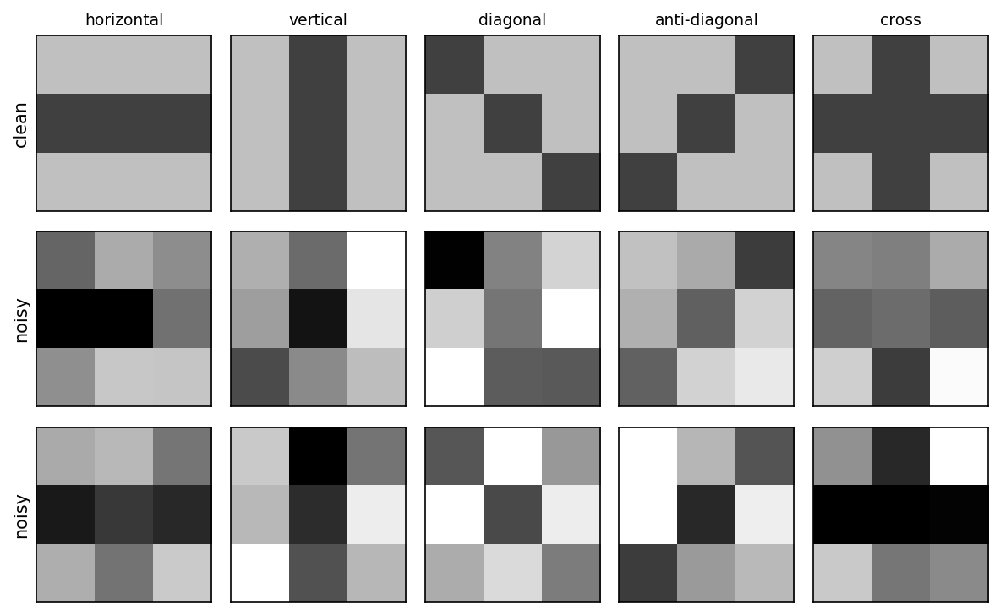
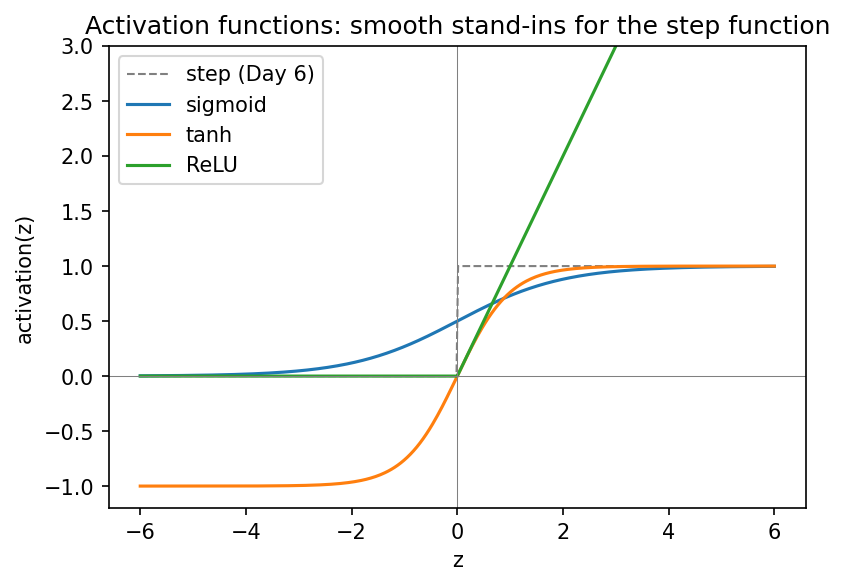

::: {.callout-note}
**Sources for this page:** d2l.ai, *Dive into Deep Learning*,
[Softmax Regression](https://d2l.ai/chapter_linear-classification/softmax-regression.html),
[Generalization in Classification](https://d2l.ai/chapter_linear-classification/generalization-classification.html)
and [Builders' Guide](https://d2l.ai/chapter_builders-guide/index.html)
(`nn.Module`) — CC BY-SA 4.0; Wikipedia,
[Training, validation, and test data sets](https://en.wikipedia.org/wiki/Training,_validation,_and_test_data_sets),
[Supervised learning](https://en.wikipedia.org/wiki/Supervised_learning),
[Regression analysis](https://en.wikipedia.org/wiki/Regression_analysis),
[Statistical classification](https://en.wikipedia.org/wiki/Statistical_classification),
[Logistic regression](https://en.wikipedia.org/wiki/Logistic_regression),
[Leakage (machine learning)](https://en.wikipedia.org/wiki/Leakage_(machine_learning)),
[Confusion matrix](https://en.wikipedia.org/wiki/Confusion_matrix),
[Matthews correlation coefficient](https://en.wikipedia.org/wiki/Phi_coefficient),
[Receiver operating characteristic](https://en.wikipedia.org/wiki/Receiver_operating_characteristic),
[Activation function](https://en.wikipedia.org/wiki/Activation_function)
— CC BY-SA 4.0; UniProt, [Subcellular location](https://www.uniprot.org/help/subcellular_location)
— CC BY 4.0; EBI's PDBe API for the helix-fraction data; Steinegger &
Söding (2017), [MMseqs2](https://doi.org/10.1038/nbt.3988), *Nature
Biotechnology* 35:1026-1028, for sequence clustering. The 3×3
pattern-recognition example, the classifier-evaluation material, and the
emphasis on homology reduction of training sets draw on ideas from Magnus
Ekman's *Learning Deep Learning* (ch. 2, ch. 4 and Appendix A slide decks
in `slides/`, the ch. 4 deck bundling Olof Emanuelsson's "Neural Networks
in bioinformatics" slides). That book is copyrighted and not openly
licensed, so it is credited here as an internal source and not linked as
further reading. All figures on this page were drawn or computed for this
course. Every number was computed in code and read back from the
notebook's output.
:::

# Day 8: Machine Learning Foundations & Practical PyTorch

## Learning goals

By the end of this session you should be able to:

- tell regression from classification, and choose the output, loss and
  evaluation metric that go with each;
- explain what training, validation and test sets are for, and name the
  ways biological data can leak between them, homologous sequences above
  all;
- compute and interpret a confusion matrix, precision, recall, F1, MCC,
  ROC/AUROC, and RMSE, Pearson $r$ and $R^2$;
- relate artificial neurons and networks to biological ones, and place
  the architectures of Days 9-13 on one map;
- describe softmax as the multi-class version of Day 6's model, and write
  (not yet train) a PyTorch `nn.Module` classifier.

The session has three parts: **what learning from data means**, **data
and evaluation**, and **from neurons to networks**. A tiny 3×3-pixel
pattern problem runs through all three as a toy example, and a real
protein-localization dataset carries the biology.

# Part 1: What does it mean to learn from data?

## Supervised and unsupervised learning

**Supervised learning** fits a model to *labelled* examples, where the
correct answer for each input is already known: a PSSM built from known
family members (Day 5), or a perceptron trained on known binding sites
(Day 6). **Unsupervised learning** finds structure in data *without*
labels: clustering sequences into families, or projecting expression
profiles with PCA. The MMseqs2 clustering in Part 2 of this page is
unsupervised. Everything we train in this course is supervised.

## Regression vs. classification

What decides the kind of supervised problem is the *label*:

- **Regression**: the label is a **number**.
- **Classification**: the label is one of a fixed set of **categories**.

| Regression (predict a number) | Classification (predict a category) |
|---|---|
| Fraction of residues in helices (below) | Subcellular compartment: 5 classes (below) |
| Protein melting temperature, or stability change $\Delta\Delta G$ of a mutation | Is this mutation pathogenic or benign? |
| mRNA expression level in a tissue | Does this protein have a signal peptide? (Day 11) |
| Binding affinity (pK~d~) of a drug to a target | Helix / strand / coil for each residue (Day 6, Day 9) |
| Relative solvent accessibility of a residue (0-1) | Is this residue buried or exposed? |

The last row shows that the same biology can often be posed either way.
Thresholding a continuous quantity turns regression into classification.
That makes the problem easier, but throws information away.

![Two real problems. **Left, regression:** for 55 PDB entries (fetched live from PDBe), the fraction of residues in helices against the fraction of strong Chou-Fasman helix formers (E, M, A, L, K, F, Q) in the sequence. A straight line captures a real trend ($r = 0.71$) with plenty of scatter. **Right, classification:** 488 secreted and 497 nuclear human proteins from UniProt, plotted by the hydrophobicity of their first 25 residues and their lysine + arginine content. Logistic regression draws the black boundary where $P(\text{secreted}) = 0.5$.](figs/day08-regression-vs-classification.png){width=100%}

The classifier on the right tells a biological story. It gives
N-terminal hydrophobicity a weight of 4.26 and K+R content a weight of
only −0.20. Secreted proteins begin with a hydrophobic **signal
peptide**, and the model found that single feature almost on its own.
Held-out accuracy is 0.935 from just two numbers per protein.

### Logistic regression: the bridge between the two

Logistic regression computes the same weighted sum as Day 6's
perceptron, $z = w_1x_1 + w_2x_2 + b$. Instead of a hard step, it passes
$z$ through the **sigmoid**

$$
\sigma(z) = \frac{1}{1+e^{-z}},
$$

which turns any number into a probability between 0 and 1. Despite its
name, logistic regression is a *classifier*: it outputs
$P(\text{secreted} \mid x)$. In the notebook, one nuclear protein gets
$P = 0.008$ and one secreted protein gets $P = 0.980$. The decision
boundary ($P = 0.5$, i.e. $z = 0$) is exactly the perceptron's straight
line. What changes is that the output is now smooth and differentiable,
which is what Day 9's training needs.

The choice of problem type fixes three things downstream:

| | Regression | Classification |
|---|---|---|
| Output unit | linear (no activation) | sigmoid (2 classes) / softmax ($K$ classes) |
| Loss minimized in training (Day 9) | mean squared error | cross-entropy |
| Evaluation metrics (Part 2) | RMSE, Pearson $r$, $R^2$ | confusion matrix, precision, recall, F1, MCC, AUROC |

## A running toy example: 3×3 pixel patterns

The smallest classification problem worth the name: nine pixels (dark =
+1, light = −1) and five classes. Every example is a clean pattern plus
random noise on each pixel (Gaussian, σ = 0.8). "Cross" shares its middle
row with "horizontal" and its middle column with "vertical", so we can
expect some confusion there.

{width=75%}

The classifier is five Day-6 perceptrons, one per pattern, each trained
to output +1 for its own pattern and −1 for every other. The predicted
class is whichever perceptron gives the highest score. This is called
**one-vs-rest**. There is no hidden layer, so nothing here needs
backpropagation. Part 2 uses this model to show what the three data sets
are for and what the evaluation metrics mean.

### Further reading

- Wikipedia, [Supervised learning](https://en.wikipedia.org/wiki/Supervised_learning), [Regression analysis](https://en.wikipedia.org/wiki/Regression_analysis), [Statistical classification](https://en.wikipedia.org/wiki/Statistical_classification)
- Wikipedia, [Logistic regression](https://en.wikipedia.org/wiki/Logistic_regression)
- Wikipedia, [Chou-Fasman method](https://en.wikipedia.org/wiki/Chou%E2%80%93Fasman_method) (helix propensities) and [Hydrophilicity plot](https://en.wikipedia.org/wiki/Hydrophilicity_plot) (Kyte-Doolittle scale)
- d2l.ai, [Linear Regression](https://d2l.ai/chapter_linear-regression/linear-regression.html)

# Part 2: Data and evaluation

## Why three data sets?

A model is only useful if it works on data it has **not** seen. Its
performance on the training data says little: a flexible enough model can
memorize every training example. So the labelled data is split three
ways:

- **Training set**: used to fit the weights.
- **Validation set**: used to make *choices*, such as how long to train,
  how large a network to use, or which features to include. Every choice
  tuned on it makes it slightly optimistic.
- **Test set**: looked at **once**, at the very end, to report the final
  number. If you go back and change the model after looking at the test
  set, it has become a second validation set and no longer gives an
  honest estimate.

On the 3×3 problem (100 training, 100 validation and 200 test examples),
the number of training epochs is chosen on the validation set. Two epochs
already reach 0.90 validation accuracy. Longer training never beats that.
The noisy, overlapping patterns can't all be separated by straight
lines, so the perceptron rule never settles, and training accuracy
keeps moving between 0.88 and 0.95. The model trained for two epochs is then measured **once** on
the test set: **0.895**.

## Evaluating a classifier

Accuracy is a single number, and it hides *which* mistakes are made. The
**confusion matrix** cross-tabulates the true class (rows) against the
predicted class (columns):

{width=100%}

For any one class, treated as "positive" against all the rest, each
prediction is a true or false positive (TP, FP) or a true or false
negative (TN, FN). From these counts:

$$
\text{precision} = \frac{TP}{TP+FP} \qquad
\text{recall} = \frac{TP}{TP+FN} \qquad
F_1 = \frac{2\cdot\text{precision}\cdot\text{recall}}{\text{precision}+\text{recall}}
$$

- **Precision** asks: of the proteins I called positive, how many are?
- **Recall** (sensitivity) asks: of the true positives, how many did I
  find?

For "vertical" on the 3×3 test set, recall is 0.95 but precision only
0.76, because many crosses were called vertical. For "cross", recall
drops to 0.75. In a screening application such as flagging potentially
pathogenic variants for follow-up, you would favour recall. When each
positive call triggers an expensive experiment, you would favour
precision.

The **Matthews correlation coefficient** uses all four counts,

$$
\text{MCC} = \frac{TP\cdot TN - FP\cdot FN}{\sqrt{(TP+FP)(TP+FN)(TN+FP)(TN+FN)}},
$$

and runs from $-1$ (always wrong) through $0$ (no better than chance) to
$+1$ (perfect). It stays honest when classes are unbalanced (see below).
Over all five 3×3 classes, MCC is 0.871.

**ROC curves.** Most classifiers output a *score*, and a threshold turns
it into a yes/no call. Lowering the threshold finds more true positives
but also lets through more false positives. The ROC curve plots the
true-positive rate against the false-positive rate as the threshold
sweeps across all values. The area under it, **AUROC**, is the
probability that a random positive gets a higher score than a random
negative: 0.5 for guessing, 1.0 for a perfect ranking. For the "cross"
perceptron it is 0.938. The same reasoning is behind Day 5's choice of an
E-value cutoff: you pick a point on this trade-off.

## Evaluating a regression model

A regression prediction isn't right or wrong, only more or less off.
On 14 held-out proteins from the helix example (fitted on the other 41):

- **RMSE** $= \sqrt{\tfrac1n \sum (y_i - \hat y_i)^2}$ is 0.159, in the
  target's own units (fraction helix). Predicting the training-set mean
  for every protein gives 0.234, which is the baseline to beat.
- **Pearson $r$** between predicted and measured values is 0.760.
- **$R^2$** $= 1 - \sum (y_i-\hat y_i)^2 / \sum (y_i - \bar y)^2$ is
  0.526: about half of the variance explained. $R^2 = 0$ means no better
  than the mean.

With only 14 test proteins, all three numbers are themselves uncertain.
That leads to the next question.

## How much can you trust one split?

The real dataset for today: reviewed human UniProt entries with exactly
one annotated location, in five classes (cytoplasm, nucleus,
mitochondrion, secreted, cell membrane). Each sequence is one-hot encoded
over its first 150 residues (localization signals are mostly N-terminal),
giving 3000 input numbers per protein.

**Class imbalance first.** Before balancing, the classes hold 424, 497,
140, 488 and 338 proteins. A "classifier" that always answers *nucleus*
reaches an accuracy of 0.263, above the 0.20 you might expect for five
classes, while its MCC is exactly 0. Real proteomes are far more
unbalanced than this. In a genome-wide screen for, say, a rare targeting
signal, "always no" can reach 99% accuracy. Always report MCC (or
precision and recall) alongside accuracy. Here we avoid the problem by
balancing every class to 140 proteins (700 in total).

**Split-to-split noise.** A quick logistic-regression baseline, refitted
on ten different random 70/15/15 splits, gives validation accuracies from
0.505 to 0.610 (mean 0.561, std 0.031). The data and model are the same;
only the random draw of the split differs. **k-fold cross-validation**
removes the dependence on one draw: cut the data into $k$ class-stratified
folds, train $k$ times with a different fold held out each time, and
average. With $k = 5$ the notebook gets 0.540 ± 0.044. Every protein is
used for validation exactly once, at $k$ times the computing cost.

## The biological trap: homologs on both sides of the split

A random split assumes the examples are independent. **Proteins are
not.** They come in families of homologs (Day 4) that share sequence and,
usually, localization and function. Suppose one family member is in the
training set and another in the test set. The model can then score well
by *recognizing the family*, without learning anything about targeting
signals, and the test set rewards memorization instead of measuring
generalization to new kinds of proteins.

We can measure this. Clustering the 700 proteins with **MMseqs2** (a
fast, BLAST-like search that groups sequences above an identity cutoff)
at 30% identity gives 551 clusters. 75 clusters have more than one
member, holding 224 proteins in total, and the largest has 11. Over the
same ten random splits:

- **31.3%** of validation proteins have a ≥30%-identity homolog in the
  training set;
- the baseline classifies those correctly **67.5%** of the time;
- it classifies the remaining proteins correctly only **50.9%** of the
  time.

The fix is **homology partitioning**: cluster first, then put whole
clusters into training, validation or test, so that no family crosses
the split. Averaged over ten splits of each kind, baseline accuracy drops
from 0.553 (random) to 0.536 (homology-aware). The overall drop is small
*here* only because 476 of the 700 proteins have no homolog in the set
at all. In more redundant data, such as a whole proteome or the PDB with
its thousands of near-identical structures of popular proteins, the gap
can be much larger. **From today on, this course uses the
homology-aware split** (486 training / 105 validation / 109 test
proteins), and Days 9 and 10 reuse it.

### Other ways biological data leaks

Homology is the classic trap, but not the only one. The common pattern
is that something shared between the training and test examples, other
than the signal you want to learn, lets the model cheat.

- **Several samples from one individual.** Split by patient, not by
  sample. Otherwise the model learns to recognize the patient.
- **Batch effects.** If all tumour samples were sequenced in one lab and
  all controls in another, a model can learn the lab. Keep batches
  balanced across classes, or split by batch.
- **Preprocessing on the full dataset.** Normalizing, selecting features
  or running PCA on *all* data before splitting lets test-set information
  in. Fit preprocessing on the training set only.
- **Time.** A model tested on proteins annotated *before* its training
  data may benefit from later annotations that were themselves predicted
  by similar tools. **CASP** (Day 7) avoids all of this by testing on
  structures that are unpublished at prediction time. This truly blind
  test is the model for honest evaluation.
- **Unrepresentative data.** Swiss-Prot over-represents well-studied
  proteins and model organisms. A model trained on human proteins may not
  transfer to bacteria. The training set should look like the data the
  model will be used on.

### Further reading

- Wikipedia, [Training, validation, and test data sets](https://en.wikipedia.org/wiki/Training,_validation,_and_test_data_sets), [Cross-validation (statistics)](https://en.wikipedia.org/wiki/Cross-validation_(statistics)), [Leakage (machine learning)](https://en.wikipedia.org/wiki/Leakage_(machine_learning)), [Batch effect](https://en.wikipedia.org/wiki/Batch_effect)
- Wikipedia, [Confusion matrix](https://en.wikipedia.org/wiki/Confusion_matrix), [Precision and recall](https://en.wikipedia.org/wiki/Precision_and_recall), [Matthews correlation coefficient](https://en.wikipedia.org/wiki/Phi_coefficient), [Receiver operating characteristic](https://en.wikipedia.org/wiki/Receiver_operating_characteristic), [Coefficient of determination](https://en.wikipedia.org/wiki/Coefficient_of_determination)
- d2l.ai, [Generalization in Classification](https://d2l.ai/chapter_linear-classification/generalization-classification.html)
- Steinegger & Söding (2017), [MMseqs2 enables sensitive protein sequence searching for the analysis of massive data sets](https://doi.org/10.1038/nbt.3988); software at [github.com/soedinglab/MMseqs2](https://github.com/soedinglab/MMseqs2)
- Wikipedia, [CASP](https://en.wikipedia.org/wiki/CASP)

# Part 3: From neurons to networks

## Biological and artificial networks

Day 6 introduced the perceptron as Rosenblatt's simplified neuron: inputs
weighted by synaptic strengths, summed, then passed through a threshold.
A *network* connects many such units, and here the analogy with biology
becomes loose:

{width=100%}

Three differences matter for what follows.

- **Real neurons spike.** They send discrete pulses over time. Artificial
  units output a single number.
- **Brains are recurrent.** Signals loop back. The networks of Days 8-10
  are strictly feed-forward. Day 11's recurrent networks bring loops back
  in a controlled form.
- **Brains are sparsely connected.** Each neuron connects to a small
  fraction of the others. A fully connected layer (`nn.Linear`) connects
  every input to every output.

{width=100%}

Connectivity is the main thing that separates the network
**architectures** in the rest of this course. Each one builds an
assumption about the data into its wiring:

![The architectures still to come, each with a biological application from this course. Feed-forward networks take a fixed-size input (today's localization model; PHD on Day 9). CNNs look for local patterns with shared weights (contact maps, Day 10). RNNs read a sequence one position at a time (signal peptides, Day 11). Transformers let every position attend to every other (protein language models and AlphaFold, Day 12). Generative diffusion models learn to turn noise into new examples (protein design, Day 13).](figs/day08-architectures.png){width=100%}

## Smooth activation functions

A step function's derivative is zero everywhere except at the jump,
where it is undefined. So it gives gradient descent nothing to follow.
Networks replace the step with a smooth function. You already met one in
Part 1, the sigmoid of logistic regression:

$$
\sigma(z) = \frac{1}{1+e^{-z}} \qquad
\tanh(z) = 2\sigma(2z) - 1 \qquad
\text{ReLU}(z) = \max(0, z)
$$

{width=70%}

- **Sigmoid** outputs a value in $(0, 1)$. It remains the standard for a
  binary output unit, where a probability is wanted.
- **tanh** has the same S shape but is centred on zero, with outputs in
  $(-1, 1)$.
- **ReLU** passes positive values unchanged and sets negative ones to
  zero. It is cheap to compute and is the default for hidden layers in
  modern networks.

*Why* the choice matters in deep networks is part of Day 9's
vanishing-gradient discussion, which is where the derivatives of these
functions are compared.

## From binary to multi-class: softmax

The 3×3 classifier has five outputs and picks the largest. **Softmax**
turns $K$ raw scores (**logits**) into a probability distribution:

$$
\text{softmax}(z)_k = \frac{e^{z_k}}{\sum_{j=1}^K e^{z_j}}
$$

Take a noisy "horizontal" pattern that the perceptrons misclassify. Its
five scores ($-2.19$, $-0.80$, $-2.35$, $-2.61$, $0.16$) become
probabilities 0.06, 0.24, 0.05, 0.04 and 0.62, most of it on "cross".
Softmax never changes *which* class wins, but it shows how confident the
decision is. With $K = 2$, softmax reduces to the sigmoid. So softmax
regression is logistic regression for more than two classes.

In PyTorch, a classifier's last layer outputs raw logits. The loss
function (`nn.CrossEntropyLoss`, Day 9) applies softmax internally, and
you apply softmax yourself only when you need probabilities, for example
to compute AUROC.

### Further reading

- Wikipedia, [Neuron](https://en.wikipedia.org/wiki/Neuron), [Neural network (machine learning)](https://en.wikipedia.org/wiki/Neural_network_(machine_learning)), [Activation function](https://en.wikipedia.org/wiki/Activation_function), [Softmax function](https://en.wikipedia.org/wiki/Softmax_function)
- d2l.ai, [Softmax Regression](https://d2l.ai/chapter_linear-classification/softmax-regression.html)

## Practical PyTorch: writing a model as a class

A PyTorch model is a class that inherits from `nn.Module`. Its layers are
attributes created in `__init__`, and a `forward()` method describes how
an input tensor becomes an output tensor. This is the first real use in
the course of the `class` syntax from Day 2, and every later model
follows the same pattern.

The whole 3×3 classifier is a single `nn.Linear(9, 5)` layer, with 50
parameters (5 × 9 weights + 5 biases). When the notebook copies the
trained perceptron weights into it, it makes exactly the same predictions
as the NumPy code. A perceptron layer and `nn.Linear` do the same
computation.

The localization network is the same pattern at a larger scale: 3000
inputs, a hidden layer of 64 ReLU units, and 5 output logits, for
**192,389 parameters**. One forward pass on the homology-aware validation
set confirms the shapes (105 × 3000 in, 105 × 5 out). With random weights
it scores what chance looks like: accuracy 0.181, MCC −0.027, macro AUROC
0.474. The network is **not trained** today. Day 9 adds backpropagation
and the training loop, and reports the same metrics on this split.

## Check your understanding

```{=html}
<div id="day08-quiz"></div>
<script>
renderQuiz("day08-quiz", [
  {
    question: "You want to predict the change in melting temperature (in &deg;C) caused by a point mutation. Which combination fits?",
    choices: [
      "Regression: linear output unit, mean-squared-error loss, evaluated with RMSE / Pearson r",
      "Classification: softmax output, cross-entropy loss, evaluated with MCC",
      "Regression: sigmoid output unit, evaluated with AUROC",
      "Unsupervised learning, since no labels are needed"
    ],
    correctIndex: 0,
    explanation: "The label is a number, so it is a regression problem. It becomes classification only if you threshold it, e.g. stabilizing vs. destabilizing."
  },
  {
    question: "A random split of a protein dataset puts close homologs in both the training and the test set. What is the most likely effect?",
    choices: [
      "Test performance overestimates how well the model works on genuinely new protein families",
      "Test performance underestimates the model, because homologs confuse it",
      "No effect, because the model never sees the test proteins during training",
      "The model cannot be trained at all"
    ],
    correctIndex: 0,
    explanation: "The model can recognize the family instead of learning the signal. In the notebook, validation proteins with a homolog in training were classified correctly 67.5% of the time, vs. 50.9% for the rest."
  },
  {
    question: "On an unbalanced 5-class dataset, a model that always predicts the largest class reaches 26% accuracy. What is its MCC?",
    choices: ["0", "0.26", "0.20", "1"],
    correctIndex: 0,
    explanation: "MCC measures agreement beyond chance. A constant prediction has none, however high its accuracy."
  },
  {
    question: "In the 3&times;3 confusion matrix, 9 crosses are predicted as 'vertical'. Which statement is correct?",
    choices: [
      "These lower the recall of 'cross' and the precision of 'vertical'",
      "These lower the precision of 'cross' and the recall of 'vertical'",
      "These lower only the overall accuracy, not any per-class metric",
      "These are true negatives for 'vertical'"
    ],
    correctIndex: 0,
    explanation: "True crosses that were missed are false negatives for 'cross' (lower recall). Predicted verticals that are not vertical are false positives for 'vertical' (lower precision)."
  },
  {
    question: "Why must the test set be used only once, at the very end?",
    choices: [
      "Every decision tuned on it makes it optimistic, so it stops being an honest estimate of performance on new data",
      "Evaluating a model changes its weights",
      "PyTorch deletes the test set after one use",
      "The test set is always smaller than the validation set"
    ],
    correctIndex: 0,
    explanation: "Choices such as the number of epochs belong on the validation set. A test set used to guide choices becomes a second validation set."
  },
  {
    question: "What does softmax add to a layer of K raw scores?",
    choices: [
      "It turns them into K positive numbers that sum to 1, without changing which class has the highest score",
      "It changes which class is predicted, to correct errors",
      "It adds a hidden layer",
      "It is only needed for regression"
    ],
    correctIndex: 0,
    explanation: "Softmax preserves the ranking of the scores. It only rescales them into a probability distribution. With K = 2 it is the sigmoid."
  },
  {
    question: "Why does the case-study encoding keep only the first 150 residues of each sequence?",
    choices: [
      "The signals that determine localization (signal peptides, mitochondrial targeting sequences) are mostly N-terminal",
      "UniProt only provides the first 150 residues",
      "150 is the average length of a human protein",
      "PyTorch cannot handle longer inputs"
    ],
    correctIndex: 0,
    explanation: "It is a modelling choice based on biology, and it keeps the input to a fixed size of 150 &times; 20 = 3000 numbers."
  }
]);
</script>
```

## The notebook

`notebooks/day08-ml-foundations-and-pytorch.ipynb` computes every number
and figure on this page. In order, it covers:

- the helix-fraction regression and the secreted-vs-nuclear logistic
  regression (both with live data);
- the 3×3 patterns: train/validation/test, confusion matrix,
  precision/recall/F1/MCC and ROC;
- regression metrics;
- class imbalance, split-to-split noise and cross-validation on the
  UniProt localization data;
- MMseqs2 clustering, homology leakage and the homology-aware split. If
  `mmseqs` is not installed, as on Colab, a precomputed clustering is
  downloaded;
- activation functions, softmax, the 3×3 model as an `nn.Linear`, and
  the untrained localization network.

Open it in
[Google Colab](https://colab.research.google.com/github/ElofssonLab/kb8029-book/blob/main/notebooks/day08-ml-foundations-and-pytorch.ipynb)
via the badge at the top of the notebook page to edit and run it
yourself.

## The lab

**Full lab, on MNIST:** 70,000 handwritten digits, the classic first
dataset for neural networks, adapted from the previous course's
"Neural Networks" lab and rebuilt in PyTorch. Work through
[`notebooks/day08-lab.ipynb`](https://colab.research.google.com/github/ElofssonLab/kb8029-book/blob/main/notebooks/day08-lab.ipynb),
filling in every `...`:

1. inspect the class balance;
2. build training, validation and test sets, and standardize the pixels
   using statistics from the training set only;
3. write the model as an `nn.Module` (784 inputs, 10 tanh hidden units,
   10 output logits) and count its parameters;
4. train it with a provided `train_model` function (Day 9 opens that
   box), then turn logits into probabilities and classes;
5. compute a confusion matrix, precision, recall, F1, MCC and a ROC
   curve for one digit against the rest;
6. shrink the training set to watch overfitting appear, and use the test
   set once, at the end.

The last section returns to proteins: it measures how many validation
proteins in a *random* split of today's localization dataset have a
homolog in the training set.

### Submitting this lab

This lab is administered through Canvas, not this book — see the
course's Canvas page for the current quiz, deadline, and submission
mechanism.

## What's next

Day 9 trains this network on the homology-aware split: backpropagation,
cross-entropy, the training loop, vanishing gradients (including the
activation-function derivatives deferred from today), and regularization.
It closes with Rost & Sander's PHD method as the payoff of the Day 5-9
arc.
