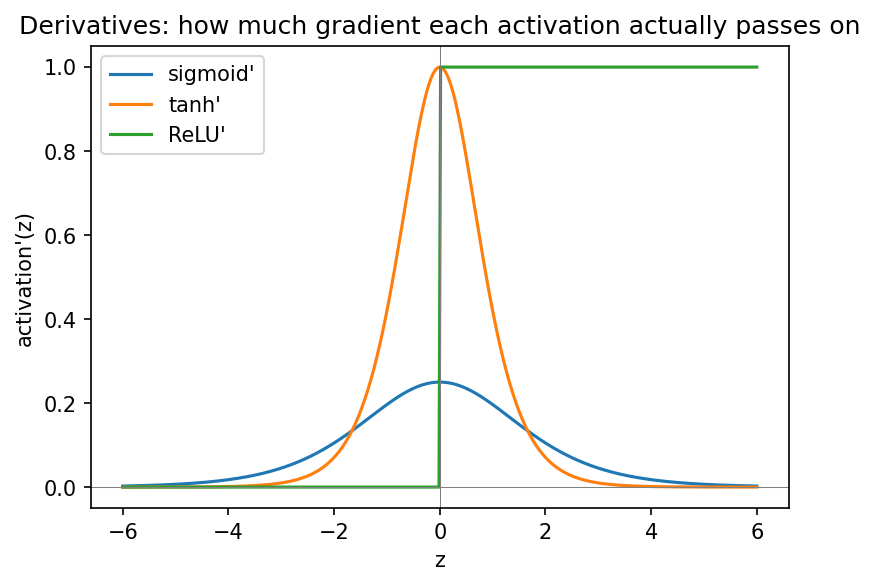

::: {.callout-note}
**Sources for this page:** d2l.ai, *Dive into Deep Learning*,
[Softmax Regression](https://d2l.ai/chapter_linear-classification/softmax-regression.html)
and [Builders' Guide](https://d2l.ai/chapter_builders-guide/index.html)
(`nn.Module`, tensors) — CC BY-SA 4.0; Wikipedia,
[Training, validation, and test data sets](https://en.wikipedia.org/wiki/Training,_validation,_and_test_data_sets),
[Supervised learning](https://en.wikipedia.org/wiki/Supervised_learning),
[Unsupervised learning](https://en.wikipedia.org/wiki/Unsupervised_learning),
[Activation function](https://en.wikipedia.org/wiki/Activation_function),
[Biological neuron model](https://en.wikipedia.org/wiki/Biological_neuron_model),
[Confusion matrix](https://en.wikipedia.org/wiki/Confusion_matrix),
[F-score](https://en.wikipedia.org/wiki/F-score),
[Matthews correlation coefficient](https://en.wikipedia.org/wiki/Phi_coefficient),
[Receiver operating characteristic](https://en.wikipedia.org/wiki/Receiver_operating_characteristic)
— CC BY-SA 4.0; UniProt, [Subcellular location - Manual annotation](https://www.uniprot.org/help/subcellular_location)
— CC BY 4.0 — the subcellular-localization dataset below was fetched
live from UniProt's REST API, not a static download. The classifier-
evaluation-metrics material (confusion matrix, precision/recall/F1,
ROC/AUROC, MCC) and the biological-neuron framing for activation
functions are mined for ideas from Magnus Ekman's *Learning Deep
Learning* (slide decks `Appendix-A`, `Chapter-3`, `Chapter-4` in
`slides/`, the latter bundling in Olof Emanuelsson's "Neural Networks in
bioinformatics" slides) — a copyrighted, not openly-licensed textbook
(the one this course rebuild is replacing), credited here as an internal
source, not linked as further reading. Every number below was computed
in code and verified by reading the notebook's actual output, not
transcribed or assumed.
:::

# Day 8: Machine Learning Foundations & Practical PyTorch

## Learning goals

By the end of this session you should be able to explain the difference
between supervised and unsupervised learning and why data gets split
into training/validation/test sets; compute and interpret the standard
classifier evaluation metrics (confusion matrix, precision/recall/F1,
ROC/AUROC, MCC); explain the connection between a perceptron and a
biological neuron, and why differentiable activation functions replace
the perceptron's step function; describe softmax as the multi-class
generalization of Day 6's binary model; and write (though not yet train)
a real PyTorch `nn.Module` classifier for a genuine multi-class
biological problem.

## Supervised learning and the three-way data split

**Supervised learning** fits a model to labelled examples (every day
from Day 5 onward in this course); **unsupervised learning** finds
structure in data with no labels at all (not used in this course, but
worth knowing exists — clustering is the classic example). Every
supervised model needs its data split three ways:

- **Training set** — used to fit the weights.
- **Validation set** — used to check progress and tune choices (like
  the regularization settings Day 9 introduces) without touching the
  test set.
- **Test set** — touched exactly once, at the very end, to report a
  fair final number.

Skipping this split, or tuning a choice based on test-set performance,
silently inflates how good a model looks — it has, in effect, been
allowed to "see the exam" before being graded on it.

Applied to today's case study (700 proteins, 5 balanced classes): a
stratified 70/15/15 split gives 490 training, 105 validation, and 105
test proteins, each split keeping the same 5-way class balance
(**stratification**) — see the notebook for the exact numbers.

### How much can you trust one split?

105 validation proteins is not a lot. Refitting a fast baseline
classifier (logistic regression on the same one-hot features — not the
deep network above, which stays untrained until Day 9) across ten
different random 70/15/15 splits, the validation accuracy it measures
ranges from 0.505 to 0.610 (mean 0.561, std 0.031) — the *same* model
and data, just a different arbitrary draw of which proteins land in
which split. A single split's number is really a sample from a
distribution, not a fixed truth.

**K-fold cross-validation** addresses this directly: partition the
training+validation data into $k$ roughly equal, class-stratified
folds, train $k$ times (holding out a different fold each time), and
average — so every example serves as validation data exactly once,
rather than the final number depending on one arbitrary split. It costs
$k\times$ the fitting time. On this same data with $k=5$, the notebook
measures a mean accuracy of 0.565 with a fold-to-fold std of 0.039 —
*not* smaller than the ten-single-splits' std of 0.031 above, since
with only 5 folds that standard deviation is itself a noisy quantity on
a dataset this small. Cross-validation's real benefit here isn't a
guaranteed lower variance in a demo this size — it's that the estimate
no longer depends on which one split you happened to draw.

### Further reading

- Wikipedia, [Training, validation, and test data sets](https://en.wikipedia.org/wiki/Training,_validation,_and_test_data_sets)
- Wikipedia, [Supervised learning](https://en.wikipedia.org/wiki/Supervised_learning) and [Unsupervised learning](https://en.wikipedia.org/wiki/Unsupervised_learning)
- Wikipedia, [Cross-validation (statistics)](https://en.wikipedia.org/wiki/Cross-validation_(statistics))

## From the perceptron's step function to smooth activations

Day 6's perceptron used a **step function**: output 1 if the weighted
sum $z$ exceeds 0, else 0 — which is, at a coarse level, exactly what a
biological neuron does: sum incoming synaptic potentials, and fire an
action potential only once that sum crosses a threshold. The perceptron
is a deliberate simplification of that neuron.

But a step function's derivative is zero everywhere except one
undefined point — it gives gradient descent nothing to follow. Every
network from here on replaces it with a smooth, differentiable
S-shaped (or otherwise well-behaved) function instead, keeping the same
"sum inputs, then decide" computation but making it trainable:

$$
\text{sigmoid: } \sigma(x) = \frac{1}{1+e^{-x}} \qquad
\tanh(x) = 2\sigma(2x) - 1 \qquad
\text{ReLU: } f(x) = \max(0, x)
$$

{width=85%}

Sigmoid and tanh both **saturate** (flatten, gradient near zero) for
large $|x|$ — the root cause of the vanishing-gradient problem Day 9
tackles directly. ReLU stays unbounded for positive inputs, avoiding
saturation on that side, which is why it's the default choice for hidden
layers in most modern networks.

**The trade-offs, concretely:**

{width=85%}

Sigmoid's derivative peaks at
just $0.25$ (at $x=0$) and is already below $0.01$ by $|x|=6$ — small to
begin with, and vanishing fast. Tanh's derivative peaks higher, at
$1.0$, and tanh is **zero-centered** ($(-1,1)$ rather than sigmoid's
$(0,1)$), which historically made it the preferred choice for *hidden*
layers — sigmoid remained standard for a binary *output* layer, where a
$(0,1)$ range is exactly what's needed. ReLU's derivative is either
exactly $0$ or exactly $1$: cheap to compute, and it never shrinks for
positive inputs, avoiding saturation on that side entirely — Day 9's
own vanishing-gradient measurement shows exactly how much this matters
across several layers. That same all-or-nothing shape is also ReLU's
weakness, known as **dying ReLU**: a unit whose weights land it in
$x<0$ territory for every training example gets a permanent zero
gradient and can never recover, no matter how training continues.
Modern practice often reaches for **Leaky ReLU** ($f(x) = \max(0.01x,
x)$, a small nonzero slope for $x<0$) or **GELU** (a smooth ReLU-like
curve used in transformer models) specifically to fix this — mentioned
here as pointers; this course's own networks use plain ReLU throughout.

### Further reading

- Wikipedia, [Activation function](https://en.wikipedia.org/wiki/Activation_function)
- Wikipedia, [Biological neuron model](https://en.wikipedia.org/wiki/Biological_neuron_model)

## From binary to multi-class: softmax

Day 6's model produced one number, thresholded into a yes/no decision.
Many real problems — including today's case study — have more than two
classes. **Softmax** generalizes the idea: given $K$ raw scores
(logits) $z_1, \ldots, z_K$, one per class,

$$
\text{softmax}(z)_k = \frac{e^{z_k}}{\sum_{j=1}^K e^{z_j}}
$$

turns them into $K$ positive numbers summing to 1 — a probability
distribution over classes. In PyTorch practice, a classification
model's own final layer outputs raw logits with no softmax applied; the
loss function (`nn.CrossEntropyLoss`, used starting Day 9) applies
softmax internally as part of computing the loss. Softmax is applied
explicitly only when actual probabilities are needed afterward — for
instance, to compute the ROC/AUROC metric below.

### Further reading

- d2l.ai, [Softmax Regression](https://d2l.ai/chapter_linear-classification/softmax-regression.html)

## Evaluating a classifier

A **confusion matrix** cross-tabulates true class against predicted
class. From it:

$$
\text{precision} = \frac{TP}{TP+FP} \qquad
\text{recall} = \frac{TP}{TP+FN} \qquad
F_1 = \frac{2 \cdot \text{precision} \cdot \text{recall}}{\text{precision}+\text{recall}}
$$

The **Matthews correlation coefficient (MCC)** summarizes the whole
confusion matrix in a single number, robust to class imbalance: $+1$ is
a perfect prediction, $0$ is no better than random, $-1$ is perfectly
wrong. The **ROC curve** plots true-positive rate against false-positive
rate as a decision threshold sweeps across predicted probabilities; the
area underneath it (**AUROC**) is $0.5$ for a random classifier and
$1.0$ for a perfect one.

These aren't computed on a hypothetical example — the notebook applies
all four to the case study network below's *own* predictions, before it
has been trained at all, which is exactly what "no better than chance"
looks like in each of these numbers: accuracy 0.248 (chance for 5
balanced classes is 0.20), MCC 0.086, macro AUROC 0.542. Day 9 reports
the same four numbers again once that network is actually trained, for
direct comparison.

### Further reading

- Wikipedia, [Confusion matrix](https://en.wikipedia.org/wiki/Confusion_matrix), [F-score](https://en.wikipedia.org/wiki/F-score), [Matthews correlation coefficient](https://en.wikipedia.org/wiki/Phi_coefficient), [Receiver operating characteristic](https://en.wikipedia.org/wiki/Receiver_operating_characteristic)

## Practical PyTorch: writing a model as a class

A PyTorch model is written as a class inheriting from `nn.Module` — this
course's first real, taught use of Python's `class` syntax (Day 2's
Biopython objects already showed the *pattern* — an object with its own
attributes — without teaching the syntax itself): a class with its
layers as attributes (set up in `__init__`) and a `forward()` method
describing how input tensors become output tensors. This is the pattern
every model in the rest of this course follows.

## Check your understanding

```{=html}
<div id="day08-quiz"></div>
<script>
renderQuiz("day08-quiz", [
  {
    question: "Why does gradient descent need the perceptron's step activation replaced with something like sigmoid or ReLU?",
    choices: [
      "The step function's derivative is zero (or undefined) almost everywhere, giving gradient descent nothing to follow",
      "The step function is too slow to compute on a GPU",
      "The step function can only represent linear relationships",
      "Biological neurons never use a threshold, so the step function is biologically inaccurate"
    ],
    correctIndex: 0,
    explanation: "Gradient-based learning needs a nonzero derivative to know which direction to adjust weights in &mdash; the step function provides none."
  },
  {
    question: "An untrained (randomly initialized) 5-class classifier is evaluated on a balanced validation set. Which set of results is most consistent with a network that hasn't learned anything yet?",
    choices: [
      "Accuracy near 0.20, MCC near 0, AUROC near 0.5",
      "Accuracy near 1.0, MCC near 1, AUROC near 1.0",
      "Accuracy near 0.20, MCC near 1, AUROC near 0.5",
      "Accuracy near 0.0, MCC near -1, AUROC near 0.0"
    ],
    correctIndex: 0,
    explanation: "Chance-level performance on 5 balanced classes is about 20% accuracy, MCC near zero (no better than random), and AUROC near 0.5 &mdash; exactly what the notebook measures for the untrained network."
  },
  {
    question: "Why does a PyTorch classification model's final layer typically output raw logits rather than probabilities?",
    choices: [
      "nn.CrossEntropyLoss applies softmax internally as part of computing the loss, so applying it twice would be redundant",
      "PyTorch cannot compute softmax on a GPU",
      "Logits are always larger numbers than probabilities, which trains faster",
      "Softmax can only be applied to binary classification problems"
    ],
    correctIndex: 0,
    explanation: "Softmax is applied explicitly only when actual probabilities are needed afterward, e.g. for computing AUROC."
  },
  {
    question: "Why does the case study's one-hot encoding truncate each sequence to its first 150 residues rather than using the full sequence?",
    choices: [
      "The biological signals that determine localization (signal peptides, targeting sequences) are overwhelmingly N-terminal, so this keeps the relevant signal while limiting input size",
      "UniProt only provides the first 150 residues of any sequence",
      "150 residues is the average length of a human protein",
      "PyTorch cannot process sequences longer than 150 residues"
    ],
    correctIndex: 0,
    explanation: "It's a deliberate modeling choice based on the biology (N-terminal targeting signals), not an arbitrary or technical limit."
  }
]);
</script>
```

## The notebook

`notebooks/day08-ml-foundations-and-pytorch.ipynb` works through all of
the above concretely: a train/val/test split demo followed by the
single-split-vs-cross-validation comparison above (ten random splits,
then real 5-fold cross-validation, both on a fast logistic-regression
baseline), plots of sigmoid, tanh, and ReLU *and their derivatives*
side by side, and the case study — five subcellular-localization
classes (cytoplasm, nucleus, mitochondrion, secreted, cell membrane)
fetched live from UniProt (424, 497, 140, 488, and 338 unambiguous
single-location human entries respectively, balanced down to 140 per
class), one-hot encoded (150 residues × 20 amino acids, flattened to a
3000-dimensional input), and fed into a real `nn.Module` classifier
(192,389 parameters) — defined, shape-checked with one real forward
pass, and evaluated with all four metrics above, but **not trained**.
Open it in
[Google Colab](https://colab.research.google.com/github/ElofssonLab/kb8029-book/blob/main/notebooks/day08-ml-foundations-and-pytorch.ipynb)
via the badge at the top of the notebook page to edit and run it
yourself.

## The lab

**Full lab:** build the subcellular-localization dataset and network
from scratch, following the notebook — fetch and clean the UniProt
data, one-hot encode it, define the `nn.Module` class, and confirm the
forward pass's output shape and the untrained baseline metrics. Stop
there; Day 9 is where this model actually learns.

### Submitting this lab

Hand-in/grading for this lab isn't set up yet. It will likely run
through a Canvas assignment — check the course's Canvas page for the
actual submission mechanism before this session runs.

## What's next

Day 9 takes this exact model and dataset and implements
backpropagation, weight initialization and normalization, and
regularization (dropout, L2, early stopping) — training it for real,
and delivering Rost & Sander's PHD method as the payoff of the whole
Day 5-9 arc.
