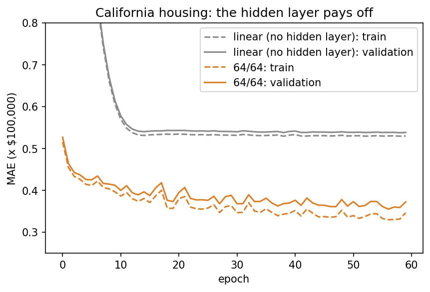
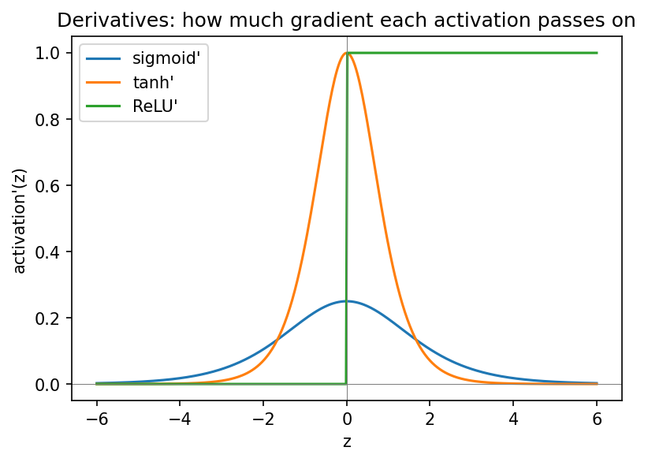

::: {.callout-note}
**Sources for this page:** d2l.ai, *Dive into Deep Learning*,
[Multilayer Perceptrons](https://d2l.ai/chapter_multilayer-perceptrons/index.html)
— CC BY-SA 4.0; Wikipedia,
[Backpropagation](https://en.wikipedia.org/wiki/Backpropagation),
[Stochastic gradient descent](https://en.wikipedia.org/wiki/Stochastic_gradient_descent),
[Overfitting](https://en.wikipedia.org/wiki/Overfitting),
[Vanishing gradient problem](https://en.wikipedia.org/wiki/Vanishing_gradient_problem),
[Regularization (mathematics)](https://en.wikipedia.org/wiki/Regularization_(mathematics)),
[Dropout (neural networks)](https://en.wikipedia.org/wiki/Dropout_(neural_networks)),
[Early stopping](https://en.wikipedia.org/wiki/Early_stopping)
— CC BY-SA 4.0. Datasets: the
[Breast Cancer Wisconsin (Diagnostic)](https://archive.ics.uci.edu/dataset/17/breast+cancer+wisconsin+diagnostic)
data set (UCI Machine Learning Repository, CC BY 4.0) and the California
housing data set (Pace & Barry, 1997,
[*Statistics & Probability Letters* 33:291-297](https://doi.org/10.1016/S0167-7152(96)00140-X)),
both loaded through [scikit-learn](https://scikit-learn.org/stable/datasets/real_world.html);
Day 8's UniProt subcellular-localization data. Ioffe & Szegedy (2015),
"Batch Normalization," [arXiv:1502.03167](https://arxiv.org/abs/1502.03167);
Rost & Sander (1993), [*J. Mol. Biol.* 232:584-599](https://doi.org/10.1006/jmbi.1993.1413)
and [*PNAS* 90:7558-7562](https://pmc.ncbi.nlm.nih.gov/articles/PMC47181/)
(the PHD method). 3Blue1Brown's neural-network videos are linked as
further watching. The housing regression setup (linear baseline vs.
64/64 network, L2 and dropout), the vanishing-gradient demonstration and
the tiny hand-computed backpropagation example follow ideas from Magnus
Ekman's *Learning Deep Learning* (ch. 3, 5 and 6 slide decks in
`slides/`), a copyrighted, not openly licensed textbook, credited here as
an internal source and not linked. Every number below was computed in
code and read back from the notebook's output.
:::

# Day 9: Backpropagation, Training, and Regularization

## Learning goals

By the end of this session you should be able to:

- explain backpropagation as the chain rule applied layer by layer;
- write and run the standard PyTorch training loop, with mini-batches,
  standardized inputs and early stopping;
- choose the output unit and loss for classification (cross-entropy) and
  regression (mean squared error);
- explain the vanishing-gradient problem and why ReLU, weight
  initialization and batch normalization help;
- apply dropout, L2 and early stopping against overfitting;
- judge **when a hidden layer actually pays off**, from how additive the
  problem is and how many examples there are per weight;
- read the architecture of Rost & Sander's PHD method and name where each
  of its parts comes from in this course.

The session has three parts, each with its own dataset: **backpropagation
and the training loop** (breast-cancer biopsies), **regression with a
network** (California housing), and **when data is scarce** (Day 8's
protein-localization network).

# Part 1: Backpropagation and the training loop

## Backpropagation: the chain rule, layer by layer

Day 1 introduced the chain rule; a network with a hidden layer is
exactly a composition of functions, $\hat y = f_2(f_1(x))$, so training
it needs the loss's derivative with respect to *every* weight in *both*
layers. **Backpropagation is not a different algorithm from the chain
rule — it is the chain rule**, applied systematically from the output
layer backward to the input layer, reusing each layer's already-computed
derivative rather than recomputing it from scratch for every weight
individually. PyTorch's `loss.backward()` does exactly this
automatically for a computation graph of any depth — automation that
becomes essential the moment a model has more than one layer, which is
why Day 6's from-scratch gradient descent doesn't scale past a single
linear layer by hand.

**A tiny worked example, verified against `autograd`.** Real networks
have thousands to hundreds of thousands of weights (Part 3's classifier
has 192,389), far too many to trace by hand, but the mechanics are identical at any size, so the notebook shrinks the
same two-layer shape (hidden layer, then output layer) down to 2
inputs, one tanh hidden unit, and one sigmoid output unit: small enough
to compute completely by hand. Starting from the loss and working
backward, each layer's **error signal** ($\partial E/\partial z$) is
computed once and reused for every weight in that layer, rather than
re-deriving each weight's gradient from scratch — that reuse is the
entire reason backpropagation is efficient rather than intractable. The
notebook then builds the identical tiny network as real PyTorch
tensors, calls `loss.backward()`, and compares: every one of the five
hand-derived gradients matches `autograd`'s to eight decimal places.
This isn't just an illustration — it's a real check that the by-hand
chain-rule derivation is actually correct, using the same verification
standard (recompute independently, don't just assert) as every other
worked example in this course.

### Further reading

- Wikipedia, [Backpropagation](https://en.wikipedia.org/wiki/Backpropagation)

### Further watching

- 3Blue1Brown, [But what is a neural network?](https://www.youtube.com/watch?v=aircAruvnKk) — a recap of the network-as-composed-functions picture from Day 6, worth revisiting first if it's been a while
- 3Blue1Brown, [What is backpropagation really doing?](https://www.youtube.com/watch?v=Ilg3gGewQ5U) — the same chain-rule idea as above, built up visually, one layer at a time
- 3Blue1Brown, [Backpropagation calculus](https://www.youtube.com/watch?v=tIeHLnjs5U8) — the full chain-rule mechanics for a general multi-layer network, the general case the worked example above specializes

## The standard PyTorch training loop, on a clinical dataset

The **Wisconsin breast-cancer** dataset has 569 fine-needle biopsies,
each described by 30 features measured on microscope images of the cell
nuclei: radius, texture, perimeter, smoothness, concavity and so on, each
as a mean, a spread and a worst value. Each biopsy is labelled malignant
(212) or benign (357).

Two habits from Day 8 come first. Split the data before anything else
(398 training / 85 validation / 86 test biopsies). Then fit the
**standardization** (each feature's mean and standard deviation) on the
training set only, and apply it unchanged to validation and test.
Standardizing puts features measured in µm² and dimensionless ratios on
the same scale, so no single feature dominates the first weighted sum.

Real training uses **mini-batches**. A `DataLoader` shuffles the training
set every epoch and serves it in batches of 32, and the weights are
updated after every batch. That gives many cheap, slightly noisy steps
per epoch (**stochastic gradient descent**) instead of one expensive exact
step. Inside the loop the same four steps always repeat:

```python
for xb, yb in loader:
    optimizer.zero_grad()            # 1. clear old gradients
    loss = loss_fn(model(xb), yb)    # 2. forward pass + loss
    loss.backward()                  # 3. backpropagation
    optimizer.step()                 # 4. update every weight
```

After every epoch the notebook scores the validation set and keeps the
weights from the best epoch, which is **early stopping**, used from here
on.

The network has one hidden layer of 16 ReLU units and one output logit,
513 weights in total. On the test set it reaches accuracy 0.953, MCC
0.900 and AUROC 0.984, with 2 benign biopsies called malignant and 2
malignant ones missed.

**Is the hidden layer needed?** With only 86 test biopsies, one split is
too noisy to compare two good models (Day 8), so the notebook uses 5-fold
cross-validation on all 569 biopsies. Logistic regression (31 weights)
and the network (513 weights) both reach **0.979** accuracy. Malignant
and benign nuclei differ mainly in size and shape, and a weighted sum of
those measurements already separates them almost perfectly. The training
loop works, but the hidden layer has nothing left to add.

### Further reading

- Wikipedia, [Stochastic gradient descent](https://en.wikipedia.org/wiki/Stochastic_gradient_descent)
- UCI Machine Learning Repository, [Breast Cancer Wisconsin (Diagnostic)](https://archive.ics.uci.edu/dataset/17/breast+cancer+wisconsin+diagnostic)

## Cross-entropy: why this is the loss

A classifier outputs probabilities, and cross-entropy measures how far
the predicted distribution is from the true one. For a single example it
is

$$
\text{CE} = -\log p(\text{true class})
$$

— the negative log of the probability the model gave the correct answer.
Confidently wrong is punished far more than hedged: probability 0.9 on
the truth costs $-\log(0.9) \approx 0.105$, while probability 0.01 costs
$-\log(0.01) \approx 4.6$, over 40 times more. With two classes this is
**binary cross-entropy** (`nn.BCEWithLogitsLoss`, which applies the
sigmoid internally). With $K$ classes it is `nn.CrossEntropyLoss`, which
applies softmax internally. The notebook checks both by hand: 0.109216
for the breast-cancer validation set and 1.305748 for the localization
network in Part 3, identical to PyTorch's values.

This is the same quantity Day 4 introduced from the other direction. Day
4's "Statistical significance of an alignment score" section used
**relative entropy** (KL-divergence) to measure how surprising a real
alignment's substitutions are compared to a random background — and
cross-entropy is built from exactly that: $H(P, Q) = H(P) +
D_{\text{KL}}(P \| Q)$, the true distribution's own entropy plus the
extra cost of using the model's imperfect distribution $Q$ instead of
the true one $P$. Minimizing cross-entropy during training *is*,
precisely, minimizing that same KL-divergence between the model's
predictions and the true labels — the same log-odds machinery Day 4
used to score alignments is what drives every softmax classifier's
training here.

### Further watching

- 3Blue1Brown, [But what is cross-entropy? | Compression is Intelligence Part 2](https://www.youtube.com/watch?v=GlYgs6v2YfU) — cross-entropy from the information-theory side, building up from first principles

# Part 2: Regression with a network

## California housing: when the hidden layer pays off

The 1990 US census, summarized per block group (a district of about 1,500
people): 20,640 districts, 8 features (median income, house age, average
rooms and bedrooms, population, average occupancy, latitude, longitude).
The target is the median house value, in units of $100,000. It is not
biology, but it is the clearest example of the opposite of Part 1: plenty
of data, and features that combine in strongly *non-additive* ways.

For regression the output unit is **linear** (no activation), the loss is
**mean squared error**, and we report the **mean absolute error** (MAE),
which is in the target's own units. Trained for 60 epochs with early
stopping (14,448 / 3,096 / 3,096 districts):

| Model | Weights | Train MAE | Val MAE | **Test MAE** |
|---|---|---|---|---|
| Linear (no hidden layer) | 9 | 0.530 | 0.538 | **0.534** |
| 64/64 | 4,801 | 0.330 | 0.355 | **0.345** |
| 64/64 + L2 (10⁻³) | 4,801 | 0.341 | 0.363 | 0.348 |
| 64/64 + dropout 0.2 | 4,801 | 0.342 | 0.357 | 0.349 |
| 256/256 | 68,353 | 0.302 | 0.352 | 0.338 |

{width=75%}

The network cuts the error by about a third. Its validation curve stays
close to its training curve: with 14,448 training districts and 4,801
weights (3 examples per weight), there is little overfitting to fight,
so L2 and dropout change almost nothing. A network 14 times larger helps
only a little more.

Why can't the linear model do this? Its prediction is a weighted *sum*,
so latitude and longitude can only add a tilted plane across California.
House prices depend on *where* you are in a way no plane can capture: the
Bay Area and Los Angeles are expensive, the Central Valley between them is
not. A hidden layer of ReLU units can build such local bumps out of
piecewise-linear pieces. The Part 2 discussion tests this by giving both
models only latitude and longitude.

### Further reading

- d2l.ai, [Linear Regression](https://d2l.ai/chapter_linear-regression/linear-regression.html) (the regression loss and output unit)
- d2l.ai, [Multilayer Perceptrons](https://d2l.ai/chapter_multilayer-perceptrons/index.html)

## Vanishing gradients: why activation choice matters for depth

The derivatives of Day 8's activation functions tell the story:

{width=70%}

| Activation | Range | Zero-centered? | Saturates? | Known problem |
|---|---|---|---|---|
| Sigmoid | $(0,1)$ | No | Both ends | Derivative at most 0.25, so the gradient shrinks at every layer |
| Tanh | $(-1,1)$ | Yes | Both ends | Still vanishes, though less severely |
| ReLU | $[0,\infty)$ | No | Only for $z<0$ (derivative exactly 0) | "Dying ReLU": a unit stuck at $z<0$ for every input never recovers |

Tanh is zero-centered, which is why it was long preferred over sigmoid
for *hidden* layers. Sigmoid stays standard for a binary *output*, where
a $(0, 1)$ probability is exactly what is needed. ReLU never shrinks the
gradient for positive inputs, and it is cheap to compute. Its weakness is
the flat side. **Leaky ReLU** ($\max(0.01z, z)$) and **GELU** (a smooth
ReLU-like curve used in transformers) keep a small slope for $z < 0$ so
that units cannot die. This course's own networks use plain ReLU.

Sigmoid and tanh saturate for large $|z|$, so their derivative there is
near zero, and in a deep network the chain rule *multiplies* one such
derivative per layer. A concrete check on the housing inputs: a network
with 6 hidden layers of 64 units, freshly initialized, one backward pass,
sigmoid vs. ReLU. The table shows the mean gradient magnitude reaching the
layer nearest the input and the layer nearest the output:

| Activation | Layer near input | Layer near output | Ratio |
|---|---|---|---|
| Sigmoid | $2.9\times10^{-7}$ | $2.3$ | ~8,000,000× |
| ReLU | $1.9\times10^{-4}$ | $0.11$ | ~550× |

With sigmoid, the first layer's gradient is about **eight million times
smaller** than the last layer's, so those weights barely move under
gradient descent. ReLU's gradients shrink far less over the same depth,
which is why ReLU (or a variant) is the default for hidden layers.

Three further tools help:

- **Weight initialization** scaled to each layer's size (Xavier/Glorot
  for tanh, He for ReLU), so activations don't saturate from the very
  first forward pass.
- **Input standardization**, done above for both tabular datasets.
- **Batch normalization** (Ioffe & Szegedy, 2015), which re-standardizes
  the *activations* between layers during training, so later layers don't
  have to keep adapting to a shifting input.

### Further reading

- Wikipedia, [Vanishing gradient problem](https://en.wikipedia.org/wiki/Vanishing_gradient_problem)
- Ioffe & Szegedy (2015), [Batch Normalization](https://arxiv.org/abs/1502.03167)

# Part 3: When data is scarce

## Subcellular localization, trained for real

Day 8's network, trained on Day 8's homology-aware split (486 training /
105 validation / 109 test proteins, with no 30%-identity homologs across
the split). The notebook trains it full-batch: 486 examples fit in one
step. Training accuracy reaches 1.000. Validation accuracy peaks at 0.486
(epoch 5), then *falls* to 0.438 by epoch 29. This is a textbook case of
**overfitting**. With 486 training examples, a 3000-dimensional input and
192,389 weights, the network has far more freedom than data, and it
memorizes idiosyncrasies of the training sequences instead of learning
the general signal.

## Regularization: dropout, L2, and early stopping

Three practical tools against the overfitting demonstrated above:

- **Dropout** randomly zeroes a fraction of a layer's activations during
  each training step, preventing the network from relying too heavily
  on any single unit.
- **L2 regularization** (weight decay) penalizes the *square* of the
  weights, discouraging any single weight from growing large; PyTorch
  applies it via the optimizer's `weight_decay` argument rather than a
  separate loss term. **L1 regularization** (Lasso) uses the *absolute
  value* instead, and tends to push some weights to exactly zero rather
  than just shrinking all of them.
- **Early stopping** — simply not training past the epoch where
  validation performance peaks — costs nothing extra to implement and
  is often the single most effective fix.

Applied here, training accuracy still reaches 1.000 in every run: with
192,389 weights and 486 examples, the model can memorize the training set
whatever we do. What helps is **early stopping**, which keeps the network
near its peak (0.486) instead of the 0.438 it has sunk to by the end.
Dropout + L2 did *not* improve on that peak (best validation accuracy
0.476, at epoch 13 of 100). Regularization is not a substitute for having
enough data relative to model size.

### Further reading

- Wikipedia, [Regularization (mathematics)](https://en.wikipedia.org/wiki/Regularization_(mathematics)), [Dropout (neural networks)](https://en.wikipedia.org/wiki/Dropout_(neural_networks)), [Early stopping](https://en.wikipedia.org/wiki/Early_stopping)

## The result, and an honest baseline

The epoch was chosen on the validation set, so the final metrics come
from the **test set**, used once. Next to them are the untrained network
from Day 8 and Day 8's linear baseline (logistic regression, no hidden
layer) trained on the same proteins:

| Metric | Untrained network (Day 8, val) | Trained network (test) | Logistic regression (test) |
|---|---|---|---|
| Accuracy | 0.181 | 0.514 | **0.569** |
| Macro F1 | 0.124 | 0.493 | — |
| MCC | −0.027 | 0.394 | **0.461** |
| Macro AUROC | 0.474 | 0.831 | **0.849** |

Training works: every metric moves far above chance. But **the linear
model wins**. Always compare against a simple baseline before believing
that a bigger model is better.

## When does a hidden layer pay off?

Today's three datasets side by side:

| Dataset | Training examples | Network weights | Examples per weight | Network vs. linear |
|---|---|---|---|---|
| Breast cancer (Part 1) | 398 | 513 | 0.78 | tie (CV accuracy 0.979 vs. 0.979) |
| California housing (Part 2) | 14,448 | 4,801 | 3.0 | **network** (test MAE 0.345 vs. 0.534) |
| Localization (Part 3) | 486 | 192,389 | 0.003 | **linear** (test accuracy 0.514 vs. 0.569) |

A hidden layer pays off when two things hold at once:

1. The relationship between inputs and output is **not additive**
   (location in housing, the XOR pattern of Day 6).
2. There are **enough examples per weight** to learn that relationship.

Breast cancer is nearly additive, so the hidden layer has nothing to add.
Localization may well be non-additive, but with 0.003 examples per weight
the network mostly memorizes. The way out is more data, or an
architecture that needs far fewer weights for the same input. That is
exactly what Day 10's convolutional network does: 19,237 weights instead
of 192,389.

## The payoff: PHD

On Day 6, Rost & Sander's **PHD** method (1993) appeared as the network
that broke the 65% plateau in secondary-structure prediction. Every part
of it is now familiar:

{width=100%}

- **Profile input from a multiple sequence alignment** (Day 5). The
  family information alone was worth six to eight percentage points.
- **A hidden layer** (Day 6) and **three outputs** for helix/strand/loop
  (Day 8's multi-class output), trained by **backpropagation** (today).
- **A second network** that smooths the first one's predictions over
  neighbouring residues, so helices and strands come out with realistic
  lengths.
- **A jury** that averages several networks, a form of the ensembling
  that is still standard.
- **Honest evaluation:** cross-validation on test sets purged of
  sequences similar to the training set (the PNAS paper's words), which is
  Day 8's homology partitioning.

The result was 70.8% three-state accuracy, and better than 82% on the
half of the residues that PHD itself flagged as most reliable.

### Further reading

- Rost & Sander (1993), [Prediction of protein secondary structure at better than 70% accuracy](https://doi.org/10.1006/jmbi.1993.1413), *J. Mol. Biol.* 232:584-599
- Rost & Sander (1993), [Improved prediction of protein secondary structure by use of sequence profiles and neural networks](https://pmc.ncbi.nlm.nih.gov/articles/PMC47181/), *PNAS* 90:7558-7562 (open access)

## Check your understanding

```{=html}
<div id="day09-quiz"></div>
<script>
renderQuiz("day09-quiz", [
  {
    question: "What is backpropagation, precisely?",
    choices: [
      "The chain rule (from calculus), applied systematically layer by layer from output back to input",
      "A completely different algorithm from the chain rule, used only in deep learning",
      "A method for choosing which activation function to use",
      "A way to initialize a network's weights before training starts"
    ],
    correctIndex: 0,
    explanation: "Backpropagation is the chain rule applied systematically, reusing each layer's derivative rather than recomputing everything from scratch for every weight."
  },
  {
    question: "Training Day 8's subcellular-localization network with no regularization reaches 100% training accuracy but only 43.8% validation accuracy at the end of training. What does this gap indicate?",
    choices: [
      "Overfitting -- the model has memorized training-set idiosyncrasies rather than learning the general signal",
      "The model has learned the task perfectly and the validation set is mislabeled",
      "A bug in the forward pass",
      "The learning rate is too low"
    ],
    correctIndex: 0,
    explanation: "A large train/validation gap, especially with far more parameters than training examples, is the classic signature of overfitting."
  },
  {
    question: "In the vanishing-gradient demonstration, why does the sigmoid network's earliest layer receive a gradient roughly 8 million times smaller than its last layer's, while ReLU's gradients shrink far less across the same depth?",
    choices: [
      "Sigmoid saturates (flattens) for large |x|, so its near-zero derivatives multiply together across layers via the chain rule; ReLU's derivative doesn't saturate on the positive side",
      "ReLU networks have fewer layers",
      "Sigmoid networks always have more parameters than ReLU networks",
      "The gradient calculation is only implemented correctly for ReLU in PyTorch"
    ],
    correctIndex: 0,
    explanation: "Saturating activations produce near-zero local derivatives, and the chain rule multiplies these across every layer -- a handful of small numbers compounds fast."
  },
  {
    question: "For Day 8's subcellular-localization network, which regularization technique gives the biggest real improvement in validation accuracy, and why?",
    choices: [
      "Early stopping -- rolling back to the epoch with peak validation accuracy, since dropout+L2 alone don't prevent the model from eventually memorizing the small training set",
      "L1 regularization, because it always outperforms L2",
      "Batch normalization, because the input is continuous-valued",
      "None of them help; more training data is the only real fix"
    ],
    correctIndex: 0,
    explanation: "Validation accuracy peaks early (0.486 at epoch 5) and then falls as the network memorizes the training set. Early stopping keeps the peak. Dropout + L2 did not improve on it here."
  },
  {
    question: "How does Rost & Sander's PHD method combine the pieces introduced across Days 5-9?",
    choices: [
      "Profile input from an alignment (Day 5) feeds a network with a hidden layer (Day 6) and three outputs for helix/strand/loop (Day 8), trained by backpropagation (Day 9) and tested on homology-purged test sets (Day 8)",
      "It replaces profile input entirely with raw one-hot sequence encoding",
      "It uses only a single perceptron with no hidden layer",
      "It is unrelated to the profile/PSSM methods introduced on Day 5"
    ],
    correctIndex: 0,
    explanation: "PHD is exactly this combination, plus a second structure-to-structure network and a jury of networks. It reached 70.8% three-state accuracy in 1993."
  },
  {
    question: "On California housing a 64/64 network cuts the test error by about a third compared with linear regression, but on the breast-cancer data the two tie. What best explains the difference?",
    choices: [
      "House prices depend non-additively on location (latitude x longitude), and there are ~3 examples per weight; the breast-cancer classes are separated almost linearly by nucleus size and shape",
      "Regression problems always need hidden layers, classification problems never do",
      "The breast-cancer network was not trained long enough",
      "Standardization only works for regression"
    ],
    correctIndex: 0,
    explanation: "A hidden layer pays off when the relationship is not additive AND there is enough data per weight to learn it."
  }
]);
</script>
```

## The notebook

`notebooks/day09-backprop-training-regularization.ipynb` runs everything
on this page, in the same three parts:

1. The hand-computed backpropagation example checked against autograd,
   the mini-batch training loop on the breast-cancer data, the
   cross-validated comparison with logistic regression, and the
   cross-entropy check.
2. California housing (linear model vs. networks, L2, dropout, learning
   curves), the activation-function derivatives and the six-layer
   vanishing-gradient measurement.
3. Day 8's localization dataset and homology-aware split, rebuilt so the
   notebook runs on its own: overfitting, dropout + L2 + early stopping,
   test-set metrics against logistic regression, and the three-dataset
   comparison.

Open it in
[Google Colab](https://colab.research.google.com/github/ElofssonLab/kb8029-book/blob/main/notebooks/day09-backprop-training-regularization.ipynb)
via the badge at the top of the notebook page to edit and run it
yourself.

## The lab

**Full lab, on MNIST:** adapted from the previous course's "Neural
Networks" lab and rebuilt in PyTorch. This time you **write the training
loop yourself**. Work through
[`notebooks/day09-lab.ipynb`](https://colab.research.google.com/github/ElofssonLab/kb8029-book/blob/main/notebooks/day09-lab.ipynb),
replacing every `todo(...)` call with your own code:

1. write the four-step mini-batch training loop;
2. compare cross-entropy with mean squared and mean absolute error as the
   loss for a classifier;
3. start every weight at 1 and see why random initialization matters;
4. add hidden layers (tanh, sigmoid, ReLU) and measure the gradient that
   reaches the first layer;
5. compare SGD with Adam, a 128-unit hidden layer with no hidden layer at
   all, and run a small hyperparameter search chosen on the validation
   set, using the test set once, at the end.

### Submitting this lab

This lab is administered through Canvas, not this book — see the
course's Canvas page for the current quiz, deadline, and submission
mechanism.

## What's next

Day 10 moves from fully connected networks to **convolutional** ones,
which share weights across positions. It covers image classification and
the ImageNet history, data augmentation and transfer learning (including
breast-cancer histopathology images), the localization dataset again, now
with 10 times fewer weights, DNA sequence (DeepSEA), and protein contact
prediction.
