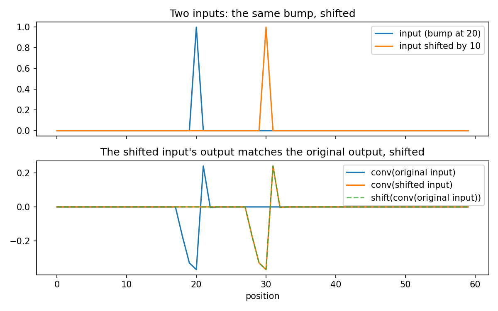
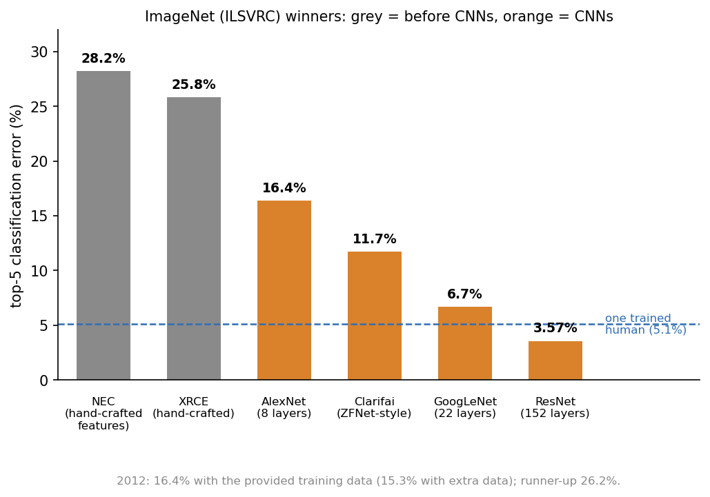
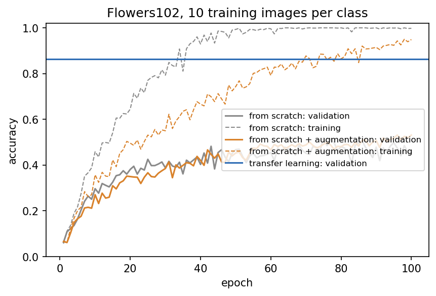
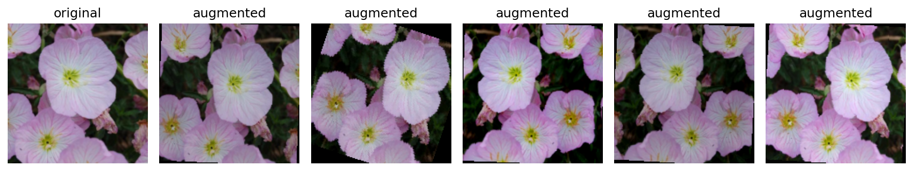
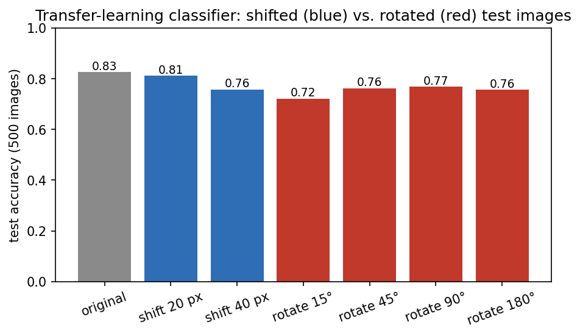
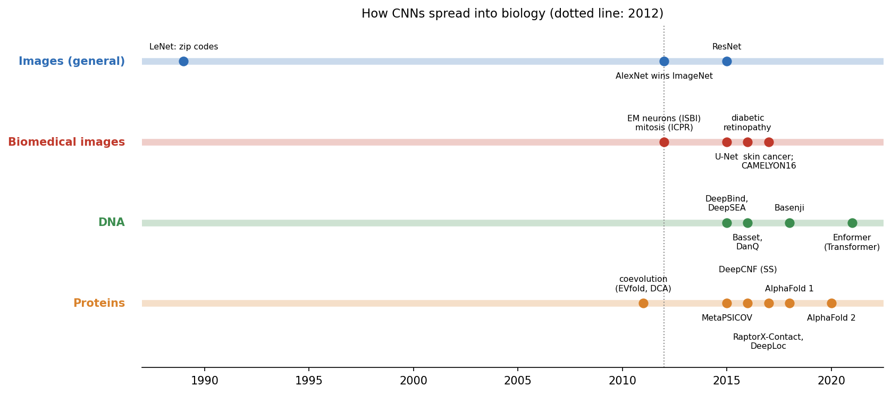
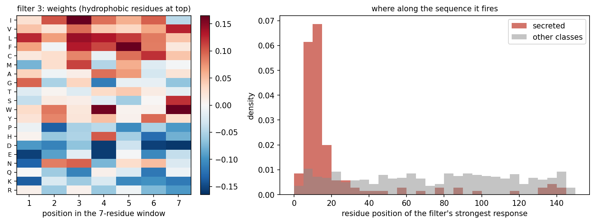
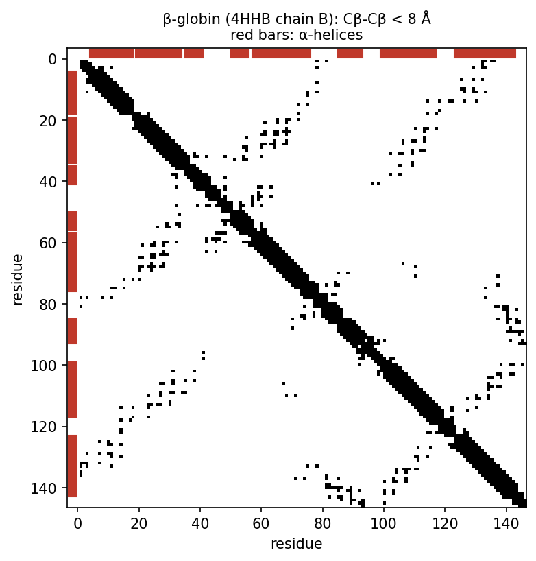
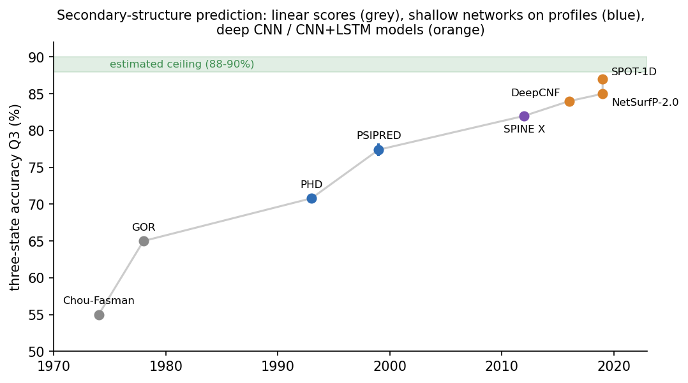

::: {.callout-note}
**Sources for this page:** d2l.ai, *Dive into Deep Learning*,
[Convolutional Neural Networks](https://d2l.ai/chapter_convolutional-neural-networks/index.html)
and [Modern Convolutional Neural Networks](https://d2l.ai/chapter_convolutional-modern/index.html)
— CC BY-SA 4.0. Every historical number on this page is taken from the
primary paper or the official challenge or CASP assessment report, cited
where it is used (ImageNet: Russakovsky et al. 2015,
[*IJCV* 115:211-252](https://doi.org/10.1007/s11263-015-0816-y)). Data:
Oxford Flowers102 (Nilsback & Zisserman, 2008, via `torchvision`), Days
8-9's UniProt localization dataset, and PDB entry
[4HHB](https://www.rcsb.org/structure/4HHB) (hemoglobin, CC0). The
ImageNet-trained ResNet-18 weights come from `torchvision`. The
classic-architecture and transfer-learning material draws on Magnus
Ekman's *Learning Deep Learning* (ch. 7-8 slide decks and
`notebooks/ch07.ipynb`/`ch08.ipynb`), a copyrighted, not openly licensed
textbook, credited here as an internal source and not linked. All figures
were drawn or computed for this course. Every number from our own code
was read back from the notebook's output.
:::

# Day 10: CNNs, and How They Took Over Biology

## Learning goals

By the end of this session you should be able to:

- explain why fully connected layers fail on images and long sequences,
  and how convolution (a small, shared, sliding weighted sum) fixes it;
- explain translation equivariance, pooling and invariance, and why
  CNNs are *not* rotation invariant, which is where data augmentation
  comes in;
- describe what actually happened in computer vision from AlexNet (2012)
  to ResNet (2015), and why transfer learning became the default;
- trace how CNNs moved into biomedical imaging, regulatory genomics and
  protein structure, and what each step changed;
- interpret a first-layer filter of a sequence CNN as a learned
  position weight matrix;
- read a protein contact map and explain why its prediction became an
  image problem.

The session has three parts: **convolution and images**, **CNNs move into
biology**, and **from contacts to structure**.

# Part 1: Convolution and images

## Why a fully connected layer fails for images (and long sequences)

Every model so far treats its input as one long vector, with an
independent weight for every position. For Days 8-9's 150-residue one-hot
sequences that is already 3,000 weights per hidden unit. For a modest
$224 \times 224$ colour image it would be over 150,000. Two problems
follow:

- **Too many weights.** The same feature detector is learned separately
  at every position, from data that rarely shows it everywhere.
- **No notion of locality or position.** A cat in the top-left corner and
  the same cat in the bottom-right look like two unrelated inputs,
  because every weight is tied to one absolute position.

A **convolutional layer** fixes both with one idea: use a small
**kernel** (say 3 × 3 pixels, or 7 residues) and slide *the same kernel*
across every position. The weights are shared; only their position
changes.

### Weight sharing gives equivariance, and pooling gives invariance

If the input shifts, a shared kernel sees the same local pattern, just
somewhere else, so the output shifts by the same amount. This
**translation equivariance** is a property of weight sharing itself. It
holds even for a random, untrained kernel:

{width=85%}

**Pooling** (taking the maximum or mean over a region, or over the whole
feature map) then discards *where* the pattern was found and keeps
*whether* it was found. Equivariant convolution followed by pooling gives
**translation invariance**. A typical CNN stacks several
convolution → ReLU → pooling blocks. Early layers detect edges and short
motifs; later layers combine them into larger parts.

### Further watching

[*But what is a convolution?*](https://www.youtube.com/watch?v=KuXjwB4LzSA) (3Blue1Brown): convolution from probability to image blurring, the same sliding weighted sum a CNN learns:

```{=html}
<div style="position:relative;padding-bottom:56.25%;height:0;overflow:hidden;max-width:100%;margin-bottom:1em;">
<iframe src="https://www.youtube.com/embed/KuXjwB4LzSA" style="position:absolute;top:0;left:0;width:100%;height:100%;border:0;" allowfullscreen title="But what is a convolution?, 3Blue1Brown"></iframe>
</div>
```

## What actually happened: from LeNet to ResNet

CNNs are older than deep learning's fame. **LeNet** (LeCun et al., 1989,
[*Neural Computation* 1:541-551](https://doi.org/10.1162/neco.1989.1.4.541))
read handwritten US zip codes, and by the late 1990s its successor LeNet-5
([LeCun et al. 1998](https://doi.org/10.1109/5.726791)) read cheques.
For natural images, though, hand-crafted features still won until 2012.

The turning point was the **ImageNet** challenge (ILSVRC): 1.2 million
training photos in 1,000 classes, scored by *top-5 error* (the correct
class is not among the model's five guesses).

{width=85%}

- **2012, AlexNet** (Krizhevsky, Sutskever & Hinton,
  [NIPS 25](https://papers.nips.cc/paper/2012/hash/c399862d3b9d6b76c8436e924a68c45b-Abstract.html)):
  an 8-layer CNN, 16.4% error on the provided data (15.3% when also
  trained on extra ImageNet data), against 26.2% for the runner-up. It
  combined four ingredients that each appear in this course: **ReLU**
  activations (Day 9's vanishing-gradient fix), **dropout** (Day 9),
  **data augmentation** (random crops, flips and colour changes; below),
  and training on **GPUs**.
- **2013:** the winner (Clarifai, 11.7%) came from Zeiler & Fergus's work
  on *visualizing* what each layer of such a network responds to.
- **2014, VGG** (7.3%, 2nd) and **GoogLeNet** (6.7%, 1st): deeper
  networks. VGG stacked plain 3 × 3 convolutions to 16-19 layers.
  GoogLeNet (22 layers) ran several filter sizes in parallel and used
  1 × 1 convolutions to keep the number of weights down.
- **2015, ResNet** (He et al.,
  [CVPR 2016](https://arxiv.org/abs/1512.03385)): 152 layers, 3.57%.
  Its **skip connections** let each block learn a correction to its input,
  $y = x + F(x)$, so gradients can flow straight through (Day 9). Before
  ResNet, simply adding layers made deep networks *harder* to train.
- **For comparison:** one trained human annotator reached 5.1% on a
  sample of the test set (Russakovsky et al. 2015).

### Further reading

- d2l.ai, [Modern Convolutional Neural Networks](https://d2l.ai/chapter_convolutional-modern/index.html) (AlexNet, VGG, GoogLeNet, ResNet in detail)
- Russakovsky et al. (2015), [ImageNet Large Scale Visual Recognition Challenge](https://arxiv.org/abs/1409.0575)

## Hands-on: Flowers102 and very little data

Biology rarely has 1.2 million labelled images. The **Flowers102**
dataset (102 species) has only **10 training images per class**, a
realistic situation. The notebook trains the same small CNN (four
convolution blocks, 254,694 weights) twice, then tries transfer
learning:

{width=75%}

| Approach | Best validation accuracy | Test accuracy (2,000 images) |
|---|---|---|
| Small CNN from scratch | 0.519 | 0.464 |
| Same CNN + data augmentation | 0.531 | 0.498 |
| Transfer: frozen ImageNet ResNet-18 + new last layer | 0.864 | **0.827** |

- **From scratch**, the network memorizes the 1,020 training images
  (training accuracy 1.000 at its best epoch) but generalizes
  poorly.
- **Data augmentation** shows it a slightly different version of every
  image in every epoch: random crops and zooms, mirror images, small
  rotations, colour changes. The label stays the same, so the network
  learns which changes should *not* matter. It overfits less and
  generalizes better.

{width=90%}

- **Transfer learning** won by a wide margin, and it is what the field
  actually did. The early layers of an ImageNet network have learned
  generic visual features (edges, textures, parts of objects). Keep them
  frozen, and train only a new last layer on the new task. Within a few
  years of AlexNet this became the default whenever labelled data is
  scarce, which is almost always the case in biomedicine.

### What a CNN is not invariant to

Nothing in convolution or pooling makes a network insensitive to
**rotation**. The notebook tests the transfer-learning classifier on 500
test images. It shifts the viewing window (by cropping at an offset, so
no empty border appears), or rotates the image and then crops its centre
(so no black corners appear):

{width=75%}

Shifting by 20 pixels barely matters (0.812 vs. 0.826), but every
rotation costs several percentage points (0.722-0.768). Flowers seen from
above are roughly symmetric, so for most objects the loss is larger. The
pretrained features were learned from ImageNet photos, which are almost
always upright, so the network never needed rotation invariance and never
learned it. This is the "rotating the cat" problem. It is why rotations
are part of standard augmentation, and why microscopy and histology
pipelines, where a tissue section has no natural "up", augment with all
rotations and flips.

# Part 2: CNNs move into biology

## What actually happened

{width=100%}

### Biomedical images: almost immediately

- **2012, the same year as AlexNet.** Cireşan, Giusti, Gambardella and
  Schmidhuber's CNNs won the ISBI 2012 challenge on segmenting neuronal
  membranes in electron-microscopy images. For pixel error they were the
  only entry to beat a second human observer
  ([NIPS 25](https://proceedings.neurips.cc/paper/2012/hash/459a4ddcb586f24efd9395aa7662bc7c-Abstract.html)).
  The same group won the ICPR 2012 contest on detecting mitoses in
  breast-cancer histology ([MICCAI 2013](https://pubmed.ncbi.nlm.nih.gov/24579167/)).
- **2015, U-Net** (Ronneberger, Fischer & Brox,
  [arXiv:1505.04597](https://arxiv.org/abs/1505.04597)): an
  encoder-decoder CNN with skip connections that outputs a whole
  segmentation mask. It beat the 2012 sliding-window CNN on the same EM
  challenge, won the 2015 cell-tracking challenge, and is still the
  standard architecture for segmenting cells and tissues.
- **2016-2017, clinical-scale results.** A CNN for diabetic retinopathy
  reached AUC 0.99 on two validation sets, trained on 128,175 retinal
  photographs (Gulshan et al., [*JAMA* 316:2402](https://pubmed.ncbi.nlm.nih.gov/27898976/)).
  An ImageNet-pretrained Inception-v3, fine-tuned on 129,450 skin images,
  performed on par with 21 dermatologists (Esteva et al.,
  [*Nature* 542:115](https://pubmed.ncbi.nlm.nih.gov/28117445/)): transfer
  learning, as above. In the CAMELYON16 challenge (lymph-node
  metastases of breast cancer), the best of 32 algorithms reached AUC
  0.994, against 0.810 for pathologists working under time constraints
  (Ehteshami Bejnordi et al.,
  [*JAMA* 318:2199](https://pubmed.ncbi.nlm.nih.gov/29234806/)).
- The breast-cancer **histopathology patches** used in the earlier
  version of this course are 277,524 patches of 50 × 50 pixels cut from
  162 whole-slide images of invasive ductal carcinoma. They came from this
  period: Cruz-Roa et al. (2014) and Janowczyk & Madabhushi (2016,
  [*J Pathol Inform* 7:29](https://pubmed.ncbi.nlm.nih.gov/27563488/)),
  who reached an F-score of 0.765 with a CNN.

### DNA: filters become motifs

A CNN reading one-hot DNA has first-layer filters of shape 4 × *k*: a
weight for each base at each of *k* positions. That is a
**position weight matrix** (Day 5), except that it is learned from the
data. It happened fast:

- **2015, DeepBind** (Alipanahi et al.,
  [*Nat Biotechnol* 33:831](https://pubmed.ncbi.nlm.nih.gov/26213851/)):
  CNNs trained on protein-DNA and protein-RNA binding data outperformed
  existing methods, and their learned specificities could be "readily
  visualized as … position weight matrices".
- **2015, DeepSEA** (Zhou & Troyanskaya,
  [*Nat Methods* 12:931](https://pubmed.ncbi.nlm.nih.gov/26301843/)): one CNN
  reading 1,000 bp of sequence predicts 919 chromatin features at once
  (125 DNase, 690 transcription-factor and 104 histone-mark profiles from
  ENCODE and Roadmap). Comparing the predictions for the reference and the
  mutated sequence scores the effect of a **non-coding variant** at single
  base resolution.
- **2016, Basset** (Kelley, Snoek & Rinn,
  [*Genome Res* 26:990](https://pubmed.ncbi.nlm.nih.gov/27197224/)):
  chromatin accessibility in 164 cell types. 45% of its 300 first-layer
  filters matched known transcription-factor motifs. The network had
  rediscovered them from sequence alone.
- **2016, DanQ** (Quang & Xie, [*NAR* 44:e107](https://pubmed.ncbi.nlm.nih.gov/27084946/)):
  a CNN followed by a bidirectional LSTM (Day 11) on the DeepSEA data. It
  beat DeepSEA on 94% of the targets, and 166 of its 320 filters matched
  JASPAR motifs.
- **2018, Basenji** (131 kb input, dilated convolutions) →
  **2021, Enformer** (196 kb input, CNN + Transformer; Avsec et al.,
  [*Nat Methods* 18:1196](https://pubmed.ncbi.nlm.nih.gov/34608324/)). Longer
  context needed new architectures, the topic of Days 11-12.

### Proteins: our own CNN finds the signal peptide

The same idea works on protein sequences. Days 8-9's localization network
becomes a 1D CNN: two convolutional layers with 7-residue filters, then
global average pooling and a linear layer to the five classes. It is
trained and evaluated exactly as on Day 9, on the same homology-aware
split:

| Metric | Day 9: flat network | Day 9: logistic regression | Day 10: 1D CNN |
|---|---|---|---|
| Weights | 192,389 | 15,005 | **19,237** |
| Test accuracy | 0.514 | 0.569 | **0.587** |
| Macro F1 | 0.493 | — | **0.586** |
| MCC | 0.394 | 0.461 | **0.484** |
| Macro AUROC | 0.831 | 0.849 | **0.869** |

The CNN beats the flat network on every metric with a tenth of the weights,
and it is level with or slightly ahead of logistic regression. With 486
training proteins, the flat network had far too many free weights. The CNN
builds in an assumption instead: the same short motif means the same thing
wherever it occurs. The margin over logistic regression is small, though.
On a 109-protein test set a few percentage points are within
split-to-split noise (Day 8), and retraining the CNN from different random
initial weights moved its test accuracy between 0.569 and 0.587 in our
runs. The robust finding is the gap to the flat network.

**What did it learn?** Each first-layer filter is a 20 × 7 matrix, a
learned PWM over a 7-residue window. The notebook ranks the 32 filters by
how much more strongly they respond in secreted than in other proteins.
The top five correlate with the Kyte-Doolittle hydrophobicity scale at
r = 0.70-0.83 (all 32 filters: mean r = 0.12). They fire at a
median residue position of 11-12 in secreted proteins, against
62-76 elsewhere:

{width=100%}

Nobody told the network about signal peptides. It found a detector for
their hydrophobic core, about 10-15 residues from the N-terminus, on its
own, the protein counterpart of Basset and DanQ rediscovering DNA motifs.
Day 11 comes back to signal peptides in depth.

**What the real tool did.** DeepLoc (Almagro Armenteros et al., 2017,
[*Bioinformatics* 33:3387](https://pubmed.ncbi.nlm.nih.gov/29036616/)) put
convolutions first, followed by a bidirectional LSTM and an attention
layer (Days 11-12). Trained on a much larger UniProt dataset, it reached
78% accuracy over 10 compartments.

### Further reading

- Wikipedia, [U-Net](https://en.wikipedia.org/wiki/U-Net)
- Zhou & Troyanskaya (2015), [Predicting effects of noncoding variants with deep learning-based sequence model](https://pubmed.ncbi.nlm.nih.gov/26301843/)
- Kelley, Snoek & Rinn (2016), [Basset](https://pubmed.ncbi.nlm.nih.gov/27197224/)

# Part 3: From contacts to structure

## A contact map is an image

A **contact map** is an $L \times L$ grid with one pixel per residue
pair. A pixel is 1 if the two residues are close in the folded
structure: in CASP's definition, Cβ atoms (Cα for glycine) within 8 Å.
Computed from the real crystal structure of hemoglobin's β chain (PDB
4HHB, Day 7):

{width=60%}

Of 197 contacts between residues at least 6 apart in sequence,
150 are **long-range** (at least 24 apart). Long-range contacts carry
the information about the fold. If you can predict them from sequence,
you can build a rough 3D model.

## What actually happened: coevolution, then deep CNNs

- **Coevolution (2011-2014).** Residues in contact tend to mutate
  together across a protein family. Global statistical models of a
  multiple sequence alignment separate direct couplings from indirect
  correlations: DCA and EVfold (Morcos et al. 2011; Marks et al. 2011),
  PSICOV (Jones et al., 2012,
  [*Bioinformatics* 28:184](https://pubmed.ncbi.nlm.nih.gov/22101153/)),
  plmDCA, GREMLIN and CCMpred. They work well only when the family has
  many sequences.
- **A shallow network on top (2015).** MetaPSICOV fed coevolution scores
  and other features into shallow feed-forward networks, the PHD recipe
  (Day 9) applied to residue pairs. It had about 60% higher precision than
  PSICOV (Jones et al.,
  [*Bioinformatics* 31:999](https://pubmed.ncbi.nlm.nih.gov/25431331/)).
- **Deep residual CNNs (2016-2017).** RaptorX-Contact (Wang, Sun, Li,
  Zhang & Xu,
  [*PLoS Comput Biol* 13:e1005324](https://pubmed.ncbi.nlm.nih.gov/28056090/))
  treated the whole contact map as an image and predicted it with a deep
  ResNet over pairwise coevolution features. The network learns that
  contacts come in patterns (helix-helix, strand pairing), not one pixel
  at a time.
- **Distances instead of contacts (2018).** AlphaFold 1 (Senior et al.,
  [*Nature* 577:706](https://pubmed.ncbi.nlm.nih.gov/31942072/)) used a deep
  ResNet to predict full *distance distributions* between residue pairs,
  and folded proteins by optimizing against them. At CASP13 it produced
  models with TM-score ≥ 0.7 for 24 of 43 free-modelling domains, against
  14 for the next best group.

The CASP assessments show the jump:

{width=85%}

From CASP9 to CASP11 (2010-2014), precision stayed around 20-27%. Once contact maps
were treated as images for deep CNNs, it reached 47% in CASP12 and more
than 70% in CASP13. In CASP14 (2020) contact precision stopped improving
(top-5 average 64%). AlphaFold 2 made contacts a by-product of predicting
the whole 3D structure directly, which is Day 12's topic.

## The secondary-structure thread, continued

The accuracy history from Day 6 did not stop at PHD:

{width=85%}

- **PSIPRED** (Jones, 1999,
  [*J Mol Biol* 292:195](https://pubmed.ncbi.nlm.nih.gov/10493868/)):
  PSI-BLAST profiles (Day 5) and two shallow networks, 76.5-78.3%.
- **DeepCNF** (Wang, Peng, Ma & Xu, 2016,
  [*Sci Rep* 6:18962](https://pubmed.ncbi.nlm.nih.gov/26752681/)): a deep
  convolutional network over the sequence profile, about 84% on CASP and
  CAMEO targets.
- **NetSurfP-2.0** (CNN + LSTM, 85%;
  [*Proteins* 87:520](https://pubmed.ncbi.nlm.nih.gov/30785653/)) and
  **SPOT-1D** (87%, using predicted contacts;
  [*Bioinformatics* 35:2403](https://pubmed.ncbi.nlm.nih.gov/30535134/)).
- The estimated ceiling is 88-90% (Yang et al., 2018,
  [*Brief Bioinform* 19:482](https://pubmed.ncbi.nlm.nih.gov/28040746/)),
  set partly by disagreements between the programs that assign secondary
  structure from 3D coordinates.

### Further reading

- Schaarschmidt et al. (2018), [Assessment of contact predictions in CASP12](https://pubmed.ncbi.nlm.nih.gov/29071738/)
- Shrestha et al. (2019), [Assessing the accuracy of contact predictions in CASP13](https://pubmed.ncbi.nlm.nih.gov/31587357/)
- Senior et al. (2020), [Improved protein structure prediction using potentials from deep learning](https://pubmed.ncbi.nlm.nih.gov/31942072/)

## Check your understanding

```{=html}
<div id="day10-quiz"></div>
<script>
renderQuiz("day10-quiz", [
  {
    question: "Why does a convolutional layer need far fewer weights than a fully connected layer on the same input?",
    choices: [
      "It slides the same small kernel over every position (weight sharing) instead of learning a separate weight per position",
      "It only looks at half of the input",
      "It discards the least useful positions automatically",
      "It stores its weights with fewer bits"
    ],
    correctIndex: 0,
    explanation: "Weight sharing is what cuts the count: 19,237 weights for the localization CNN vs. 192,389 for the flat network on the same input."
  },
  {
    question: "A CNN recognizes a flower whether it is in the left or the right half of the image, but can fail when the image is rotated by 45 degrees. Why?",
    choices: [
      "Shared kernels plus pooling give translation invariance by construction; nothing in the architecture gives rotation invariance, so it must be learned from (augmented) rotated examples",
      "Rotated images always contain black corners",
      "CNNs only work on square images",
      "The kernels are too small to see rotated objects"
    ],
    correctIndex: 0,
    explanation: "This is why rotation is a standard data augmentation, especially for microscopy and histology where there is no natural 'up'."
  },
  {
    question: "On Flowers102 (10 training images per class), which approach gave by far the best test accuracy?",
    choices: [
      "A frozen ImageNet-trained ResNet-18 with a newly trained last layer (transfer learning)",
      "A small CNN trained from scratch",
      "The same small CNN with data augmentation",
      "All three were equal"
    ],
    correctIndex: 0,
    explanation: "Generic visual features learned on 1.2 million ImageNet photos transfer to new tasks. This is how Esteva et al. (2017) built their dermatology classifier."
  },
  {
    question: "AlexNet's 2012 ImageNet win combined several ingredients. Which of these was NOT one of them?",
    choices: [
      "Skip connections between layers",
      "ReLU activations",
      "Dropout",
      "Data augmentation and GPU training"
    ],
    correctIndex: 0,
    explanation: "Skip connections came with ResNet in 2015. They made networks of more than 100 layers trainable."
  },
  {
    question: "The first-layer filter of the localization CNN that responds most strongly in secreted proteins has large weights for L, I, V and F, and fires around residues 10-15. What has it learned?",
    choices: [
      "A detector for the hydrophobic core of an N-terminal signal peptide: a learned PWM",
      "A detector for nuclear localization signals",
      "Nothing: first-layer weights are random",
      "The protein's total length"
    ],
    correctIndex: 0,
    explanation: "Like Basset and DanQ rediscovering transcription-factor motifs in DNA, the network found a biological signal nobody told it about."
  },
  {
    question: "Best long-range contact precision in CASP was 27% in CASP11 (2014), 47% in CASP12 (2016) and over 70% in CASP13 (2018). What changed?",
    choices: [
      "Contact maps were predicted as whole images by deep residual CNNs over coevolution features, instead of scoring residue pairs one by one",
      "Proteins in CASP13 were much easier",
      "Multiple sequence alignments were no longer used",
      "Contact prediction switched to 5 Angstrom cutoffs"
    ],
    correctIndex: 0,
    explanation: "RaptorX-Contact (2017) and AlphaFold 1 (2018) are the key steps; the network learns that contacts come in patterns such as helix-helix packing."
  },
  {
    question: "DeepSEA predicts 919 chromatin features from 1,000 bp of DNA. How does it score the effect of a single non-coding variant?",
    choices: [
      "By comparing its predictions for the reference sequence and for the sequence carrying the variant",
      "By looking the variant up in a database of known mutations",
      "By counting how often the variant occurs in the population",
      "It cannot score single variants"
    ],
    correctIndex: 0,
    explanation: "A trained sequence model can be asked 'what if' questions: change one base and see how the predicted chromatin profile changes."
  }
]);
</script>
```

## The notebook

`notebooks/day10-cnns-in-code.ipynb` runs everything on this page from our
own code, in the same three parts:

1. The equivariance demonstration, Flowers102 (from scratch, with
   augmentation, and transfer learning from ResNet-18), and the
   rotation/shift test.
2. The localization 1D CNN on the homology-aware split, and the analysis
   of its first-layer filters.
3. The contact map of β-globin computed from PDB 4HHB.

Part 1 trains two CNNs for 100 epochs; use a GPU runtime on Colab
(*Runtime → Change runtime type*), or lower `EPOCHS` on a CPU. Open it in
[Google Colab](https://colab.research.google.com/github/ElofssonLab/kb8029-book/blob/main/notebooks/day10-cnns-in-code.ipynb)
via the badge at the top of the notebook page.

## The lab

**Full lab, on MNIST:** adapted from the previous course's "Neural
Networks" lab and rebuilt in PyTorch. Work through
[`notebooks/day10-lab.ipynb`](https://colab.research.google.com/github/ElofssonLab/kb8029-book/blob/main/notebooks/day10-lab.ipynb),
replacing every `todo(...)` call with your own code:

1. count the weights of a dense and a convolutional model, and see why
   adding a convolutional layer can make the whole model *smaller*;
2. find out how many unpadded 5×5 convolutions fit on a 28×28 image, and
   which settings (padding, kernel size, stride) let you stack them
   indefinitely;
3. build a VGG block, and test it on digits placed at positions it never
   saw during training, before and after training on randomly placed
   digits;
4. build a ResNet block with a skip connection and compare it with VGG;
5. rotate the test digits by 45° and measure what rotation augmentation
   buys you.

### Submitting this lab

This lab is administered through Canvas, not this book — see the
course's Canvas page for the current quiz, deadline, and submission
mechanism.

## What's next

Day 11 turns to models that read a sequence *in order*: recurrent
networks and LSTMs, the history of language models, and the Transformer.
SignalP, from its 1995 feed-forward network to its 2022 protein language
model, follows that whole history.
