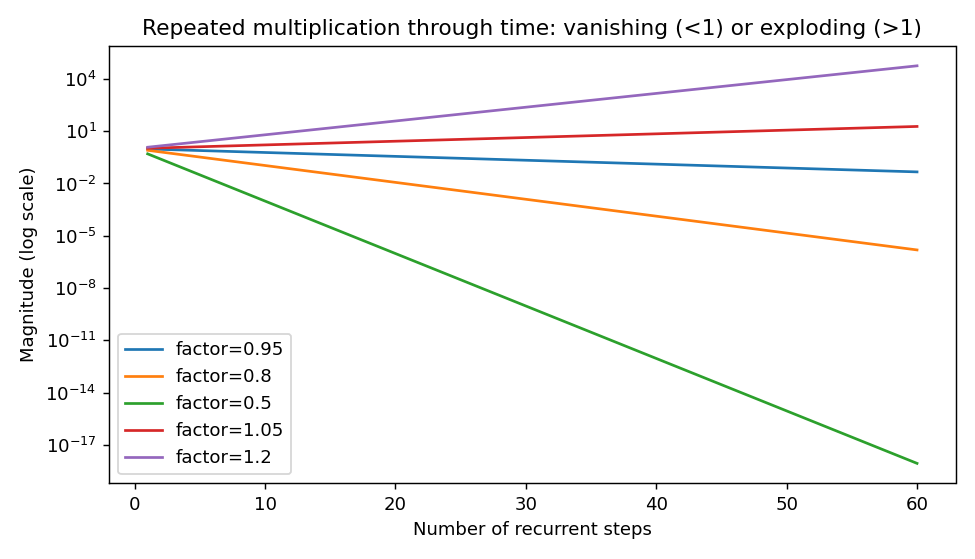
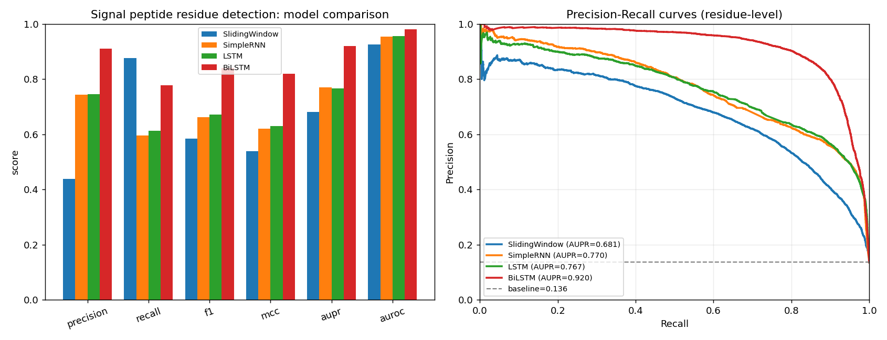
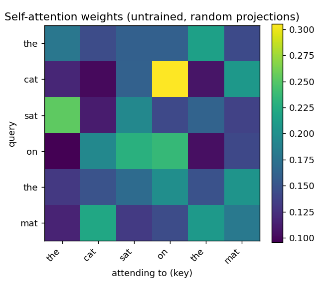
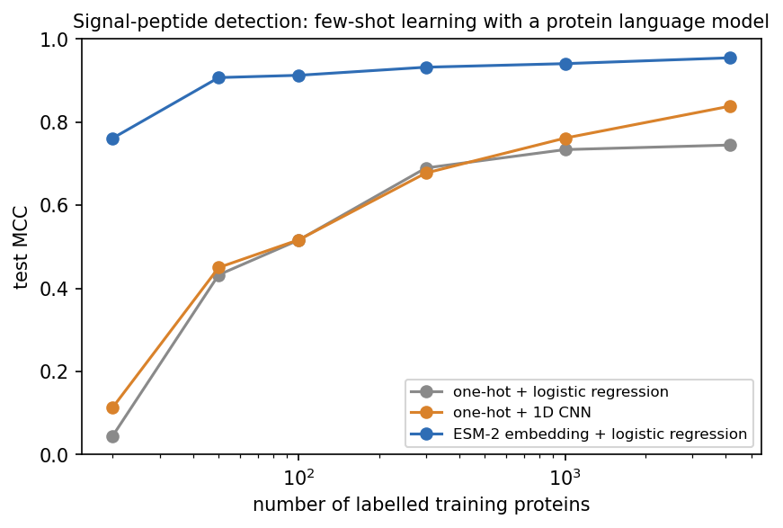
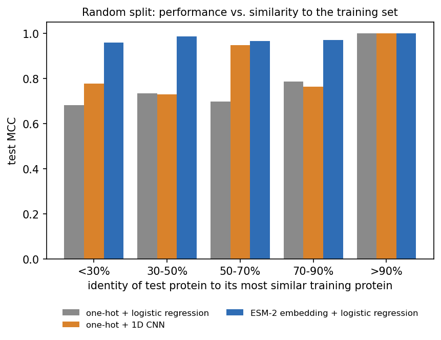
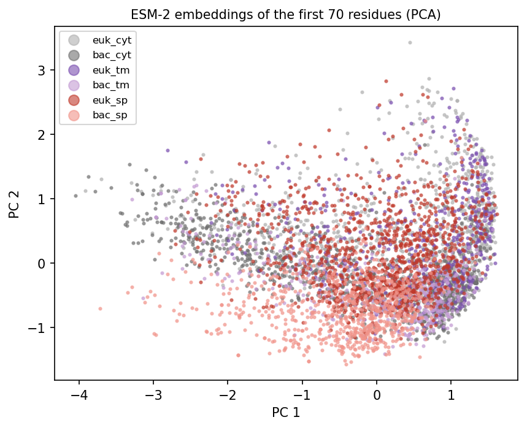

::: {.callout-note}
**Sources for this page:** d2l.ai, *Dive into Deep Learning*,
[Recurrent Neural Networks](https://d2l.ai/chapter_recurrent-neural-networks/index.html),
[Modern Recurrent Neural Networks](https://d2l.ai/chapter_recurrent-modern/index.html)
and [Attention Mechanisms and Transformers](https://d2l.ai/chapter_attention-mechanisms-and-transformers/index.html)
— CC BY-SA 4.0. The history of SignalP follows Nielsen, Teufel, Brunak &
von Heijne (2024), ["SignalP: The Evolution of a Web Server"](https://doi.org/10.1007/978-1-0716-4007-4_17),
*Methods Mol Biol* 2836:331-367, a history written by the SignalP authors
themselves (copyrighted; its findings are described and cited here, and
its figures are not reproduced). Every other historical number is taken
from the primary paper, cited where it is used. Data: 4,910 reviewed
UniProt entries (CC BY 4.0), a copy of which is kept in the course
repository; the pretrained ESM-2 model (Lin et al. 2023) via `fair-esm`.
3Blue1Brown's videos on language models, Transformers and attention are
embedded as further watching.
The recurrent-network and attention material follows ideas from Magnus
Ekman's *Learning Deep Learning* (ch. 9-12 slide decks and notebooks), a
copyrighted, not openly licensed textbook, credited here as an internal
source and not linked. Every number from our own code was read back
from the notebook's output.
:::

# Day 11: Sequences, Language Models and SignalP

## Learning goals

By the end of this session you should be able to:

- explain how a recurrent network carries a hidden state along a
  sequence, why gradients vanish or explode through time, and how LSTM
  and bidirectional LSTM address this;
- explain what a **language model** is, and trace the path from n-grams
  and recurrent language models to attention, the Transformer, BERT and
  GPT;
- explain self-attention (queries, keys, values) and the difference
  between masked (BERT-style) and causal (GPT-style) language models;
- describe how protein language models are trained and what their
  embeddings capture;
- describe how SignalP changed from a 1990s feed-forward network to a
  protein language model, and show in code why pretrained embeddings help
  most when labelled data are scarce or test proteins are unlike the
  training set.

The session has three parts: **recurrent networks**, **language
models**, and **SignalP 6.0 in practice**.

# Part 1: Recurrent networks

## A hidden state carried along the sequence

Every model so far has a fixed-size input: Days 8-9's one-hot vector,
Day 10's convolutional window. A **recurrent neural network (RNN)**
instead reads a sequence one position at a time and carries a **hidden
state** $h_t$ forward, updated from the current input and the previous
state:

$$
h_t = \tanh(W_{xh} x_t + W_{hh} h_{t-1} + b_h)
$$

The same weights are reused at every position, so one network handles
sequences of any length. In principle $h_t$ can carry information from
arbitrarily far back.

### Why gradients vanish or explode through time

Training an RNN means backpropagating through every step it took
(**backpropagation through time**). The same matrix $W_{hh}$ enters the
gradient once per step, so the gradient is multiplied by roughly the same
factor again and again. Below 1 it vanishes, above 1 it explodes. This is
Day 9's vanishing-gradient problem again, now along the sequence instead
of through the layers:

{width=80%}

## LSTM: a memory cell with gates

The **Long Short-Term Memory** network (Hochreiter & Schmidhuber, 1997,
[*Neural Computation* 9:1735](https://doi.org/10.1162/neco.1997.9.8.1735))
adds a separate **cell state** $c_t$ that is updated by *addition* rather
than by repeated multiplication. Gates (small sigmoid layers) decide what
to forget, what to write and what to output:

$$
f_t = \sigma(W_f[h_{t-1}, x_t]), \quad i_t = \sigma(W_i[h_{t-1}, x_t]), \quad \tilde c_t = \tanh(W_c[h_{t-1}, x_t])
$$
$$
c_t = f_t \odot c_{t-1} + i_t \odot \tilde c_t, \qquad o_t = \sigma(W_o[h_{t-1}, x_t]), \qquad h_t = o_t \odot \tanh(c_t)
$$

When the forget gate is near 1 and the input gate near 0, $c_t \approx
c_{t-1}$, and the error signal flows back almost unchanged. The original
paper called this the "constant error carousel" and showed it could
bridge time lags of more than 1,000 steps. (The forget gate itself was
added a few years later.) The notebook writes the cell out by hand and
checks it against PyTorch's `nn.LSTMCell`: the outputs are identical.

Two refinements:

- A **bidirectional LSTM** (Schuster & Paliwal, 1997) runs one LSTM
  left-to-right and another right-to-left and combines them at every
  position, so each position sees what comes *after* it too.
- A **GRU** merges the gates into two and drops the separate cell state:
  fewer weights, often similar results.

## Case study: which residues belong to a signal peptide?

**Signal peptides** are short N-terminal sequences that send a protein
into the secretory pathway, a discovery for which Günter Blobel received
the [1999 Nobel Prize](https://www.nobelprize.org/prizes/medicine/1999/summary/).
They have three regions: a positively charged **n-region**, a
hydrophobic **h-region**, and a polar **c-region** ending at the cleavage
site. Our dataset has 4,910 reviewed UniProt proteins from eukaryotes and
bacteria:

- 1,936 with a signal peptide whose annotation has **experimental
  evidence** (ECO:0000269). Many UniProt signal peptides are *predicted*,
  often by SignalP itself, and training on those would teach a model to
  imitate SignalP;
- 1,988 cytoplasmic or nuclear proteins;
- 986 transmembrane proteins without a signal peptide. These are *hard*
  negatives, since a transmembrane helix is also a hydrophobic stretch.

The split is homology-aware (Day 8): 3,205 MMseqs2 clusters at 30%
identity, divided into 3,432 training, 737 validation and 741 test
proteins. Each residue of the first 70 is labelled signal peptide or not:

| Model (per-residue labelling, test set) | Weights | MCC | AUPR |
|---|---|---|---|
| Sliding window (15 residues) + linear classifier | — | 0.539 | 0.681 |
| Simple RNN | 4,105 | 0.620 | 0.770 |
| LSTM | 14,761 | 0.631 | 0.767 |
| **Bidirectional LSTM** | 29,017 | **0.820** | **0.920** |

{width=100%}

The bidirectional LSTM wins by a wide margin. Whether residue *i* is still
in the signal peptide depends on what comes *after* it (the cleavage
site), which a forward-only network has not seen yet. SignalP 5.0 (2019)
was built from these parts: a deep network with an LSTM and a
**conditional random field** (CRF) on top. A CRF scores whole label
sequences rather than single residues, so it can rule out biologically
impossible ones (for example, a signal peptide that stops and restarts).

### Further reading

- d2l.ai, [Modern Recurrent Neural Networks](https://d2l.ai/chapter_recurrent-modern/index.html) (LSTM, GRU, bidirectional RNNs)
- Wikipedia, [Long short-term memory](https://en.wikipedia.org/wiki/Long_short-term_memory)

# Part 2: Language models

## What a language model is

A **language model** assigns a probability to a sequence of tokens,
usually one token at a time: *given what came before (or around), how
likely is each possible next token?* It needs no labels, because the text
is its own training signal. To predict well it has to learn the
regularities of the language, and those learned regularities (its
internal representations, or **embeddings**) turn out to be useful for
almost everything else.

**A tiny one, in the notebook.** An LSTM trained to predict the next
residue of the training proteins reaches 4.071 bits per residue on the
test proteins. That is better than knowing only the amino-acid composition
(4.164 bits) or guessing uniformly (4.322 bits), but only a little.
Protein sequences are hard to predict residue by residue. Large models
get much further, with far more data and a better architecture.

### Further watching

[*Large Language Models explained briefly*](https://www.youtube.com/watch?v=LPZh9BOjkQs) (3Blue1Brown): a short overview of what a language model is and how it is trained:

```{=html}
<div style="position:relative;padding-bottom:56.25%;height:0;overflow:hidden;max-width:100%;margin-bottom:1em;">
<iframe src="https://www.youtube.com/embed/LPZh9BOjkQs" style="position:absolute;top:0;left:0;width:100%;height:100%;border:0;" allowfullscreen title="Large Language Models explained briefly, 3Blue1Brown"></iframe>
</div>
```

## What actually happened: from n-grams to GPT

- **n-grams.** For decades, language models counted how often each word
  followed the previous one or two words.
- **2003, neural language models.** Bengio et al.
  ([*JMLR* 3:1137](https://www.jmlr.org/papers/volume3/bengio03a/bengio03a.pdf))
  learned a vector for every word jointly with a network that predicts
  the next word. Perplexity improved by about 24% over the best n-gram
  model on one corpus.
- **2013, word vectors with structure.** Using vectors from a recurrent
  language model, Mikolov, Yih & Zweig
  ([NAACL 2013](https://aclanthology.org/N13-1090/)) showed that
  "King − Man + Woman" lands closest to "Queen". Word2vec (Mikolov et al.,
  [arXiv:1301.3781](https://arxiv.org/abs/1301.3781)) then made such
  vectors cheap to train: under a day for 1.6 billion words.
- **2014, sequence to sequence.** An LSTM encoder compresses a sentence
  into one vector, and an LSTM decoder writes the translation. It reached
  34.8 BLEU on English→French, beating a phrase-based system (33.3)
  (Sutskever, Vinyals & Le, [arXiv:1409.3215](https://arxiv.org/abs/1409.3215)).
- **2014, attention.** Bahdanau, Cho & Bengio
  ([arXiv:1409.0473](https://arxiv.org/abs/1409.0473)) argued that one
  fixed-length vector is a bottleneck. They let the decoder
  "(soft-)search" the whole input sentence at every step instead.
- **2017, the Transformer** (Vaswani et al.,
  [arXiv:1706.03762](https://arxiv.org/abs/1706.03762)): drop the
  recurrence and keep only attention. 28.4 BLEU on English→German and
  41.8 on English→French, the latter after 3.5 days on eight GPUs, "a
  small fraction of the training costs of the best models". Without
  recurrence, all positions are processed in parallel.
- **2018-2019, pretrain, then adapt.** Three landmark models:
  - ELMo (bidirectional LSTM language model;
    [Peters et al.](https://arxiv.org/abs/1802.05365));
  - **GPT** (a 12-layer Transformer decoder predicting the *next* token;
    [Radford et al. 2018](https://cdn.openai.com/research-covers/language-unsupervised/language_understanding_paper.pdf));
  - **BERT** (a Transformer encoder that predicts *masked* tokens; 15% of
    tokens masked; [Devlin et al.](https://arxiv.org/abs/1810.04805)).

  All are pretrained on unlabelled text and then fine-tuned for each task.
- **Scale.** GPT-2 had 1.5 billion parameters (2019). GPT-3 had 175
  billion (2020,
  [arXiv:2005.14165](https://arxiv.org/abs/2005.14165)), and it solved
  new tasks from a few examples in the prompt, "without any gradient
  updates".

### Further watching

[*Transformers, the tech behind LLMs*](https://www.youtube.com/watch?v=wjZofJX0v4M) (3Blue1Brown, Deep Learning ch. 5): how a GPT-style model turns tokens into vectors and predicts the next token:

```{=html}
<div style="position:relative;padding-bottom:56.25%;height:0;overflow:hidden;max-width:100%;margin-bottom:1em;">
<iframe src="https://www.youtube.com/embed/wjZofJX0v4M" style="position:absolute;top:0;left:0;width:100%;height:100%;border:0;" allowfullscreen title="Transformers, the tech behind LLMs, 3Blue1Brown"></iframe>
</div>
```

## Attention, from scratch

For every position, **self-attention** asks: *which other positions
should I take information from?* Each position's vector $x_i$ is turned
into a **query** $q_i$, a **key** $k_i$ and a **value** $v_i$ (three
learned linear maps). Position $i$ compares its query with every key,
turns the scores into weights with softmax, and takes the weighted average
of the values:

$$
\text{Attention}(Q, K, V) = \text{softmax}\!\left(\frac{QK^\top}{\sqrt{d_k}}\right) V
$$

{width=55%}

Unlike an RNN, attention connects any two positions in one step, however
far apart they are. A Transformer stacks many such layers, each with
several **heads** that can learn different relationships, plus a small
feed-forward network, residual connections (Day 10's ResNet idea), and a
**positional encoding**, because attention by itself ignores order.

**BERT vs. GPT is one mask.** A BERT-style encoder lets every position
attend to every other and learns by filling in masked tokens. A GPT-style
decoder masks out the *future*, so each position sees only earlier ones
and learns by predicting the next token, which is what lets it generate
text:

{width=45%}

### Further watching

[*Attention in transformers, step-by-step*](https://www.youtube.com/watch?v=eMlx5fFNoYc) (3Blue1Brown, Deep Learning ch. 6): queries, keys, values, multiple heads and the causal mask, animated:

```{=html}
<div style="position:relative;padding-bottom:56.25%;height:0;overflow:hidden;max-width:100%;margin-bottom:1em;">
<iframe src="https://www.youtube.com/embed/eMlx5fFNoYc" style="position:absolute;top:0;left:0;width:100%;height:100%;border:0;" allowfullscreen title="Attention in transformers, step-by-step, 3Blue1Brown"></iframe>
</div>
```

Going further: [*How might LLMs store facts*](https://www.youtube.com/watch?v=9-Jl0dxWQs8) (3Blue1Brown, Deep Learning ch. 7), about the feed-forward layers inside a Transformer.

## Protein language models

The same recipe works for proteins. There are hundreds of millions of
unlabelled sequences, and a model that learns to fill in missing residues
has to learn something about structure, function and evolution.

- **An early precursor.** SignalP's authors note that the neural-network
  program their group used before SignalP had a "spell-checking" mode:
  the central residue of a window was erased and the network trained to
  predict it. They describe this as "presumably … the first machine
  learning language model" in biological sequence analysis (Nielsen et
  al. 2024).
- **2019, recurrent protein language models.** UniRep: a 1,900-unit
  multiplicative LSTM trained on about 24 million UniRef50 sequences for
  about three weeks on four GPUs (Alley et al.,
  [*Nat Methods* 16:1315](https://pubmed.ncbi.nlm.nih.gov/31636460/)).
  SeqVec: ELMo on UniRef50, secondary structure Q3 = 79% from embeddings
  alone (Heinzinger et al.,
  [*BMC Bioinformatics* 20:723](https://pubmed.ncbi.nlm.nih.gov/31847804/)).
- **2021-2022, Transformers.**
  - ProtTrans (Elnaggar et al.,
    [*IEEE TPAMI* 44:7112](https://pubmed.ncbi.nlm.nih.gov/34232869/))
    trained BERT, T5 and other architectures on up to 393 billion amino
    acids. **ProtBERT**, a 30-layer BERT, is the model inside SignalP 6.0.
  - ESM-1b (Rives et al.,
    [*PNAS* 118:e2016239118](https://pubmed.ncbi.nlm.nih.gov/33876751/)):
    about 650 million parameters, trained on UniRef50.
  - Rao et al. ([ICLR 2021](https://openreview.net/forum?id=fylclEqgvgd))
    showed that the attention maps of such models predict residue-residue
    **contacts** without ever being trained on structures. That is the
    bridge to Day 12.
- **2023, ESM-2** (Lin et al.,
  [*Science* 379:1123](https://pubmed.ncbi.nlm.nih.gov/36927031/)):
  models from 8 million to 15 billion parameters, trained by masked
  language modelling. The largest ones predict 3D structure directly from
  a single sequence (ESMFold).

**The model knows what a signal peptide looks like.** In the notebook,
ESM-2 (35M parameters) is given a real secreted protein with residue 11,
inside the hydrophobic h-region, masked. It predicts leucine with
probability 0.41, then A, V and G, and the true residue is indeed L. At
the same position in a cytoplasmic protein its guesses are spread out,
with no residue above 0.11. Nobody told it about signal peptides.

### Further reading

- d2l.ai, [Attention Mechanisms and Transformers](https://d2l.ai/chapter_attention-mechanisms-and-transformers/index.html)
- Vaswani et al. (2017), [Attention Is All You Need](https://arxiv.org/abs/1706.03762)
- Devlin et al. (2019), [BERT](https://arxiv.org/abs/1810.04805)
- Lin et al. (2023), [Evolutionary-scale prediction of atomic-level protein structure with a language model](https://pubmed.ncbi.nlm.nih.gov/36927031/)

# Part 3: SignalP 6.0 in practice

## Thirty years of SignalP

The SignalP web server has existed since 1995 and is one of the most used
prediction tools in bioinformatics. Its history runs through this whole
course:

| Version | Year | Model | What changed |
|---|---|---|---|
| 1.0 | 1997 | Feed-forward networks on sliding windows (Day 6), one hidden layer | Separate networks for prokaryotes and eukaryotes |
| 2.0 | 1998 | + hidden Markov model (Day 5) | Cleavage site found in nearly 70% of signal peptides |
| 3.0 | 2004 | Networks + HMM | Cleavage-site accuracy up 6-17%; new discrimination score |
| 4.0 | 2011 | Networks | Transmembrane proteins added as negatives, so hydrophobic TM helices are no longer called signal peptides |
| 5.0 | 2019 | Deep network with LSTM + CRF (Part 1) | Three signal-peptide types; archaea; organism group as an extra input |
| 6.0 | 2022 | **ProtBERT protein language model** + CRF | Five types, subregions (n/h/c), metagenomic proteins |

(Nielsen, Engelbrecht, Brunak & von Heijne,
[*Protein Eng* 10:1](https://pubmed.ncbi.nlm.nih.gov/9051728/); Nielsen &
Krogh, [ISMB 1998](https://pubmed.ncbi.nlm.nih.gov/9783217/); Bendtsen et
al., [*J Mol Biol* 340:783](https://pubmed.ncbi.nlm.nih.gov/15223320/);
Petersen et al., [*Nat Methods* 8:785](https://pubmed.ncbi.nlm.nih.gov/21959131/);
Almagro Armenteros et al., [*Nat Biotechnol* 37:420](https://pubmed.ncbi.nlm.nih.gov/30778233/);
Teufel et al., [*Nat Biotechnol* 40:1023](https://pubmed.ncbi.nlm.nih.gov/34980915/).)

### What the language model changed (Nielsen et al. 2024; Teufel et al. 2022)

- **Few-shot learning.** Two signal-peptide types had almost no training
  data: Tat/SPII (lipoproteins exported by the Tat pathway; 36 sequences
  could be assembled) and Sec/SPIII (pilin-like proteins; 113). With
  ProtBERT, both became predictable for the first time, while a retrained
  SignalP 5.0 "remained too low to make it practically useful". In the
  paper's words, this "confirms the importance of LMs for low-data
  problems".
- **Better generalization.** Tested on proteins removed during homology
  partitioning, the two versions were equal on close homologs of the
  training data, but "at sequence identities lower than 60%, SignalP 6.0
  outperforms SignalP 5.0".
- **No organism input needed.** The language model infers the taxonomic
  context from the sequence itself, so SignalP 6.0 also works on
  metagenomic proteins of unknown origin.
- **Regions without labels.** n-, h- and c-regions cannot be measured
  directly. They were learned by *weak supervision* (a few rules such as
  "the most hydrophobic position is in the h-region") plus an extra loss
  that pushes the predicted regions to differ in amino-acid composition.
- **Homology partitioning, again.** SignalP 5.0 had assigned CD-HIT
  clusters to folds, which the authors later found "was actually not
  valid": pairs across folds stayed well above the 20% identity cutoff.
  For 6.0 they built GraphPart (Teufel et al. 2023,
  [*NAR Genom Bioinform* 5:lqad088](https://pubmed.ncbi.nlm.nih.gov/37850036/)),
  which removes sequences until no cross-fold pair is too similar. Even
  so, 20% proved impossible and they settled for 30%. This is Day 8's
  lesson, learned the hard way by one of the most used tools in the field.
- **Fine-tuned, then frozen.** SignalP 6.0 fine-tuned all 30 ProtBERT
  layers. The field has since moved towards keeping the language model
  frozen and training only small layers on top, which is what we do below
  and what Day 10 did with the ImageNet ResNet.

## Reproducing the idea at classroom scale

Can we see the same two effects ourselves? The task is simpler than
SignalP's: *does this protein have a signal peptide?* We use the same
4,910 proteins and the first 70 residues of each, with three classifiers:

- **one-hot + logistic regression** (70 × 20 = 1,400 input numbers);
- **one-hot + a small 1D CNN** (Day 10), closer to the pre-language-model
  era;
- **frozen ESM-2 embedding + logistic regression**: ESM-2 (35M
  parameters, a stand-in for the much larger ProtBERT) reads the 70
  residues, and its last-layer vectors are averaged into 480 numbers.

**On the homology-aware test set** (741 proteins, used once):

| Classifier | MCC | Accuracy |
|---|---|---|
| one-hot + logistic regression | 0.745 | 0.879 |
| one-hot + 1D CNN | 0.837 | 0.922 |
| **ESM-2 embedding + logistic regression** | **0.955** | **0.978** |

**Few-shot.** Train on random subsets of the training proteins:

{width=75%}

With 50 labelled proteins the ESM-2 classifier (MCC 0.907) already beats
both one-hot models trained on all 4,169 (0.745 and 0.839). The language
model has already learned, from unlabelled sequences, most of what
distinguishes a signal peptide. The labels only need to point at it.

**Generalization.** SignalP 6.0's authors compared performance on test
proteins at different identities to the training set. We do the same with
a plain random 80/20 split, so the test set covers the whole range, and
measure each test protein's identity to its most similar training protein
with MMseqs2:

{width=75%}

- **Close homologs (>90% identity):** all three classifiers are perfect.
- **No close homolog (<30%):** the one-hot classifiers drop to MCC 0.681
  and 0.776, while the ESM-2 classifier stays at 0.960.

The middle bins hold only 78-288 proteins each and are noisy. The overall
pattern matches SignalP 6.0's finding: the advantage appears where
there is no close homolog to copy from.

**Caveats, stated plainly.** Our task is easier than SignalP's (one
signal-peptide type, protein-level labels), our language model is much
smaller, and we did not fine-tune it. ESM-2 has also seen these sequences
during pretraining, but never their labels, and the same is true of
ProtBERT inside SignalP 6.0.

{width=60%}

### Further reading

- Teufel et al. (2022), [SignalP 6.0 predicts all five types of signal peptides using protein language models](https://pubmed.ncbi.nlm.nih.gov/34980915/) (open access)
- Teufel et al. (2023), [GraphPart: homology partitioning for biological sequence analysis](https://pubmed.ncbi.nlm.nih.gov/37850036/)
- SignalP 6.0 [web server](https://services.healthtech.dtu.dk/services/SignalP-6.0/)

## Check your understanding

```{=html}
<div id="day11-quiz"></div>
<script>
renderQuiz("day11-quiz", [
  {
    question: "Why does a bidirectional LSTM label signal-peptide residues so much better (MCC 0.820) than a forward-only LSTM (0.631)?",
    choices: [
      "Whether a residue is still in the signal peptide depends on what comes after it (the cleavage site), which a forward-only network has not yet seen",
      "Bidirectional networks have no vanishing-gradient problem at all",
      "It was trained on twice as many proteins",
      "Signal peptides are read from the C-terminus by the cell"
    ],
    correctIndex: 0,
    explanation: "Running a second LSTM right-to-left gives every position information about the rest of the sequence."
  },
  {
    question: "Why does the dataset keep only signal peptides with experimental evidence (ECO:0000269)?",
    choices: [
      "Many UniProt signal peptides are predicted, often by SignalP itself; training on them would teach the model to imitate SignalP rather than biology",
      "Experimental annotations are always longer",
      "UniProt removes predicted features from downloads",
      "It makes the dataset larger"
    ],
    correctIndex: 0,
    explanation: "Circular training data inflate apparent performance, a relative of Day 8's leakage problem."
  },
  {
    question: "What is the essential difference between a BERT-style and a GPT-style Transformer language model?",
    choices: [
      "BERT fills in masked tokens using context on both sides; GPT predicts the next token and may only attend to earlier positions (causal mask)",
      "BERT uses recurrence, GPT uses attention",
      "GPT has no attention layers",
      "BERT is only for proteins, GPT only for text"
    ],
    correctIndex: 0,
    explanation: "The architecture is almost the same; the training objective and one mask differ. ESM-2 and ProtBERT are BERT-style."
  },
  {
    question: "In self-attention, what does softmax(QK^T / sqrt(d_k)) compute?",
    choices: [
      "For each position (query), a probability distribution over all positions (keys), used to average their values",
      "The next token in the sequence",
      "The gradient of the loss",
      "A fixed position-independent weight matrix"
    ],
    correctIndex: 0,
    explanation: "Each row of the attention matrix sums to one: how much each other position contributes to this one."
  },
  {
    question: "With only 20 labelled proteins, logistic regression on frozen ESM-2 embeddings reaches MCC 0.762 while one-hot models stay near zero. Why?",
    choices: [
      "Pretraining on millions of unlabelled sequences already taught the model what signal peptides look like; the few labels only have to point at it",
      "ESM-2 was trained on SignalP's labels",
      "One-hot encoding cannot represent signal peptides",
      "20 proteins are enough for any model"
    ],
    correctIndex: 0,
    explanation: "This is the few-shot effect that let SignalP 6.0 predict Tat/SPII (36 known examples) and Sec/SPIII (113) for the first time."
  },
  {
    question: "SignalP 6.0 outperformed a retrained SignalP 5.0 mainly for test proteins below 60% identity to the training set, and we see the same pattern. What does this say?",
    choices: [
      "Pretrained representations help most where there is no close homolog to copy from, which is where a predictor is most needed",
      "Language models are worse on close homologs",
      "Homology partitioning is unnecessary with language models",
      "Identity to the training set does not matter"
    ],
    correctIndex: 0,
    explanation: "On close homologs everything works; the difference appears on novel proteins."
  },
  {
    question: "Why did the SignalP authors say that their SignalP 5.0 homology partitioning with CD-HIT 'was actually not valid'?",
    choices: [
      "Assigning CD-HIT clusters to folds only bounds identity to cluster centres; other pairs across folds stayed well above the 20% cutoff",
      "CD-HIT cannot read protein sequences",
      "They used too many folds",
      "The clusters were too small to train on"
    ],
    correctIndex: 0,
    explanation: "GraphPart, built for SignalP 6.0, removes sequences until no cross-fold pair is too similar (they had to settle for 30%)."
  }
]);
</script>
```

## The notebook

`notebooks/day11-rnns-lstm-gru-in-code.ipynb` runs everything on this
page from our own code, in the same three parts:

1. Vanishing and exploding gradients through time, an LSTM cell written
   out by hand, and residue labelling with a sliding window, a simple
   RNN, an LSTM and a bidirectional LSTM on the homology-aware split.
2. A next-residue LSTM language model, self-attention and the causal mask
   from scratch, and ESM-2 filling in a masked residue.
3. One-hot vs. frozen ESM-2 embeddings: the homology-aware test, the
   few-shot curve, performance vs. identity, and the PCA.

The dataset is loaded from the course repository. On Colab run
`!pip install fair-esm` first; everything runs on a CPU in a few minutes.
Open it in
[Google Colab](https://colab.research.google.com/github/ElofssonLab/kb8029-book/blob/main/notebooks/day11-rnns-lstm-gru-in-code.ipynb).

## The lab

**Full lab:** adapted from the previous course's "Neural Networks" labs
and rebuilt in PyTorch on biological data. Work through
[`notebooks/day11-lab.ipynb`](https://colab.research.google.com/github/ElofssonLab/kb8029-book/blob/main/notebooks/day11-lab.ipynb),
replacing every `todo(...)` call with your own code:

1. write one step of a simple RNN by hand and check it against `nn.RNN`;
2. label signal-peptide residues with a feed-forward sliding window of
   1 to 41 residues, and see how the window size matters;
3. build a forward and a bidirectional LSTM tagger for the same task, and
   explain why reading the sequence in both directions helps;
4. compute ESM-2 embeddings and cosine similarities for two myoglobins
   and an unrelated membrane transporter;
5. embed eleven PDB proteins, plot them with PCA, cluster them, and check
   the clusters against their Pfam families.

### Submitting this lab

This lab is administered through Canvas, not this book — see the
course's Canvas page for the current quiz, deadline, and submission
mechanism.

## What's next

Day 12 is about **AlphaFold** and its relatives. Attention over a
multiple sequence alignment and over residue pairs predicts full 3D
structures, and protein language models such as ESM-2 can do it from a
single sequence. The contacts of Day 10 become distances, then
coordinates.
