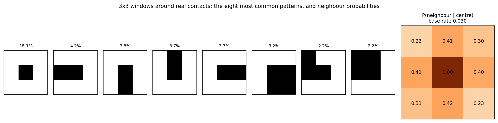
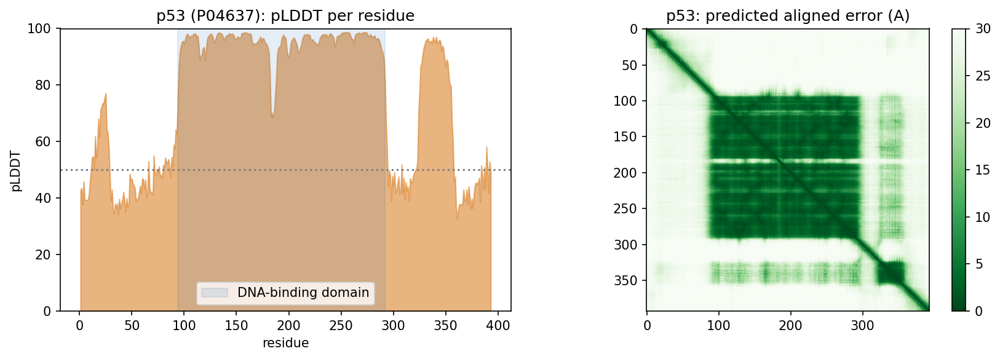
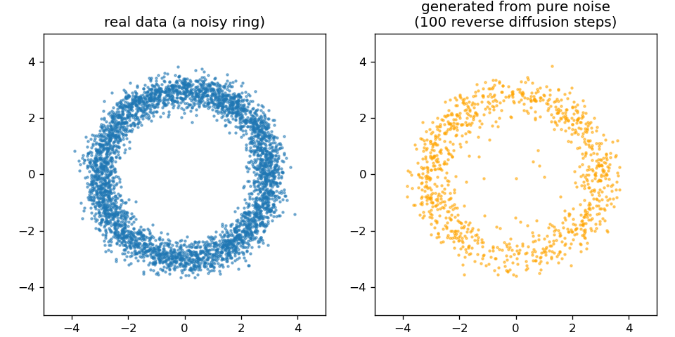

::: {.callout-note}
**Sources for this page:** Arne Elofsson's AlphaFold lecture (*AlphaFold
2026, undervisning*) and diffusion-models lecture (`slides/Diffusion
models (undervisning).pdf`), which this page follows; every paper named
below is the primary source for its numbers, cited where it is used.
Data and models are fetched live from the RCSB PDB, the
[AlphaFold Protein Structure Database](https://alphafold.ebi.ac.uk/)
(CC BY 4.0) and the ESM Atlas API. All figures were drawn or computed for
this course, and every number from our own code was read back from the
notebook's output. The "four regions" framework in Part 3 is taken from
the lecture; it has not yet been published as a paper.
:::

# Day 12: AlphaFold and Generative Models of Protein Structure

## Learning goals

By the end of this session you should be able to:

- explain the protein folding problem and how structure prediction moved
  from energy functions and fragments, through coevolution and contact
  prediction, to AlphaFold;
- describe AlphaFold2's architecture (MSA and pair representations, the
  Evoformer, the structure module) and interpret its confidence measures,
  pLDDT and PAE;
- explain how AlphaFold2 was extended to protein complexes, and what
  pDockQ, ipTM and ipSAE measure;
- explain what a diffusion model does, and how AlphaFold3, RFdiffusion
  and ProteinMPNN use generative modelling;
- judge where AI structure prediction works and where it does not, using
  the "four regions" of protein interactions.

The session has three parts: **from the folding problem to AlphaFold 1**,
**AlphaFold2 and protein complexes**, and **AlphaFold3 and generative
models**. It closes the arc the course opened on Day 6 with secondary
structure.

# Part 1: From the folding problem to AlphaFold 1

## The folding problem

A protein's sequence determines its structure (Anfinsen, 1973,
[*Science* 181:223](https://doi.org/10.1126/science.181.4096.223)). Under
Anfinsen's dogma the native structure is unique, stable (the bottom of a
folding "funnel") and kinetically reachable. Dill & MacCallum
([*Science* 338:1042](https://doi.org/10.1126/science.1219021), 2012)
summarised fifty years of work as three questions. What is the physical
code by which a sequence dictates its structure? How do proteins fold so
fast? And "can we devise a computer algorithm to predict protein
structures from their sequences?"

For decades the typical pipeline was:

1. Search the sequence against a database and build a multiple sequence
   alignment (Days 4-5).
2. Derive a profile, and from it predict secondary structure (Day 6).
3. Assemble the structure from short fragments of known proteins with an
   energy function (Rosetta, Simons et al. 1997,
   [*J Mol Biol* 268:209](https://doi.org/10.1006/jmbi.1997.0959)).

Local sequence is not enough: the same 10 residues can be a strand in one
protein and a helix in another ("chameleon sequences"). The missing
information was long-range.

## Coevolution and contact prediction

If two residues touch, a mutation in one is often compensated by a
mutation in the other. Across a large family of homologs they therefore
**co-evolve**. Early mutual-information scores were swamped by indirect
correlations (A-B and B-C contacts make A and C look coupled). Global
statistical models, such as DCA and plmDCA (Ekeberg et al. 2013,
[*Phys Rev E* 87:012707](https://doi.org/10.1103/PhysRevE.87.012707)), separate
direct couplings from indirect ones (Day 10). Two things made this work
around 2011-2014: the models, and the explosive growth of sequence
databases that made families big enough.

**Contacts come in patterns.** Contact maps are not random collections of
pixels. In the notebook, 3 × 3 windows centred on real contacts in eight
structures show only 146 of the 256 possible patterns. A neighbouring pair
is in contact 23-42% of the time when the centre pair is, against a base
rate of 3.0%:

{width=100%}

**What happened next: our own lineage, and then everyone's.**

- **PconsC2** (Skwark, Raimondi, Michel & Elofsson, 2014,
  [*PLoS Comput Biol* 10:e1003889](https://doi.org/10.1371/journal.pcbi.1003889))
  used "a deep learning approach to identify protein-like contact
  patterns": random forests applied iteratively over an 11 × 11 window of
  first-round predictions. It helped most for β-sheet proteins.
- **PconsFold** (Michel et al., 2014,
  [*Bioinformatics* 30:i482](https://doi.org/10.1093/bioinformatics/btu458))
  folded proteins from these contacts, improving model TM-scores by 33%
  over EVfold. **PconsC3** (2017) predicted accurate contacts for "more
  than 4000" Pfam families of unknown structure.
- **RaptorX-Contact** (2017, Day 10) treated the whole contact map as an
  image for a deep residual network. **PconsC4** (Michel,
  Menéndez-Hurtado & Elofsson, 2019,
  [*Bioinformatics* 35:2677](https://doi.org/10.1093/bioinformatics/bty1036))
  made this fast and "hassle-free": `pip install pconsc4`, no GPU needed.
- **AlphaFold 1** (Senior et al., CASP13, 2018;
  [*Nature* 577:706](https://pubmed.ncbi.nlm.nih.gov/31942072/)) and **trRosetta** (Yang
  et al., 2020,
  [*PNAS* 117:1496](https://doi.org/10.1073/pnas.1914677117)) predicted
  **distance distributions** (and, in trRosetta, orientations) instead of
  binary contacts, and folded by minimising against them. By CASP13 most
  single-domain proteins could be predicted "quite accurately".
- **Fold and dock.** Joining the alignments of two proteins lets the same
  machinery predict how they bind. Pozzati et al. (2022,
  [*Bioinformatics* 38:954](https://doi.org/10.1093/bioinformatics/btab760))
  did this with trRosetta, and their PconsDock score separated correct
  from incorrect models 98% of the time.

### Further reading

- Dill & MacCallum (2012), [The protein-folding problem, 50 years on](https://doi.org/10.1126/science.1219021)
- Skwark et al. (2014), [Improved contact predictions using the recognition of protein like contact patterns](https://doi.org/10.1371/journal.pcbi.1003889)
- Yang et al. (2020), [trRosetta](https://doi.org/10.1073/pnas.1914677117)

# Part 2: AlphaFold2 and protein complexes

## AlphaFold2 (CASP14, 2020)

AlphaFold2 (Jumper et al., 2021,
[*Nature* 596:583](https://doi.org/10.1038/s41586-021-03819-2)) was "the
first computational method that can regularly predict protein structures
with atomic accuracy even in cases in which no similar structure is
known". At CASP14 its median backbone accuracy was 0.96 Å (Cα RMSD at 95%
coverage), against 2.8 Å for the next best method. How it works:

- **Two representations.** An **MSA representation** (one row per aligned
  sequence, one column per residue) and a **pair representation** (one
  vector per residue pair: a learned, much richer version of a contact or
  distance map).
- **The Evoformer** (48 blocks) updates both. Attention runs along the
  rows of the MSA (which residues matter together in one sequence) and
  down its columns (how a position varies across the family): Day 11's
  attention, applied to an alignment. The idea of learning directly from
  raw alignments had been explored in rawMSA (Mirabello & Wallner, 2019,
  [*PLoS One* 14:e0220182](https://doi.org/10.1371/journal.pone.0220182)).
  **Triangle updates** make the pair representation consistent: if i is
  near j and j near k, that constrains i-k, just as distances in 3D must
  obey the triangle inequality.
- **The structure module** turns the pair representation into 3D
  coordinates, treating each residue as a rigid frame that is rotated and
  moved into place.
- **Recycling.** The output is fed back in a few times, nudging the
  prediction towards a consistent structure.

Its confidence measures are as important as the structure itself:

- **pLDDT** (0-100, per residue): predicted local accuracy. Above 90 is
  very high; below 50 usually means disorder.
- **PAE** (predicted aligned error): for each pair of residues, the
  expected error in the position of one when the model is aligned on the
  other. It tells you whether the *relative* placement of two domains, or
  two chains, can be trusted.

**In the notebook.** The AlphaFold DB model of human β-globin (mean pLDDT
97.2) matches the crystal structure 4HHB with TM-score 0.988 and RMSD 0.51
Å. For p53, 30% of the residues have pLDDT below 50. The DNA-binding
domain averages 95.3, while the N-terminal transactivation region (47.6)
and the C-terminus (45.8) are disordered, which is real biology, not a
failure:

{width=100%}

**Scale.** AlphaFold predicted "almost the entire human proteome (98.5% of
human proteins)", with 58% of residues at confident pLDDT, compared with
the 17% of residues covered by experimental structures
(Tunyasuvunakool et al. 2021,
[*Nature* 596:590](https://doi.org/10.1038/s41586-021-03828-1)). The
AlphaFold Database now holds over 214 million predicted structures
(Varadi et al. 2024,
[*NAR* 52:D368](https://doi.org/10.1093/nar/gkad1011)). In 2024, Demis
Hassabis and John Jumper shared half of the
[Nobel Prize in Chemistry](https://www.nobelprize.org/prizes/chemistry/2024/summary/)
"for protein structure prediction"; the other half went to David Baker
"for computational protein design".

**Others, and tools.**

- **RoseTTAFold** (Baek et al. 2021,
  [*Science* 373:871](https://doi.org/10.1126/science.abj8754)) reached
  similar accuracy with a three-track network (sequence, distance map and
  3D coordinates).
- **ColabFold** (Mirdita et al. 2022,
  [*Nat Methods* 19:679](https://doi.org/10.1038/s41592-022-01488-1))
  replaced the slow alignment search with MMseqs2 (Day 8's clustering
  tool). Its "40-60-fold faster search" put AlphaFold in a Google Colab
  notebook.
- **ESMFold** skips the alignment altogether and predicts from a single
  sequence using the ESM-2 language model (Day 11). In the notebook,
  ESMFold predicts Ephrin-A5 in seconds with TM-score 0.941 against the
  crystal structure (1SHW).

**Known limits** (lecture):

- AlphaFold cannot tell whether a sequence folds at all, or how a mutation
  changes the structure.
- It may or may not find alternative conformational states.
- The arrangement of domains in large flexible or repeated proteins is
  often arbitrary.
- It "does not know what a membrane is".
- In a protein-DNA complex it can place another protein where the DNA
  should be.

### Further watching

[*Highly accurate protein structure prediction with AlphaFold*](https://www.youtube.com/watch?v=92j-7b-sRPw) (Simon Kohl, DeepMind), a detailed walk through AlphaFold2's architecture:

```{=html}
<div style="position:relative;padding-bottom:56.25%;height:0;overflow:hidden;max-width:100%;margin-bottom:1em;">
<iframe src="https://www.youtube.com/embed/92j-7b-sRPw" style="position:absolute;top:0;left:0;width:100%;height:100%;border:0;" allowfullscreen title="Highly accurate protein structure prediction with AlphaFold, Simon Kohl"></iframe>
</div>
```

## From single chains to complexes

AlphaFold2 was trained on single chains, yet it can predict complexes.

- **FoldDock** (Bryant, Pozzati & Elofsson, 2022,
  [*Nat Commun* 13:1265](https://doi.org/10.1038/s41467-022-28865-w)):
  paste the two sequences together, with paired and unpaired alignments,
  and AlphaFold2 produced "models with acceptable quality (DockQ ≥ 0.23)
  for 63% of the dimers".
  - A score built from the interface pLDDT and the number of interface
    contacts, **pDockQ**, predicts model quality, and identified "51% of
    all interacting pairs at 1% FPR".
  - DockQ (Basu & Wallner 2016,
    [*PLoS One* 11:e0161879](https://doi.org/10.1371/journal.pone.0161879))
    is the standard score for comparing a docked model with the true
    complex (0 to 1; ≥ 0.23 counts as acceptable).
- **AlphaFold-Multimer** (Evans et al., 2021,
  [bioRxiv](https://doi.org/10.1101/2021.10.04.463034)), retrained on
  complexes, predicted 70% of heteromeric interfaces correctly
  (DockQ ≥ 0.23). Its interface confidence score is **ipTM**.
- **Homomers are all or none.** For 97.5% of homomeric complexes either
  all interfaces or none are predicted correctly (Zhu et al. 2023,
  [*Bioinformatics* 39:btad424](https://doi.org/10.1093/bioinformatics/btad424)).
- **Large complexes.** Assemble them from predicted sub-complexes with
  Monte Carlo tree search: 91 of 175 complexes with 10-30 chains assembled,
  30 of them highly accurate (Bryant et al. 2022,
  [*Nat Commun* 13:6028](https://doi.org/10.1038/s41467-022-33729-4)).
- **The human interactome.** Structures were predicted for 65,484 human
  protein interactions, yielding 3,137 high-confidence models, "of which
  1,371 have no homology to a known structure". Fewer than 5% of human
  interactions had been structurally characterised (Burke et al. 2023,
  [*Nat Struct Mol Biol* 30:216](https://doi.org/10.1038/s41594-022-00910-8)).
- **Biology from predictions.** All-against-all modelling of 14
  fertilisation proteins identified "a pentameric complex involving sperm
  IZUMO1, SPACA6, TMEM81 and egg JUNO, CD9" at the egg-sperm fusion
  synapse (Elofsson et al. 2024,
  [*eLife* 13:RP93131](https://doi.org/10.7554/eLife.93131)).

### Further reading

- Jumper et al. (2021), [Highly accurate protein structure prediction with AlphaFold](https://doi.org/10.1038/s41586-021-03819-2)
- Bryant, Pozzati & Elofsson (2022), [Improved prediction of protein-protein interactions using AlphaFold2](https://doi.org/10.1038/s41467-022-28865-w)
- Mirdita et al. (2022), [ColabFold](https://doi.org/10.1038/s41592-022-01488-1)

# Part 3: AlphaFold3 and generative models

## Diffusion models in one page

A **diffusion model** learns to generate data by learning to *remove
noise*:

1. **Forward process:** take real data and add a little Gaussian noise
   step by step, until nothing but noise is left. No learning is needed
   for this.
2. **Training:** show a network a noisy example and its step number, and
   train it to predict the noise that was added (mean squared error).
3. **Generation:** start from pure noise and apply the network many
   times, removing a little noise at each step.

The idea goes back to Sohl-Dickstein et al. (2015). Ho, Jain & Abbeel's
denoising diffusion probabilistic models
([arXiv:2006.11239](https://arxiv.org/abs/2006.11239), 2020) made it
practical, and it is the technique behind image generators such as DALL-E.
**Flow matching** (Lipman et al.,
[arXiv:2210.02747](https://arxiv.org/abs/2210.02747)) learns a smooth
velocity field that carries noise straight to data. The idea is the same,
and it needs fewer steps. An older relative, the **variational
autoencoder**, compresses data into a small latent space and generates by
decoding samples from it.

{width=70%}

## AlphaFold3 (2024)

AlphaFold3 (Abramson et al. 2024,
[*Nature* 630:493](https://doi.org/10.1038/s41586-024-07487-w)) predicts
"the joint structure of complexes including proteins, nucleic acids, small
molecules, ions and modified residues". Three changes from AlphaFold2
matter most:

- **Pairformer:** a simpler replacement for the Evoformer, which works
  mostly on the pair representation and much less on the MSA.
- **Diffusion module:** instead of a structure module that moves residue
  frames, it "directly predicts the raw atom coordinates". It starts from
  random atom positions and denoises them, conditioned on the Pairformer's
  output. This handles any molecule made of atoms.
- **Everything as tokens:** residues, nucleotides and single ligand atoms.

AlphaFold3 reported far better accuracy than docking tools for
protein-ligand complexes, and much better antibody-antigen accuracy than
AlphaFold-Multimer. The antibody numbers used 1,000 random seeds per
target, so sampling matters. A diffusion model can also **hallucinate**,
producing plausible-looking structure in regions that should be
disordered, which the authors had to counter in training.

**Open reproductions** followed quickly, because AlphaFold3 was released
without training code:

- **Boltz-1**: fully open (MIT licence).
- **Boltz-2**: adds binding-affinity prediction, approaching free-energy
  perturbation "at least 1000× more computationally efficient".
- **Chai-1**: can run without alignments.
- **Protenix**.
- **OpenFold3**: preview release.
- **RoseTTAFold All-Atom** (Krishna et al. 2024,
  [*Science* 384:eadl2528](https://doi.org/10.1126/science.adl2528)) is an
  independent architecture.

**How much better is it?** At CASP16, "AlphaFold3 performs slightly better
for protein complexes. However, when massive sampling is applied to
AlphaFold2, the difference disappears" (Elofsson 2026,
[*Proteins* 94:154](https://doi.org/10.1002/prot.70044)). The official
assessment concluded that complex prediction "remains an unsolved
challenge", with "model ranking and selection" as major bottlenecks
(Zhang et al. 2026,
[*Proteins* 94:106](https://doi.org/10.1002/prot.70068)).

## The ranking problem

Generating a good model has become easier than *knowing* which of your
models is good.

- **Antibody-antigen complexes** have no coevolution between partners to
  learn from. On 110 complexes unseen in training, with 200 models per
  complex, AlphaFold3 beat AlphaFold2, Boltz-1 and Chai-1. The average
  DockQ of the best model rose "from below 0.3 to above 0.5" with more
  samples. But AlphaFold's own confidence often "cannot identify the best
  predicted structures", so the top-ranked model is much worse than the
  best one. Performance also "declines significantly for complexes that
  lack structural similarity to the training set" (Fromm, Ludaic &
  Elofsson 2026,
  [*Bioinformatics* 42:btag136](https://doi.org/10.1093/bioinformatics/btag136)).
  A learned ranker, ABAG-Rank, "significantly outperforms AF3 internal
  scoring" (Tadiello et al. 2026,
  [*Bioinformatics* 42:btag663](https://doi.org/10.1093/bioinformatics/btag663)).
- **ipTM depends on what you include.** Trimming a full-length construct
  to its interacting domains raises ipTM "even though the structure
  prediction of the interaction is unchanged". **ipSAE** counts only
  residue pairs with good PAE and separates true from false complexes
  better (Dunbrack 2025,
  [bioRxiv](https://doi.org/10.1101/2025.02.10.637595)).
- **RNA.** Ten methods were benchmarked on RNAs and RNA complexes not seen
  in training. AlphaFold3 and Boltz-1 lead, but "accuracy depends greatly
  on similarity to the training set", and the methods "recognize recurring
  motifs rather than generalize to novel RNA folds" (Ludaic & Elofsson
  2026, [*NAR* 54:gkag813](https://doi.org/10.1093/nar/gkag813)).

The common thread is Day 8's lesson on a grand scale. Performance on
examples similar to the training data says little about genuinely new
ones, and confidence scores do not always know the difference.

## Where AI structure prediction works: four regions

The lecture organises all of this into four regions of protein
interactions. Current methods mainly answer *how* two proteins could
interact, not *whether* and *when* they do in a cell.

| Region | Character | Example | Current methods |
|---|---|---|---|
| I, tractable | Stable interfaces, strong coevolution | Obligate heterodimers (Ephrin-A5:EphB2) | Work well |
| II, ambiguity and competition | A plausible interface is easy; the right partner or stoichiometry is hard | Proteasome paralogs; Izumo1 and its competing partners | Struggle to rank the correct partner |
| III, missing coevolution | No joint selective pressure | Antibody-antigen, host-pathogen | AlphaFold3-class models help, partly through memorisation |
| IV, missing context or dynamics | Transient, conditional, disordered | p53 transactivation domain binding MDM2 | Static structure prediction is the wrong tool |

The lab tests exactly this: one AlphaFold3 Server prediction per region,
and a look at whether the model's confidence tracks how hard each problem
really is.

## Designing new proteins

The same generative machinery runs in reverse:

- **RFdiffusion** (Watson et al. 2023,
  [*Nature* 620:1089](https://doi.org/10.1038/s41586-023-06415-8))
  fine-tuned RoseTTAFold to denoise protein backbones and generates new
  ones. Hundreds of designed assemblies, metal-binding proteins and binders
  were characterised in the lab, including a binder to influenza
  haemagglutinin whose cryo-EM structure was "nearly identical to the
  design model".
- **ProteinMPNN** (Dauparas et al. 2022,
  [*Science* 378:49](https://doi.org/10.1126/science.add2187)) designs a
  sequence for a given backbone. On native backbones it recovers 52.4% of
  the native sequence, against 32.9% for Rosetta.
- **Chroma** (Ingraham et al. 2023,
  [*Nature* 623:1070](https://doi.org/10.1038/s41586-023-06728-8))
  generates structure and sequence together, conditioned on properties or
  "even natural-language prompts".
- **DiffDock** (Corso et al.,
  [arXiv:2210.01776](https://arxiv.org/abs/2210.01776)) applies diffusion
  to ligand docking, over translations, rotations and torsion angles.

Designs are usually checked by refolding the designed sequence with
AlphaFold2 or ESMFold and comparing it with the intended structure.

### Further reading

- Abramson et al. (2024), [Accurate structure prediction of biomolecular interactions with AlphaFold 3](https://doi.org/10.1038/s41586-024-07487-w)
- Fromm, Ludaic & Elofsson (2026), [Evaluating deep learning based structure prediction methods on antibody-antigen complexes](https://doi.org/10.1093/bioinformatics/btag136)
- Elofsson & Ben-Tal (2026), [What will be the future of computational biology for macromolecules in the era of AI?](https://doi.org/10.1371/journal.pcbi.1014467)
- Watson et al. (2023), [De novo design of protein structure and function with RFdiffusion](https://doi.org/10.1038/s41586-023-06415-8)

### Further watching

[*Flow-Matching vs Diffusion Models explained side by side*](https://www.youtube.com/watch?v=firXjwZ_6KI) (AI Coffee Break with Letitia), used in the diffusion lecture:

```{=html}
<div style="position:relative;padding-bottom:56.25%;height:0;overflow:hidden;max-width:100%;margin-bottom:1em;">
<iframe src="https://www.youtube.com/embed/firXjwZ_6KI" style="position:absolute;top:0;left:0;width:100%;height:100%;border:0;" allowfullscreen title="Flow-Matching vs Diffusion Models explained side by side"></iframe>
</div>
```

## Check your understanding

```{=html}
<div id="day12-quiz"></div>
<script>
renderQuiz("day12-quiz", [
  {
    question: "Why do residues that are in contact in 3D tend to co-evolve across a protein family?",
    choices: [
      "A mutation at one residue that disturbs the contact is often compensated by a mutation at its partner, so the two change together",
      "Residues in contact are always identical",
      "Coevolution only happens in disordered regions",
      "Contacts are copied from a template structure"
    ],
    correctIndex: 0,
    explanation: "Global statistical models (DCA, plmDCA) then separate these direct couplings from indirect correlations."
  },
  {
    question: "In real contact maps, a neighbouring pair is in contact 23-42% of the time when the centre pair is, against a base rate of 3%. Which methods exploited this first?",
    choices: [
      "Predictors that look at a neighbourhood of the map: PconsC2's random forests over an 11x11 window, then deep residual CNNs",
      "Mutual information between single columns",
      "BLAST",
      "Secondary-structure predictors"
    ],
    correctIndex: 0,
    explanation: "A contact map is an image with strong local structure: Day 10's point, used by PconsC2 (2014), RaptorX-Contact (2017) and AlphaFold 1 (2018)."
  },
  {
    question: "An AlphaFold model has pLDDT above 90 in two domains but high predicted aligned error (PAE) between them. What should you conclude?",
    choices: [
      "Each domain is probably correct, but their relative placement is not reliable",
      "Both domains are wrong",
      "The whole model is correct",
      "The protein is intrinsically disordered"
    ],
    correctIndex: 0,
    explanation: "pLDDT is local; PAE measures the confidence in relative positions."
  },
  {
    question: "About 30% of p53's residues have pLDDT below 50 in the AlphaFold DB. What is the most likely explanation?",
    choices: [
      "Those regions are intrinsically disordered in the free protein; the DNA-binding domain itself is predicted with pLDDT ~95",
      "AlphaFold failed because p53 is too long",
      "p53 has no homologs",
      "The model was built without an alignment"
    ],
    correctIndex: 0,
    explanation: "Low pLDDT often marks disorder, not failure. The transactivation domain folds only when bound to partners such as MDM2 (Region IV)."
  },
  {
    question: "What did AlphaFold3 change compared with AlphaFold2?",
    choices: [
      "A Pairformer replaces the Evoformer, and a diffusion module generates raw atom coordinates, so ligands, nucleic acids and ions can be modelled",
      "It stopped using attention",
      "It predicts only secondary structure",
      "It no longer needs any training data"
    ],
    correctIndex: 0,
    explanation: "The diffusion module starts from random atom positions and denoises them, conditioned on the Pairformer's representation."
  },
  {
    question: "For antibody-antigen complexes, the best of 200 AlphaFold3 models has much higher DockQ than the top-ranked one. What does this show?",
    choices: [
      "Generating a correct model is easier than recognising it: the confidence score (ranking) is the bottleneck",
      "More sampling never helps",
      "Antibodies cannot be modelled at all",
      "DockQ is a poor measure"
    ],
    correctIndex: 0,
    explanation: "Fromm, Ludaic and Elofsson (2026); learned rankers (ABAG-Rank) and interface-specific scores such as ipSAE address this."
  },
  {
    question: "In the four-regions framework, why is an antibody-antigen complex (Region III) harder than an obligate heterodimer (Region I)?",
    choices: [
      "Antibody and antigen have not co-evolved, so the alignments carry no coevolutionary signal about the interface",
      "Antibodies are too large for AlphaFold",
      "Antigens are always disordered",
      "Region III complexes have no crystal structures"
    ],
    correctIndex: 0,
    explanation: "Without coevolution, the model must rely on learned structural patterns, and gains partly trace to memorisation."
  },
  {
    question: "How do RFdiffusion and ProteinMPNN divide the work of designing a new protein?",
    choices: [
      "RFdiffusion generates a new backbone by denoising; ProteinMPNN designs a sequence that should fold into it",
      "ProteinMPNN predicts structures, RFdiffusion aligns sequences",
      "Both only predict natural protein structures",
      "RFdiffusion designs the sequence and ProteinMPNN the backbone"
    ],
    correctIndex: 0,
    explanation: "Designs are then usually checked by refolding the sequence with AlphaFold2 or ESMFold."
  }
]);
</script>
```

## The notebook

`notebooks/day12-alphafold-and-generative-models-in-code.ipynb` runs the
computations on this page, in the same three parts:

1. 3 × 3 contact patterns in eight real structures.
2. AlphaFold DB models of β-globin and p53 with pLDDT and PAE; the
   β-globin model against its crystal structure; ESMFold on Ephrin-A5.
3. The forward noising of a diffusion model, and a small diffusion model
   generating points from noise.

It runs on a CPU in a few minutes. Open it in
[Google Colab](https://colab.research.google.com/github/ElofssonLab/kb8029-book/blob/main/notebooks/day12-alphafold-and-generative-models-in-code.ipynb).

## The lab

**Full lab:** adapted from the previous course's AlphaFold2 lab and the
2026 AlphaFold3 Server exercise. Your group runs one of four targets on
the [AlphaFold Server](https://alphafoldserver.com), one per region of
the framework on this page:

- Region I: Ephrin-A5 : EphB2 (1SHW);
- Region II: Izumo1 : Juno (5F4E);
- Region III: antibody : antigen (8TQ7);
- Region IV: p53 peptide : MDM2 (1YCR).

Work through
[`notebooks/day12-lab.ipynb`](https://colab.research.google.com/github/ElofssonLab/kb8029-book/blob/main/notebooks/day12-lab.ipynb),
replacing every `todo(...)` call with your own code:

1. fetch your target's chain sequences from the PDB and submit them to
   the AlphaFold Server (20 jobs per day and account);
2. read AlphaFold DB models: pLDDT, the PAE matrix, a hydrogen bond, which
   models are disordered, and how closely a model matches its crystal
   structure;
3. load your AlphaFold Server result, plot its PAE heatmap, and compute
   pTM, ipTM and the interface score ipSAE;
4. pool the class's results and compare ipTM with ipSAE across the four
   regions;
5. superimpose your model on the crystal structure in PyMOL.

### Submitting this lab

This lab is administered through Canvas, not this book — see the
course's Canvas page for the current quiz, deadline, and submission
mechanism.

## What's next

The capstone project: predicting secondary structure, the problem this
course met on Day 6, now with every tool from Days 5-12 at hand.
