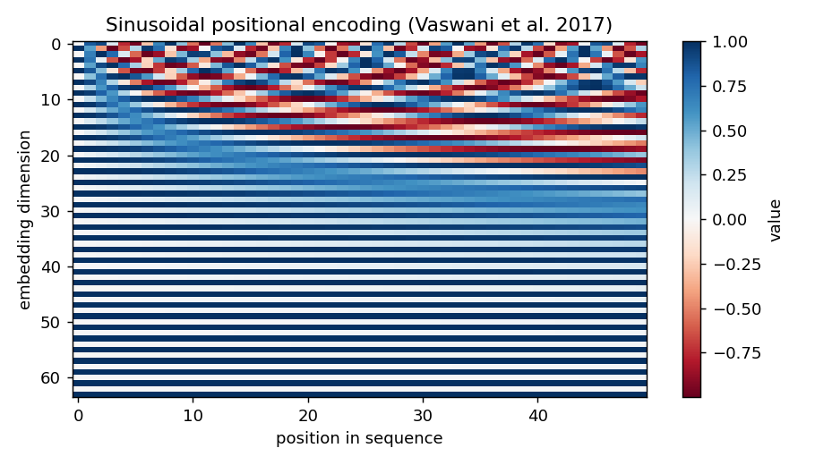
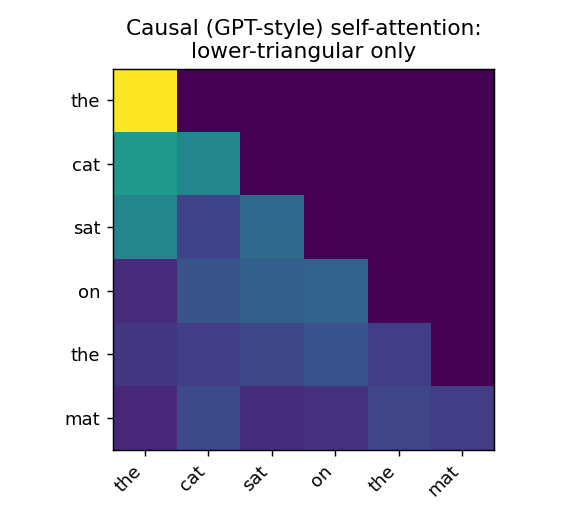

::: {.callout-note}
**Sources for this page:** d2l.ai, *Dive into Deep Learning*,
[Attention Mechanisms and Transformers](https://d2l.ai/chapter_attention-mechanisms-and-transformers/index.html)
— CC BY-SA 4.0; Wikipedia, [Attention (machine learning)](https://en.wikipedia.org/wiki/Attention_(machine_learning))
— CC BY-SA 4.0; Vaswani et al. (2017),
["Attention Is All You Need"](https://arxiv.org/abs/1706.03762); Jumper
et al. (2021), ["Highly accurate protein structure prediction with
AlphaFold"](https://www.nature.com/articles/s41586-021-03819-2), *Nature*;
a real, working blog explainer of the Evoformer, linked directly in
Arne's own slides — ["AlphaFold 2 Is Here: What's Behind the Structure
Prediction
Miracle"](https://www.blopig.com/blog/2021/07/alphafold-2-is-here-whats-behind-the-structure-prediction-miracle/);
Pennington, Socher & Manning (2014), GloVe word vectors, via `gensim`.
Mined for ideas, not copied: `slides/EkmanSlides-Chapters-12-15.pdf` and
`notebooks/ch12.ipynb`-`ch15.ipynb` (Ekman-derived: word embeddings,
seq2seq, Bahdanau/Luong attention, self-attention, multi-head attention,
positional encoding, a Transformer encoder block, and an ESM
protein-language-model example) and Arne's own 207-slide `slides/AlphaFold
2026 (Undervisning).pptx`, mined only for its attention/Evoformer
portion (slides 68-71, 97-100) — the physics-based-potentials/MSA/
coevolution history it opens with is already Days 5 and 10's territory,
not repeated here. Text below is written from scratch. Every number is
computed in the notebook, not asserted.
:::

# Day 12: Attention and Transformers

## Learning goals

By the end of this session you should be able to explain attention as a
learned, differentiable search over a sequence; describe the history
that led from word embeddings to the Transformer; describe how the same
decoder architecture, trained by next-token prediction, is what a GPT
model is; describe, at a conceptual level, what AlphaFold's Evoformer
changed relative to the profile+network lineage built up since Day 5;
and describe what a protein language model is.

## From word vectors to "Attention Is All You Need"

Before attention, this field had to solve a smaller problem first:
representing a discrete symbol — a word, or a residue — as something a
neural network can actually compute with. A one-hot vector (Day 8) works
but treats every pair of words as equally unrelated. **Word embeddings**
(word2vec, GloVe) fix this by *learning* a vector per word from how it's
used in a huge text corpus, so that words used in similar contexts end
up nearby in vector space — and, famously, so that vector arithmetic can
capture relationships:

$$
\text{king} - \text{man} + \text{woman} \approx \text{queen}
$$

This isn't a slogan — the notebook computes it directly on real,
pretrained GloVe vectors and gets `queen` back with cosine similarity
0.85, ahead of every other word in the vocabulary.

The path from there to the Transformer is a chain of one-fix-at-a-time
engineering, not a single leap:

1. **Sequence-to-sequence translation** (Day 11's encoder-decoder RNN,
   applied to translation): an encoder compresses the whole source
   sentence into one fixed-length vector, a decoder generates the
   target sentence from it.
2. **The bottleneck**: one fixed-length vector has to summarize an
   entire sentence, however long — quality degrades badly on long
   inputs.
3. **Bahdanau/Luong attention** (2014-2015) fixes this by letting the
   decoder look back at *all* of the encoder's hidden states at every
   output step, weighted by a learned relevance score — attention
   bolted onto an RNN, not yet its own architecture.
4. **Vaswani et al. (2017), "Attention Is All You Need"** asks: if
   attention is doing all the real work, do we need the RNN at all? The
   answer was no — the Transformer is built entirely from attention
   (plus feed-forward layers), with no recurrence, which also makes it
   far more parallelizable to train than any RNN.

### Further reading

- Wikipedia, [Word2vec](https://en.wikipedia.org/wiki/Word2vec) and [GloVe](https://en.wikipedia.org/wiki/GloVe) — the two classic embedding methods, in more depth than needed here

## Attention as differentiable search

Every attention mechanism answers the same question at every position:
*which other positions matter, and how much?* Concretely, each
position's representation is projected into three vectors — **query**
(what this position is looking for), **key** (what a position offers to
be matched against), and **value** (what gets returned if matched) —
and the output is a weighted sum of values, weighted by how well each
query matches each key:

$$
\text{Attention}(Q, K, V) = \text{softmax}\!\left(\frac{QK^\top}{\sqrt{d_k}}\right) V
$$

This is worth stating plainly: it is a learned, differentiable version
of exactly what Day 5's BLAST does. BLAST searches a fixed database
using a fixed heuristic (word matching, then extension) to decide what's
relevant. Attention learns *what makes something relevant* — the
projections that produce $Q$, $K$, and $V$ are trained end-to-end,
rather than hand-designed — and it searches within a single input
(self-attention) rather than against an external database.

{width=85%}

A single attention head can only learn one kind of relationship at a
time. **Multi-head attention** runs several heads in parallel, each with
its own projections, then combines them — letting different heads
specialize in different kinds of relationships:

{width=100%}

Real Transformers also add **positional encoding** (attention alone has
no notion of order — shuffle the input and every query/key/value pair is
unchanged) and stack many attention+feed-forward blocks, each with a
residual connection and layer normalization, exactly the way Day 9's
hidden layers stacked:

{width=90%}

### Further reading

- d2l.ai, [Attention Mechanisms and Transformers](https://d2l.ai/chapter_attention-mechanisms-and-transformers/index.html) — the full mechanical detail (multi-head attention, the Transformer architecture end-to-end) beyond what's needed here
- Vaswani et al. (2017), ["Attention Is All You Need"](https://arxiv.org/abs/1706.03762) — the original paper

## The GPT coupling: one masking change

Everything above lets every position attend to every other position —
exactly right for an *encoder* that sees a whole input at once (a
sentence for translation, or a whole protein sequence for a protein
language model). A **decoder-only** model like GPT generates one token
at a time and must never be allowed to peek at tokens it hasn't
generated yet. The fix is a single change: a **causal mask** that sets
every "attend to a future position" score to $-\infty$ before the
softmax, so it becomes exactly zero afterward:

{width=85%}

That's the entire architectural difference between an encoder and a
GPT-style decoder. Train a stack of causal self-attention blocks by
next-token prediction on a huge unlabeled text corpus, and that *is* a
GPT model — the same self-supervised idea Day 11 already introduced for
**UniRep** (predict the next amino acid, on an LSTM), now redone with
attention instead of recurrence, at a much larger scale. This is the
direct bridge into protein language models: ESM, ProtBERT, and ProstT5
(Day 11's forward reference) are this same GPT-family recipe, applied to
protein sequences instead of English text.

### Further reading

- Wikipedia, [GPT (language model)](https://en.wikipedia.org/wiki/Generative_pre-trained_transformer) — the family of models this section describes, in more depth

## AlphaFold, conceptually

AlphaFold2 (2020) is where this course's two threads — Day 5's profile
information and this day's attention — actually meet. Its core module,
the **Evoformer**, does not throw away the MSA/coevolution idea from Day
5 and Day 10; it processes it with attention instead of a fixed profile
score or a CNN over a static contact map. Concretely, the Evoformer
maintains two representations that update each other: a representation
per sequence in the MSA, and a representation per *pair* of residues.
**Row-wise attention** lets each sequence's representation attend across
columns (positions) within it; **column-wise attention** lets information
flow *across* the different sequences in the MSA at a fixed position —
both are the same query/key/value mechanism above, just applied to a
2D array (sequences × positions) instead of a 1D sentence. A **triangular
update** rule then lets the pairwise representation enforce basic
geometric consistency (if residue A is close to B, and B is close to C,
that constrains how close A and C can be) — dozens of these blocks are
stacked before the structure module converts the final representation
into 3D coordinates.

AlphaFold3 (2024) replaced the Evoformer with a related but simplified
**Pairformer**, which leans more on the pairwise representation and less
on the raw MSA — evidence that the specific attention pattern is still
an active area of iteration, not a settled final architecture.

### Further reading

- ["AlphaFold 2 Is Here: What's Behind the Structure Prediction Miracle"](https://www.blopig.com/blog/2021/07/alphafold-2-is-here-whats-behind-the-structure-prediction-miracle/) — an accessible explainer of the Evoformer, linked directly in the source slides for this page
- Jumper et al. (2021), ["Highly accurate protein structure prediction with AlphaFold"](https://www.nature.com/articles/s41586-021-03819-2), *Nature* — the primary AlphaFold2 paper

## Protein language models

A protein language model is exactly the GPT recipe above (or, for ESM,
a masked/bidirectional variant of it — an encoder, not a decoder),
pretrained on real protein sequences instead of text, with no
alignment, no MSA, and no labels required. The notebook computes this
directly rather than just describing it: real ESM-2 embeddings for
three real globins used throughout this course (HBB, myoglobin, and
HBA1) land closer together in embedding space exactly when their real,
independently-computed pairwise sequence identity is higher —

{width=80%}

— continuing directly from Day 11's UniRep (an LSTM-based protein
language model) and setting up ProstT5's bilingual sequence/structure
embeddings, both introduced there as forward references.

## Check your understanding

```{=html}
<div id="day12-quiz"></div>
<script>
renderQuiz("day12-quiz", [
  {
    question: "How does attention relate to Day 5's BLAST?",
    choices: [
      "Attention is a learned, differentiable version of the same relevance-search idea BLAST performs with a fixed heuristic",
      "Attention and BLAST solve completely unrelated problems",
      "BLAST is a special case of attention with zero attention heads",
      "Attention only works on protein sequences, never on text"
    ],
    correctIndex: 0,
    explanation: "Both search for what's relevant to a query; BLAST's heuristic is fixed and hand-designed, attention's query/key/value projections are learned end-to-end."
  },
  {
    question: "What is the single architectural change that turns a bidirectional Transformer encoder into a GPT-style decoder?",
    choices: [
      "A causal mask that sets every attend-to-the-future score to negative infinity before the softmax",
      "Removing positional encoding entirely",
      "Replacing multi-head attention with single-head attention",
      "Training on protein sequences instead of text"
    ],
    correctIndex: 0,
    explanation: "Everything else (QKV projections, multi-head attention, feed-forward blocks) is identical between an encoder and a GPT-style decoder -- only the causal mask differs."
  },
  {
    question: "In AlphaFold's Evoformer, what do row-wise and column-wise attention operate over?",
    choices: [
      "Row-wise attends across positions within one sequence; column-wise attends across different sequences at a fixed position",
      "Row-wise and column-wise are two names for the exact same computation",
      "Row-wise attention only runs during training, column-wise only during inference",
      "They operate on the 3D coordinates directly, not on the MSA"
    ],
    correctIndex: 0,
    explanation: "The Evoformer maintains an MSA-shaped (sequences x positions) representation, and applies attention along each of its two axes separately."
  },
  {
    question: "The notebook computes real ESM-2 embeddings for HBB, myoglobin, and HBA1. What real result does it find?",
    choices: [
      "HBB and HBA1 -- the pair with the highest real sequence identity (46.4%) -- also have the highest ESM-2 embedding cosine similarity",
      "All three proteins have identical ESM-2 embeddings",
      "ESM-2 embedding similarity is completely unrelated to sequence identity for these three proteins",
      "Myoglobin's embedding could not be computed"
    ],
    correctIndex: 0,
    explanation: "A real, computed result: higher real sequence identity corresponds to higher ESM-2 embedding similarity for this pair, consistent with what a protein language model's representations should capture."
  },
  {
    question: "Why does Day 11's UniRep matter for understanding a GPT model?",
    choices: [
      "UniRep already used the same self-supervised next-token(next-residue) pretraining idea as GPT, just built on an LSTM instead of attention",
      "UniRep and GPT have no conceptual relationship",
      "UniRep is a later, improved version of GPT",
      "UniRep only works on images, not sequences"
    ],
    correctIndex: 0,
    explanation: "Both predict the next token/residue from the ones before it, self-supervised, at scale -- GPT just swaps the LSTM for attention."
  }
]);
</script>
```

## The notebook

`notebooks/day12-attention-and-transformers-in-code.ipynb` builds the
Transformer up piece by piece, computing every claim above directly: the
king-man+woman&approx;queen check on real pretrained GloVe vectors,
self-attention and multi-head attention from scratch (with the attention
heatmaps above), a causal mask verified to assign exactly zero weight to
every future position, sinusoidal positional encoding, a minimal
Transformer encoder block (verified to preserve its input's shape, which
is why it can be stacked), and the real ESM-2 embedding-vs-sequence-identity
comparison for three real globins. Adapted from this project's own
`notebooks/ch12.ipynb`-`ch15.ipynb` and `protein_contact_prediction.ipynb`'s
ESM usage. Open it in
[Google Colab](https://colab.research.google.com/github/ElofssonLab/kb8029-book/blob/main/notebooks/day12-attention-and-transformers-in-code.ipynb)
via the badge at the top of the notebook page to edit and run it
yourself.

## The lab

A light, demo-heavy exercise, not a from-scratch build (implementing a
full Transformer from scratch in one session isn't realistic, and isn't
the point): explore the notebook's ESM-2 embeddings for a protein of
your choice — fetch a real UniProt sequence, compute its embedding, and
compare it against the three globins already there.

## What's next

Day 13 (if it runs) picks up the *generative* thread this course hasn't
touched yet: diffusion and flow-matching models, from DALL-E to
RFdiffusion and Chroma. Otherwise, the capstone project picks up
directly from here: the same secondary-structure-prediction problem
posed descriptively on Day 7, now solvable with every tool built up from
Day 5's profiles through this day's attention.
