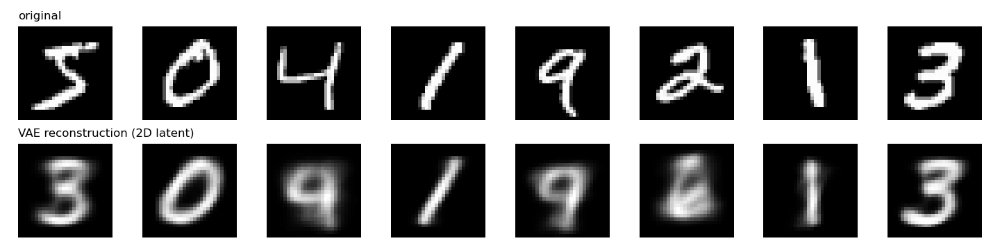
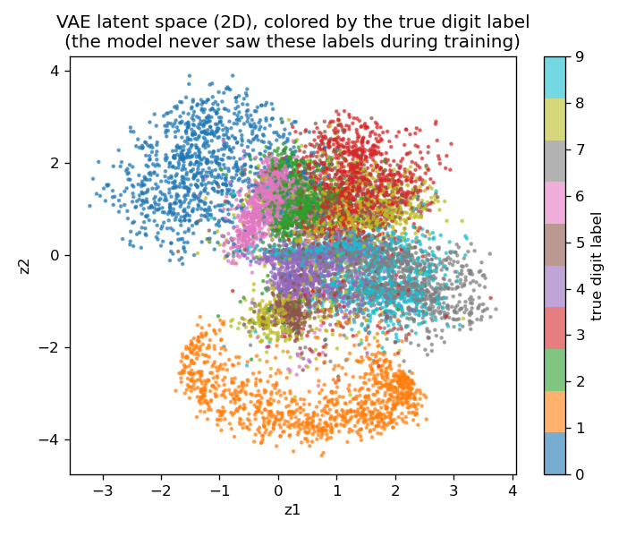
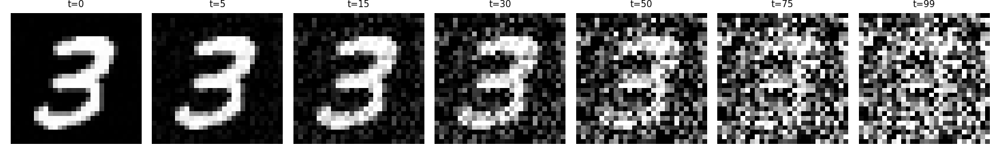

::: {.callout-note}
**Sources for this page:** Arne's own `slides/Diffusion models
(undervisning).pdf` — this page follows its ordering (VAE before
diffusion, diffusion before flow matching) and its own biological
examples (DiffDock, RFdiffusion, ProteinMPNN, Chroma); Sohl-Dickstein et
al. (2015), ["Deep Unsupervised Learning using Nonequilibrium
Thermodynamics"](https://proceedings.mlr.press/v37/sohl-dickstein15.html),
*PMLR* 37:2256-2265 — the original diffusion-models paper, per the
slide deck's own citation; Corso, Stärk, Jing, Barzilay & Jaakkola
(2023), ["DiffDock: Diffusion Steps, Twists, and Turns for Molecular
Docking"](https://arxiv.org/abs/2210.01776); Watson et al. (2023),
["De novo design of protein structure and function with
RFdiffusion"](https://www.nature.com/articles/s41586-023-06415-8),
*Nature* 620:1089-1100; Dauparas et al. (2022), ["Robust deep
learning-based protein sequence design using
ProteinMPNN"](https://pubmed.ncbi.nlm.nih.gov/36108050/), *Science*
378:49-56; Ingraham et al. (2023), ["Illuminating protein space with a
programmable generative
model"](https://www.nature.com/articles/s41586-023-06728-8), *Nature*
623:1070-1078. Wikipedia,
[Variational autoencoder](https://en.wikipedia.org/wiki/Variational_autoencoder) —
CC BY-SA 4.0. Every number and figure below was computed and verified
in the notebook, not transcribed from the slides.
:::

# Day 13: Diffusion & Flow-Matching Models

::: {.callout-important}
**This is an extra session, not a guaranteed part of the course.**
It's built and ready so it's a real option, but the schedule marks it
as a backup/buffer day the course will likely run without (see
`schedule.qmd`). If you're a student: don't assume this material is
examinable unless your instructor says otherwise, in a given year.
:::

## Learning goals

By the end of this session you should be able to describe what a
variational autoencoder (VAE) learns and why it motivates a
latent-space generative approach; describe how a diffusion model
generates data by learning to reverse a noising process, and how flow
matching reframes the same idea as learning a velocity field instead;
and describe how these ideas carry over from image generation (DALL-E)
to protein design (RFdiffusion, Chroma), and why ProteinMPNN is a
necessary companion piece, not a competitor, to backbone-only diffusion
methods.

## Variational autoencoders: the latent-space idea

An ordinary autoencoder learns one fixed encoding per input — useful for
compression, but the space of encodings has no particular structure, so
sampling a random point in it and decoding usually produces garbage. A
**variational autoencoder (VAE)** fixes this by learning a
*distribution* over each input's code (a mean and a variance, not a
single point) and adding a term to the loss — the KL divergence between
that distribution and a standard normal — that pulls every input toward
a shared, smooth, sampleable latent space.

Trained on real MNIST digits with a deliberately tiny 2-dimensional
latent space (small enough to plot directly — a real VAE would use far
more), reconstructions are blurry and occasionally output a different
digit than the input — a genuine, honest cost of squeezing everything
through two real numbers, not a flaw in the idea itself:

{width=95%}

What the tiny latent space buys you: it can be visualized directly, and
digits of the same class cluster together — despite the model **never
seeing a single label** during training:

{width=75%}

This — a smooth, structured space you can sample from — is the direct
conceptual ancestor of what diffusion models do next, just approached
differently: instead of one latent space, learn to *generate by
reversing a gradual corruption process*.

### Further reading

- Wikipedia, [Variational autoencoder](https://en.wikipedia.org/wiki/Variational_autoencoder)

## Diffusion models

The recipe, introduced by Sohl-Dickstein et al. in 2015 and now the
technique behind DALL-E and Stable Diffusion:

1. **Forward process** (fixed, no learning): repeatedly mix in a little
   Gaussian noise, following a schedule, until the data is
   indistinguishable from pure noise.
2. **Reverse process** (learned): train a network to undo *one* small
   noise step at a time. Starting from pure noise and repeatedly
   applying the trained denoiser generates new, realistic data.

Concretely, on a real MNIST digit — no training involved yet, this is
just the fixed forward schedule:

{width=95%}

**Does the reverse process actually work?** Training a full
image-generating diffusion model from scratch and getting recognizable
MNIST digits out isn't realistic in one session's compute budget — a
plain fully-connected network applied directly to MNIST pixels was
tried and did **not** converge to recognizable digits in a reasonable
training time, an honest negative result rather than something to
paper over (this is exactly why real diffusion models use convolutional
U-Nets or Transformers, and far more training). What *does* train
reliably in seconds: a small 2D toy dataset (a noisy ring), where the
reverse process can be checked directly against the real data
distribution rather than by eye on a blurry image:

{width=90%}

Same mechanism, same training objective (predict the noise that was
added, at a given step), just applied at a scale small enough to verify
directly. RFdiffusion (below) applies the identical recipe to 3D
protein backbone coordinates instead of 2D points or image pixels.

### Further reading

- Sohl-Dickstein et al. (2015), [Deep Unsupervised Learning using
  Nonequilibrium Thermodynamics](https://proceedings.mlr.press/v37/sohl-dickstein15.html)

## Flow matching: an alternative to noise-reversal

Diffusion frames generation as reversing a *stochastic* noising process
— formally, a stochastic differential equation (SDE). **Flow matching**
reframes the same generative goal differently: learn a smooth,
*deterministic* transformation (an ordinary differential equation — a
velocity field) that carries the noise distribution to the data
distribution directly, rather than undoing a random walk one noisy step
at a time. Same destination, different math — and, in practice, often
fewer steps needed at generation time since there's no per-step
randomness to average out.

### Further watching

- ["Flow-Matching vs Diffusion Models explained side by
  side"](https://www.youtube.com/watch?v=firXjwZ_6KI) — *AI Coffee
  Break with Letitia* (linked directly in the source slide deck for
  this day; verified via YouTube's own oEmbed API, not a 3Blue1Brown
  video)

## Case study: protein design

Three real, current examples of exactly this recipe applied to
molecules instead of pixels — described here, not run (each is a
large, GPU-cluster-trained research model well beyond what a teaching
notebook can reproduce, the same treatment Day 12 gave AlphaFold and
ESM):

- **DiffDock** (Corso, Stärk, Jing, Barzilay & Jaakkola, 2023) frames
  molecular *docking* — where a small-molecule ligand binds a protein —
  as a diffusion process over the ligand's pose (translation, rotation,
  and torsion angles), rather than over pixels or coordinates directly.
  It reports 38% top-1 accuracy (RMSD < 2 Å) on a blind-docking
  benchmark, against 23% for the best prior search-based method and 20%
  for the best prior deep-learning method — a real, substantial jump,
  not a marginal one. Notably, it uses ESM2 protein-language-model
  embeddings (Day 11-12's thread) as one of its input features.
- **RFdiffusion** (Watson et al., 2023, Baker lab) generates protein
  *backbones* — 3D coordinates, no amino acid identities yet — using
  the same forward-noise/learned-reverse recipe demonstrated above,
  just in 3D coordinate space instead of 2D or pixel space. A backbone
  alone can't be synthesized; it needs a sequence. That's exactly what
  **ProteinMPNN** (Dauparas et al., 2022, also Baker lab) is for: a
  separate, non-generative, non-diffusion model that solves the
  *inverse folding* problem — given a backbone, find a sequence likely
  to fold into it (52.4% native-sequence recovery on real backbones,
  vs. 32.9% for the physics-based Rosetta method it replaced).
  RFdiffusion's own released pipeline is literally these two models in
  sequence: diffuse a backbone, then run ProteinMPNN on it — two
  different models solving two different problems, not one model doing
  both.
- **Chroma** (Ingraham et al., 2023, Generate Biomedicines) takes the
  other architectural bet: **one** diffusion model that jointly
  co-designs sequence *and* structure together, rather than
  RFdiffusion+ProteinMPNN's two-stage pipeline. Neither approach is
  simply "better" — it's a real, teachable design-space tradeoff
  (one integrated model vs. two specialized ones) that shows up
  throughout machine learning, not just here.

### Further reading

- [DiffDock on arXiv](https://arxiv.org/abs/2210.01776)
- [RFdiffusion, *Nature* 2023](https://www.nature.com/articles/s41586-023-06415-8)
- [ProteinMPNN, *Science* 2022](https://pubmed.ncbi.nlm.nih.gov/36108050/)
- [Chroma, *Nature* 2023](https://www.nature.com/articles/s41586-023-06728-8)

## The notebook

`notebooks/day13-diffusion-and-flow-matching-in-code.ipynb` builds both
generative models from scratch and verifies each one actually works: a
VAE trained on real MNIST (the reconstructions and latent-space plots
above), the forward noising process applied to a real digit, and a full
working diffusion model — trained and sampled — on the 2D ring dataset,
including the honestly-reported negative result of trying the same
approach directly on MNIST pixels first. Open it in
[Google Colab](https://colab.research.google.com/github/ElofssonLab/kb8029-book/blob/main/notebooks/day13-diffusion-and-flow-matching-in-code.ipynb)
via the badge at the top of the notebook page to edit and run it
yourself.

## Check your understanding

```{=html}
<div id="day13-quiz"></div>
<script>
renderQuiz("day13-quiz", [
  {
    question: "A VAE's loss has two terms: a reconstruction term and a KL-divergence term. What does the KL term actually do?",
    choices: [
      "Pulls every input's latent distribution toward a shared, smooth standard normal, so the latent space is structured and sampleable",
      "Measures how blurry the reconstructed image is",
      "Counts how many training epochs have passed",
      "Penalizes the model for using too many parameters"
    ],
    correctIndex: 0,
    explanation: "Without the KL term, a VAE could learn a scattered, gap-filled latent space that reconstructs well but can't be sampled from meaningfully; the KL term is what makes it a generative model, not just an autoencoder."
  },
  {
    question: "The notebook's diffusion model failed to generate recognizable MNIST digits with a plain fully-connected network, but succeeded on a 2D toy ring dataset. What does this actually demonstrate?",
    choices: [
      "Diffusion, as a mechanism, works (verified on the 2D case) -- generating real images needs more model capacity/compute (a U-Net or Transformer, more training) than a teaching notebook budget allows, not a flaw in the underlying idea",
      "Diffusion models cannot work on image data at all",
      "The MNIST dataset is too small to train a diffusion model",
      "2D data doesn't actually require a reverse diffusion process to generate"
    ],
    correctIndex: 0,
    explanation: "This is exactly why production diffusion models (DALL-E, Stable Diffusion, RFdiffusion) use convolutional U-Nets or Transformers and far more compute -- the recipe is the same, just at a scale this notebook can't reproduce."
  },
  {
    question: "Why is RFdiffusion always paired with ProteinMPNN, rather than used alone?",
    choices: [
      "RFdiffusion generates a protein backbone (3D coordinates) with no amino acid identities; ProteinMPNN solves the separate inverse-folding problem of designing a sequence for that backbone",
      "ProteinMPNN makes RFdiffusion's diffusion process run faster",
      "RFdiffusion cannot generate valid 3D coordinates without ProteinMPNN's help",
      "They are two names for the same model"
    ],
    correctIndex: 0,
    explanation: "A backbone with no sequence can't be synthesized -- RFdiffusion's own released pipeline is diffuse-a-backbone, then ProteinMPNN, in sequence: two different models for two different problems."
  }
]);
</script>
```

## The lab

A light, exploratory exercise: run the notebook, then change the 2D
toy dataset's shape (e.g. two separated clusters instead of a ring, or
a spiral) and confirm the same reverse-diffusion code still recovers
whatever new shape you trained it on — a check that nothing above was
tuned specifically for a ring.

### Submitting this lab

Hand-in/grading for this lab isn't set up yet. It will likely run
through a Canvas assignment — check the course's Canvas page for the
actual submission mechanism before this session runs (if it runs at
all — see the note at the top of this page).

## What's next

The capstone project picks up directly from Day 12, not from this
extra session: the same secondary-structure-prediction problem posed
descriptively on Day 7, now solvable with every tool built up from
Day 5's profiles through Day 12's attention.
