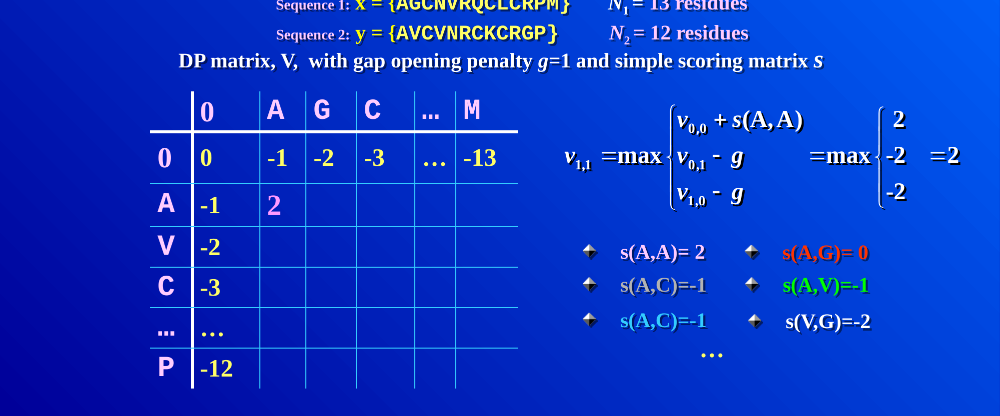
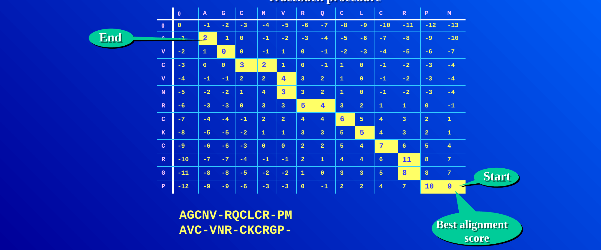
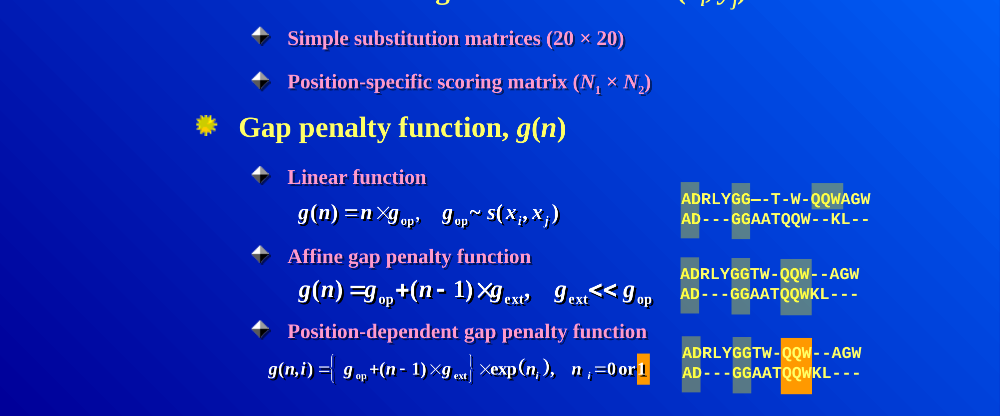
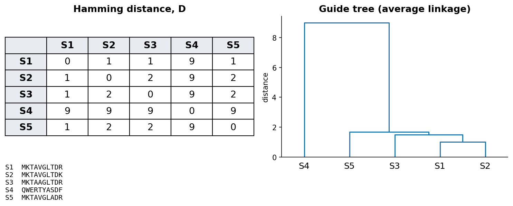

::: {.callout-note}
**Sources for this page:** Petras Kundrotas's KB8029 lecture "Sequence
Alignment" (Feb 2026) — this page follows its structure and worked
examples, adapted and shortened for this book, not copied verbatim; three
figures below (filling one DP cell; the completed Needleman-Wunsch
traceback; linear vs. affine gap penalties) are taken directly from that
lecture's slides, and the globin gene tree was computed for this course;
Dayhoff, Schwartz & Orcutt (1978), *Atlas of Protein Sequence and
Structure*, pp. 345-352 (origin of the PAM matrices); Henikoff & Henikoff
(1992), *PNAS* 89:10915-10919 (origin of the BLOSUM matrices); Wikipedia,
[Needleman–Wunsch algorithm](https://en.wikipedia.org/wiki/Needleman%E2%80%93Wunsch_algorithm),
[Smith–Waterman algorithm](https://en.wikipedia.org/wiki/Smith%E2%80%93Waterman_algorithm),
[Gap penalty](https://en.wikipedia.org/wiki/Gap_penalty),
[Dot plot (bioinformatics)](https://en.wikipedia.org/wiki/Dot_plot_(bioinformatics)),
[Standard score](https://en.wikipedia.org/wiki/Standard_score),
[Kullback–Leibler divergence](https://en.wikipedia.org/wiki/Kullback%E2%80%93Leibler_divergence),
[Sequence homology](https://en.wikipedia.org/wiki/Sequence_homology),
[Point accepted mutation](https://en.wikipedia.org/wiki/Point_accepted_mutation),
[BLOSUM](https://en.wikipedia.org/wiki/BLOSUM),
[Multiple sequence alignment](https://en.wikipedia.org/wiki/Multiple_sequence_alignment)
— CC BY-SA 4.0; the notebook's core algorithm code is adapted from Lukas
Käll's [*bibook*](https://github.com/statisticalbiotechnology/bibook)
— CC BY 4.0. The guide-tree worked-example figure is original to this
book, not from the lecture. The globin sequence logo is drawn for this
book from the Pfam Globin family (PF00042) seed alignment, via
[InterPro](https://www.ebi.ac.uk/interpro/entry/pfam/PF00042/) (CC0),
with [logomaker](https://logomaker.readthedocs.io/); sequence logos were
introduced by Schneider & Stephens (1990), *Nucleic Acids Research*
18:6097-6100; Wikipedia, [Sequence logo](https://en.wikipedia.org/wiki/Sequence_logo)
— CC BY-SA 4.0.
:::

# Session 4: Sequence Alignment

::: {.callout-tip icon="false"}
## Homology

> Two sequences walk into a bar. The bartender asks: "Are you two related?"
>
> They answer: "Depends on your gap penalty."
:::

## Learning goals

By the end of this session you should be able to:

- explain why sequence alignment needs a dedicated algorithm rather than
  brute-force comparison;
- work a small global alignment by hand using dynamic programming;
- explain the difference between global and local alignment;
- explain why an affine gap penalty is usually preferred over a linear
  one;
- explain what distinguishes the PAM and BLOSUM families of substitution
  matrices;
- explain why a high alignment score is not by itself significant;
- read a sequence logo, and explain how the entropy of each column of a
  multiple alignment shows which positions are conserved;
- read a simple phylogenetic tree, and tell orthologs from paralogs by
  speciation and duplication.

Session 3 ended with two related sequences retrieved from the databases.
This session asks the next question: **which residues correspond to each
other, and how much evidence does the alignment give for shared
ancestry?** An alignment is a hypothesis about that correspondence. It
proposes which residues descend from the same ancestral position, so
substitutions appear as aligned pairs, and insertions and deletions as
gaps. The score of the alignment then says how plausible this proposed
history is *under the chosen scoring scheme*. That is not the same as
recovering the true evolutionary history, and much of this session is
about the choices that go into the score.

## Why alignment needs an algorithm

By definition, two sequences are **homologous** if and only if they
share a common evolutionary origin. We cannot observe that ancestry
directly, so we have to *infer* it from statistical evidence, usually
the similarity (or identity) of the two sequences. Both measures require
an alignment. **Identity** is the fraction of aligned positions with the
same residue. **Similarity** is defined more loosely and also counts
residues with shared physicochemical properties (two hydrophobic
residues, say). High identity or similarity is therefore *evidence* for
homology, not proof of it.

Since homology is defined by a common ancestor, it follows that homologs
come in two kinds, depending on the event that separated them:

- **orthologs** are homologs separated by a **speciation** event, such as
  myoglobin in human and in mouse;
- **paralogs** are homologs separated by a **gene duplication**, such as
  α- and β-globin, which descend from a duplicated ancestral globin gene.

The two definitions refer to events, not to genomes, so paralogs need
not be in the same genome. Human α-globin and mouse β-globin are
paralogs too, because the duplication that separated the α- and β-globin
genes happened before human and mouse diverged. Telling the two kinds
apart therefore requires the order of events, and the section "From
alignment to tree" below shows how a gene tree makes that order visible.

To measure identity, we first have to decide which
residues to compare. When two sequences have the same length, this is
trivial: we place one under the other and count the matches. Real
sequences usually differ in length, because insertions and deletions
have accumulated over evolutionary time. Where we place one sequence
under the other then changes the answer dramatically. Two example globin
sequences that are 21.5% identical when aligned correctly can look as
low as 4% identical if placed naively. Finding the right placement is
therefore the real problem.

Could we simply try every possible placement and keep the best one?
Unfortunately not. For two sequences of length $n$, allowing gaps, the
number of possible alignments grows so fast that for $n = 100$ it is
already around $10^{59}$, far too many to search exhaustively. This is
why **dynamic programming** algorithms are used for this problem. They
find the guaranteed-optimal alignment without ever checking most of the
possibilities. The trick is that many candidate alignments share the
same beginnings. Dynamic programming therefore solves the best alignment
of every pair of prefixes once, stores it, and reuses it. Before we turn
to the algorithm, it helps to see what a good alignment looks
like.

### Further reading

- Wikipedia, [Sequence homology](https://en.wikipedia.org/wiki/Sequence_homology): orthology, paralogy and the other relatedness terms, in more depth than needed here

## Visualising alignments: dot plots

The simplest way to see whether two sequences are related is a **dot
plot**, and it needs no algorithm at all. We put one sequence along each
axis of a grid and mark a dot wherever the row and column residues
match. A run of matches then lines up as a diagonal line, which the eye
picks out immediately. A long alignment shows up as one long diagonal, a
repeat as several parallel diagonals, and an inversion as a diagonal
running in the opposite direction. A dot plot gives no score and no
optimal alignment, so it is only a fast qualitative screen. It is still
used today to visualise the output of real alignments (BLAST's web
output includes one), because a picture answers "is there a match here
at all, and roughly where?" faster than a score does. To get an actual
alignment, and a score for it, we need dynamic programming.

### Further reading

- Wikipedia, [Dot plot (bioinformatics)](https://en.wikipedia.org/wiki/Dot_plot_(bioinformatics)) — filtering/windowing techniques for noisy real sequences, beyond the simple version above

## Dynamic programming: Needleman-Wunsch and Smith-Waterman

Dynamic programming builds a matrix $V$ with one extra row and column
(for handling the sequence starts), fills it in using a simple rule, and
then traces back through it to read off the best alignment. Each cell
$V(i,j)$ holds the score of the best alignment of the first $i$ residues
of one sequence with the first $j$ residues of the other. It is filled
as the best of three options: extending the alignment diagonally with a
match or mismatch, or opening a gap from above or from the left.

$$
V(i,j) = \max \begin{cases} V(i-1,j-1) + s(x_i, y_j) \\ V(i-1,j) + g \\ V(i,j-1) + g \end{cases}
$$

Here $s(x_i, y_j)$ is a substitution score (see below) and $g$ is a gap
penalty. In practice, filling one cell means computing all three
candidates and keeping the largest. The figure shows this for cell
$V(1,1)$ of a pair of 13- and 12-residue sequences, with a gap penalty
of $g=1$:

{width=90%}

Every other cell is filled in the same way, and only the numbers that go
into the three candidates change. **Worked example.** The following case
is small enough to do completely by hand. We align $x =
\texttt{GCAT}$ against $y = \texttt{GAC}$, with match $= +1$, mismatch
$= -1$ and gap $= -1$:

|       |   | G  | A  | C  |
|---|---|---|---|---|
|       | 0 | -1 | -2 | -3 |
| **G** | -1 | 1 | 0 | -1 |
| **C** | -2 | 0 | 0 | 1 |
| **A** | -3 | -1 | 1 | 0 |
| **T** | -4 | -2 | 0 | 0 |

Tracing back from the bottom-right corner (score 0) gives the optimal
global alignment:

```
G C A T
G - A C
```

Here G matches G, C is deleted, A matches A, and T is mismatched with C,
for a total score of $1 - 1 + 1 - 1 = 0$.

The same procedure works at the scale where it is actually used. The
figure below shows two protein sequences of 12 and 13 residues, with the
completed matrix and its full traceback path highlighted:

{width=95%}

This algorithm, **Needleman-Wunsch**, produces a *global* alignment, in
which the entire length of both sequences is forced into the result,
gaps and all. Often, however, we want only the best-matching sub-region,
that is, a *local* alignment. **Smith-Waterman** achieves this with one
change to the same algorithm. Negative values in the matrix are reset to
zero, and the traceback starts from the highest-scoring cell anywhere in
the matrix (not necessarily the bottom-right corner) and stops as soon
as it reaches a zero.

Which of the two to use is a biological choice, not just a mechanical
one. **Global** alignment is the right choice when we expect the two
sequences to correspond along most of their length, as two myoglobins
do. **Local** alignment is the right choice when they may share only a
part, such as one domain common to two large multidomain proteins, or a
short motif inside a long sequence. Forcing a global alignment on such
sequences buries the shared region under a long tail of meaningless
gaps. How the gaps are penalised is therefore the next question.

### Further reading

- Wikipedia, [Needleman–Wunsch algorithm](https://en.wikipedia.org/wiki/Needleman%E2%80%93Wunsch_algorithm) and [Smith–Waterman algorithm](https://en.wikipedia.org/wiki/Smith%E2%80%93Waterman_algorithm) — pseudocode and complexity analysis beyond what's needed here

## Gap penalties: linear vs. affine

So far $g$ has been a single flat number charged per gap position, and
this choice matters more than it might seem. A **linear** gap penalty,
$g(n) = n \times g_{\text{op}}$ for $n$ consecutive gaps, charges the
same total whether the gaps are spread out or bunched together.
Evolutionary insertions and deletions often affect contiguous
stretches of residues. It is therefore usually more realistic to charge
more for opening a gap than for extending one. A linear penalty, in
contrast, can produce implausible alignments that scatter single gaps
throughout and break up motifs that are conserved as a block.

The fix is an **affine** gap penalty. It charges a larger cost
$g_{\text{op}}$ to *open* a new gap and a much smaller cost
$g_{\text{ext}}$ to *extend* an already open one ($g_{\text{ext}} \ll
g_{\text{op}}$):

$$
g(n) = g_{\text{op}} + (n-1) \times g_{\text{ext}}
$$

With this penalty, a single long gap costs less than the same number of
gap positions scattered as many short gaps, which is the behaviour we
want. The figure below makes this concrete. It shows the same two
sequences aligned once with a linear penalty (top pair), where the gaps
are scattered and break up the shared "QQW" motif, and once with an
affine penalty (bottom pair), where the gaps are consolidated into
contiguous stretches and "QQW" stays together:

{width=90%}

### Further reading

- Wikipedia, [Gap penalty](https://en.wikipedia.org/wiki/Gap_penalty) — covers this in more depth, including the position-dependent variant shown at the bottom of the figure above, which is beyond what this course needs

## Substitution matrices: PAM and BLOSUM

The other ingredient of the alignment score is the substitution score
$s(x_i, y_j)$. These scores are **log-odds scores**, the logarithms of
probability ratios from Session 1. Roughly, the score of residues $a$
and $b$ is the log of how often they are aligned in related proteins,
divided by how often they would pair by chance given how common each
residue is. A **positive** score therefore means that the pair is seen
more often among related sequences than expected by chance, and a
**negative** score that it is seen less often. Conservative
substitutions (K and R, I and V) consequently score positively.
Session 5's profiles use the same idea, one column at a time. Two
families of substitution matrices dominate, and they differ in the data
and the model they are built from:

- **PAM** (Point Accepted Mutations; Dayhoff, Schwartz & Orcutt, 1978)
  is based on **global** alignments of **closely related** proteins and
  uses an *explicit* evolutionary model. The sequences are arranged into
  phylogenetic trees, ancestral sequences are inferred, and
  substitutions are counted along the branches of the tree. Matrices for
  larger distances (PAM250) are then extrapolated from the one for very
  short distances.
- **BLOSUM** (BLOcks SUbstitution Matrix; Henikoff & Henikoff, 1992) is
  instead based on **local**, ungapped alignments of **distantly
  related** proteins. Substitution frequencies are counted directly from
  conserved blocks of real multiple alignments, with no phylogenetic tree
  and no extrapolation. Each BLOSUM matrix (BLOSUM45, BLOSUM62, BLOSUM80,
  ...) is therefore derived independently of the others.

The two families are easy to confuse, because their numbering runs in
*opposite* directions. A **higher** PAM number means a **more distant**
comparison, so PAM250 suits more divergent sequences than PAM100. A
**higher** BLOSUM number, in contrast, means a **closer** comparison, so
BLOSUM80 suits more similar sequences than BLOSUM45.

### Further reading

- Wikipedia, [Point accepted mutation](https://en.wikipedia.org/wiki/Point_accepted_mutation) and [BLOSUM](https://en.wikipedia.org/wiki/BLOSUM) — the full derivation of each matrix family, beyond the conceptual level above

## Is the score significant?

Once a substitution matrix and gap penalties are chosen, every
alignment gets a score. A high score alone, however, does not prove that
two sequences are homologous. The raw score depends on the sequence
lengths, the substitution matrix and the gap penalties, so there is no
universal threshold for "good enough". One intuitive way to calibrate it
is to compare the observed score with the scores of the same sequences
shuffled, or of unrelated sequences, aligned in the same way. If the
real score is far above almost all of them, chance is an unlikely
explanation.

For local alignments this comparison can be made precise. The best
scores of unrelated sequences follow a known statistical distribution,
an extreme-value distribution rather than a normal one. Database-search
tools use this distribution to estimate an **E-value**, the number of
hits this good expected by chance in a database of this size. Session 5
explains BLAST and E-values properly.

### Further reading

- Wikipedia, [Extreme value theory](https://en.wikipedia.org/wiki/Extreme_value_theory), in its general statistical form, beyond its use here

## Multiple sequence alignment

So far we have aligned two sequences, but a protein family usually has
many members, and aligning more than two sequences at once is harder
than it looks. Exact dynamic programming extends to $N$ sequences, but
its cost grows exponentially with $N$, so it becomes impractical for
more than a few short sequences. Practical methods therefore combine
three ideas:

- **Progressive alignment** builds a **guide tree** from all pairwise
  distances, aligns the closest pair first, and then adds sequences (or
  already aligned groups) one at a time. Early decisions are never
  revisited, so an early mistake can persist (ClustalW is the classic
  example).
- **Iterative refinement** starts from a progressive alignment and
  repeatedly re-aligns parts of it, keeping the changes that improve the
  score (as in MUSCLE).
- **Consistency** uses the agreement among all the pairwise alignments
  as extra information. If A aligns with B and B with C at a position, a
  multiple alignment in which A also matches C there is preferred (as in
  T-Coffee).

Real tools often combine several of these ideas, and which works best
depends on the number, length and divergence of the sequences.

The guide tree for progressive alignment is built by the kind of
hierarchical clustering used on any distance matrix. Every sequence
starts as its own cluster, the closest pair of clusters is merged
repeatedly, and the process stops once only one cluster remains. The
merge order *is* the order in which the sequences are aligned. The
figure shows a small worked example: five toy sequences that are almost
identical except for sequence 4, their pairwise Hamming-distance matrix,
and the resulting guide tree. Sequence 4 merges in only at the very last
step, which reflects how clearly it differs from the other four.

{width=90%}

A guide tree is only an *ordering device* for the alignment and not
necessarily a phylogenetic tree. It is usually built by a quick method
(UPGMA) that assumes all lineages evolve at the same rate, so a
fast-evolving sequence can end up in the wrong place. The third
discussion problem shows such a case. To infer how the sequences are
actually related, we need a method built for phylogeny.

## From alignment to tree

A **phylogenetic tree** proposes how sequences are related by descent.
The quickest route from an alignment to a tree uses the same ingredient
as a guide tree, a matrix of pairwise distances, but combines it with a
method built for phylogeny. **Neighbour joining** is such a method,
because it allows lineages to evolve at different rates, which UPGMA
does not. A tree is read as follows:

- The **leaves** are the sequences, and the internal **nodes** are
  inferred ancestors.
- The **branch lengths** show the amount of change (here, the fraction
  of differing residues).
- A **clade** is an ancestor with all its descendants.
- A tree is either **rooted** or **unrooted**. In a rooted tree the root
  marks the oldest ancestor, so the order of events can be read off.
  Distance methods give unrooted trees, and a root is added either with
  an **outgroup**, a sequence known to have branched off first, or, as
  here, at the midpoint of the longest path.

The notebook uses these ideas to build a tree of α-globin, β-globin and
myoglobin from human, mouse and chicken:

{width=85%}

This tree is a **gene tree**, and comparing it with the **species tree**
(in which chicken branched off before human and mouse) tells the two
kinds of homolog apart. The first split separates myoglobin from the
haemoglobins, and the second separates α- from β-globin. Both splits are
**duplications**, because each branch still contains all three species,
so the genes must have been copied before birds and mammals diverged.
Every node below them follows the species tree, with human and mouse
joining first, so those nodes are **speciations**. Human and mouse
α-globin are therefore orthologs (human α-globin differs from mouse
α-globin at 14% of positions, and from chicken α-globin at 30%), while
human α- and β-globin are paralogs (54% different).

Two cautions apply. First, a tree does not by itself say how much each
branch can be trusted. This is usually measured by **bootstrap**
support: the alignment columns are resampled many times, the tree is
rebuilt each time, and we count how often each branch reappears.
Second, real phylogenetics uses models of how residues substitute,
together with maximum likelihood (for example IQ-TREE or FastTree),
whereas this course only needs the concepts. The fact that sequences are
related by a tree comes back in Session 8's homology-aware splits and in
Session 12's coevolution.

### Further reading

- Wikipedia, [Phylogenetic tree](https://en.wikipedia.org/wiki/Phylogenetic_tree), [Neighbor joining](https://en.wikipedia.org/wiki/Neighbor_joining) and [UPGMA](https://en.wikipedia.org/wiki/UPGMA)
- Saitou & Nei (1987), [The neighbor-joining method: a new method for reconstructing phylogenetic trees](https://doi.org/10.1093/oxfordjournals.molbev.a040454), *Mol Biol Evol* 4:406-425

## Reading an alignment: entropy and sequence logos

A multiple alignment of a whole family is too large to read row by row,
so we need a way to summarise it. What matters is how each **column**
varies. A position where every sequence has the same residue has been
conserved through evolution, usually because it matters for structure or
function. A position with many different residues, in contrast, is free
to change.

Session 1's **entropy** puts a number on this variation. For the residue
frequencies $p_a$ in a column, the entropy is

$$
H = -\sum_a p_a \log_2 p_a
$$

It is 0 bits for a fully conserved column and at most
$\log_2 20 \approx 4.32$ bits for a protein column where all 20 amino
acids are equally common ($\log_2 4 = 2$ bits for DNA). The column's
**information content** is the distance from that maximum,
$\log_2 20 - H$, so it is high for conserved columns and near zero for
variable ones. (This is the simple version, which assumes that all amino
acids are equally common in the background. Logo programs often correct
for background frequencies and for small samples.)

A **sequence logo** (Schneider & Stephens 1990) turns these numbers into
a picture by drawing each column as a stack of letters. The height of
the stack is the column's information content, and the height of each
letter within the stack is its frequency. A tall stack with one big
letter is therefore a conserved position, and a low stack of many small
letters is a variable one. In the logo below, gaps also lower the stack,
because the height is multiplied by the fraction of sequences that have
a residue in that column.

The logo of the Pfam globin family, 73 globins from bacteria, plants,
worms, insects and vertebrates, shows how few positions are conserved
across the whole family:

{width=100%}

Only two columns are identical in all 73 sequences. One is **His92**
(F8, the "proximal" histidine, whose side chain binds the haem iron), and
the other is **Phe42** (CD1, which packs against the haem). A third,
**His63** (E7, the "distal" histidine, on the oxygen-binding side of the
haem), is His in 73% of the sequences. The average column carries only
1.2 bits. The rest of the fold is held together by positions that stay
hydrophobic (the black L, V, I and F stacks, often with several residues
sharing a column) rather than by identical residues. An alignment can
therefore point to the residues a protein cannot do without. It also
shows how the same globin fold is kept even though most pairs of
sequences in this alignment share fewer than 20% of their residues.

Two practical notes apply to logos. With few sequences, the frequencies
are noisy and a column can look conserved by chance, so logo programs
often apply a small-sample correction. Closely related sequences are
also over-represented in most alignments, so real tools weight the
sequences as well.

A multiple alignment is therefore more than a picture, because each
column gives a distribution of amino acids. Session 5 turns these
distributions into position-specific scores.

### Further reading

- Wikipedia, [Multiple sequence alignment](https://en.wikipedia.org/wiki/Multiple_sequence_alignment) — additional methods and applications, e.g. profile HMMs, which Session 5 picks up in full
- Wikipedia, [Sequence logo](https://en.wikipedia.org/wiki/Sequence_logo); Schneider & Stephens (1990), "Sequence logos: a new way to display consensus sequences," *Nucleic Acids Research* 18:6097-6100

## The course notebook

`notebooks/session04-alignment-in-code.ipynb` implements Needleman-Wunsch
and Smith-Waterman from scratch, adapted from Lukas Käll's open-access
[*bibook*](https://github.com/statisticalbiotechnology/bibook) (CC BY
4.0). It starts with amino-acid sequences and a simple identity scoring
scheme, in which a match scores +1 and any mismatch or gap −1. This is
the $V(i,j)$ recurrence above, with the identity matrix standing in for
$s(x_i, y_j)$.

Rather than presenting a finished matrix, the notebook fills a small
worked example one cell at a time, with the reasoning printed out. The
example is a real HBB fragment aligned against a hypothetical mutated
variant of it. You then complete a partially filled matrix yourself
before the real one is revealed, and the traceback is walked through in
the same step-by-step way. Both halves of the algorithm thus appear as a
sequence of small decisions rather than as a finished picture.

The notebook then replaces the flat identity scheme with a real
substitution matrix, the PAM250 matrix from the "Substitution matrices"
section above, loaded from Biopython rather than typed in by hand. With
it, the notebook compares global and local alignment of two real globin
fragments (from HBB and myoglobin) that share one conserved motif but
differ elsewhere. This makes two things directly visible: the practical
difference between the two algorithms, and the effect of a graded
substitution matrix compared with a flat identity scheme. Finally, the
notebook builds the globin gene tree of the section "From alignment to
tree" by neighbour joining. Open it in
[Google Colab](https://colab.research.google.com/github/ElofssonLab/kb8029-book/blob/main/notebooks/session04-alignment-in-code.ipynb)
via the badge at the top of the notebook page to edit and run it
yourself.

## Check your understanding

The questions below give immediate feedback and cover the sections
above. They are in the same style as the course's live in-class
peer-instruction quizzes, and the full question bank is in
`quizzes/session04.md` in the repository.

```{=html}
<div id="session04-quiz"></div>
<script>
renderQuiz("session04-quiz", [
  {
    question: "In a sequence logo of a protein family, one column is a single tall letter about 4.3 bits high. What does that tell you?",
    choices: [
      "Almost every sequence has the same residue there (entropy near 0), so the position is conserved",
      "The position is the most variable one in the family",
      "The column is mostly gaps",
      "The residue is the most common amino acid in proteins"
    ],
    correctIndex: 0,
    explanation: "Stack height is the information content, log2(20) - H. A height near log2(20) = 4.32 bits means entropy near 0: one residue in every sequence."
  },
  {
    question: "Human haemoglobin and human myoglobin arose from an ancient gene duplication within the same genome. What relationship do they have?",
    choices: ["Orthologs", "Paralogs", "Analogs", "They are not homologous"],
    correctIndex: 1,
    explanation: "Paralogs are homologs separated by a gene duplication; orthologs are homologs separated by a speciation event. Paralogs can also sit in different species, if the duplication came before the speciation."
  },
  {
    question: "For two sequences of length around 100, why is it infeasible to try every possible alignment and keep the best one?",
    choices: [
      "The number of possible alignments grows so fast (around 10^59 for n=100) that exhaustive search is impossible",
      "Computers cannot store sequences longer than 100 characters",
      "Substitution matrices are only defined for sequences shorter than 50 residues",
      "Alignment scores are undefined once gaps are allowed"
    ],
    correctIndex: 0,
    explanation: "The real number is around 10^59 possible alignments for n=100 &mdash; dynamic programming avoids ever checking most of them."
  },
  {
    question: "Smith-Waterman turns Needleman-Wunsch's global algorithm into a local one with one specific change to the DP matrix. What is that change?",
    choices: [
      "Negative values in the matrix are reset to zero, and traceback starts from the highest-scoring cell anywhere and stops at a zero",
      "The substitution matrix is replaced with a different one",
      "The gap penalty is changed from linear to affine",
      "The matrix's rows and columns are transposed"
    ],
    correctIndex: 0,
    explanation: "This single change &mdash; flooring the matrix at zero &mdash; is what turns global alignment into local alignment."
  },
  {
    question: "With an affine gap penalty g(n) = g_open + (n-1) &times; g_ext, using g_open = -10 and g_ext = -1, what is the total penalty for a single gap of length 4?",
    choices: ["-13", "-40", "-11", "-4"],
    correctIndex: 0,
    explanation: "-10 + (4-1) &times; (-1) = -10 - 3 = -13."
  },
  {
    question: "Which pairing correctly describes how PAM and BLOSUM numbering relate to evolutionary distance?",
    choices: [
      "A higher PAM number means a more distant comparison; a higher BLOSUM number means a more similar comparison",
      "A higher PAM number means a more similar comparison; a higher BLOSUM number means a more distant comparison",
      "Both a higher PAM number and a higher BLOSUM number mean a more distant comparison",
      "Neither PAM nor BLOSUM numbering relates to evolutionary distance"
    ],
    correctIndex: 0,
    explanation: "The two families' numbering runs in opposite directions &mdash; a common source of confusion."
  },
  {
    question: "Human alpha-globin and mouse beta-globin come from different species. Are they orthologs?",
    choices: [
      "No: they are paralogs, because what separates them is the duplication of the ancestral globin gene into alpha and beta, which happened before human and mouse diverged",
      "Yes: genes from different species are always orthologs",
      "Yes, because both are haemoglobin subunits",
      "They are not homologous at all"
    ],
    correctIndex: 0,
    explanation: "Orthology and paralogy are defined by the event at the node that separates the two genes in a gene tree: speciation gives orthologs, duplication gives paralogs."
  },
  {
    question: "Why is a guide tree for progressive alignment not automatically a phylogenetic tree?",
    choices: [
      "It is an ordering device built by a quick method (often UPGMA) that assumes equal rates of evolution; a fast-evolving sequence can be placed wrongly",
      "Guide trees are always identical to phylogenetic trees",
      "Guide trees are built from the final alignment, so they cannot be wrong",
      "Phylogenetic trees cannot be built from distances"
    ],
    correctIndex: 0,
    explanation: "Neighbour joining, which allows unequal rates, or likelihood methods are used for phylogeny; the third discussion problem shows UPGMA getting a tree wrong."
  },
  {
    question: "Two proteins align with a high raw score. Why is that alone not enough to call them homologous?",
    choices: [
      "The raw score depends on sequence length, substitution matrix and gap penalties; it must be compared with the scores expected for unrelated sequences, which is what an E-value does",
      "Because high scores are always produced by chance",
      "Because alignment scores cannot be compared at all",
      "Because only identical sequences are homologous"
    ],
    correctIndex: 0,
    explanation: "Shuffled or unrelated sequences give a background distribution of scores; for local alignment it is an extreme-value distribution, the basis of BLAST's E-values (Session 5)."
  }
]);
</script>
```

## The lab

The lab has four steps, all reached through
[`notebooks/session04-lab.ipynb`](https://colab.research.google.com/github/ElofssonLab/kb8029-book/blob/main/notebooks/session04-lab.ipynb):

1. **By hand**: fill in a small Needleman-Wunsch dynamic-programming
   matrix and trace back the optimal alignment yourself, on paper. This
   time you use a real substitution matrix (BLOSUM62) instead of the
   course notebook's flat identity scheme, on two real protein
   fragments that are not used anywhere else on this page. The lab notebook
   checks your work one row at a time rather than computing it for you.
2. **In code**: see how the score and the alignment from Step 1 change
   with different gap penalties and substitution matrices. A real local
   `blastp` search against a small real database then shows the same
   kind of sensitivity in a genuine E-value.
3. **In code**: build and visualise a small, real multiple sequence
   alignment. This makes the progressive strategy from the section above
   concrete, on three short real windows from proteins used throughout
   this course.
4. **By hand, then in code**: work out the entropy of three columns of
   that alignment by hand. Then draw the sequence logo of the Pfam
   globin family, map its most conserved columns onto human HBB, and
   (optionally) see how few sequences it takes to be fooled by chance.

When all four steps are done, answer the Session 4 lab quiz on Canvas
using your own results.

### Submitting this lab

This lab is administered through Canvas, not through this book. See the
course's Canvas page for the current quiz, the deadline and how to
submit.

## What's next

Sequence alignment infers which residues correspond from the sequences
alone, and Session 6 asks the same question directly in 3D, with
structure alignment. Before that, Session 5 takes up two problems that
this session leaves open. First, exact dynamic programming such as
Needleman-Wunsch does not scale to searching a new sequence against an
entire database, and that is what BLAST's heuristic is for. Second, once
we have many aligned sequences rather than two, we can build a *profile*
from them.
