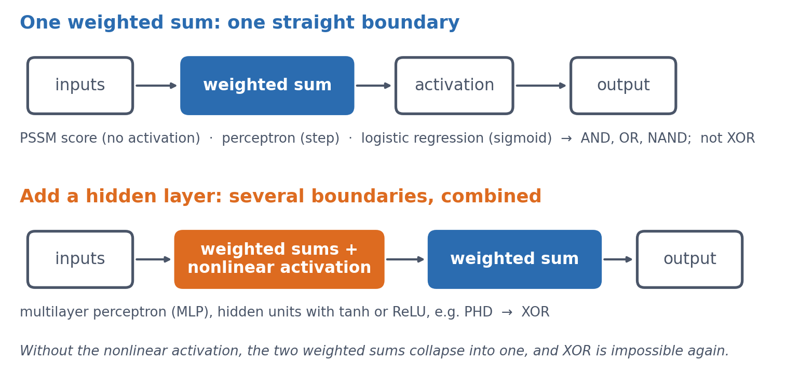

::: callout-note
**Sources for this page:** d2l.ai, *Dive into Deep Learning*, [Linear Neural Networks for Regression](https://d2l.ai/chapter_linear-regression/index.html) — CC BY-SA 4.0; Wikipedia, [Perceptron](https://en.wikipedia.org/wiki/Perceptron), [*Perceptrons* (book)](https://en.wikipedia.org/wiki/Perceptrons_(book)), [Gradient descent](https://en.wikipedia.org/wiki/Gradient_descent), [Linear separability](https://en.wikipedia.org/wiki/Linear_separability), [AI winter](https://en.wikipedia.org/wiki/AI_winter), [Backpropagation](https://en.wikipedia.org/wiki/Backpropagation), [Protein secondary structure](https://en.wikipedia.org/wiki/Protein_secondary_structure), [Alpha helix](https://en.wikipedia.org/wiki/Alpha_helix), [Beta sheet](https://en.wikipedia.org/wiki/Beta_sheet), and [Protein structure prediction](https://en.wikipedia.org/wiki/Protein_structure_prediction) — CC BY-SA 4.0; Bulyk, Johnson & Church (2002), *Nucleic Acids Research* 30(5):1255-1261, [PubMed](https://pubmed.ncbi.nlm.nih.gov/11861919/); Chou & Fasman (1974), *Biochemistry* 13(2):222-245, [PubMed](https://pubmed.ncbi.nlm.nih.gov/4358940/); Garnier, Osguthorpe & Robson (1978), *Journal of Molecular Biology* 120(1):97-120, [PubMed](https://pubmed.ncbi.nlm.nih.gov/642007/); Rost & Sander (1993), "Prediction of protein secondary structure at better than 70% accuracy," *Journal of Molecular Biology* 232:584-599. The brain/perceptron figure is Rosenblatt, F., "The Design of an Intelligent Automaton," *Research Reviews*, Office of Naval Research, October 1958, pp. 5-13 — public domain (US federal government work), via [Wikimedia Commons](https://commons.wikimedia.org/wiki/File:Organization_of_a_biological_brain_and_a_perceptron.png). The real secondary-structure counts for *HBB* below were fetched live from EBI's [PDBe API](https://www.ebi.ac.uk/pdbe/api/doc/) — CC BY 4.0 — see the notebook. The by-hand AND/OR/NAND perceptron weights, the closed-form vs. iterative linear-regression comparison, and the "solve XOR by engineering a feature" example below are mined for ideas from Magnus Ekman's *Learning Deep Learning* (slide decks `Chapter-1`, `Chapter-2`, `Appendix-A` in `slides/`) — a copyrighted, not openly-licensed textbook (the very one this course rebuild is replacing), credited here as an internal source the way Petras Kundrotas's own lecture decks are on other days, not linked as further reading. Every number below was independently recomputed and verified in code, not transcribed. Text below is written from scratch, not copied, following these ideas.
:::

# Session 7: Linear Models, Gradient Descent, the XOR Problem & Secondary Structure Prediction

::: {.callout-tip icon="false"}
## A fast learner

> **Interviewer**: What's your biggest strength?
>
> *Me*: I'm a fast learner
>
> **Interviewer**: What's $11*11$
>
> *Me*: 65
>
> **Interviewer**: Not even close. It's 121
>
> *Me*: It's 121
:::

Session 6 gave us structural properties that we would like to predict from sequence, with secondary structure first among them. This session starts building the mathematical machinery for doing that.

## Learning goals

By the end of this session you should be able to:

- explain that a profile score and a perceptron share the same mathematical core, a weighted sum (dot product), and how they differ;
- explain how a model's weights can be *learned* from labelled examples by gradient descent, rather than derived from alignment statistics;
- explain, with a real biological example, why some patterns cannot be captured by any linear model, and why a hidden layer only helps if its activation function is nonlinear;
- describe how Rost & Sander's PHD method (1993) combined profile input from multiple alignments with a neural network to predict secondary structure better than earlier methods;
- explain why a more powerful model cannot compensate for an input representation that lacks the relevant information.

## Two pictures to keep in mind

This session uses many names: profile score (PSSM), perceptron, linear and logistic regression, sigmoid, tanh, hidden layer, multilayer perceptron and PHD. Behind them there are only two pictures, and together these two pictures explain the whole idea of the lecture.

{#fig-session07-two-diagrams width="95%"}

Keep them in mind as you read. The goal of the session is to understand what changes between the two pictures, and why that change makes XOR possible.

## A profile score and a perceptron: the same weighted sum {#sec-s07-weighted-sum}

**You actually already know the central computation of a neural network.** Session 5 introduced the profile score, which checks how well a sequence matches a known family. It multiplies each position's observed value by a position-specific weight and adds up the results. In Session 1's terms, this is a dot product, something you learned on the first day. A **perceptron** has exactly the same mathematical core, because it also computes a weighted sum $z$:

$$
z = w_1 x_1 + w_2 x_2 + \dots + w_n x_n + b
$$

The extra term $b$, a **bias**, shifts the whole sum by a constant amount, so that the model's decision threshold can sit somewhere other than zero. The PSSM and the perceptron share this weighted sum, but they differ in what they do with it. A PSSM reports the sum itself as a *score*. A perceptron instead passes the sum through an **activation function**, originally a threshold (output 1 if $z > 0$, else 0), to make a *classification*. Keeping the two terms apart helps later on. "Profile score" means a linear score, and "perceptron" means a (thresholded) classifier that adds an activation function to the same weighted sum.

**Where the name comes from.** Frank Rosenblatt introduced the perceptron in 1958, first as a simulation on an IBM 704 computer, and the Mark I Perceptron machine followed in 1960. He modelled it on a simplified neuron. Each synapse weights its input, the cell sums the weighted inputs, and the cell fires once the sum crosses a threshold. The weights $w_i$ therefore stand for connection strengths, and $b$ for how easily the cell fires. His own diagram set the circuit of the brain next to the perceptron built to mirror it:

{#fig-session07-rosenblatt-brain-perceptron width="75%"}

Geometrically, $z = 0$ is a line in two dimensions (a plane, or hyperplane, in higher dimensions), and this line is the model's **decision boundary**. On one side of it the output is 1, and on the other side it is 0.

Solving $w_1 x_1 + w_2 x_2 + b = 0$ for $x_2$ gives $x_2 = -\frac{w_1}{w_2} x_1 - \frac{b}{w_2}$. This is the familiar $y = mx + c$ form of a line, with the bias $b$ playing the role of the intercept $c$ (scaled by $-1/w_2$). Changing $b$ therefore slides the whole line sideways without changing its slope. The intercept $b_0$ plays the same role in ordinary linear regression, as the next section shows.

### Further reading

- Wikipedia, [Perceptron](https://en.wikipedia.org/wiki/Perceptron) — other activation functions and the original biological motivation, beyond the general-purpose version above

### Further watching

[*But what is a neural network?*](https://www.youtube.com/watch?v=aircAruvnKk) (3Blue1Brown, Deep Learning ch. 1), animating what a weighted sum + activation is doing:

```{=html}
<div style="position:relative;padding-bottom:56.25%;height:0;overflow:hidden;max-width:100%;margin-bottom:1em;">
<iframe src="https://www.youtube.com/embed/aircAruvnKk" style="position:absolute;top:0;left:0;width:100%;height:100%;border:0;" allowfullscreen title="But what is a neural network?, 3Blue1Brown"></iframe>
</div>
```

## Learning the weights from examples {#sec-s07-learning}

So far the weights have simply been given. A profile's weights come from counting: we look at a multiple alignment, count how often each residue appears at each position, and turn those counts into log-odds scores. This works well when we already have a trustworthy alignment to count from. As Session 5 showed, small alignments need some extra tricks (pseudocounts), but that is still counting, only with some modifications.

The alternative to **counting**, and the one the rest of this course builds on, is to **learn** the weights directly from labelled examples with an optimisation method, normally gradient descent as described in Session 1. We often start with arbitrary (random) weights and measure how wrong the model's current predictions are with a *loss function*. We then compute the gradient of that loss with respect to each weight, and nudge every weight a small step in the direction that reduces the loss. This is repeated many times. No alignment and no hand-counting are needed, only examples and many small corrections. This is the foundation of all machine learning: we do not tell the computer what to do, but let it **learn** what to do.

In this session's lab, the code works directly with raw tensors and automatic differentiation (Session 2). It deliberately avoids the higher-level `nn.Module` and training-loop tools that Session 8 introduces, because the point here is to see every step of the mechanics rather than to use a convenient shortcut around them.

**Worked example.** Take a perceptron with one input and no bias yet ($z = wx$), an initial weight $w_0 = 0$, a training example $(x, y) = (2, 6)$, a squared-error loss $L(w) = (wx - y)^2$, and a learning rate $\eta = 0.05$. Session 1's chain rule gives

$$
\frac{dL}{dw} = 2(wx - y) \cdot x
$$

The table shows the first iterations of gradient descent, $w_{n+1} = w_n - \eta \, dL/dw$:

| $n$ | $w_n$ | prediction $w_n x$ | $dL/dw$ | $w_{n+1} = w_n - 0.05 \, dL/dw$ |
|---------------|---------------|---------------|---------------|---------------|
| 0 | 0.00 | 0.00 | $2(0-6)(2) = -24.0$ | 0.00 − 0.05 × (−24.0) = 1.20 |
| 1 | 1.20 | 2.40 | $2(2.4-6)(2) = -14.4$ | 1.20 − 0.05 × (−14.4) = 1.92 |
| 2 | 1.92 | 3.84 | $2(3.84-6)(2) = -8.64$ | 1.92 − 0.05 × (−8.64) = 2.35 |

: The first iterations of gradient descent with learning rate $\eta = 0.05$. {#tbl-s07-gradient-descent}

The weight converges towards $w = 3$, where the prediction $wx = 3 \times 2 = 6$ would exactly match the target. Just as in Session 1's one-variable example, the size of each correction ($dL/dw$) shrinks by itself as the prediction gets closer, so $\eta$ needs no manual adjustment. This holds only as long as the learning rate is not too large. With an excessive learning rate, gradient descent overshoots the minimum and can oscillate or diverge (Session 1's second discussion problem).

**Deriving vs. learning, on the simplest possible model.** Ordinary linear regression, which fits a line $\hat y = b_0 + b_1 x$ to data, has a direct numerical solution. It therefore makes a useful check, because gradient descent should reach the same optimum iteratively. Take five noisy points roughly following $y \approx 2x$, with $x = (1,2,3,4,5)$ and $y = (2.1, 3.9, 6.2, 7.8, 10.1)$. A least-squares solver gives $b_0 = 0.05$ and $b_1 = 1.99$ in one step, and gradient descent (learning rate $\eta = 0.01$, thousands of small steps) converges to the same $b_0 = 0.050$ and $b_1 = 1.990$.

This mirrors the contrast between Session 5's PSSM, whose weights are *derived* directly from alignment counts, and this session's gradient descent, whose weights are *learned* iteratively. Gradient descent is what the rest of the course uses, because most models, including a perceptron with its classification loss, have no direct solution.

::: {.callout-note collapse="true"}
## Optional: the formula

The least-squares solution can be written with the **normal equations**. We stack the inputs into a matrix $X$, with a column of 1s for $b_0$ next to the $x$ values. Then

$$
\hat{\beta} = (X^\top X)^{-1} X^\top \mathbf{y}
$$

This formula is a way to *write* the solution, not a way to compute it, because numerical libraries (`np.linalg.lstsq`, scikit-learn) use more stable methods than inverting $X^\top X$. Moreover, when the columns of $X$ are exactly linearly dependent, $X^\top X$ cannot be inverted at all. This session's lab comes close to that case. The 20 amino-acid fractions of a protein sum to 1 (for 54 of its 55 proteins, since one contains unknown residues), so together with the intercept column they are almost exactly linearly dependent. A least-squares solver still finds a best fit, but the individual weights are poorly determined.
:::

### Further reading

- Wikipedia, [Gradient descent](https://en.wikipedia.org/wiki/Gradient_descent) — variants (stochastic gradient descent, momentum, Adam) are introduced in Session 9, where we train real networks

### Further watching

[*Gradient descent, how neural networks learn*](https://www.youtube.com/watch?v=IHZwWFHWa-w) (3Blue1Brown, Deep Learning ch. 2):

```{=html}
<div style="position:relative;padding-bottom:56.25%;height:0;overflow:hidden;max-width:100%;margin-bottom:1em;">
<iframe src="https://www.youtube.com/embed/IHZwWFHWa-w" style="position:absolute;top:0;left:0;width:100%;height:100%;border:0;" allowfullscreen title="Gradient descent, how neural networks learn, 3Blue1Brown"></iframe>
</div>
```

## What one weighted sum can represent {#sec-s07-represent}

Before asking what a perceptron cannot do, it helps to see what it can do. A single perceptron with a step activation (output 1 if $z > 0$, else 0) can implement basic logic gates directly. No training is required, only weights chosen by hand:

| Gate | $w_1$ | $w_2$ | $b$  |
|------|-------|-------|------|
| AND  | 1     | 1     | −1.5 |
| OR   | 1     | 1     | −0.5 |
| NAND | −1    | −1    | 1.5  |

: Perceptron weights, chosen by hand, that implement three logic gates. {#tbl-s07-gates}

Take AND as an example. At $(1,1)$, $z = 1+1-1.5 = 0.5 > 0 \to 1$, and at every other corner $z \le -0.5 \to 0$, which is exactly the truth table of AND. (NAND is AND with both weights and the bias negated, which flips every output.) In the notebook, all three gates check out exactly against their truth tables.

Each gate is one straight decision boundary through the square of four inputs, with the "1" corners on one side and the "0" corners on the other. For AND, only $(1,1)$ lies on the positive side of the line $x_1 + x_2 = 1.5$. The second discussion problem asks you to find weights for OR yourself.

This is easiest to see if we draw the four inputs as dots on a plane and the decision boundary $z = 0$ as a line between them. The step activation then simply asks on which side of the line a dot lies:

{#fig-session07-gates width="100%"}

::: {.callout-tip icon="false"}
## In the course notebook

[Section 3 of the course notebook](notebooks/session07-gradient-descent-xor.ipynb#what-one-weighted-sum-can-do) ([open in Colab](https://colab.research.google.com/github/ElofssonLab/kb8029-book/blob/main/notebooks/session07-gradient-descent-xor.ipynb)) computes $z$ and the output for all four corners of all three gates with exactly these weights, and draws this figure.
:::

## What one weighted sum can never represent: XOR {#sec-s07-xor}

A model built purely from weighted sums has a real limitation, because there is a whole class of patterns it can never represent, however its weights are chosen. The classic illustration is the **XOR problem**. XOR is a function of two binary inputs that outputs `1` when its inputs *differ* and `0` when they are the *same*.

| $x_1$ | $x_2$ | XOR |
|-------|-------|-----|
| 0     | 0     | 0   |
| 0     | 1     | 1   |
| 1     | 0     | 1   |
| 1     | 1     | 0   |

: The XOR function. {#tbl-s07-xor}

**Before reading on, try it:** find weights $w_1, w_2, b$ that reproduce this table with one perceptron. You will not succeed. The two "1" outputs sit on opposite corners of the input square, and no straight line can put both of them on one side while leaving both "0" outputs on the other. [Section 4 of the notebook](notebooks/session07-gradient-descent-xor.ipynb#what-it-can-never-do-xor) tries 226,981 combinations of $w_1$, $w_2$ and $b$ (every value from −3 to 3 in steps of 0.1). About 5,000 of them reproduce AND, 9,500 OR and 4,500 NAND, but not one reproduces XOR.

{#fig-session07-xor-boundary width="95%"}

::: {.callout-note collapse="true"}
## Optional: the algebraic proof

The geometric argument can be turned into a short proof. A perceptron with a sign-style activation outputs 1 when $z = w_1 x_1 + w_2 x_2 + b > 0$ and 0 otherwise. Reproducing the XOR table therefore requires all four of the following inequalities:

$$
b \le 0, \qquad w_1 + b > 0, \qquad w_2 + b > 0, \qquad w_1 + w_2 + b \le 0
$$

The first and last inequalities come from the two "0" rows, and the middle two from the "1" rows. Adding the second and third inequalities gives $w_1 + w_2 + 2b > 0$, that is, $w_1 + w_2 + b > -b \ge 0$ (using $b \le 0$ from the first inequality). The fourth inequality, however, says directly that $w_1 + w_2 + b \le 0$. No values of $w_1$, $w_2$ and $b$ can satisfy both at once, so no such weights exist. This is the same fact that the geometric picture showed, derived without drawing anything.
:::

### Further reading

- Wikipedia, [Linear separability](https://en.wikipedia.org/wiki/Linear_separability) — generalises the geometric argument above beyond the two-input case shown here

## Why a hidden layer helps {#sec-s07-hidden}

One perceptron draws one line, but XOR needs two. Combining perceptrons therefore goes further than any single one can. If **OR** and **NAND** are computed separately from the same two inputs and then fed as the two inputs to an **AND** perceptron, the result reproduces **XOR** exactly:

| $x_1$ | $x_2$ | OR  | NAND | AND(OR, NAND) | XOR |
|-------|-------|-----|------|---------------|-----|
| 0     | 0     | 0   | 1    | 0             | 0   |
| 0     | 1     | 1   | 1    | 1             | 1   |
| 1     | 0     | 1   | 1    | 1             | 1   |
| 1     | 1     | 1   | 0    | 0             | 0   |

: XOR built from OR, NAND and AND. {#tbl-s07-xor-from-gates}

Drawn as a network, this is a **two-layer perceptron**, with two inputs, a hidden layer of two units and one output unit. Every arrow carries a weight, and every unit adds its bias and applies the step activation:

{#fig-session07-network width="80%"}

**Step by step.** For each input, we first compute the two hidden units, and then the output unit from their outputs:

| $x_1$ | $x_2$ | $z_{h_1} = x_1 + x_2 - 0.5$ | $h_1$ | $z_{h_2} = -x_1 - x_2 + 1.5$ | $h_2$ | $z_y = h_1 + h_2 - 1.5$ | $y$ |
|---------|---------|---------|---------|---------|---------|---------|---------|
| 0 | 0 | −0.5 | 0 | +1.5 | 1 | −0.5 | **0** |
| 0 | 1 | +0.5 | 1 | +0.5 | 1 | +0.5 | **1** |
| 1 | 0 | +0.5 | 1 | +0.5 | 1 | +0.5 | **1** |
| 1 | 1 | +1.5 | 1 | −0.5 | 0 | −0.5 | **0** |

: The two-layer perceptron for XOR, computed step by step. {#tbl-s07-xor-network}

The last column is XOR. Take $(1,1)$ as an example. Both inputs are on, so the OR unit fires ($z = 1.5$), but the NAND unit does not ($z = -0.5$). The output unit then sees $h_1 + h_2 = 1$, and since $1 - 1.5 < 0$, $y = 0$. Only the two mixed inputs switch on *both* hidden units, and only then does the AND unit fire.

The same calculation can be written in matrix form for all four inputs at once, with the inputs as the rows of $X$ and one column of $W_1$ per hidden unit:

$$
H = \text{step}(X W_1 + \mathbf{b}_1), \qquad
W_1 = \begin{pmatrix} 1 & -1 \\ 1 & -1 \end{pmatrix}, \quad
\mathbf{b}_1 = (-0.5,\ 1.5)
$$

$$
\mathbf{y} = \text{step}(H W_2 + b_2), \qquad
W_2 = \begin{pmatrix} 1 \\ 1 \end{pmatrix}, \quad b_2 = -1.5
$$

[Section 5 of the notebook](notebooks/session07-gradient-descent-xor.ipynb#why-a-hidden-layer-helps) does exactly this in PyTorch and prints every intermediate value, and the result is the table above.

The two perceptrons computing OR and NAND form a **hidden layer**, and the third perceptron, which combines their outputs, gives the model's final output. The notebook's hidden-layer network has the same shape (two hidden units feeding one output unit), but it finds its weights by gradient descent rather than by hand. Seeing both, an exact hand-built solution here and a learned approximate one later, makes clear that gradient descent is not discovering some exotic new trick. It finds weights for a structure that could, in principle, be written down directly.

### The activation must be nonlinear

The construction above works only because each unit applies a **nonlinear** activation (here a step) before its output is passed on. Without one, stacking layers gains nothing. To see why, we write the hidden layer as $\mathbf{h} = W_1 \mathbf{x} + \mathbf{b}_1$ and the output as $z = W_2 \mathbf{h} + b_2$, with no activation. Then

$$
z = W_2 (W_1 \mathbf{x} + \mathbf{b}_1) + b_2 = (W_2 W_1)\,\mathbf{x} + (W_2 \mathbf{b}_1 + b_2)
$$

which is again a single weighted sum of the inputs, with one matrix $W_2 W_1$ and one bias. Any number of linear layers therefore collapses into one linear layer, and one linear layer cannot solve XOR. A nonlinear activation between the layers (a step, sigmoid, tanh or ReLU) is what lets the hidden units bend the decision boundary. The notebook shows this directly. The same two-hidden-unit network, trained on XOR with the activation removed, gets stuck at 0.5 for every input, just like the plain linear model.

**Keeping track of shapes.** The table follows the shapes in the notebook's network for XOR, with the four input rows stacked into one matrix (Session 1's shape rules):

|   | Shape |   |
|------------------------|------------------------|------------------------|
| inputs $X$ | $(4, 2)$ | four examples, two inputs each |
| weights $W_1$ | $(2, 2)$ | two inputs → two hidden units |
| hidden layer $h = \tanh(X W_1 + \mathbf{b}_1)$ | $(4, 2)$ | two hidden values per example |
| weights $W_2$ | $(2, 1)$ | two hidden units → one output |
| output $y = \sigma(h W_2 + b_2)$ | $(4, 1)$ | one prediction per example |

: The shapes of the matrices in the notebook's network for XOR. {#tbl-s07-shapes}

If you can follow these shapes, the training loop in the notebook is simply this table written in code.

::: {.callout-tip icon="false"}
## A short history

Minsky and Papert's book *Perceptrons* (1969) proved rigorously that single-layer perceptrons cannot solve problems like XOR. It is widely credited with contributing to a drop in neural-network research in the 1970s, the first "AI winter". Multi-layer networks were known to be more powerful, but training them became practical only with **backpropagation** (popularised by Rumelhart, Hinton & Williams in 1986), which applies Session 1's chain rule through the hidden layers. Session 9 covers it.
:::

## Biological analogues {#sec-s07-analogues}

### Interactions between positions: Bulyk et al.

XOR is not just a toy puzzle about logic gates, because the same structure shows up in real sequence motifs. Bulyk, Johnson & Church (2002) used protein-binding microarrays to measure how the binding affinity of a zinc-finger transcription factor depended on the nucleotides at different positions of its binding site. They found that the positions do **not** contribute independently, since the effect of the nucleotide at one position depends on what is at another position. This directly violates the assumption behind a profile score, namely that the contribution of each position can simply be added to the others. They measured the zinc-finger protein Zif268 (mouse Egr1) and mutants of it binding to all 64 possible central triplets of its site, and concluded that neither a consensus sequence nor a position weight matrix describes the protein's true specificity.

![(a) What a binding-site description normally looks like: the sequence logo of Egr1 (Zif268) sites in the human genome, from ChIP-seq peaks (JASPAR MA0162.4, CC BY 4.0), with the familiar GCG TGG GCG core. A logo, like a profile, describes each position on its own. (b) The logo of the strong sites of the XOR-shaped toy motif below is completely flat: each position, taken alone, carries 0 bits. (c) Yet the *pair* of positions decides binding completely. A logo or a profile cannot show this; a hidden layer can learn it. Drawn by tools/builders/make_session07_figures.py.](figs/session07-bulyk.png){#fig-session07-bulyk width="100%"}

To see why this kind of dependency is an XOR-shaped problem, consider a deliberately simplified, illustrative version. It is not the actual data from the paper, which involve more positions and continuous binding affinities, but it has the same qualitative shape. Suppose a two-position motif binds strongly only when the two positions belong to **different** purine/pyrimidine classes (one R, one Y), and weakly when they belong to the **same** class:

| Position 1 | Position 2 | Binding |
|------------|------------|---------|
| Y          | Y          | weak    |
| Y          | R          | strong  |
| R          | Y          | strong  |
| R          | R          | weak    |

: Binding strength depending on the purine/pyrimidine classes of two positions. {#tbl-s07-binding}

If we relabel "weak" as 0 and "strong" as 1, this is the XOR table above. Neither position predicts binding on its own, and only their combination does. This is exactly what no profile score, and no single perceptron, can represent. A hidden layer with a nonlinear activation (@sec-s07-hidden), in contrast, can represent such an interaction.

**A different fix: change the input.** A hidden layer is not the only way to solve XOR. For 0/1-valued $x_1, x_2$, it happens that

$$
\text{XOR}(x_1, x_2) = x_1 + x_2 - 2\,x_1 x_2
$$

holds exactly (check all four rows: $(0,0) \to 0$, $(0,1) \to 1$, $(1,0) \to 1$, $(1,1) \to 1+1-2 = 0$). The right-hand side is *linear* in three inputs: $x_1$, $x_2$, and the hand-engineered feature $x_1 x_2$. Adding this one extra, human-chosen feature therefore turns an unsolvable problem into an exactly solvable linear regression, with weights $(1, 1, -2)$ and bias $0$. This is a real, older alternative to a hidden layer, and it works. It only works, however, if someone has noticed in advance that $x_1 x_2$ is the interaction that matters. For Bulyk et al.'s real binding-site data, or for the secondary-structure problem below, nobody knows the useful interaction terms in advance. The advantage of a hidden layer is that it *learns* useful nonlinear features like this from data, instead of requiring someone to engineer them. The engineered feature also makes a point of its own. Changing the *input representation*, not the model, turned an impossible problem into an easy one (@sec-s07-representation).

### Secondary structure prediction: PHD

Bulyk et al.'s zinc-finger microarrays make the XOR-shaped limitation concrete on a small, hand-built example. Secondary structure prediction, a much larger real problem, illustrates the same general limitation of additive, position-by-position scores. It also shows how better input and a more flexible model moved past that limitation. (XOR itself is not a historical explanation of the plateau described below, but a clean example of the kind of limitation involved.)

**What secondary structure is.** A protein's *secondary structure* is the local, repeating shape into which its backbone folds, short of the full 3D fold (its *tertiary* structure), as Session 6 showed in PyMOL. Two patterns dominate. The **alpha helix** is a right-handed coil held together by hydrogen bonds between backbone atoms four residues apart. The **beta sheet** is made of extended strands lying alongside each other and hydrogen-bonded edge to edge. Everything else is usually called **coil** (or loop/turn). Predicting secondary structure therefore means labelling every residue in a sequence with one of these three classes. This is a per-residue classification problem rather than a single yes/no like XOR, but it is built from the same kind of position-by-position scoring that this course has used throughout.

**Two classical methods, before neural networks entered the picture.** The first real attempts predate neural networks by decades. **Chou & Fasman (1974)** derived empirical propensities for helix, sheet and turn from the (then small) set of known structures. Alanine, glutamate, leucine and methionine, for example, are strong helix-formers, while proline and glycine are helix-breakers. The method combined these propensities with rules. It first finds short *nucleation* regions of high-propensity residues and then *extends* them along the chain until breakers stop them. It is therefore a propensity- and rule-based method, not a simple one-residue-at-a-time classifier, and it reached roughly **50-60%** three-state accuracy. **Garnier, Osguthorpe & Robson (1978)**, the **GOR** method, scored each residue with an information-theoretic sum of contributions from a whole *window* of neighbours. It reached roughly **65%** and was better at helices than at sheets. Neither method is literally a perceptron, but both build their score mostly by adding up per-residue contributions, and this is where the limitation lies.

GOR in particular is a linear model in the sense of Sections [-@sec-s07-weighted-sum]–[-@sec-s07-represent]. To label a residue, it looks at a window of 17 residues centred on it. For each offset in the window, it looks up in a table how much the amino acid at that offset favours helix, strand or coil, and it adds up these values. Each state thus gets a score, and the largest score wins. This amounts to three position-specific scoring matrices, one per state, read off the same window. GOR is therefore three weighted sums, with one straight boundary between each pair of states.

{#fig-session07-gor width="100%"}

{#fig-session07-ss-accuracy-history width="75%"}

**Why a single sequence is not enough.** A window of neighbours is still only local information, and local sequence does not determine local structure. Kabsch & Sander (1984) searched the 62 protein structures then known and found identical five-residue stretches that were part of a helix in one protein and of a strand in another. With today's PDB, the effect extends to stretches of ten residues. These **chameleon sequences** (Li et al. 2015, ChSeq database) adopt different secondary structures depending on the protein around them.

![The same ten residues, QGTAVVVSAA, in two unrelated proteins: part of a long helix in a malate oxidoreductase from *Thermotoga maritima* (PDB 1VL6) and a strand followed by coil in a human antibody heavy chain (PDB 4JB9). Positions are counted along each chain's sequence (1VL6: 164-183, 4JB9: 118-137); in the PDB files' own numbering these are residues 152-171 of 1VL6 and, in antibody numbering, 100F-119 of 4JB9. The secondary structure of each residue is taken from the PDB entries (via PDBe). No method that sees only this window can label both correctly. Example from Li et al. (2015).](figs/session07-chameleon.png){#fig-session07-chameleon width="100%"}

Even a better model did not overcome this. Qian & Sejnowski (1988, *J Mol Biol* 202:865) trained a network with a hidden layer on windows of single sequences and reached **64.3%**. They concluded that "no method based solely on local information in the protein sequence is likely to produce significantly better results for non-homologous proteins". The limit was the information in the input, not only the model.

**Turning a sequence into numbers: one-hot encoding.** Before a network can read a sequence, the sequence has to be turned into numbers, because a network computes weighted sums. The obvious idea, numbering the amino acids A = 1, C = 2, D = 3, ..., does not work. It tells the model that C lies between A and D, and that Y (20) is twenty times "more" than A, which means nothing biologically. Instead, each residue becomes **20 numbers**, all 0 except for a single 1 in the column of that amino acid:

$$
\text{A} \to (1, 0, 0, \dots, 0), \qquad \text{C} \to (0, 1, 0, \dots, 0), \qquad \dots, \qquad \text{Y} \to (0, 0, \dots, 0, 1)
$$

Every amino acid is then equally different from every other, and the network learns its own weight for each amino acid at each position. A window of 13 residues becomes $13 \times 20 = 260$ input numbers. This is how Qian & Sejnowski's network read single sequences, and it is also the encoding of the localisation data in Session 8 (150 residues, 3000 numbers). For DNA, the same idea gives 4 numbers per base.

{#fig-session07-onehot width="100%"}

One-hot encoding is not the only choice. A residue can also be described by a few **physicochemical properties** (hydrophobicity, charge, size), which is compact and lets similar residues look similar. It can be described by its row of a **substitution matrix** such as BLOSUM62 (Session 4), or, as PHD does below, by a **profile** of its homologs. Later in the course, the network learns the representation itself. An **embedding layer** (`nn.Embedding` in PyTorch, used by the recurrent networks of Session 11) gives each amino acid a short vector of trainable numbers. This is exactly a linear layer applied to the one-hot vector, since multiplying a one-hot vector by a weight matrix simply picks out one row. Protein language models (Session 11) go one step further and give each residue a vector that also depends on its context in the sequence.

**What changed with PHD: *the use of evolutionary information*.** The key innovation of Rost & Sander's **PHD** (1993) was its input. In their words, "a new key aspect is the use of evolutionary information in the form of multiple sequence alignments that are used as input in place of single sequences." For each position of the window, the network sees a *profile* (Session 5) instead of a one-hot vector, that is, the frequencies of the 20 amino acids at that position among the protein's homologs (the right panel of the figure above). This helps because homologs can retain similar structures even when their sequences have diverged substantially. A common expression is that *structure is more conserved than sequence*, and Illergård, Ardell & Elofsson (2009) quantified it: the structural cores of proteins evolve three to ten times more slowly than their sequences. Where a chameleon stretch sits in a helix, its homologs tend to vary it in the ways that helices tolerate, and where it sits in a strand, in the ways that strands tolerate. The profile can therefore show a difference that the single sequence hides. This family information alone added "six to eight percentage points", and the full method reached **70.8%** three-state accuracy. Profile-based predictors also label chameleon sequences better than single-sequence ones (Li et al. 2015).

PHD combined this input with networks at **three levels**:

![PHD's design. Level 1, a sequence-to-structure network with one hidden layer, reads a window of 13 residues, each described by its 20 profile frequencies from the multiple alignment, and outputs helix (H), strand (E) and loop (L) values for the middle residue. Level 2, a structure-to-structure network, reads the level-1 outputs for a window of 17 residues and learns that helices and strands come in segments of plausible lengths. Level 3, a jury, averages several such networks trained in different ways. PHD also reports how reliable each residue's prediction is. The alignment and profile shown are schematic.](figs/session07-phd.png){#fig-session07-phd width="100%"}

Each level is a network of the kind described in @sec-s07-hidden, only larger: weighted sums, a nonlinear activation, and more weighted sums. The lesson therefore combines both halves of this session. A better representation of the input (profiles) and a model flexible enough to use it (networks with hidden layers) together achieved what additive scores on single sequences could not. Session 9 returns to PHD once you can train such networks yourself.

**What a per-residue predictor has to do: *HBB*.** To see what such a predictor must produce, take beta-globin (*HBB*), this course's running example. In the crystal structure of human haemoglobin (PDB entry `2HHB`), every residue of its chain has a label, either helix (H) or coil (C), and there are no strands.

{#fig-session07-hbb-structure width="60%"}

A secondary-structure predictor has to produce that whole string from the sequence. PHD-style methods label one residue at a time, from a *window* of its neighbours:

{#fig-session07-hbb-two-views width="100%"}

The top view keeps what matters for the label: which residues are neighbours, in what order, and where helices start and stop (five of HBB's helices begin at a proline). A single sequence in that window gave Qian and Sejnowski their 64%, and PHD replaced each position of the window by a profile of its homologs (Session 5). The bottom view is what this session's lab uses. *HBB* becomes 20 numbers, and the question becomes "what fraction is helix?" (0.80, 117 of its 146 residues). Everything in the top view that is not a count has been thrown away. Keep both views in mind for the lab.

::: {.callout-important icon="false"}
## Can you do better?

PHD reached about 71% in 1993, a significant improvement over earlier methods. Modern methods that combine profiles or protein language models with deep networks, however, reach substantially higher accuracy on standard benchmarks. In the [capstone project](capstone.qmd) you build your own secondary-structure predictor with the tools of this course. Which input will you give it (a single sequence, a profile, an embedding), which model will you use, and how will you know that it really predicts proteins it has never seen?
:::

### Further reading

- Wikipedia, [Protein secondary structure](https://en.wikipedia.org/wiki/Protein_secondary_structure), [Alpha helix](https://en.wikipedia.org/wiki/Alpha_helix), [Beta sheet](https://en.wikipedia.org/wiki/Beta_sheet), and [Protein structure prediction](https://en.wikipedia.org/wiki/Protein_structure_prediction) — the accuracy figures above
- Chou & Fasman (1974), "Prediction of protein conformation," *Biochemistry* 13(2):222-245 — [PubMed](https://pubmed.ncbi.nlm.nih.gov/4358940/)
- Garnier, Osguthorpe & Robson (1978), "Analysis of the accuracy and implications of simple methods for predicting the secondary structure of globular proteins," *Journal of Molecular Biology* 120(1):97-120 — [PubMed](https://pubmed.ncbi.nlm.nih.gov/642007/)
- Rost & Sander (1993), *Journal of Molecular Biology* 232:584-599 — the original PHD paper
- Illergård, Ardell & Elofsson (2009), "Structure is three to ten times more conserved than sequence — a study of structural response in protein cores," *Proteins* 77(3):499-508 — [doi:10.1002/prot.22458](https://doi.org/10.1002/prot.22458)
- Li, Kinch, Karplus & Grishin (2015), "ChSeq: A database of chameleon sequences," *Protein Science* 24(7):1075-1086 — [doi:10.1002/pro.2689](https://doi.org/10.1002/pro.2689)
- Kabsch & Sander (1984), "On the use of sequence homologies to predict protein structure: identical pentapeptides can have completely different conformations," *PNAS* 81(4):1075-1078 — [doi:10.1073/pnas.81.4.1075](https://doi.org/10.1073/pnas.81.4.1075)

## Representation matters as much as the model {#sec-s07-representation}

Three examples on this page make the same point, namely that the input representation limits what any model can learn:

- **XOR** becomes a linear problem once the input includes the feature $x_1 x_2$.
- **Secondary structure prediction** plateaued with single sequences, whatever the method, and improved when the input became a profile of homologous sequences.
- **This session's lab** predicts a protein's helix fraction from its 20 amino-acid frequencies. A linear model and a neural network come out essentially tied. Before you read the lab's explanation, it asks you what information the 20 numbers have thrown away that a per-residue prediction would need. Try to answer it yourself.

A more powerful model cannot recover information that is not in its input. What a model can learn is therefore set by how the data are represented, at least as much as by the model's capacity. This is one of the central lessons of modern deep learning, and Sessions 10 and 11 build models (convolutional networks, language models) that *learn* their own representations of sequences, including order and local context.

## Summary: the two pictures again

{#fig-session07-two-diagrams-2 width="95%"}

- **Top:** one weighted sum, then an activation. A PSSM reports the sum as a score, a perceptron thresholds it, and logistic regression passes it through a sigmoid. The weights can be learned from examples by gradient descent (@sec-s07-learning). Whatever the weights, the model draws one straight boundary, so it can represent AND, OR and NAND, but never XOR (Sections [-@sec-s07-represent]–[-@sec-s07-xor]).
- **Bottom:** a hidden layer of weighted sums with a nonlinear activation, then one more weighted sum. Each hidden unit draws its own boundary, and the output combines them, so XOR becomes possible (@sec-s07-hidden). Remove the nonlinear activation and the two layers collapse back into the top picture.
- **Either picture** can only use the information in its input (Sections [-@sec-s07-analogues]–[-@sec-s07-representation]).

If you can explain what changes between the two pictures, and why that change allows XOR, you have understood this session. You do not need to be able to write the PyTorch training loop from memory.

## Check your understanding

The questions below give immediate feedback and cover the sections above. They are in the same style as the course's live in-class peer-instruction quizzes, and the full question bank is in `quizzes/session07.md` in the repository.

```{=html}
<div id="session07-quiz"></div>
<script>
renderQuiz("session07-quiz", [
  {
    question: "In a perceptron's weighted sum z = w&#8321;x&#8321; + ... + w&#8345;x&#8345; + b, what does the bias term b let the model do?",
    choices: [
      "Let the decision threshold sit somewhere other than zero, instead of being forced through the origin",
      "Scale the learning rate up or down during training",
      "Act as the activation function itself",
      "Set a hard upper limit on how large z can get"
    ],
    correctIndex: 0,
    explanation: "Without a bias, the decision boundary is forced through the origin no matter how the other weights are chosen."
  },
  {
    question: "A perceptron has one input, no bias (z = wx), an initial weight w&#8320; = 0, a training example (x, y) = (3, 9), a squared-error loss L(w) = (wx - y)&sup2;, and a learning rate &eta; = 0.02. Using dL/dw = 2(wx - y)x, what is w&#8321; after one gradient descent step?",
    choices: ["1.08", "0.54", "-1.08", "9.0"],
    correctIndex: 0,
    explanation: "At w=0: dL/dw = 2(0-9)(3) = -54, so w&#8321; = 0 - 0.02&times;(-54) = 1.08."
  },
  {
    question: "Geometrically, why can no single perceptron represent the XOR function?",
    choices: [
      "XOR's two \"1\" outputs sit on opposite corners of the input square, and no single straight line can separate both of them from both \"0\" outputs",
      "XOR requires three or more inputs to even be defined",
      "A perceptron's sign activation function can only ever output positive numbers",
      "XOR's inputs and outputs are not integers"
    ],
    correctIndex: 0,
    explanation: "This is why XOR is called not linearly separable."
  },
  {
    question: "Bulyk, Johnson &amp; Church's protein-binding microarray study found something about a zinc-finger transcription factor's binding site that directly violates the assumption behind a simple profile/perceptron score. What was it?",
    choices: [
      "Binding-site positions do not contribute independently &mdash; the effect of one position's identity depends on what's at another position",
      "Transcription factors never bind DNA in a sequence-specific way",
      "All positions in a binding site contribute exactly equally to binding",
      "Binding affinity is unrelated to the nucleotide sequence"
    ],
    correctIndex: 0,
    explanation: "A profile/perceptron score assumes each position's contribution simply adds to the others &mdash; this finding is the XOR-shaped exception to that assumption."
  },
  {
    question: "A network has a hidden layer, but no activation function: h = W1 x + b1, then z = W2 h + b2. Can it solve XOR?",
    choices: [
      "No: W2(W1 x + b1) + b2 = (W2 W1) x + (W2 b1 + b2) is again a single linear function of x",
      "Yes: any hidden layer is enough to solve XOR",
      "Yes, if the hidden layer has at least 100 units",
      "Only if trained for long enough"
    ],
    correctIndex: 0,
    explanation: "Linear layers collapse into one linear layer. A nonlinear activation (step, sigmoid, tanh, ReLU) between the layers is what lets a hidden layer bend the decision boundary."
  },
  {
    question: "What later development made it practical to train multi-layer networks, resolving the XOR limitation Minsky and Papert identified?",
    choices: [
      "Backpropagation &mdash; an efficient way to apply the chain rule through a network with hidden layers",
      "A new activation function that only single perceptrons could use",
      "Increasing the bias term to a very large fixed value",
      "Removing the sign function from the perceptron entirely"
    ],
    correctIndex: 0,
    explanation: "Backpropagation, popularised by Rumelhart, Hinton &amp; Williams in 1986, is Session 1's chain rule applied through a network with hidden layers."
  },
  {
    question: "Methods that predicted secondary structure from single sequences, including an early neural network (Qian &amp; Sejnowski 1988, 64.3%), stayed around 60-65% three-state accuracy. What did Rost &amp; Sander's PHD method (1993) change to reach about 71%?",
    choices: [
      "Profile input (a multiple-alignment-derived representation, not a single sequence) together with a neural network that has a hidden layer",
      "A much larger single-sequence database, with no change to the linear scoring model",
      "Removing the bias term from the perceptron entirely",
      "Switching from BLOSUM62 to PAM250 as the scoring matrix"
    ],
    correctIndex: 0,
    explanation: "The family information from multiple alignments added six to eight percentage points (Rost &amp; Sander's abstract). Qian &amp; Sejnowski had already concluded that local information from a single sequence limits any method: the input mattered as much as the model."
  },
  {
    question: "Which description of Chou-Fasman (1974) and GOR (1978) is most accurate?",
    choices: [
      "Chou-Fasman combines residue propensities with nucleation and extension rules; GOR sums information from a window of neighbouring residues. Both build scores mostly from per-residue contributions, from single sequences",
      "Both are neural networks with a hidden layer, smaller than PHD's",
      "Both ignore the protein sequence and use only structural data",
      "Chou-Fasman classifies each residue independently from its own propensity alone"
    ],
    correctIndex: 0,
    explanation: "Chou-Fasman is a propensity- and rule-based method, not a one-residue-at-a-time classifier. Neither method uses information from homologous sequences, which is what PHD added."
  },
  {
    question: "The Session 7 lab describes HBB by its amino-acid composition (20 numbers) and predicts its helix fraction, 0.80. What can such a model never tell you?",
    choices: [
      "Which residues are in helices, and where each helix starts and stops",
      "Whether HBB is mostly helical",
      "How many alanines HBB contains",
      "Anything at all about HBB"
    ],
    correctIndex: 0,
    explanation: "Composition keeps only counts, so it can predict an overall fraction but not the per-residue labels. A per-residue predictor such as PHD reads a window of neighbours around each residue instead."
  },
  {
    question: "A single perceptron can implement AND, OR, and NAND by hand-chosen weights. What does combining an OR perceptron and a NAND perceptron, then feeding both outputs into an AND perceptron, compute?",
    choices: [
      "XOR, exactly — this is a hand-built version of the same hidden-layer shape used later in the notebook",
      "AND, since the final perceptron is an AND gate",
      "Nothing meaningful; the outputs of OR and NAND cannot be combined",
      "NOR"
    ],
    correctIndex: 0,
    explanation: "AND(OR(x&#8321;,x&#8322;), NAND(x&#8321;,x&#8322;)) reproduces XOR's truth table exactly on all four input pairs."
  },
  {
    question: "Adding the engineered feature x&#8321;x&#8322; alongside x&#8321; and x&#8322; lets an ordinary linear model solve XOR exactly, using weights (1, 1, -2) and bias 0. What's the real limitation of this fix compared to a hidden layer?",
    choices: [
      "A person has to notice in advance which interaction feature (like x&#8321;x&#8322;) to engineer, whereas a hidden layer learns useful features like this directly from data",
      "It doesn't actually reproduce XOR's truth table",
      "It only works for inputs other than 0 and 1",
      "It requires more training data than a hidden layer does"
    ],
    correctIndex: 0,
    explanation: "The linear-algebra is exact once you've chosen x&#8321;x&#8322; as a feature -- the catch is knowing to choose it, which for real data (Bulyk et al.'s binding sites, secondary structure) nobody knows in advance."
  },
  {
    question: "The OR perceptron has w = (1, 1) and b = -0.5. In the plane of the inputs, what is its decision boundary, and which corners lie on the side where the output is 1?",
    choices: [
      "The line x&#8321; + x&#8322; = 0.5; the corners (0,1), (1,0) and (1,1)",
      "The line x&#8321; + x&#8322; = 1.5; only the corner (1,1)",
      "The line x&#8321; = x&#8322;; the corners (0,0) and (1,1)",
      "There is no boundary: a perceptron outputs a score, not a class"
    ],
    correctIndex: 0,
    explanation: "The boundary is z = 0, i.e. x&#8321; + x&#8322; - 0.5 = 0. Only (0,0) gives z &lt; 0; the other three corners give z &gt; 0 and output 1."
  },
  {
    question: "Why is the GOR method, which sums a table value for each residue in a 17-residue window, called a linear model on this page?",
    choices: [
      "Each state's score is a weighted sum over the window, like a position-specific scoring matrix, so it cannot represent interactions between positions",
      "It predicts only straight (linear) stretches of helix",
      "It uses linear regression to fit the helix fraction",
      "It reads the sequence in a straight line from N- to C-terminus"
    ],
    correctIndex: 0,
    explanation: "GOR adds up independent contributions: three profile-like weighted sums, one per state. That is picture 1 of this session."
  },
  {
    question: "The ten residues QGTAVVVSAA form a helix in a malate oxidoreductase and a strand in an antibody. What does this tell you about secondary-structure prediction?",
    choices: [
      "A window of local sequence alone cannot always determine the structure; information from outside the window, such as the protein family, is needed",
      "The structures in the PDB must be wrong for one of the two proteins",
      "Ten residues are too short to form any secondary structure",
      "Helices and strands are interchangeable"
    ],
    correctIndex: 0,
    explanation: "These are 'chameleon sequences' (Kabsch &amp; Sander 1984; Li et al. 2015). Profile-based predictors, which see the family, handle them better than single-sequence ones."
  },
  {
    question: "What was the key innovation of Rost &amp; Sander's PHD method (1993)?",
    choices: [
      "Its input: a profile from a multiple alignment of homologs instead of a single sequence",
      "It was the first neural network ever used for secondary structure",
      "It used a much deeper network than anyone before",
      "It predicted the full 3D structure instead of secondary structure"
    ],
    correctIndex: 0,
    explanation: "In Rost &amp; Sander's words, 'a new key aspect is the use of evolutionary information in the form of multiple sequence alignments'. That alone added six to eight percentage points. (Qian &amp; Sejnowski had used a neural network on single sequences in 1988.)"
  }
]);
</script>
```

## The course notebook

The course notebook for this session (`notebooks/session07-gradient-descent-xor.ipynb`) follows the order of this page. It opens by comparing a least-squares solver with gradient descent on the same tiny dataset, and confirms that they agree. Hand-chosen weights then implement AND, OR and NAND (checked against their truth tables), and gradient descent learns AND by itself. The same model trained on XOR visibly fails. Combining the OR and NAND perceptrons with AND solves XOR exactly, and a small network with one hidden layer then learns it, with the shape of every tensor printed and a plot showing why. The same network with its activation removed fails like the linear model, and a single engineered input, $x_1 x_2$, makes XOR linear without changing the model. The notebook closes by fetching *HBB*'s per-residue secondary structure live from EBI's PDBe API and printing the two views of the protein from the figure above: the labels with a 13-residue window, and the 20 composition numbers. The version below is a static, read-only copy. Open it in [Google Colab](https://colab.research.google.com/github/ElofssonLab/kb8029-book/blob/main/notebooks/session07-gradient-descent-xor.ipynb) via the badge at the top of the notebook page to edit and run it yourself.

## The lab

**A teaser, not a full treatment.** Session 8 covers train/validation/test splitting and evaluation properly, and Session 9 covers regularisation and architecture choices, so neither is anticipated here. In the lab you assemble a real dataset, the amino-acid composition of 55 real proteins, fetched live from EBI's PDBe API, against their real alpha-helix fraction. You then fit linear regression and a small from-scratch multilayer perceptron on the same data and compare their error on held-out proteins. The two come out essentially tied on this small split, and the lab asks why a more flexible model does not help here. You first answer that question yourself (what has a composition vector thrown away?), and a scrambled-sequence demonstration then shows the answer, which links back to the windows and profiles that PHD used. (A cached copy of the dataset is used if the live fetch fails.) [`notebooks/session07-lab.ipynb`](https://colab.research.google.com/github/ElofssonLab/kb8029-book/blob/main/notebooks/session07-lab.ipynb) has the real pipeline, end to end.

### Submitting this lab

This lab is administered through Canvas, not through this book. See the course's Canvas page for the current quiz, the deadline and how to submit.

## What's next

Session 8 moves from a single yes/no output (this session's XOR problem) to multi-class prediction. It also asks the question that matters in practice: how do we know whether a model has learned anything useful? To answer it, Session 8 uses a real multi-class biological problem, subcellular localisation. Session 9 then trains networks properly, and shows why training sometimes fails.