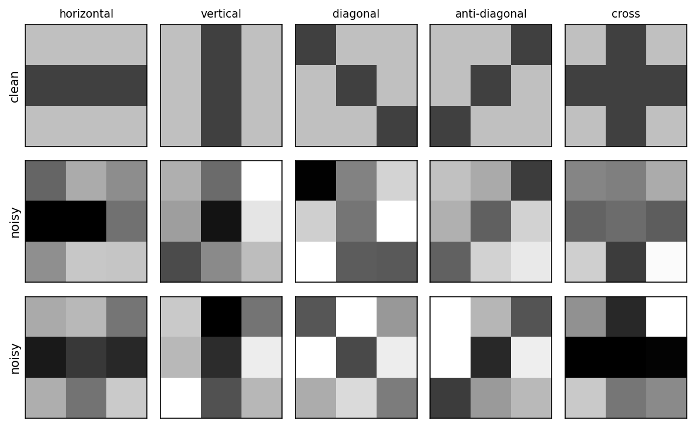
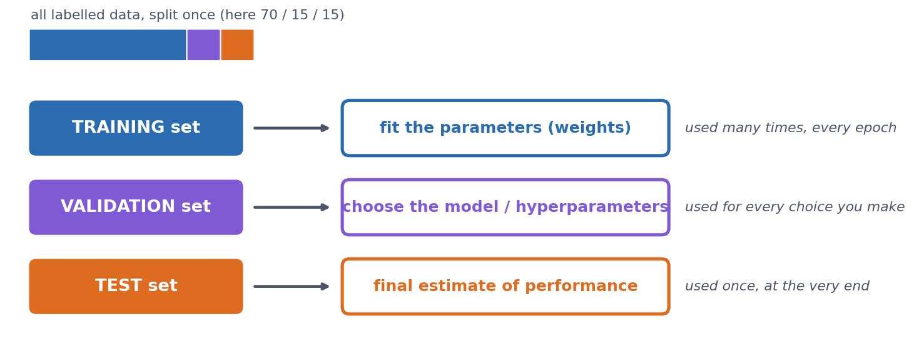
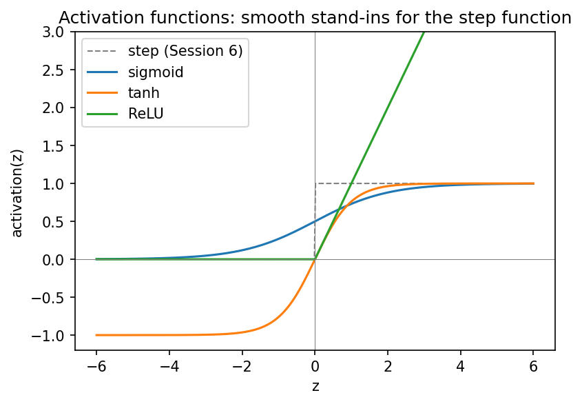

::: callout-note
**Sources for this page:** d2l.ai, *Dive into Deep Learning*, [Softmax Regression](https://d2l.ai/chapter_linear-classification/softmax-regression.html), [Generalization in Classification](https://d2l.ai/chapter_linear-classification/generalization-classification.html) and [Builders' Guide](https://d2l.ai/chapter_builders-guide/index.html) (`nn.Module`) — CC BY-SA 4.0; Wikipedia, [Training, validation, and test data sets](https://en.wikipedia.org/wiki/Training,_validation,_and_test_data_sets), [Supervised learning](https://en.wikipedia.org/wiki/Supervised_learning), [Regression analysis](https://en.wikipedia.org/wiki/Regression_analysis), [Statistical classification](https://en.wikipedia.org/wiki/Statistical_classification), [Logistic regression](https://en.wikipedia.org/wiki/Logistic_regression), [Leakage (machine learning)](https://en.wikipedia.org/wiki/Leakage_(machine_learning)), [Confusion matrix](https://en.wikipedia.org/wiki/Confusion_matrix), [Matthews correlation coefficient](https://en.wikipedia.org/wiki/Phi_coefficient), [Receiver operating characteristic](https://en.wikipedia.org/wiki/Receiver_operating_characteristic), [Activation function](https://en.wikipedia.org/wiki/Activation_function) — CC BY-SA 4.0; UniProt, [Subcellular location](https://www.uniprot.org/help/subcellular_location) — CC BY 4.0; EBI's PDBe API for the helix-fraction data; Steinegger & Söding (2017), [MMseqs2](https://doi.org/10.1038/nbt.3988), *Nature Biotechnology* 35:1026-1028, for sequence clustering. The 3×3 pattern-recognition example, the classifier-evaluation material, and the emphasis on homology reduction of training sets draw on ideas from Magnus Ekman's *Learning Deep Learning* (ch. 2, ch. 4 and Appendix A slide decks in `slides/`, the ch. 4 deck bundling Olof Emanuelsson's "Neural Networks in bioinformatics" slides). That book is copyrighted and not openly licensed, so it is credited here as an internal source and not linked as further reading. All figures on this page were drawn or computed for this course. Every number was computed in code and read back from the notebook's output.
:::

# Session 8: Machine Learning Foundations & Practical PyTorch

::: {.callout-tip icon="false"}
## Overfitting

> Why did the deep learning model refuse to attend the party?
>
> It didn't want to overfit in.
:::

## Learning goals

By the end of this session you should be able to:

- explain what training, validation and test sets are for, and why performance on the training data says little about a model;
- name the ways information can leak from the test data into a model (through the samples, the preprocessing or the model choices), homologous sequences above all;
- compute and interpret a confusion matrix, precision, recall, F1, MCC and ROC/AUROC for a classifier, and RMSE, Pearson $r$ and $R^2$ for a regression model, and explain what each of them does and does not tell you;
- tell regression from classification, and choose the output, loss and evaluation metric that go with each;
- write (not yet train) a PyTorch `nn.Module` classifier and count its parameters.

Session 7 asked what a model *can* represent. This session asks the question that matters in practice: **how do we know whether a model has learned anything useful?**

The session has three parts. @sec-s08-problem poses the problem: is it regression or classification? @sec-s08-evaluation, the heart of the session, is about evaluation and generalisation. @sec-s08-training builds the bridge to Session 9, with activation functions, softmax and a PyTorch model. A tiny 3×3-pixel pattern problem runs through all three parts as a toy example, and a real protein-localisation dataset carries the biology.

## Posing the problem {#sec-s08-problem}

### Supervised and unsupervised learning

Before choosing a model, we need to know what kind of learning problem we have. Machine learning distinguishes two kinds of learning.

- **Supervised learning** fits a model to *labelled* examples, where the correct answer for each input is already known, so that it can predict the label of new inputs. An example is a perceptron trained on known binding and non-binding sites (Session 7).
- **Unsupervised learning** finds structure in data *without* labels, for example by clustering sequences into families, or by projecting expression profiles with PCA. The MMseqs2 clustering in @sec-s08-evaluation is an unsupervised example.

A PSSM (Session 5) sits in between, because it is estimated by counting residues in an alignment of family members rather than fitted to labelled positive and negative examples. Both kinds of learning are useful, but almost everything we train in this course is supervised, so that is what we focus on.

### Regression vs. classification

Within supervised learning, the kind of problem is decided by the *label*:

- in **regression**, the label is a **number**;
- in **classification**, the label is one of a fixed set of **categories**.

| Regression (predict a number) | Classification (predict a category) |
|------------------------------------|------------------------------------|
| Fraction of residues in helices (below) | Subcellular compartment: 5 classes (below) |
| Protein melting temperature, or stability change $\Delta\Delta G$ of a mutation | Is this mutation pathogenic or benign? |
| mRNA expression level in a tissue | Does this protein have a signal peptide? (Session 11) |
| Binding affinity (pK~d~) of a drug to a target | Helix / strand / coil for each residue (Session 7, Session 9) |
| Relative solvent accessibility of a residue (0-1) | Is this residue buried or exposed? |

: Regression and classification problems in biology. {#tbl-s08-problem-types}

The last row shows that the same biology can often be posed either way. Setting a threshold on a continuous quantity turns regression into classification, which makes the problem easier but throws information away.

![Two real problems. **Left, regression:** for 55 PDB entries (fetched live from PDBe), the fraction of residues in helices against the fraction of strong Chou-Fasman helix formers (E, M, A, L, K, F, Q) in the sequence. A straight line captures a real trend ($r = 0.71$) with plenty of scatter. **Right, classification:** 488 secreted and 497 nuclear human proteins from UniProt, plotted by the hydrophobicity of their first 25 residues and their lysine + arginine content. Logistic regression draws the black boundary where $P(\text{secreted}) = 0.5$.](figs/session08-regression-vs-classification.png){#fig-session08-regression-vs-classification width="100%"}

The classifier on the right tells a biological story. It gives N-terminal hydrophobicity a weight of 4.26 and K+R content a weight of only −0.20. Secreted proteins begin with a hydrophobic **signal peptide**, and the model found that single feature almost on its own. On held-out proteins it is right 93.5% of the time, from just two numbers per protein:

{#fig-session08-classification-predictions width="60%"}

#### Logistic regression: the bridge between the two

Logistic regression computes the same weighted sum as Session 7's perceptron, $z = w_1x_1 + w_2x_2 + b$. Instead of a hard step, it passes $z$ through the **sigmoid** function:

$$
\sigma(z) = \frac{1}{1+e^{-z}},
$$

which maps any number to a value between 0 and 1. Despite its name, logistic regression is a *classifier*. Because it is fitted with the log-loss (cross-entropy), its output can be read as an estimate of $P(\text{secreted} \mid x)$. In the notebook, for example, one nuclear protein gets 0.008 and one secreted protein 0.980. Whether such estimates are well *calibrated*, meaning that a predicted 0.8 is right 80% of the time, is a separate question that has to be checked on held-out data. It is important to keep two things apart. The **sigmoid** is just a mathematical mapping into the range 0-1, whereas **logistic regression** is a probabilistic model, fitted with the likelihood (cross-entropy) of the labels. Only the second makes the output an estimate of a probability, and a sigmoid applied to an arbitrary score does not.

The decision boundary ($\sigma(z) = 0.5$, i.e. $z = 0$) is still the perceptron's straight line. What changes is that the output is now smooth and differentiable, which is what Session 9's training needs.

Once the problem type is chosen, three things downstream follow from it:

|   | Regression | Classification |
|------------------------|------------------------|------------------------|
| Output unit | linear (no activation) | sigmoid (2 classes) / softmax ($K$ classes) |
| Loss minimised in training (Session 9) | mean squared error | cross-entropy (Session 1) |
| Evaluation metrics (@sec-s08-evaluation) | RMSE, Pearson $r$, $R^2$ | confusion matrix, precision, recall, F1, MCC, AUROC |

: What follows from the choice between regression and classification. {#tbl-s08-consequences}

### A running toy example: 3×3 pixel patterns

Deep learning had its first great breakthrough in image classification (Session 10), where a computer learns whether an image contains a cat, a house, and so on. To see how a classifier is evaluated, we play here with the smallest image-classification problem worth the name. Each image has nine pixels on a continuous scale (dark = +1, light = −1), and there are five classes: horizontal, vertical, diagonal, anti-diagonal and cross. Every example is a clean pattern plus random noise on each pixel (Gaussian, σ = 0.8). "Cross" shares its middle row with "horizontal" and its middle column with "vertical", so we can expect some confusion there.

{#fig-session08-3x3-patterns width="75%"}

The classifier is five Session 7 perceptrons, one per pattern. Each is trained to output +1 for its own pattern and −1 for every other, and the predicted class is whichever perceptron gives the highest score. This is called **one-vs-rest**. There is no hidden layer, so nothing here needs backpropagation. @sec-s08-evaluation uses this model to show what the three data sets are for and what the evaluation metrics mean.

#### Further reading

- Wikipedia, [Supervised learning](https://en.wikipedia.org/wiki/Supervised_learning), [Regression analysis](https://en.wikipedia.org/wiki/Regression_analysis), [Statistical classification](https://en.wikipedia.org/wiki/Statistical_classification)
- Wikipedia, [Logistic regression](https://en.wikipedia.org/wiki/Logistic_regression)
- Wikipedia, [Chou-Fasman method](https://en.wikipedia.org/wiki/Chou%E2%80%93Fasman_method) (helix propensities) and [Hydrophilicity plot](https://en.wikipedia.org/wiki/Hydrophilicity_plot) (Kyte-Doolittle scale)
- d2l.ai, [Linear Regression](https://d2l.ai/chapter_linear-regression/linear-regression.html)

## How do we know a model learned anything? Evaluation and generalisation {#sec-s08-evaluation}

::: {.callout-tip icon="false"}
### Datasets should be representative

An often-told story: an army wanted a neural network to recognise tanks in photographs. They took many pictures of an area with tanks, and on another day many pictures of the same area without them. The network learned to separate the two sets perfectly, but on new photographs it was no better than guessing. Why? All the pictures with tanks had been taken on a sunny day and all those without on a cloudy day, so the network had become a perfect detector of the weather. (The story may be partly legend, but the failure it describes is real and common.)
:::

### Why three data sets?

A model is only useful if it works on data it has **not** seen. Its performance on the training data says little, because a flexible enough model can memorise every training example. A model that predicts its training data accurately but fails on new examples is said to **overfit**. The labelled data are therefore split three ways. This is not always done in practice, but it should be:

{#fig-session08-three-sets width="90%"}

- **Training set**: used to fit the weights.
- **Validation set**: used to make *choices*, such as how long to train, how large a network to use, or which features to include. Every choice tuned on it makes it slightly optimistic.
- **Test set**: looked at **once**, at the very end, to report the final number. If you go back and change the model after looking at the test set, it has become a second validation set and no longer gives an honest estimate.

**On the 3×3 problem.** We draw 100 training, 100 validation and 200 test examples, and first measure the model by its **accuracy**, the fraction of examples, over all five classes, that it classifies correctly. (The next section breaks this single number down.) The one choice to make is how many **epochs** (passes through the training set) to train for, and we make it on the validation set. If we train for 50 epochs and record both accuracies after every epoch, we get this picture ([the notebook](notebooks/session08-ml-foundations-and-pytorch.ipynb#training-validation-and-test-sets-on-the-33-problem) computes every number and draws the figure):

{#fig-session08-3x3-epochs width="85%"}

The figure shows three things:

- **Training accuracy never settles.** It moves between 0.88 and 0.98. The noisy, overlapping patterns cannot all be separated by straight lines, so the perceptron rule keeps changing the weights for every example it gets wrong. High training accuracy is not the goal, because the model is judged on data it has not seen.
- **Validation accuracy is noisy.** After the first epoch it moves around a plateau of about 0.89, between 0.84 and 0.94. With only 100 validation examples, one accuracy value is uncertain by about ±0.03 (its standard error, $\sqrt{p(1-p)/n}$), so most of the epoch-to-epoch movement is noise. After about 30 epochs, training accuracy is clearly higher than validation accuracy, which is the first sign of overfitting.
- **Choosing the single best epoch is optimistic.** Epoch 3 happens to reach 0.94, but picking the maximum of 50 noisy numbers partly picks luck. This is **selection bias**. Choosing the maximum of many noisy validation scores makes the reported validation performance optimistic, so the chosen model's validation accuracy overstates how well it will do. (Making choices on the validation set is what it is for. The bias lies in reporting the best score as the expected one.) Tuning many choices on the same validation set can, in the end, overfit the validation set too. We therefore use the earliest epoch that has clearly reached the validation plateau, rather than chasing the highest noisy value, which gives **2 epochs** (0.90).

The model trained for two epochs is then measured **once** on the test set, giving **0.895**, in line with the plateau. But is that good? Accuracy alone can mislead, in particular when the classes are unbalanced, and that is the topic of the next section.

### Evaluating a classifier

::: {.callout-tip icon="false"}
### How useful is accuracy?

> You want to build a predictor of who will pass their PhD defence at a Swedish university. Each year about 1000 PhD students defend, and on average one of them fails. How would you judge the predictor?
>
> If you *predict* that everyone will pass, you are right 99.9% of the time. But does that tell you anything?
>
> The Matthews correlation coefficient (MCC, below) of that prediction is 0.00.
:::

Accuracy is a single number, and it hides *which* mistakes are made. The **confusion matrix** shows them, because it cross-tabulates the true class (rows) against the predicted class (columns).

{#fig-session08-3x3-evaluation width="100%"}

For any classification task, even one with many classes, we can treat one class as "positive" and all the others together as "negative". Every prediction is then a true or false positive (TP, FP) or a true or false negative (TN, FN). From these four counts we can define several useful measures, which are worth remembering:

$$
\text{precision} = \frac{TP}{TP+FP} \qquad
\text{recall} = \frac{TP}{TP+FN}
$$

- **Precision** asks: of the proteins I called positive, how many really are?
- **Recall** (sensitivity) asks: of the true positives, how many did I find?

For "vertical" on the 3×3 test set, recall is 0.95 but precision only 0.76, because many crosses were called vertical. For "cross", recall drops to 0.75. There is always a trade-off between precision and recall, and the application decides which matters more. In a screening application, such as flagging potentially pathogenic variants for follow-up, you would favour *recall*. When each positive call triggers an expensive experiment, you would favour *precision*.

Two measures combine these counts into a single number. $F_1$ balances precision and recall:

$$
F_1 = \frac{2\cdot\text{precision}\cdot\text{recall}}{\text{precision}+\text{recall}}
$$

The **Matthews correlation coefficient** uses all four counts:

$$
\text{MCC} = \frac{TP\cdot TN - FP\cdot FN}{\sqrt{(TP+FP)(TP+FN)(TN+FP)(TN+FN)}}
$$

MCC runs from $-1$ (perfect disagreement: every prediction inverted) through $0$ (no better than chance) to $+1$ (perfect), and it stays honest when the classes are unbalanced (see below). The formula above is for two classes. For problems with more classes, software such as scikit-learn uses a generalisation that works on the whole confusion matrix. Over all five 3×3 classes, that multi-class MCC is 0.871.

#### ROC curves

Most classifiers output a *score*, and a threshold turns it into a yes/no call. Lowering the threshold finds more true positives but also lets through more false positives, and raising it does the opposite. Choosing one cutoff is somewhat arbitrary, so it is often better to look at all thresholds at once. The **ROC curve** does this by plotting the true-positive rate against the false-positive rate as the threshold sweeps across all values. To turn the curve into a single number, we use the area under it, **AUROC**. This is the probability that a random positive gets a higher score than a random negative, so it is 0.5 for guessing and 1.0 for a perfect ranking. For the "cross" perceptron above, AUROC is 0.938. The same reasoning lies behind Session 5's choice of an E-value cutoff, where you also pick a point on this trade-off.

### Evaluating a regression model

A regression prediction is not simply right or wrong, but more or less off, so it needs other measures. For the helix-content example, we fit the line on 41 proteins and hold out the other 14:

- **RMSE** $= \sqrt{\tfrac1n \sum (y_i - \hat y_i)^2}$ is 0.159, in the target's own units (fraction helix). Predicting the training-set mean for every protein gives 0.234, which is the baseline to beat.
- **Pearson** $r$ between predicted and measured values is 0.760.
- $R^2$ $= 1 - \sum (y_i-\hat y_i)^2 / \sum (y_i - \bar y)^2$ is 0.526, so about half of the variance is explained. $R^2 = 0$ means no better than predicting the mean.

The three numbers answer different questions:

- **RMSE**: how numerically wrong are the predictions, in the target's units?
- **Pearson** $r$: do the predictions follow the ordering and linear trend of the truth?
- $R^2$: how much better are the predictions than always predicting the mean?

They can disagree sharply. A systematically biased predictor, for example one that outputs $2\hat y + 0.3$ instead of $\hat y$, keeps exactly the same correlation ($r = 0.760$), because the ordering is unchanged. But its RMSE rises from 0.159 to 0.639, and its $R^2$ falls to $-6.67$, far worse than predicting the mean. A high correlation is therefore not the same as accurate prediction, and treating it as such is one of the most common mistakes in bioinformatics papers.

**Why we need held-out data, in one picture.** A model that is flexible enough can simply memorise its training data. A **1-nearest-neighbour** model is the extreme case, because it predicts the helix fraction of the most similar protein (by amino-acid composition) that it was trained on. If we train it on all 55 proteins and evaluate it on the same 55, every protein's nearest neighbour is itself, so the predictions are perfect ($R^2 = 1.00$, RMSE $= 0$). If we train it on 41 proteins and evaluate it on the other 14, it is no better than predicting the mean ($R^2 = 0.03$):

{#fig-session08-regression-evaluation width="100%"}

The middle panel is what you get if you evaluate on the training data, and it says nothing about new proteins. With only 14 test proteins, however, all of these numbers are themselves uncertain, which leads to the next question.

### How much can you trust one split?

To answer it, we turn to a real, though still small, problem: predicting subcellular localisation. The dataset comes from reviewed human UniProt entries (Session 3) with exactly one annotated location. We use five classes (cytoplasm, nucleus, mitochondrion, secreted, cell membrane) and leave out all others (peroxisome, Golgi, ER, and so on). Each sequence is one-hot encoded (Session 7) over its first 150 residues, because localisation signals are mostly N-terminal, which gives 150 × 20 = 3000 input numbers per protein.

**Class imbalance first.** Before balancing, the classes hold 424, 497, 140, 488 and 338 proteins. A "classifier" that always answers *nucleus* reaches an accuracy of 0.263, above the 0.20 you might expect for five classes, while its MCC is exactly 0. Real proteomes are far more unbalanced than this. In a genome-wide screen for, say, a rare targeting signal, "always no" can be more than 90% accurate. You should therefore always report MCC, or precision and recall, alongside accuracy, and be sceptical of papers that do not. Here we avoid the problem by balancing every class to 140 proteins (700 in total).

**Split-to-split noise.** A quick logistic-regression baseline, refitted on ten different random 70/15/15 splits, gives validation accuracies from 0.505 to 0.610 (mean 0.561, standard deviation 0.031). The data and the model are the same, and only the random draw of the split differs. **k-fold cross-validation** makes better use of limited data and reduces the dependence on one particular split, although it does not remove sampling variability. The data are cut into $k$ class-stratified folds, the model is trained $k$ times with a different fold held out each time, and the results are averaged. With $k = 5$ the notebook gets 0.540 ± 0.044. Every protein is used for validation exactly once, at $k$ times the computing cost.

{#fig-session08-split-noise width="70%"}

### The biological trap: homologs on both sides of the split

A random split assumes that the examples are independent. **Proteins are not.** They come in families of homologs (Session 4) that share sequence and, often, structure, localisation and function. Suppose one family member is in the training set and another in the test set. The model can then exploit family-specific sequence similarity rather than relying only on general targeting signals. The test set then partly rewards recognising known families instead of measuring generalisation to new kinds of proteins.

This effect can be measured. Clustering the 700 proteins with **MMseqs2** (a fast, BLAST-like search that groups sequences above an identity cutoff) at 30% identity gives 551 clusters. 75 clusters have more than one member, holding 224 proteins in total, and the largest has 11. Over the same ten random splits:

- **31.3%** of validation proteins have a ≥30%-identity homolog in the training set;
- the baseline classifies those correctly **67.5%** of the time;
- it classifies the remaining proteins correctly only **50.9%** of the time.

{#fig-session08-homology-leakage width="95%"}

The fix is **homology partitioning**. We cluster first and then put whole clusters into training, validation or test, so that no cluster of sequences with ≥30% identity crosses the split. This substantially reduces homology leakage, although it cannot guarantee that no remote homolog below the cutoff remains. Averaged over ten splits of each kind, baseline accuracy drops from 0.553 (random) to 0.536 (homology-aware). The overall drop is small *here* only because 476 of the 700 proteins have no homolog in the set at all. In more redundant data, such as a whole proteome or the PDB with its thousands of near-identical structures of popular proteins, the gap can be much larger. **From this session on, the course uses the homology-aware split** (486 training / 105 validation / 109 test proteins), and Sessions 9 and 10 reuse it.

#### Other ways biological data leaks

Homology is the classic trap, but not the only one. Information from the test data can leak into a model in three ways: through the **samples** (homologs or samples from the same patient on both sides of the split), through the **preprocessing** (normalising or selecting features using all the data), and through the **evaluation** (repeatedly inspecting the test set while choosing models). Using the *validation* set to choose a model is not leakage, because that is what it is for. The common pattern is that something shared between the training and test examples, other than the signal you want to learn, lets the model cheat.

- **Several samples from one individual.** Split by patient, not by sample. Otherwise the model learns to recognise the patient.
- **Batch effects.** If all tumour samples were sequenced in one lab and all controls in another, a model can learn the lab. Keep batches balanced across classes, or split by batch.
- **Preprocessing on the full dataset.** Normalising, selecting features or running PCA on *all* data before splitting lets test-set information in. Fit preprocessing on the training set only.
- **Time.** A model tested on proteins annotated *before* its training data may benefit from later annotations that were themselves predicted by similar tools. **CASP** (Session 6) avoids all of this by testing on structures that are unpublished at prediction time. This truly blind test is the model for honest evaluation.
- **Unrepresentative data.** Swiss-Prot over-represents well-studied proteins and model organisms. A model trained on human proteins may not transfer to bacteria. The training set should look like the data the model will be used on.

#### Further reading

- Wikipedia, [Training, validation, and test data sets](https://en.wikipedia.org/wiki/Training,_validation,_and_test_data_sets), [Cross-validation (statistics)](https://en.wikipedia.org/wiki/Cross-validation_(statistics)), [Leakage (machine learning)](https://en.wikipedia.org/wiki/Leakage_(machine_learning)), [Batch effect](https://en.wikipedia.org/wiki/Batch_effect)
- Wikipedia, [Confusion matrix](https://en.wikipedia.org/wiki/Confusion_matrix), [Precision and recall](https://en.wikipedia.org/wiki/Precision_and_recall), [Matthews correlation coefficient](https://en.wikipedia.org/wiki/Phi_coefficient), [Receiver operating characteristic](https://en.wikipedia.org/wiki/Receiver_operating_characteristic), [Coefficient of determination](https://en.wikipedia.org/wiki/Coefficient_of_determination)
- d2l.ai, [Generalization in Classification](https://d2l.ai/chapter_linear-classification/generalization-classification.html)
- Steinegger & Söding (2017), [MMseqs2 enables sensitive protein sequence searching for the analysis of massive data sets](https://doi.org/10.1038/nbt.3988); software at [github.com/soedinglab/MMseqs2](https://github.com/soedinglab/MMseqs2)
- Wikipedia, [CASP](https://en.wikipedia.org/wiki/CASP)

## Towards training networks {#sec-s08-training}

This part prepares Session 9, in which networks are trained. It covers how units are connected, the activation functions that make gradient descent possible, softmax outputs, and how to write a model in PyTorch and count its parameters.

### Connectivity decides the number of weights

A network connects many units of the kind that Session 7 introduced. How they are connected decides how many weights a layer has, and it also builds an assumption about the data into the model:

{#fig-session08-connectivity width="100%"}

A fully connected layer (`nn.Linear`) connects every input to every output, so its size grows with the length of the input. The third discussion problem compares it with a convolution, whose number of weights does not depend on the input length at all.

::: {.callout-note collapse="true"}
### Optional: biological and artificial networks, and the architectures still to come

Session 7 introduced the perceptron as Rosenblatt's simplified neuron. Beyond single units, the analogy with biology becomes loose:

{#fig-session08-neuron-to-network width="100%"}

- **Real neurons spike.** They send discrete pulses over time. Artificial units output a single number.
- **Brains are recurrent.** Signals loop back. The networks of Sessions 8-10 are strictly feed-forward; Session 11's recurrent networks bring loops back in a controlled form.
- **Brains are sparsely connected.** Each neuron connects to a small fraction of the others.

Each architecture in the rest of the course builds a different assumption about the data into its wiring:

![The architectures still to come, each with a biological application from this course. Feed-forward networks take a fixed-size input (this session's localisation model; PHD in Session 9). CNNs look for local patterns with shared weights (contact maps, Session 10). RNNs read a sequence one position at a time (signal peptides, Session 11). Transformers let every position attend to every other (language models and SignalP 6.0, Session 11; AlphaFold, Session 12). Generative diffusion models learn to turn noise into new examples (protein design, Session 12).](figs/session08-architectures.png){#fig-session08-architectures width="100%"}
:::

### From step functions to trainable activations

In Session 9 we train networks with backpropagation, which is gradient descent (Session 1) applied layer by layer. For that we need the derivative of every unit's activation function. A step function's derivative is zero everywhere except at the jump, where it is undefined, so it gives gradient descent nothing to follow. Networks therefore replace the step with functions that have a useful gradient. Sigmoid and tanh are smooth. ReLU has a kink at zero, but its slope is 1 or 0 everywhere else, which is enough for gradient descent. You already met the sigmoid in @sec-s08-problem:

$$
\sigma(z) = \frac{1}{1+e^{-z}} \qquad
\tanh(z) = 2\sigma(2z) - 1 \qquad
\text{ReLU}(z) = \max(0, z)
$$

{#fig-session08-activation-functions width="70%"}

- **Sigmoid** outputs a value in $(0, 1)$. It remains the standard for a binary output unit.
- **tanh** has the same S shape but is centred on zero, with outputs in $(-1, 1)$.
- **ReLU** passes positive values unchanged and sets negative ones to zero. It is cheap to compute and is the default for hidden layers in modern networks.

*Why* the choice matters in deep networks is part of Session 9's vanishing-gradient discussion, which compares the derivatives of these functions.

### From binary to multi-class: softmax

With more than two classes, a single threshold is not enough. The 3×3 classifier has five outputs and simply picks the largest. **Softmax** turns $K$ raw scores (**logits**) into $K$ positive numbers that sum to 1:

$$
\text{softmax}(z)_k = \frac{e^{z_k}}{\sum_{j=1}^K e^{z_j}}
$$

Take a noisy "horizontal" pattern that the perceptrons misclassify. Its five scores ($-2.19$, $-0.80$, $-2.35$, $-2.61$, $0.16$) become 0.06, 0.24, 0.05, 0.04 and 0.62, with most of the weight on "cross". Softmax never changes *which* class wins. It only expresses the relative scores as a normalised distribution. These perceptrons were not trained with cross-entropy, so the numbers sum to 1 but should **not** be read as reliable probabilities. Training with cross-entropy (Session 9) makes softmax outputs interpretable as probability estimates, but whether they are well calibrated depends on the training and has to be checked on held-out data. For biomedical predictions, where a "90% probability" may drive a decision, that check matters. For two classes, softmax is equivalent to logistic (sigmoid) classification.

Because softmax gives a distribution, its **entropy** (Session 1) measures how spread out the distribution is. It is 1.56 bits for the example above, against a maximum of $\log_2 5 \approx 2.32$ bits for a model that cannot tell the five classes apart at all, and 0 bits for a completely confident one. Session 9 trains the network by minimising the **cross-entropy** between these values and the true labels.

In PyTorch, a classifier's last layer outputs raw logits. The loss function (`nn.CrossEntropyLoss`, Session 9) combines log-softmax with the negative log-likelihood in one numerically stable operation, so the model should output raw logits, not softmax values. You apply softmax yourself only when you need normalised scores, for example for a per-class ROC curve.

#### Further reading

- Wikipedia, [Neuron](https://en.wikipedia.org/wiki/Neuron), [Neural network (machine learning)](https://en.wikipedia.org/wiki/Neural_network_(machine_learning)), [Activation function](https://en.wikipedia.org/wiki/Activation_function), [Softmax function](https://en.wikipedia.org/wiki/Softmax_function)
- d2l.ai, [Softmax Regression](https://d2l.ai/chapter_linear-classification/softmax-regression.html)

### Practical PyTorch: writing a model as a class

A PyTorch model is a class that inherits from `nn.Module`. Its layers are attributes created in `__init__`, and a `forward()` method describes how an input tensor becomes an output tensor. This is the pattern of Session 2's `Protein` class, with `super().__init__()` and attributes set in `__init__`, now used for a model, and every later model follows it.

The whole 3×3 classifier is a single `nn.Linear(9, 5)` layer, with 50 parameters (5 × 9 weights + 5 biases). When the notebook copies the trained perceptron weights into it, the layer makes exactly the same predictions as the NumPy code, because a perceptron layer and `nn.Linear` do the same computation.

The localisation network is the same pattern at a larger scale: 3000 inputs, a hidden layer of 64 ReLU units, and 5 output logits, for **192,389 parameters**. One forward pass on the homology-aware validation set confirms the shapes (105 × 3000 in, 105 × 5 out). With random weights it scores what chance looks like: accuracy 0.181, MCC −0.027 and macro AUROC 0.474. The network is **not trained** in this session. Session 9 adds backpropagation and the training loop, and reports the same metrics on this split.

## Check your understanding

```{=html}
<div id="session08-quiz"></div>
<script>
renderQuiz("session08-quiz", [
  {
    question: "You want to predict the change in melting temperature (in &deg;C) caused by a point mutation. Which combination fits?",
    choices: [
      "Regression: linear output unit, mean-squared-error loss, evaluated with RMSE / Pearson r",
      "Classification: softmax output, cross-entropy loss, evaluated with MCC",
      "Regression: sigmoid output unit, evaluated with AUROC",
      "Unsupervised learning, since no labels are needed"
    ],
    correctIndex: 0,
    explanation: "The label is a number, so it is a regression problem. It becomes classification only if you threshold it, e.g. stabilising vs. destabilising."
  },
  {
    question: "A random split of a protein dataset puts close homologs in both the training and the test set. What is the most likely effect?",
    choices: [
      "Test performance overestimates how well the model works on genuinely new protein families",
      "Test performance underestimates the model, because homologs confuse it",
      "No effect, because the model never sees the test proteins during training",
      "The model cannot be trained at all"
    ],
    correctIndex: 0,
    explanation: "The model can exploit family-specific sequence similarity rather than relying only on general signals. In the notebook, validation proteins with a homolog in training were classified correctly 67.5% of the time, vs. 50.9% for the rest."
  },
  {
    question: "On an unbalanced 5-class dataset, a model that always predicts the largest class reaches 26% accuracy. What is its MCC?",
    choices: ["0", "0.26", "0.20", "1"],
    correctIndex: 0,
    explanation: "MCC measures agreement beyond chance. A constant prediction has none, however high its accuracy."
  },
  {
    question: "In the 3&times;3 confusion matrix, 9 crosses are predicted as 'vertical'. Which statement is correct?",
    choices: [
      "These lower the recall of 'cross' and the precision of 'vertical'",
      "These lower the precision of 'cross' and the recall of 'vertical'",
      "These lower only the overall accuracy, not any per-class metric",
      "These are true negatives for 'vertical'"
    ],
    correctIndex: 0,
    explanation: "True crosses that were missed are false negatives for 'cross' (lower recall). Predicted verticals that are not vertical are false positives for 'vertical' (lower precision)."
  },
  {
    question: "Why must the test set be used only once, at the very end?",
    choices: [
      "Every decision tuned on it makes it optimistic, so it stops being an honest estimate of performance on new data",
      "Evaluating a model changes its weights",
      "PyTorch deletes the test set after one use",
      "The test set is always smaller than the validation set"
    ],
    correctIndex: 0,
    explanation: "Choices such as the number of epochs belong on the validation set. A test set used to guide choices becomes a second validation set."
  },
  {
    question: "What does softmax add to a layer of K raw scores?",
    choices: [
      "It turns them into K positive numbers that sum to 1, without changing which class has the highest score",
      "It changes which class is predicted, to correct errors",
      "It adds a hidden layer",
      "It is only needed for regression"
    ],
    correctIndex: 0,
    explanation: "Softmax preserves the ranking of the scores and rescales them into a normalised distribution. Whether those numbers are well-calibrated probabilities depends on how the model was trained, and has to be checked. For two classes it is equivalent to logistic (sigmoid) classification."
  },
  {
    question: "Why does the case-study encoding keep only the first 150 residues of each sequence?",
    choices: [
      "The signals that determine localisation (signal peptides, mitochondrial targeting sequences) are mostly N-terminal",
      "UniProt only provides the first 150 residues",
      "150 is the average length of a human protein",
      "PyTorch cannot handle longer inputs"
    ],
    correctIndex: 0,
    explanation: "It is a modelling choice based on biology, and it keeps the input to a fixed size of 150 &times; 20 = 3000 numbers."
  },
  {
    question: "A model's predictions of melting temperature correlate with the measured values at r = 0.95, but every prediction is about twice the true value plus 5 degrees. Which is true?",
    choices: [
      "The correlation is high but the RMSE is large and R&sup2; can be negative: correlation measures whether predictions track the trend, not whether they are numerically right",
      "r = 0.95 means the predictions are accurate to within 5%",
      "The RMSE must be small because r is close to 1",
      "R&sup2; is always equal to r&sup2; for any predictor"
    ],
    correctIndex: 0,
    explanation: "A stretched and shifted predictor keeps the same ordering, so r is unchanged, but it is far off in absolute terms. On this page, biasing the helix predictions kept r = 0.760 but raised RMSE from 0.159 to 0.639 and gave R&sup2; = -6.67."
  },
  {
    question: "A classifier's softmax output says 0.9 for 'secreted'. What can you conclude without further checks?",
    choices: [
      "That 'secreted' has the highest score; whether 0.9 means a 90% chance depends on training and calibration, which must be checked on held-out data",
      "That the protein is secreted with 90% probability, always",
      "That the model is 90% accurate",
      "Nothing: softmax outputs are random"
    ],
    correctIndex: 0,
    explanation: "Softmax always gives numbers that sum to 1. Only a well-calibrated model's 0.9 means right about 90% of the time; cross-entropy training alone does not guarantee that."
  },
  {
    question: "You standardise all features using the mean and standard deviation of the whole dataset, then split it into training and test sets. Which kind of leakage is this?",
    choices: [
      "Leakage through preprocessing: statistics of the test data have entered the model",
      "Leakage through the samples, like homologs on both sides of the split",
      "Evaluation leakage: inspecting the test set while choosing models",
      "No leakage, because the labels were not used"
    ],
    correctIndex: 0,
    explanation: "Preprocessing must be fitted on the training set only. The three routes on this page: samples (homologs), preprocessing (normalisation), and evaluation (a reused test set)."
  }
]);
</script>
```

## The course notebook

`notebooks/session08-ml-foundations-and-pytorch.ipynb` computes every number and figure on this page. In order, it covers:

- the helix-fraction regression and the secreted-vs-nuclear logistic regression (both with live data);
- the 3×3 patterns: train/validation/test, confusion matrix, precision/recall/F1/MCC and ROC;
- regression metrics;
- class imbalance, split-to-split noise and cross-validation on the UniProt localisation data;
- MMseqs2 clustering, homology leakage and the homology-aware split. If `mmseqs` is not installed, as on Colab, a precomputed clustering is downloaded;
- activation functions, softmax, the 3×3 model as an `nn.Linear`, and the untrained localisation network.

Open it in [Google Colab](https://colab.research.google.com/github/ElofssonLab/kb8029-book/blob/main/notebooks/session08-ml-foundations-and-pytorch.ipynb) via the badge at the top of the notebook page to edit and run it yourself.

## The lab

**Full lab, on blood-cell images.** The lab uses BloodMNIST ([Yang et al. 2023](https://doi.org/10.1038/s41597-022-01721-8)), 17,092 microscope images of single blood cells in eight classes (neutrophils, eosinophils, basophils, lymphocytes, monocytes, immature granulocytes, erythroblasts and platelets). The images were taken with an automated analyser at the Hospital Clínic de Barcelona and labelled by clinical pathologists ([Acevedo et al. 2020](https://doi.org/10.1016/j.dib.2020.105474)), then shrunk to 28 × 28 colour pixels so that a network trains in seconds on a laptop. The lab uses a fixed subset of 7,000 of them. It was adapted from the previous course's "Neural Networks" lab, which used handwritten digits (MNIST), and rebuilt in PyTorch. Blood cells make the evaluation questions real ones: the classes are unequal in size, and the mistakes the network makes can be explained by cell biology. At the end of the lab, the same machinery is carried straight back to protein localisation. Work through [`notebooks/session08-lab.ipynb`](https://colab.research.google.com/github/ElofssonLab/kb8029-book/blob/main/notebooks/session08-lab.ipynb), replacing every `todo(...)` call with your own code:

1.  inspect the class balance, and the accuracy you would get by always guessing the commonest cell type;
2.  build training, validation and test sets, and standardise the three colour channels using statistics from the training set only;
3.  write the model as an `nn.Module` (28 × 28 × 3 = 2,352 inputs, 10 tanh hidden units, 8 output logits) and count its parameters;
4.  train it with a provided `train_model` function (Session 9 opens that box), then turn logits into probabilities and classes;
5.  compute a confusion matrix, and explain its mistakes biologically, then precision, recall, F1, MCC and a ROC curve for immature granulocytes against the rest;
6.  see how a rare class (basophils, under 7% of the cells) can almost vanish from the predictions without lowering the accuracy much;
7.  shrink the training set to watch overfitting appear, and use the test set once, at the end.

The last section returns to proteins. It measures how many validation proteins in a *random* split of this session's localisation dataset have a homolog in the training set. Together with step 2, it covers two of the three routes for leakage from @sec-s08-evaluation, namely through the samples (homologs) and through the preprocessing (normalisation statistics).

### Submitting this lab

This lab is administered through Canvas, not through this book. See the course's Canvas page for the current quiz, the deadline and how to submit.

## What's next

Session 9 trains this network on the homology-aware split. It covers backpropagation, cross-entropy, the training loop, vanishing gradients (including the activation-function derivatives deferred from this session) and regularisation. It closes with Rost & Sander's PHD method as the payoff of the Session 5-9 arc.