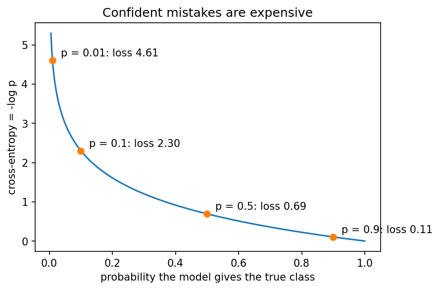
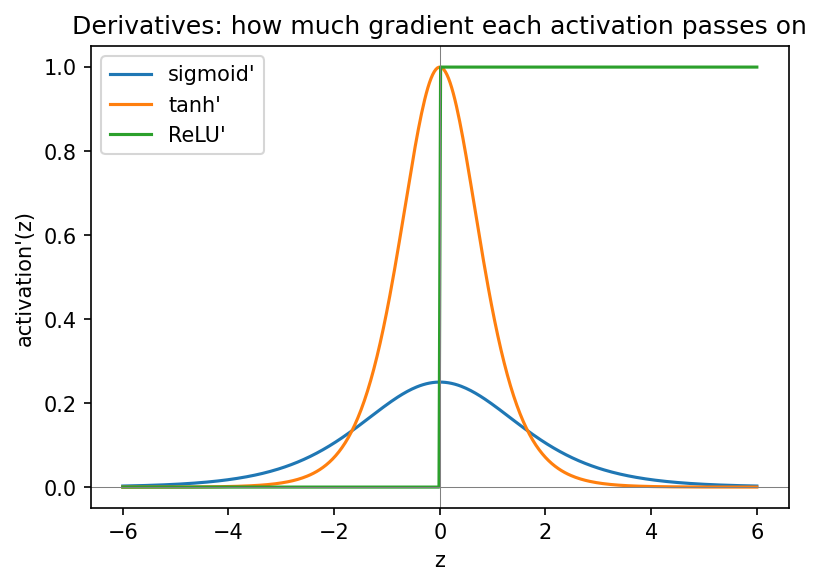
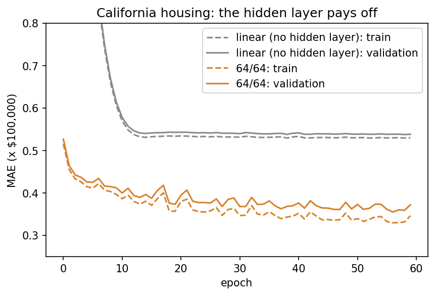
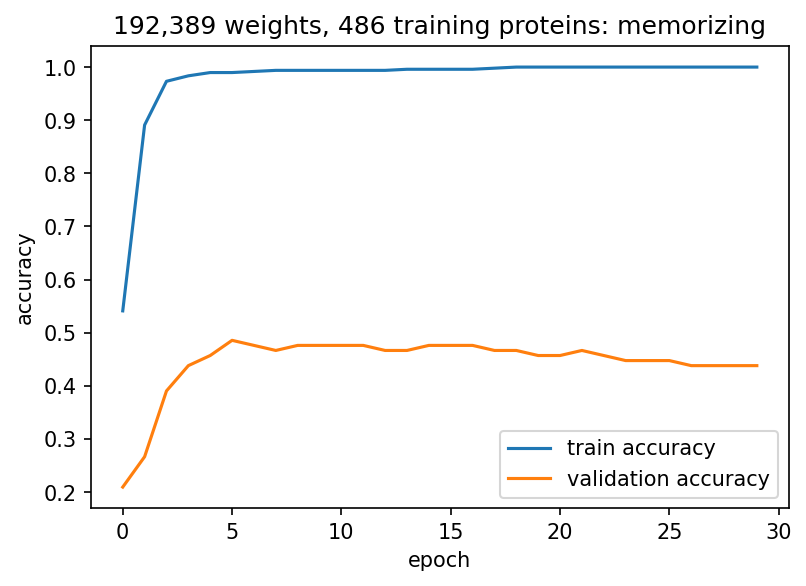

::: {.callout-note}
**Sources for this page:** d2l.ai, *Dive into Deep Learning*,
[Multilayer Perceptrons](https://d2l.ai/chapter_multilayer-perceptrons/index.html)
— CC BY-SA 4.0; Wikipedia,
[Backpropagation](https://en.wikipedia.org/wiki/Backpropagation),
[Stochastic gradient descent](https://en.wikipedia.org/wiki/Stochastic_gradient_descent),
[Overfitting](https://en.wikipedia.org/wiki/Overfitting),
[Vanishing gradient problem](https://en.wikipedia.org/wiki/Vanishing_gradient_problem),
[Regularization (mathematics)](https://en.wikipedia.org/wiki/Regularization_(mathematics)),
[Dropout (neural networks)](https://en.wikipedia.org/wiki/Dropout_(neural_networks)),
[Early stopping](https://en.wikipedia.org/wiki/Early_stopping)
— CC BY-SA 4.0. Datasets: the
[Breast Cancer Wisconsin (Diagnostic)](https://archive.ics.uci.edu/dataset/17/breast+cancer+wisconsin+diagnostic)
data set (UCI Machine Learning Repository, CC BY 4.0) and the California
housing data set (Pace & Barry, 1997,
[*Statistics & Probability Letters* 33:291-297](https://doi.org/10.1016/S0167-7152(96)00140-X)),
both loaded through [scikit-learn](https://scikit-learn.org/stable/datasets/real_world.html);
Session 8's UniProt subcellular-localization data. Ioffe & Szegedy (2015),
"Batch Normalization," [arXiv:1502.03167](https://arxiv.org/abs/1502.03167);
Rost & Sander (1993), [*J. Mol. Biol.* 232:584-599](https://doi.org/10.1006/jmbi.1993.1413)
and [*PNAS* 90:7558-7562](https://pmc.ncbi.nlm.nih.gov/articles/PMC47181/)
(the PHD method). 3Blue1Brown's neural-network and cross-entropy videos are embedded as
further watching. The housing regression setup (linear baseline vs.
64/64 network, L2 and dropout), the vanishing-gradient demonstration and
the tiny hand-computed backpropagation example follow ideas from Magnus
Ekman's *Learning Deep Learning* (ch. 3, 5 and 6 slide decks in
`slides/`), a copyrighted, not openly licensed textbook, credited here as
an internal source and not linked. Every number below was computed in
code and read back from the notebook's output.
:::

# Session 9: How a Neural Network Learns, and Why Training Fails

## Learning goals

By the end of this session you should be able to:

- describe the training cycle (predictions → loss → gradients → update) and write the standard PyTorch training loop;
- explain backpropagation as the chain rule applied from the loss backwards through the network;
- choose the loss for classification (cross-entropy) and regression (mean squared error), and explain why confident mistakes are expensive;
- recognize three common ways training fails (equal starting weights, vanishing gradients, a poor optimizer or learning rate) and name the fix for each;
- judge when a hidden layer pays off, and why a very large network can lose to a simple baseline;
- use early stopping, weight decay and dropout against overfitting, and evaluate the result honestly.

Sessions 6, 8 and 9 form one progression. Session 6 asked **what a neural network can represent**. Session 8 asked **how we know whether a model generalizes**. This session asks **how we actually train a network, and why training sometimes succeeds and sometimes fails**.

The starting point is concrete. In Session 8 we built a network, but its weights were random, so its predictions were no better than chance. We have labelled examples. How do we turn the random weights into useful predictions? The whole session answers that question, with four datasets: breast-cancer biopsies (the training loop), California housing (when a hidden layer pays off), Session 8's protein localization (when a network is too large for its data), and MNIST digits in the lab.

# 1. From an untrained network to a trained network

The **Wisconsin breast-cancer** dataset has 569 fine-needle biopsies, each described by 30 features measured on microscope images of the cell nuclei (radius, texture, perimeter, smoothness, concavity and so on). Each biopsy is labelled malignant (212) or benign (357). We split it into 398 training, 85 validation and 86 test biopsies, and standardize the features with statistics from the training set only (Session 8). The network has one hidden layer of 16 ReLU units and one output, 513 weights in all.

Training repeats one cycle, over and over:

{width="100%"}

Before training, the network's predicted probabilities all sit close to 0.5: it is guessing (validation accuracy 0.659, roughly the share of benign biopsies). After 100 passes through the training data, the benign biopsies are pushed towards 0 and the malignant ones towards 1:

{width="100%"}

On the test set the trained network reaches accuracy 0.953, MCC 0.900 and AUROC 0.984: 2 benign biopsies called malignant and 2 malignant ones missed.

**Was the hidden layer needed?** Not here. Compared by 5-fold cross-validation (one test split of 86 biopsies is too noisy, Session 8), logistic regression with 31 weights and the network with 513 both reach an accuracy of **0.979**. Malignant and benign nuclei differ mainly in size and shape, and a weighted sum of those measurements already separates them. Training works; the extra capacity simply has nothing to add. Section 5 shows a dataset where it does.

# 2. How backpropagation finds every gradient

Gradient descent (Session 1, Session 6) needs $\partial L / \partial w$, the slope of the loss, for **every** weight. For a single layer that was easy. But what about a weight buried several layers inside a network, whose effect on the loss passes through every later layer?

{width="90%"}

**Backpropagation is an efficient application of the chain rule, from the loss backwards through the network.** Each layer's "error signal" is computed once and reused for all the weights feeding into it, so the cost of all the gradients is about the same as one forward pass. Without that reuse, networks with thousands or millions of weights could not be trained.

You do not have to differentiate networks by hand. The notebook does it once for the tiny network above (five gradients, worked out with the chain rule), then builds the same network in PyTorch and calls `loss.backward()`: all five gradients agree to eight decimal places. From then on, PyTorch's **autograd** does it for any network.

That gives the **training loop** you will write yourself in the lab:

```python
for epoch in range(n_epochs):
    for xb, yb in loader:                 # one mini-batch at a time
        optimizer.zero_grad()             # 1. clear the old gradients
        logits = model(xb)                # 2. forward pass
        loss = criterion(logits, yb)      # 3. how wrong is it?
        loss.backward()                   # 4. backpropagation: every gradient
        optimizer.step()                  # 5. update every weight
```

Real training uses **mini-batches**: a `DataLoader` shuffles the training set every epoch and serves it in small batches (here 32 biopsies), and the weights are updated after every batch. That gives many cheap, slightly noisy steps per **epoch** (one pass through the training data) instead of one expensive exact step; this is **stochastic gradient descent**. After every epoch we measure the validation loss and keep the best weights (**early stopping**).

### Further watching

[*Backpropagation, intuitively*](https://www.youtube.com/watch?v=Ilg3gGewQ5U) (3Blue1Brown, Deep Learning ch. 3), and [*Backpropagation calculus*](https://www.youtube.com/watch?v=tIeHLnjs5U8) (ch. 4) for the full chain-rule mechanics:

```{=html}
<div style="position:relative;padding-bottom:56.25%;height:0;overflow:hidden;max-width:100%;margin-bottom:1em;">
<iframe src="https://www.youtube.com/embed/Ilg3gGewQ5U" style="position:absolute;top:0;left:0;width:100%;height:100%;border:0;" allowfullscreen title="Backpropagation, intuitively, 3Blue1Brown"></iframe>
</div>
```

# 3. Which loss to minimize

The loss decides what "wrong" means. For **regression** we use the **mean squared error** between prediction and target. For **classification** we use **cross-entropy**. For one example it is the negative log of the probability the model gave the true class,

$$
\text{CE} = -\log p(\text{true class}),
$$

its *surprise* in the language of Session 1. Averaged over a dataset, it is the negative log-likelihood, so minimizing it is maximum likelihood (Session 1).

{width="60%"}

Confidently wrong is punished far more than hedging: probability 0.9 on the truth costs 0.105, probability 0.01 costs 4.6, over 40 times more. This is what pushes a classifier to separate the classes, as in the right panel of the breast-cancer figure. For two classes PyTorch's `nn.BCEWithLogitsLoss`, and for more classes `nn.CrossEntropyLoss`, combine the sigmoid or log-softmax with this loss in one numerically stable step, so the model outputs raw logits (Session 8). The notebook checks both by hand. The lab compares cross-entropy with mean squared and mean absolute error for the same digit classifier: cross-entropy trains best.

::: {.callout-note collapse="true"}
## Optional: cross-entropy and relative entropy

Cross-entropy is built from the relative entropy (Kullback-Leibler divergence) of Session 4: $H(P, Q) = H(P) + D_{\text{KL}}(P \| Q)$, the true distribution's own entropy plus the extra cost of describing it with the model's distribution $Q$. Since $H(P)$ does not depend on the model, minimizing cross-entropy is minimizing the KL divergence between the model's predictions and the true labels.
:::

# 4. Why training fails

The training loop always runs; it does not always learn. Here are three common failures, each shown by changing one thing in a network for the California housing data (described in Section 5; the task is to predict a district's median house value, and we measure the validation error as the mean absolute error, MAE, in units of \$100,000). Predicting the training mean for every district gives an MAE of 0.912; a working 64/64 network reaches about 0.37 within 20 epochs.

{width="100%"}

### Failure 1: every weight starts the same

- **Observation.** Start all weights at 0.1 instead of small random numbers. After 20 epochs the validation MAE is 0.512, no better than a linear model, against 0.373 from a random start.
- **Why?** Every hidden unit computes the same thing and receives the same gradient, so the units stay identical for ever. After training, all 64 units in the first layer are still exactly the same: 64 units behave like one.
- **Fix.** Random initialization *breaks the symmetry*. PyTorch does this by default.

### Failure 2: deep sigmoid networks, and vanishing gradients

- **Observation.** A network with six hidden layers of sigmoid units, trained with plain SGD, does not learn at all: its validation MAE stays at 0.90, the error of predicting the mean. The same network with tanh (0.420) or ReLU (0.396) learns.
- **Why?** Backpropagation multiplies one activation *derivative* per layer, and sigmoid's derivative is at most 0.25 (and almost 0 when the unit saturates). In a freshly initialized six-layer sigmoid network, the first layer's gradient is about **eight million times smaller** than the last layer's; for tanh and ReLU the ratio is only a few hundred. The first layers barely move.
- **Fix.** ReLU-like activations; initialization scaled to each layer's size; standardized inputs; normalization layers such as batch normalization (Ioffe & Szegedy, 2015); and modern architectures. Adaptive optimizers also help: the same sigmoid network trained with Adam, which rescales small gradients, does learn (0.425).

{width="65%"}

ReLU never shrinks the gradient for positive inputs and is cheap to compute, so it is the default for hidden layers. Its weakness is the flat side: a unit whose input is negative for every example gets no gradient and never recovers ("dying ReLU"; the first discussion problem). **Leaky ReLU** and **GELU** keep a small slope there. Sigmoid remains standard for a binary *output*.

### Failure 3: the optimizer and the learning rate

- **Observation.** The same 64/64 network reaches a validation MAE of 0.373 with Adam (learning rate 0.001), but only 0.415 with plain SGD in the same 20 epochs. With Adam and a learning rate of 0.1, the error jumps around and ends worse than it was earlier.
- **Why?** The learning rate sets the step size of gradient descent (Session 1). Too small is slow; too large overshoots the minimum. Adam adapts the step size for each weight.
- **Fix.** Start with Adam and a learning rate around $10^{-3}$, and always watch the validation curve.

The lab repeats all of these on MNIST, and adds the comparison of loss functions: *change one thing, see what happens, explain why*.

# 5. When a hidden layer pays off: California housing

The California housing data come from the 1990 US census, summarized per block group (a district of about 1,500 people): 20,640 districts, 8 features (median income, house age, average rooms and bedrooms, population, average occupancy, latitude, longitude), and the median house value as the target. It is not biology, but it is the clearest example of the opposite of breast cancer: plenty of data, and features that combine in strongly *non-additive* ways. For regression the output unit is linear and the loss is mean squared error. Trained for 60 epochs with early stopping (14,448 / 3,096 / 3,096 districts):

| Model | Weights | Train MAE | Val MAE | **Test MAE** |
|---|---|---|---|---|
| Linear (no hidden layer) | 9 | 0.530 | 0.538 | **0.534** |
| 64/64 | 4,801 | 0.330 | 0.355 | **0.345** |
| 64/64 + weight decay (10⁻³) | 4,801 | 0.341 | 0.363 | 0.348 |
| 64/64 + dropout 0.2 | 4,801 | 0.342 | 0.357 | 0.349 |
| 256/256 | 68,353 | 0.302 | 0.352 | 0.338 |

{width="70%"}

The network cuts the error by about a third, and its validation curve stays close to its training curve: with 14,448 districts there is little overfitting, so weight decay and dropout change almost nothing.

**Why can't the linear model do this?** Look at where the expensive houses are. A linear model's prediction is a weighted *sum*, so latitude and longitude can only add a tilted plane across the state. Prices depend on location in a way no plane can capture: the Bay Area and Los Angeles are expensive, the Central Valley between them is not. Trained on latitude and longitude alone, the difference is plain:

{width="100%"}

A hidden layer of ReLU units builds those local regions out of piecewise-linear pieces. This is Session 6's lesson on real data: hidden layers can represent non-additive relationships, and here, with enough data, training actually finds one. The second discussion problem explores where the advantage comes from.

# 6. Why not make the network enormous?

If larger networks can represent more, why not always use an enormous one? Session 8's protein-localization network answers that. It has 3000 inputs (150 residues, one-hot), a hidden layer of 64 units and 5 outputs: **192,389 weights**, trained on only **486 proteins** of the homology-aware split.

{width="65%"}

Training accuracy reaches **1.000**: the network memorizes every training protein. Validation accuracy peaks at **0.486** after five epochs and then *falls*, to 0.438 by epoch 29. This is **overfitting** in its plainest form: with far more freedom than data, the network learns the idiosyncrasies of the training sequences instead of the general signal.

And the simple baseline wins. Measured once on the test set:

| Metric | Untrained network (Session 8, val) | Trained network (test) | Logistic regression (test) |
|---|---|---|---|
| Accuracy | 0.181 | 0.514 | **0.569** |
| Macro F1 | 0.124 | 0.493 | — |
| MCC | −0.027 | 0.394 | **0.461** |
| Macro AUROC | 0.474 | 0.831 | **0.849** |

Training works, since every number is far above chance. But **the linear model is better**. Always compare against a simple baseline before believing that a bigger model is better.

# 7. What can we do about overfitting?

- **More data.** The most reliable fix, and often the only one that really helps.
- **A smaller model, or a better architecture.** Fewer weights for the same input. Session 10's convolutional network needs 19,237 weights instead of 192,389.
- **Early stopping.** Keep the weights from the epoch with the best validation score. It costs nothing and is used throughout this course.
- **Weight decay (L2 regularization).** Penalize large weights; in PyTorch, the optimizer's `weight_decay` argument.
- **Dropout.** Randomly switch off a fraction of the units in every training step, so the network cannot rely on any single unit.

Applied to the localization network, dropout and weight decay do *not* beat early stopping alone (best validation accuracy 0.476 against 0.486). Training accuracy still reaches 1.000 whatever we do: with 192,389 weights and 486 examples the network can always memorize. Regularization is not a substitute for enough data.

::: {.callout-note collapse="true"}
## Optional: L1 regularization

**L1 regularization** penalizes the *absolute values* of the weights instead of their squares. It tends to push many weights to exactly zero, giving a sparse model, while L2 shrinks all of them a little. The third discussion problem compares the two on synthetic data.
:::

# 8. Is the improvement real?

Session 8's rules apply to every comparison in this session: choices (epochs, sizes, regularization) are made on the validation set, the test set is used once, and every model is compared with a simple baseline. The three datasets side by side:

| Dataset | Training examples | Network weights | Examples per weight | Network vs. linear |
|---|---|---|---|---|
| Breast cancer | 398 | 513 | 0.78 | tie (CV accuracy 0.979 vs. 0.979) |
| California housing | 14,448 | 4,801 | 3.0 | **network** (test MAE 0.345 vs. 0.534) |
| Protein localization | 486 | 192,389 | 0.003 | **linear** (test accuracy 0.514 vs. 0.569) |

- **Breast cancer:** the network trains well, but a linear model is just as good; the problem is nearly additive.
- **California housing:** the network clearly wins; the relationship is non-additive, and there are enough data to learn it.
- **Protein localization:** the network memorizes and loses to the baseline; the data are scarce relative to the model.

Examples per weight is a **warning sign, not a strict rule**: modern networks often have more weights than training examples and still generalize, thanks to their architecture, regularization and the way they are trained. But when a model is huge relative to its data, check it against a baseline before trusting it.

::: {.callout-tip icon="false"}
## Now you can read the whole PHD pipeline

Rost & Sander's PHD (1993, Session 6) is the recipe of Sessions 5-9 at the scale that mattered historically: **profile input** from a multiple alignment (Session 5), networks with a **hidden layer** (Session 6) and **three outputs** (Session 8), trained by **backpropagation** (this session), and evaluated by cross-validation on test sets purged of similar sequences (Session 8's homology partitioning). It reached 70.8% three-state accuracy.
:::

**Next: fewer weights, by using the structure of the data.** A fully connected layer has a separate weight for every connection, which is why the localization network needs 192,389 of them. A sequence, however, has structure: the same motif means the same thing wherever it occurs. Can we exploit that, and use far fewer weights? That is **convolution**, Session 10.

### Further reading

- Wikipedia, [Backpropagation](https://en.wikipedia.org/wiki/Backpropagation), [Stochastic gradient descent](https://en.wikipedia.org/wiki/Stochastic_gradient_descent), [Vanishing gradient problem](https://en.wikipedia.org/wiki/Vanishing_gradient_problem), [Overfitting](https://en.wikipedia.org/wiki/Overfitting), [Regularization (mathematics)](https://en.wikipedia.org/wiki/Regularization_(mathematics)), [Dropout (neural networks)](https://en.wikipedia.org/wiki/Dropout_(neural_networks)), [Early stopping](https://en.wikipedia.org/wiki/Early_stopping)
- d2l.ai, [Multilayer Perceptrons](https://d2l.ai/chapter_multilayer-perceptrons/index.html)
- Ioffe & Szegedy (2015), [Batch Normalization](https://arxiv.org/abs/1502.03167)
- Rost & Sander (1993), [Prediction of protein secondary structure at better than 70% accuracy](https://doi.org/10.1006/jmbi.1993.1413), *J. Mol. Biol.* 232:584-599
- UCI Machine Learning Repository, [Breast Cancer Wisconsin (Diagnostic)](https://archive.ics.uci.edu/dataset/17/breast+cancer+wisconsin+diagnostic)

## Check your understanding

```{=html}
<div id="session09-quiz"></div>
<script>
renderQuiz("session09-quiz", [
  {
    question: "What is backpropagation, precisely?",
    choices: [
      "The chain rule (from calculus), applied systematically layer by layer from output back to input",
      "A completely different algorithm from the chain rule, used only in deep learning",
      "A method for choosing which activation function to use",
      "A way to initialize a network's weights before training starts"
    ],
    correctIndex: 0,
    explanation: "Backpropagation is the chain rule applied systematically, reusing each layer's derivative rather than recomputing everything from scratch for every weight."
  },
  {
    question: "Training Session 8's subcellular-localization network with no regularization reaches 100% training accuracy but only 43.8% validation accuracy at the end of training. What does this gap indicate?",
    choices: [
      "Overfitting -- the model has memorized training-set idiosyncrasies rather than learning the general signal",
      "The model has learned the task perfectly and the validation set is mislabeled",
      "A bug in the forward pass",
      "The learning rate is too low"
    ],
    correctIndex: 0,
    explanation: "A large train/validation gap, especially with far more parameters than training examples, is the classic signature of overfitting."
  },
  {
    question: "In the vanishing-gradient demonstration, why does the sigmoid network's earliest layer receive a gradient roughly 8 million times smaller than its last layer's, while ReLU's gradients shrink far less across the same depth?",
    choices: [
      "Sigmoid saturates (flattens) for large |x|, so its near-zero derivatives multiply together across layers via the chain rule; ReLU's derivative doesn't saturate on the positive side",
      "ReLU networks have fewer layers",
      "Sigmoid networks always have more parameters than ReLU networks",
      "The gradient calculation is only implemented correctly for ReLU in PyTorch"
    ],
    correctIndex: 0,
    explanation: "Saturating activations produce near-zero local derivatives, and the chain rule multiplies these across every layer -- a handful of small numbers compounds fast."
  },
  {
    question: "For Session 8's subcellular-localization network, which regularization technique gives the biggest real improvement in validation accuracy, and why?",
    choices: [
      "Early stopping -- rolling back to the epoch with peak validation accuracy, since dropout+L2 alone don't prevent the model from eventually memorizing the small training set",
      "L1 regularization, because it always outperforms L2",
      "Batch normalization, because the input is continuous-valued",
      "None of them help; more training data is the only real fix"
    ],
    correctIndex: 0,
    explanation: "Validation accuracy peaks early (0.486 at epoch 5) and then falls as the network memorizes the training set. Early stopping keeps the peak. Dropout + L2 did not improve on it here."
  },
  {
    question: "How does Rost & Sander's PHD method combine the pieces introduced across Sessions 5-9?",
    choices: [
      "Profile input from an alignment (Session 5) feeds a network with a hidden layer (Session 6) and three outputs for helix/strand/loop (Session 8), trained by backpropagation (Session 9) and tested on homology-purged test sets (Session 8)",
      "It replaces profile input entirely with raw one-hot sequence encoding",
      "It uses only a single perceptron with no hidden layer",
      "It is unrelated to the profile/PSSM methods introduced on Session 5"
    ],
    correctIndex: 0,
    explanation: "PHD is this combination, plus a second structure-to-structure network and a jury of networks. It reached 70.8% three-state accuracy in 1993."
  },
  {
    question: "On California housing a 64/64 network cuts the test error by about a third compared with linear regression, but on the breast-cancer data the two tie. What best explains the difference?",
    choices: [
      "House prices depend non-additively on location (latitude x longitude), and there are ~3 examples per weight; the breast-cancer classes are separated almost linearly by nucleus size and shape",
      "Regression problems always need hidden layers, classification problems never do",
      "The breast-cancer network was not trained long enough",
      "Standardization only works for regression"
    ],
    correctIndex: 0,
    explanation: "A hidden layer pays off when the relationship is not additive and there are enough data to learn it. Breast-cancer malignancy is nearly a weighted sum of size and shape measurements."
  },
  {
    question: "In the training loop, what does loss.backward() do?",
    choices: [
      "Computes the gradient of the loss with respect to every weight, by backpropagation",
      "Updates the weights",
      "Clears the old gradients",
      "Computes the predictions"
    ],
    correctIndex: 0,
    explanation: "zero_grad clears the old gradients, the forward pass computes predictions and loss, backward computes all gradients, and optimizer.step updates the weights."
  },
  {
    question: "All weights of a 64/64 network start at 0.1. After training, the 64 first-layer units are identical and the network does no better than a linear model. Why?",
    choices: [
      "Units that start identical receive identical gradients and stay identical; random initialization breaks the symmetry",
      "0.1 is too large a learning rate",
      "The network has too few weights",
      "ReLU units cannot have positive weights"
    ],
    correctIndex: 0,
    explanation: "With equal starting weights every hidden unit computes the same function and gets the same update, so 64 units behave like one."
  },
  {
    question: "With Adam and a learning rate of 0.1, the validation error of the housing network jumps around and ends worse than earlier in training. What is the most likely cause?",
    choices: [
      "The learning rate is too large, so the updates overshoot the minimum",
      "The learning rate is too small",
      "The network has too few hidden units",
      "The test set was used for training"
    ],
    correctIndex: 0,
    explanation: "The learning rate is the step size of gradient descent: too large overshoots, too small is slow. Around 0.001 is a good starting point for Adam."
  }
]);
</script>
```

## The notebook

`notebooks/session09-backprop-training-regularization.ipynb` computes every number and figure on this page, section by section: the breast-cancer training run and the predictions before and after training; the backpropagation example by hand, checked against autograd; cross-entropy by hand; the three training failures (equal initialization, deep sigmoid networks, optimizer and learning rate); the California housing models and the location-only map; and the localization network's overfitting, regularization and comparison with logistic regression.

Open it in
[Google Colab](https://colab.research.google.com/github/ElofssonLab/kb8029-book/blob/main/notebooks/session09-backprop-training-regularization.ipynb)
via the badge at the top of the notebook page to edit and run it
yourself.

## The lab

**Full lab, on MNIST:** adapted from the previous course's "Neural
Networks" lab and rebuilt in PyTorch. This time you **write the training
loop yourself**. Work through
[`notebooks/session09-lab.ipynb`](https://colab.research.google.com/github/ElofssonLab/kb8029-book/blob/main/notebooks/session09-lab.ipynb),
replacing every `todo(...)` call with your own code:

1. write the four-step mini-batch training loop;
2. compare cross-entropy with mean squared and mean absolute error as the
   loss for a classifier;
3. start every weight at 1 and see why random initialization matters;
4. add hidden layers (tanh, sigmoid, ReLU) and measure the gradient that
   reaches the first layer;
5. compare SGD with Adam, a 128-unit hidden layer with no hidden layer at
   all, and run a small hyperparameter search chosen on the validation
   set, using the test set once, at the end.

### Submitting this lab

This lab is administered through Canvas, not this book — see the
course's Canvas page for the current quiz, deadline, and submission
mechanism.

## What's next

Session 10 moves from fully connected networks to **convolutional** ones,
which share weights across positions. It covers image classification and
the ImageNet history, data augmentation and transfer learning (including
breast-cancer histopathology images), the localization dataset again, now
with 10 times fewer weights, DNA sequence (DeepSEA), and protein contact
prediction.
