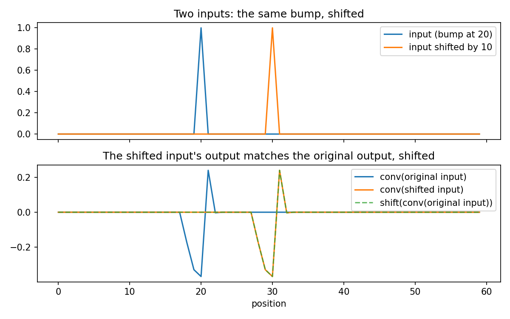
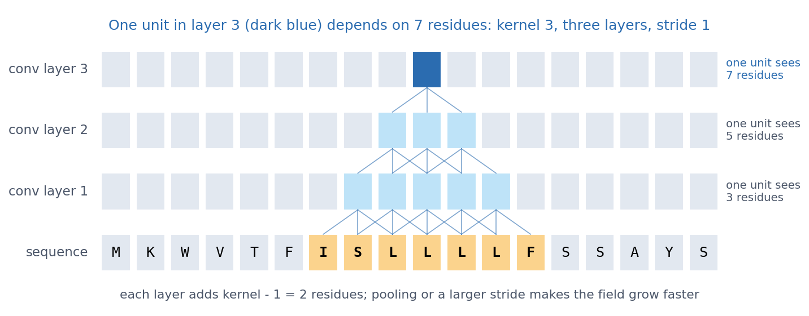
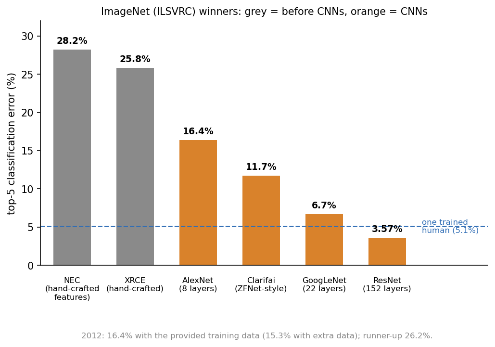
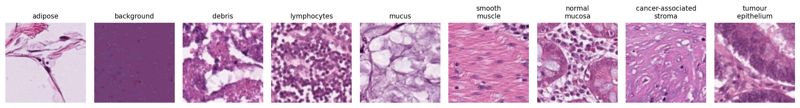
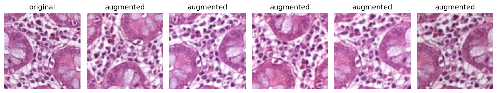
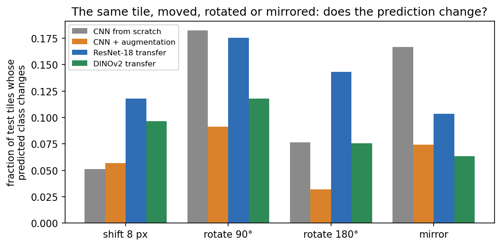
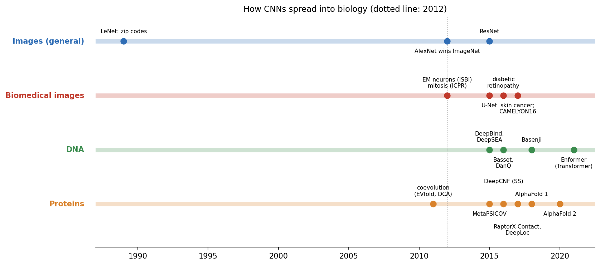
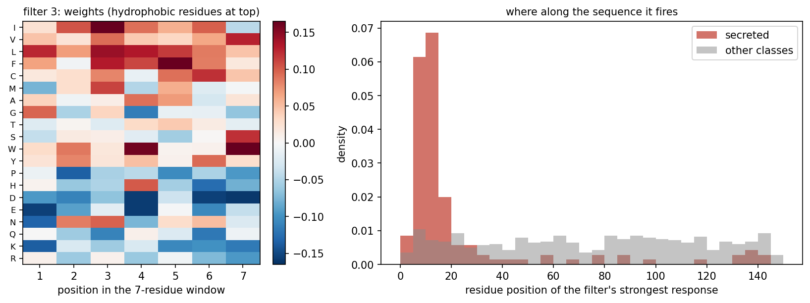
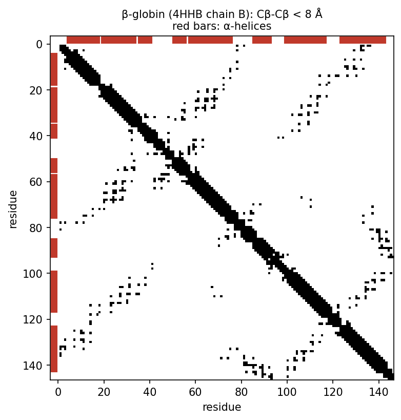

::: callout-note
**Sources for this page:** d2l.ai, *Dive into Deep Learning*, [Convolutional Neural Networks](https://d2l.ai/chapter_convolutional-neural-networks/index.html) and [Modern Convolutional Neural Networks](https://d2l.ai/chapter_convolutional-modern/index.html) — CC BY-SA 4.0. Every historical number on this page is taken from the primary paper or the official challenge report, cited where it is used (ImageNet: Russakovsky et al. 2015, [*IJCV* 115:211-252](https://doi.org/10.1007/s11263-015-0816-y)). Lab results quoted on the page come from the executed solution of the Session 10 lab (BloodMNIST, Yang et al. 2023, CC BY 4.0). Data: colorectal-cancer histology tiles NCT-CRC-HE-100K and CRC-VAL-HE-7K (Kather, Halama & Marx 2018, [Zenodo](https://doi.org/10.5281/zenodo.1214456), CC BY 4.0; a small subset is kept in the course repository), Sessions 8-9's UniProt localization dataset, and PDB entry [4HHB](https://www.rcsb.org/structure/4HHB) (hemoglobin, CC0). The ImageNet-trained ResNet-18 weights come from `torchvision`, and the DINOv2 weights (Apache 2.0) from Hugging Face. The classic-architecture and transfer-learning material draws on Magnus Ekman's *Learning Deep Learning* (ch. 7-8 slide decks and `notebooks/ch07.ipynb`/`ch08.ipynb`), a copyrighted, not openly licensed textbook, credited here as an internal source and not linked. All figures were drawn or computed for this course. Every number from our own code was read back from the notebook's output.
:::

# Session 10: CNNs, and How They Took Over Biology

::: {.callout-tip icon="false"}
## Translation

> **Why did the CNN fail its language exam?** It was only translation-equivariant.
:::

## Learning goals

By the end of this session you should be able to:

- explain why convolution is useful (locality, weight sharing, far fewer weights), and count the weights of a dense and a convolutional layer;
- read image and sequence tensor shapes, and say what kernel size, padding, stride, pooling and the number of filters do;
- distinguish **equivariance** from **invariance**: convolution is equivariant, local pooling adds some tolerance to small shifts, and global pooling turns position-wise features into a position-invariant summary;
- explain how stacking convolutions enlarges the **receptive field**, so that simple local patterns combine into larger ones;
- explain why a CNN can beat a much larger dense network, and why augmentation should encode only label-preserving transformations;
- interpret a first-layer sequence filter as a learned position weight matrix, and say what global pooling throws away when a motif's position matters;
- say what a residual connection does.

The central message of this session is that a dense layer learns a separate weight for every position, while **a convolutional layer assumes that nearby inputs belong together and reuses the same small detector at every position.** This built-in assumption is why CNNs need fewer weights and less data.

## Why convolution? {#sec-s10-convolution}

### The problem with dense layers

Every model so far gives every input position its own weight. For the 150-residue one-hot sequences of Sessions 8-9, that means 3,000 weights per hidden unit, and for a $224 \times 224$ colour image over 150,000. The same feature detector must then be learned separately at every position, and neighbouring pixels or residues are treated as being as unrelated as distant ones.

### A small detector, reused everywhere

A **convolutional layer** instead slides a small **kernel** (say 3 × 3 pixels, or 7 residues) across every position, using *the same weights* everywhere. Its number of weights therefore does not depend on the input length. The table compares one layer of each kind on the localisation data (150 residues × 20 amino acids):

| Layer | Weights | Count |
|------------------------|------------------------|------------------------|
| Dense, 3,000 inputs → 64 units | inputs × outputs + biases | 3,000 × 64 + 64 = **192,064** |
| Convolution, 20 channels → 32 filters, kernel 7 | kernel × input channels × filters + biases | 7 × 20 × 32 + 32 = **4,512** |

: The number of weights in one dense and one convolutional layer on the localisation data. {#tbl-s10-weights}

The convolution has 40 times fewer weights, and it keeps that number for a protein of any length. (Whole networks are less simple. In the lab, *adding* a convolutional layer makes the network smaller, because the following dense layer receives a smaller feature map.)

**Shapes.** A batch of images is a tensor **B × C × H × W** (batch, channels, height, width, with C = 3 for colour), and a batch of sequences is **B × C × L** (C = 20 for one-hot protein, 4 for DNA). A size-7 kernel on protein therefore has 20 × 7 weights, one per amino acid per position. A layer has several kernels (**filters**), and each produces one output channel, that is, one learned feature type. Four more settings control a convolutional layer:

- **kernel size**: the width of the local window;
- **padding**: zeros added at the edges, so that the output can keep the input's length;
- **stride**: how far the kernel moves between steps (1 = every position);
- **pooling**: replacing small regions by their maximum or mean, which shrinks the feature map.

### Equivariance is not invariance

If the input shifts, a shared kernel sees the same pattern somewhere else, so its output shifts by the same amount. This **translation equivariance** comes from weight sharing itself, and it holds even for a random, untrained kernel:

{#fig-session10-conv-equivariance width="85%"}

Equivariance is not invariance, however. The feature is found, but *where* it is found still differs, and what happens to that position depends on the rest of the network:

{#fig-session10-position width="100%"}

- **Local pooling** (for example 2 × 2 max pooling) gives **some tolerance to small shifts**, because a pattern that moves by one pixel often stays in the same pooling window.
- **Flatten followed by a dense layer** brings absolute position back, because every position of the final feature map gets its own weight. In the lab, CNNs trained on blood cells pasted into one corner reach 0.77-0.86 accuracy on corner cells but only 0.18-0.29 on cells at random positions, close to always guessing the most common class (0.198).
- **Global average pooling** averages each feature map over all positions, giving one number per filter. The network then asks "was this feature present?", not "was it present at position 17?". The result is a **position-invariant summary**, used by the localisation CNN below.

Rotation is a different matter, because nothing in convolution or pooling handles it.

### Stacking convolutions: the receptive field

A single layer sees only the window of its kernel, but stacking layers widens the view. A unit in a second convolutional layer combines several first-layer units, each with its own window, so it depends on a wider stretch of the input, its **receptive field**.

{#fig-session10-receptive-field width="100%"}

With kernel size *k* and stride 1, every layer adds *k* − 1 positions, and pooling and larger strides make the receptive field grow faster. This is how deep CNNs build complex patterns from simple ones: edges, shapes and objects in images, and motifs and then combinations of motifs in DNA and proteins. The second discussion problem asks how wide the window must be for a signal peptide.

#### Further watching

[*But what is a convolution?*](https://www.youtube.com/watch?v=KuXjwB4LzSA) (3Blue1Brown): convolution from probability to image blurring, the same sliding weighted sum a CNN learns:

```{=html}
<div style="position:relative;padding-bottom:56.25%;height:0;overflow:hidden;max-width:100%;margin-bottom:1em;">
<iframe src="https://www.youtube.com/embed/KuXjwB4LzSA" style="position:absolute;top:0;left:0;width:100%;height:100%;border:0;" allowfullscreen title="But what is a convolution?, 3Blue1Brown"></iframe>
</div>
```

### What actually happened: from LeNet to ResNet

**LeNet** (LeCun et al. 1989, [*Neural Computation* 1:541-551](https://doi.org/10.1162/neco.1989.1.4.541)) already read handwritten zip codes. The breakthrough for natural images, however, came in the 2012 **ImageNet** challenge (1.2 million photos, 1,000 classes):

{#fig-session10-imagenet-history width="80%"}

- **AlexNet** (Krizhevsky, Sutskever & Hinton 2012, [NIPS 25](https://papers.nips.cc/paper/2012/hash/c399862d3b9d6b76c8436e924a68c45b-Abstract.html)) cut the error by about 10 percentage points by combining convolution with ReLU, dropout (Session 9), data augmentation and GPUs.
- **VGG** (2014) used deep stacks of small 3 × 3 convolutions, which give large receptive fields from small kernels.
- **ResNet** (He et al., [CVPR 2016](https://arxiv.org/abs/1512.03385)) introduced **residual connections**. Each block learns a correction to its input and returns $x + F(x)$, so the gradient has a short path back and 100+ layers become trainable. In the lab, a three-block ResNet beats a three-block VGG network (0.771 against 0.722).

The lesson is architectural: **convolution + depth + data + GPUs**, with residual connections making the depth trainable.

#### Further reading

- d2l.ai, [Modern Convolutional Neural Networks](https://d2l.ai/chapter_convolutional-modern/index.html) (AlexNet, VGG, ResNet in detail)
- Russakovsky et al. (2015), [ImageNet Large Scale Visual Recognition Challenge](https://arxiv.org/abs/1409.0575)

## What assumptions does a CNN build in? {#sec-s10-assumptions}

### More weights are not better: dense vs. CNN on blood cells

The lab trains five models on the same BloodMNIST blood-cell images, and the result shows that more weights are not better. The best dense network, with two hidden layers of 256 units and **670,216 weights**, reaches a validation accuracy of 0.797. A small CNN with two convolution blocks and only **17,640 weights** reaches **0.887**. The CNN wins with 38 times fewer weights because it does not have to learn locality and weight sharing from the data, since they are built in. This is Session 9's lesson again, seen from the other side: more weights do not help, but the right assumptions do.

### Few labels: transfer learning on cancer histology

Biology rarely has 1.2 million labelled images. Kather et al. (2019, [*PLoS Med* 16:e1002730](https://doi.org/10.1371/journal.pmed.1002730)) cut H&E-stained slides of colorectal cancer into small tiles and labelled each with one of **nine tissue types**:

{#fig-session10-crc-classes width="100%"}

To imitate a small dataset, the notebook pretends that we have only **40 labelled tiles per class** for training and 40 for validation, all from the same 86 slides. It tests on 100 tiles per class from **50 other patients**:

| Approach | Validation accuracy | Test accuracy (new patients) |
|------------------------|------------------------|------------------------|
| Small CNN from scratch (242,697 weights) | 0.861 | 0.745 (three seeds: 0.721-0.786) |
| Same CNN + data augmentation | 0.855 | 0.792 (three seeds: 0.769-0.821) |
| Transfer: frozen ImageNet ResNet-18 + new last layer | 0.856 | 0.780 |
| Transfer: frozen DINOv2 + new last layer | 0.917 | **0.832** |

: Colorectal-cancer tissue classification from few labelled tiles: training from scratch and transfer learning. {#tbl-s10-transfer}

- **From scratch**, the CNN memorises its 360 training tiles. With so little data, the random seed alone moves its test accuracy by more than 6 percentage points.
- **Data augmentation** (below) helps on average, though not in every seed.
- **Transfer learning** is what the field actually did. The layers of a network trained on millions of images are kept frozen, as a feature extractor, and only a new last layer is trained. ResNet-18 never saw a tissue tile, yet its features match the augmented CNN.
- **Validation from the same slides, test from new patients.** Every model scores clearly higher on validation than on test, because the validation tiles share patients, staining runs and scanner with the training tiles. This is Session 8's homology trap again. When examples come in groups (proteins in families, tiles in patients), the honest split is by group.

::: callout-note
#### Transfer learning from very large image collections

A network trained on a huge image collection has learned features that are useful for a new task with few labels. DINOv2 (Oquab et al. 2023, [arXiv:2304.07193](https://arxiv.org/abs/2304.07193)) was trained on 142 million images *without any labels* (self-supervised), and its features still work best on tissue it has never seen. Such reusable models are called **foundation models**, and Session 11 shows the same recipe for proteins.
:::

### Which transformations should not matter?

A CNN handles small shifts through its architecture, but everything else it must learn from data. **Data augmentation** is how we tell it what should not matter: in every epoch, the network sees a slightly changed copy of every training image, with the same label. Augmentation should therefore encode only transformations that **preserve the label**, which is a statement about the biology, not about the network. A tissue section or a blood cell on a slide has no "up", so rotations and mirror images are valid, and small colour changes imitate staining differences between labs. A handwritten 6 rotated by 180° becomes a 9, however, so the same augmentation would be wrong for digits.

{#fig-session10-augmentation width="85%"}

Does the network need augmentation? The notebook counts how often the **predicted class changes** when the same test tile is shifted, rotated or mirrored. An invariant classifier would change none:

{#fig-session10-rotation-shift width="80%"}

Without augmentation, an 8-pixel shift changes the CNN's answer for 5% of tiles, but a 90° rotation changes it for 18% and a mirror image for 17%. Training with rotated and mirrored copies roughly halves the last two (9% and 7%), so the network has learned from data a symmetry that the architecture could not give it. The pretrained networks are not rotation-invariant either, since their training photos are almost always upright. This is why histology pipelines augment with all rotations and flips, and why rotation-equivariant CNNs were developed for pathology (Veeling et al. 2018, [MICCAI](https://doi.org/10.1007/978-3-030-00934-2_24)).

## CNNs on biological sequences {#sec-s10-biology}

### Filters become motifs

A first-layer filter on one-hot DNA has shape 4 × *k*, with one weight per base per position. Sliding it along the sequence is exactly how a **position weight matrix** scores a sequence (Session 5), except that the matrix is learned instead of counted from aligned sites. Two examples show this:

- **DeepBind** (Alipanahi et al. 2015, [*Nat Biotechnol* 33:831](https://pubmed.ncbi.nlm.nih.gov/26213851/)) trained CNNs on protein-DNA and protein-RNA binding data, and its learned specificities could be "readily visualized as … position weight matrices".
- **DeepSEA** (Zhou & Troyanskaya 2015, [*Nat Methods* 12:931](https://pubmed.ncbi.nlm.nih.gov/26301843/)) read 1,000 bp of sequence and predicted 919 chromatin features at once. Comparing its predictions for the reference and a mutated sequence scores the effect of a **non-coding variant**.

Later networks found that many of their filters matched known transcription-factor motifs, rediscovered from sequence alone. Longer-range models needed larger receptive fields and, eventually, Transformers (Session 11).

{#fig-session10-cnn-biology-timeline width="100%"}

The spread was as fast in biomedical imaging. **U-Net** (Ronneberger et al. 2015, [arXiv:1505.04597](https://arxiv.org/abs/1505.04597)) became the standard for segmenting cells and tissues, and ImageNet-pretrained CNNs fine-tuned on retinal, skin or pathology images reached expert level on the tasks they were trained for (e.g. Esteva et al. 2017, [*Nature* 542:115](https://pubmed.ncbi.nlm.nih.gov/28117445/)).

### Proteins: our own CNN finds the signal peptide

The same idea works on protein sequences. The localisation network of Sessions 8-9 becomes a 1D CNN with two convolutional layers of 7-residue filters, followed by global average pooling and a linear layer to the five classes. It is trained and evaluated exactly as in Session 9, on the same homology-aware split:

| Metric | Session 9: flat network | Session 9: logistic regression | Session 10: 1D CNN |
|------------------|------------------|------------------|------------------|
| Weights | 192,389 | 15,005 | **19,237** |
| Test accuracy | 0.514 | 0.569 | **0.587** |
| Macro F1 | 0.493 | — | **0.586** |
| MCC | 0.394 | 0.461 | **0.484** |
| Macro AUROC | 0.831 | 0.849 | **0.869** |

: The CNN compared with the models of Session 9 on the localisation data. {#tbl-s10-localisation}

The CNN beats the flat network on every metric with a tenth of the weights. It does so because it builds in an assumption instead of learning 192,389 free weights from 486 proteins: the same local pattern can be detected with the same weights wherever it occurs. Its margin over logistic regression, in contrast, is within the noise of a 109-protein test set (retraining from other random initial weights gave 0.569-0.587). The robust finding is therefore the gap to the flat network.

**What did it learn?** Each first-layer filter is a 20 × 7 matrix, that is, a learned PWM over a 7-residue window. The five filters most selective for secreted proteins correlate with the Kyte-Doolittle hydrophobicity scale at r = 0.70-0.83 (all 32 filters: mean r = 0.12). They fire at a median residue position of 11-12 in secreted proteins, against 62-76 elsewhere:

{#fig-session10-signal-filter width="100%"}

Nobody told the network about signal peptides, yet it found a detector for their hydrophobic core on its own, just as the DNA filters rediscovered transcription-factor motifs. Each unit of its second layer sees 20 residues (7 in layer 1, then 2× pooling and another 7-wide kernel), about the length of a signal peptide.

**But position matters in proteins.** Convolution assumes that a pattern can be *detected* the same way everywhere, not that it *means* the same thing everywhere. A hydrophobic stretch at the N-terminus is a signal peptide, whereas in the middle of a protein it may be a transmembrane helix, and some targeting signals sit specifically at the C-terminus. Global average pooling throws away *where* the filter fired, so our network only knows that a hydrophobic stretch occurred somewhere. **If signal peptides matter at the N-terminus, what has the network lost, and how could you give it back?** Later layers, positional features or position-aware pooling are options. Session 11's models, which read the sequence in order and encode position explicitly, return to signal peptides in depth.

The real tool, DeepLoc (Almagro Armenteros et al. 2017, [*Bioinformatics* 33:3387](https://pubmed.ncbi.nlm.nih.gov/29036616/)), puts convolutions first and a bidirectional LSTM with attention (Session 11) after them, so that the order-aware part restores position.

#### Further reading

- Zhou & Troyanskaya (2015), [Predicting effects of noncoding variants with deep learning-based sequence model](https://pubmed.ncbi.nlm.nih.gov/26301843/)
- Kelley, Snoek & Rinn (2016), [Basset](https://pubmed.ncbi.nlm.nih.gov/27197224/)
- Wikipedia, [U-Net](https://en.wikipedia.org/wiki/U-Net)

## Beyond sequences: a contact map is an image {#sec-s10-structure}

Convolution is not limited to sequences and photographs. A **contact map** is an $L \times L$ grid with one pixel per residue pair, set to 1 if the two residues are close in the structure (Cβ atoms within 8 Å). You first saw this representation in Session 6. For the β chain of haemoglobin (PDB 4HHB) it looks like this:

{#fig-session10-hbb-contact-map width="60%"}

Contacts form local patterns, as helices give bands and strand pairs give lines along or across the diagonal. Once a protein is an $L \times L$ map, 2D convolutions are therefore a natural way to predict it. From 2016, deep residual CNNs that predict contact and distance maps transformed structure prediction, and Session 12 tells that story. The third discussion problem asks you to read fold classes from contact maps.

## Check your understanding

```{=html}
<div id="session10-quiz"></div>
<script>
renderQuiz("session10-quiz", [
  {
    question: "Why does a convolutional layer need far fewer weights than a fully connected layer on the same input?",
    choices: [
      "It slides the same small kernel over every position (weight sharing) instead of learning a separate weight per position",
      "It only looks at half of the input",
      "It discards the least useful positions automatically",
      "It stores its weights with fewer bits"
    ],
    correctIndex: 0,
    explanation: "Weight sharing is what cuts the count: 19,237 weights for the localisation CNN vs. 192,389 for the flat network on the same input."
  },
  {
    question: "A CNN classifies a tissue tile the same way when the tile is shifted by a few pixels, but changes its answer for many tiles when they are rotated by 90 degrees. Why?",
    choices: [
      "Shared kernels make the features shift with the input, and pooling adds tolerance to small shifts; nothing in the architecture handles rotation, so it must be learned from (augmented) rotated examples",
      "Rotated images always contain black corners",
      "CNNs only work on square images",
      "The kernels are too small to see rotated objects"
    ],
    correctIndex: 0,
    explanation: "This is why rotation is a standard data augmentation, especially for microscopy and histology where there is no natural 'up'."
  },
  {
    question: "A CNN trained on blood cells pasted in one corner of the image fails on cells at random positions, although convolution is translation-equivariant. Why?",
    choices: [
      "The final Flatten + Linear layer gives every position its own weight, so features in new positions meet weights that were never trained; local pooling adds only a few pixels of tolerance",
      "Convolution stops being equivariant after training",
      "The cells at random positions have different colours",
      "Pooling removes the cells from the image"
    ],
    correctIndex: 0,
    explanation: "Equivariance is not invariance. Global average pooling, which averages each feature map over all positions, would make the summary position-invariant."
  },
  {
    question: "Three stacked 1D convolutions with kernel size 3 and stride 1: how many input residues does one unit in the third layer depend on?",
    choices: ["7", "3", "9", "27"],
    correctIndex: 0,
    explanation: "Each layer adds kernel - 1 = 2 positions: 3, then 5, then 7. Stacking enlarges the receptive field, so deeper units combine simple local patterns into larger ones."
  },
  {
    question: "With 40 labelled histology tiles per class, which approach gave the best test accuracy on tiles from new patients?",
    choices: [
      "A frozen DINOv2 (self-supervised on 142 million unlabelled images) with a newly trained last layer",
      "A small CNN trained from scratch",
      "The same small CNN with data augmentation",
      "A frozen ImageNet ResNet-18 with a newly trained last layer, by a wide margin over everything else"
    ],
    correctIndex: 0,
    explanation: "DINOv2 reached 0.832, against 0.780 for ResNet-18, 0.792 for the augmented CNN and 0.745 for the CNN from scratch. Features learned on huge image collections transfer to new tasks, even without any labels during pretraining."
  },
  {
    question: "Every model scored higher on the validation tiles (from the same slides as the training tiles) than on the test tiles (from 50 other patients). What does this show?",
    choices: [
      "Tiles from the same patient share staining, scanner and tissue features, so validation on them is optimistic; the honest split is by patient, like Session 8's homology-aware split",
      "The test tiles are mislabelled",
      "The models were trained on the test set",
      "Validation accuracy is always higher than test accuracy, whatever the split"
    ],
    correctIndex: 0,
    explanation: "When examples come in related groups (proteins in families, tiles in patients), random splits leak information between training and evaluation."
  },
  {
    question: "Rotating training images is a good augmentation for blood cells but a bad one for handwritten digits. Why?",
    choices: [
      "Augmentation should only use transformations that preserve the label: a rotated cell is still the same cell type, but a 6 rotated by 180 degrees becomes a 9",
      "Digits are smaller than cells",
      "CNNs cannot be trained on rotated digits",
      "Rotation is only allowed for colour images"
    ],
    correctIndex: 0,
    explanation: "Which transformations should not matter is a property of the data and the biology, not of the network."
  },
  {
    question: "The localisation CNN detects the hydrophobic core of signal peptides and then averages each filter's output over the whole sequence (global average pooling). What does that throw away?",
    choices: [
      "Where the filter fired: an N-terminal signal peptide and a hydrophobic transmembrane helix in the middle of the protein look the same after pooling",
      "The amino-acid identities in the 7-residue window",
      "The number of training proteins",
      "Nothing: global pooling keeps all position information"
    ],
    correctIndex: 0,
    explanation: "Convolution assumes a pattern can be detected the same way everywhere, not that it means the same everywhere. Positional features, later layers or position-aware models (Session 11) can restore the position."
  },
  {
    question: "The first-layer filter of the localisation CNN that responds most strongly in secreted proteins has large weights for L, I, V and F, and fires around residues 10-15. What has it learned?",
    choices: [
      "A detector for the hydrophobic core of an N-terminal signal peptide: a learned PWM",
      "A detector for nuclear localisation signals",
      "Nothing: first-layer weights are random",
      "The protein's total length"
    ],
    correctIndex: 0,
    explanation: "The filter has learned the hydrophobic core of a signal peptide, a biological signal nobody told the network about."
  },
  {
    question: "DeepSEA predicts 919 chromatin features from 1,000 bp of DNA. How does it score the effect of a single non-coding variant?",
    choices: [
      "By comparing its predictions for the reference sequence and for the sequence carrying the variant",
      "By looking the variant up in a database of known mutations",
      "By counting how often the variant occurs in the population",
      "It cannot score single variants"
    ],
    correctIndex: 0,
    explanation: "A trained sequence model can be asked 'what if' questions: change one base and see how the predicted chromatin profile changes."
  }
]);
</script>
```

## The course notebook

`notebooks/session10-cnns-in-code.ipynb` computes every number on this page:

1.  the equivariance demonstration; cancer histology from scratch, with augmentation and with transfer learning (ResNet-18, DINOv2); the shift/rotation test;
2.  the localisation 1D CNN on the homology-aware split, and its first-layer filters;
3.  the contact map of β-globin (PDB 4HHB).

The first part of the notebook trains a small CNN six times for 100 epochs, so use a GPU runtime on Colab (*Runtime → Change runtime type*), or lower `EPOCHS` on a CPU. Open it in [Google Colab](https://colab.research.google.com/github/ElofssonLab/kb8029-book/blob/main/notebooks/session10-cnns-in-code.ipynb) via the badge at the top of the notebook page.

## The lab

**Full lab, on blood-cell images** (BloodMNIST, as in the Session 8 and 9 labs). The lab is adapted from the previous course's "Neural Networks" lab. Work through [`notebooks/session10-lab.ipynb`](https://colab.research.google.com/github/ElofssonLab/kb8029-book/blob/main/notebooks/session10-lab.ipynb), replacing every `todo(...)` call with your own code:

1.  count the weights of a dense and a convolutional layer, then of whole models, and see why adding a convolutional layer can make the whole model *smaller* (the next dense layer receives a smaller feature map);
2.  train four models side by side, two dense networks of 23,000 and 302,000 weights, a one-layer convolutional network and a small CNN, and see that the CNN, with 17,640 weights, beats them all;
3.  find out how many unpadded 5×5 convolutions fit on a 28×28 image;
4.  build a VGG block, and test it on cells placed at positions it never saw during training, before and after training on randomly placed cells, to see that equivariance is not invariance.

Two optional extras, which are not part of the quiz, follow if you have time. In the first you build a ResNet block with a skip connection and compare it with VGG. In the second you rotate and mirror the cells and measure what augmentation buys you.

### Submitting this lab

This lab is administered through Canvas, not through this book. See the course's Canvas page for the current quiz, the deadline and how to submit.

## What's next

CNNs are excellent when local patterns matter, but they see only as far as their receptive field, and global pooling forgets where things were. Session 11 turns to models that read a whole sequence *in order* and relate distant positions: recurrent networks and LSTMs, the history of language models, and the Transformer. SignalP, from its 1995 feed-forward network to its 2022 protein language model, follows that whole history.