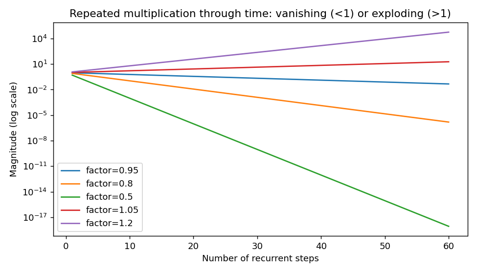
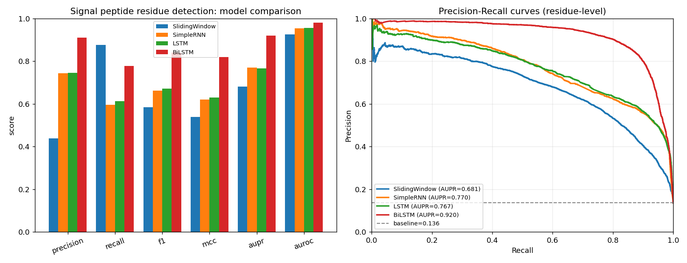
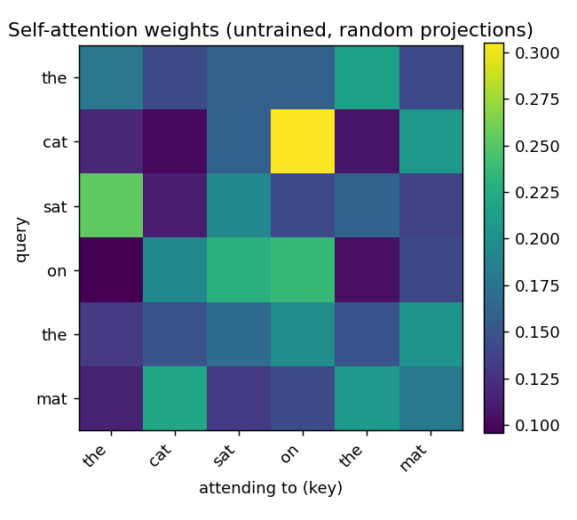
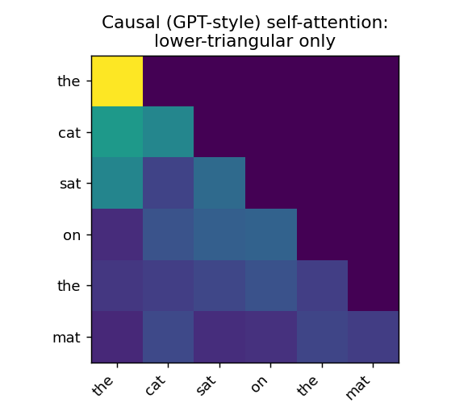
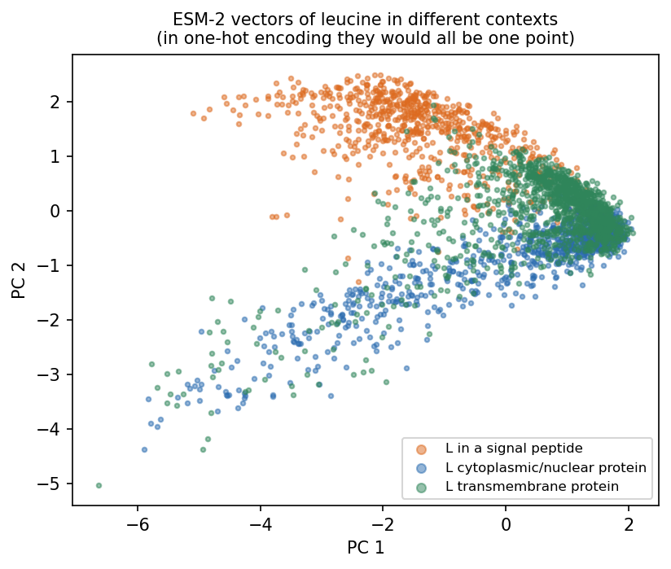
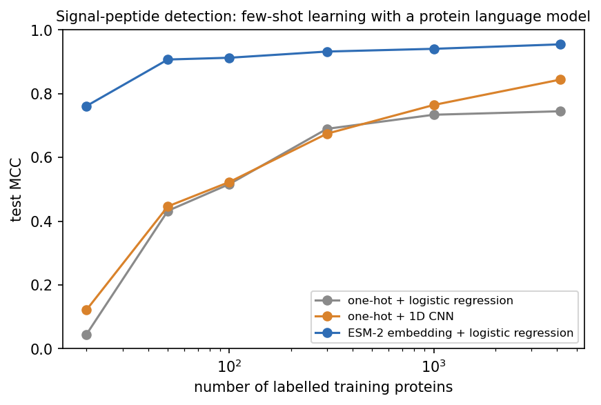
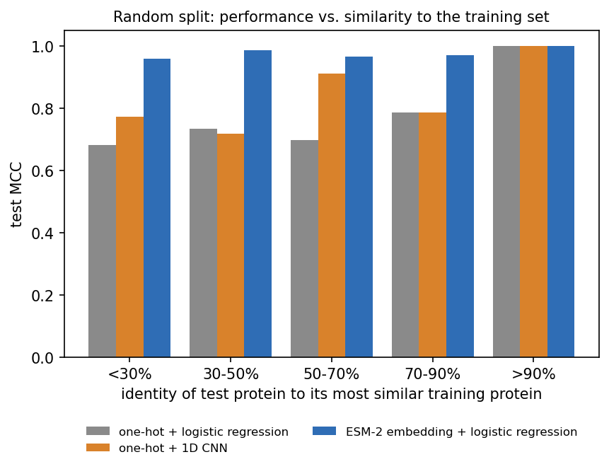

::: callout-note
**Sources for this page:** d2l.ai, *Dive into Deep Learning*, [Recurrent Neural Networks](https://d2l.ai/chapter_recurrent-neural-networks/index.html), [Modern Recurrent Neural Networks](https://d2l.ai/chapter_recurrent-modern/index.html) and [Attention Mechanisms and Transformers](https://d2l.ai/chapter_attention-mechanisms-and-transformers/index.html) — CC BY-SA 4.0. The history of SignalP follows Nielsen, Teufel, Brunak & von Heijne (2024), ["SignalP: The Evolution of a Web Server"](https://doi.org/10.1007/978-1-0716-4007-4_17), *Methods Mol Biol* 2836:331-367, a history written by the SignalP authors themselves (copyrighted; its findings are described and cited here, and its figures are not reproduced). Every other historical number is taken from the primary paper, cited where it is used. Data: 4,910 reviewed UniProt entries (CC BY 4.0), a copy of which is kept in the course repository; the pretrained ESM-2 model (Lin et al. 2023) via `fair-esm`. 3Blue1Brown's videos on language models, Transformers and attention are embedded as further watching. The recurrent-network and attention material follows ideas from Magnus Ekman's *Learning Deep Learning* (ch. 9-12 slide decks and notebooks), a copyrighted, not openly licensed textbook, credited here as an internal source and not linked. Every number from our own code was read back from the notebook's output.
:::

# Session 11: Sequences, Language Models and SignalP

::: {.callout-tip icon="false"}
## Attention

> "Attention is all you need." — every Transformer, and every teacher during a lecture.
:::

## Learning goals

By the end of this session you should be able to:

- explain how a recurrent network carries context along a sequence, why its gradients can vanish or explode, and what the LSTM's additive memory path changes;
- explain, for residue-level signal-peptide annotation, why a bidirectional LSTM beats a forward-only one, and when a bidirectional model is impossible;
- explain what a language model learns without labels, the difference between masked (BERT-style) and next-token (GPT-style) models, and how attention lets every position consult every other;
- explain what a **contextual embedding** is, and why the same amino acid gets different vectors in different proteins;
- explain, from the classroom version of SignalP 6.0's idea, why pretrained protein-language-model embeddings help most when labelled proteins are scarce.

The whole session answers two questions:

1.  **How can a model use context from the rest of a biological sequence?**
2.  **How can we learn useful biological representations when labels are scarce but unlabelled sequences are abundant?**

Session 10's CNNs share local detectors and widen their receptive field with depth. But what if residue 10 needs information from residue 200? There are three ways to bring in such context, and this session covers the last two:

{#fig-session11-context width="100%"}

## How can a model remember sequence context? {#sec-s11-rnn}

### A hidden state carried along the sequence

The first way to carry context is to remember it. A **recurrent neural network (RNN)** reads a sequence one position at a time and keeps a **hidden state**, a vector that summarises what it has read so far. At every position it updates this memory from the current residue and the old memory, **new memory = function(current residue, old memory)**, and it uses the same weights at every position:

$$
h_t = \tanh(W_{xh} x_t + W_{hh} h_{t-1} + b_h)
$$

In the notebook, each residue $x_t$ enters as a learned **embedding** of 24 numbers (`nn.Embedding`, a trainable vector per amino acid instead of a one-hot vector), and the hidden state $h_t$ has 48 numbers. $W_{xh}$ is therefore 48 × 24 and $W_{hh}$ is 48 × 48, whatever the length of the protein, so one network handles sequences of any length.

#### Why gradients vanish or explode through time

Carrying context through many steps has a cost during training. Training an RNN means backpropagating through every step it took (**backpropagation through time**). The gradient that reaches an early position is a product of many factors, one per step, each involving the recurrent weights and the derivative of the activation. If their effective size is repeatedly below 1, the product tends to vanish, and if it is above 1, the product can explode. This is Session 9's vanishing-gradient problem again, now along the sequence instead of through the layers. A single repeated factor shows the scale of the effect:

{#fig-session11-vanishing-exploding width="80%"}

### LSTM: an additive memory path

The **Long Short-Term Memory** network (Hochreiter & Schmidhuber, 1997, [*Neural Computation* 9:1735](https://doi.org/10.1162/neco.1997.9.8.1735)) was designed to solve this problem. It adds a separate memory, the **cell state**, which is updated by *adding* to it rather than by recomputing it. Small sigmoid **gates** decide what to keep, what to add and what to expose. Because the memory is carried forward by addition, the error signal can flow back over many steps without shrinking at every one. LSTMs therefore make much longer dependencies trainable than a simple RNN can, although how long in practice depends on the task. The notebook writes the gate equations out and checks them against PyTorch's `nn.LSTMCell`. A **GRU** is a later, simpler gated recurrent network, with fewer gates and no separate cell state.

An LSTM that reads from left to right still knows only what came *before* each position. A **bidirectional LSTM** (Schuster & Paliwal, 1997) removes this limitation. It runs one LSTM from left to right and another from right to left, and it combines them at every position, so each position also sees what comes *after* it.

### Case study: which residues belong to a signal peptide?

A good test case for these models is the signal peptide. **Signal peptides** are short N-terminal sequences that send a protein into the secretory pathway, a discovery for which Günter Blobel received the [1999 Nobel Prize](https://www.nobelprize.org/prizes/medicine/1999/summary/). They have three regions: a positively charged **n-region**, a hydrophobic **h-region**, and a polar **c-region** that ends at the cleavage site. Our dataset has 4,910 reviewed UniProt proteins from eukaryotes and bacteria, in three groups:

- 1,936 proteins with an **experimentally supported** signal peptide (ECO:0000269). Many UniProt signal peptides are predicted by SignalP itself, and training on those would teach a model to imitate SignalP.
- 1,988 cytoplasmic or nuclear proteins.
- 986 transmembrane proteins. These are *hard* negatives, because a transmembrane helix is also a hydrophobic stretch.

The split is homology-aware (Session 8). The proteins fall into 3,205 MMseqs2 clusters at 30% identity, which are divided into 3,432 training, 737 validation and 741 test proteins. Each of the first 70 residues is labelled as signal peptide or not:

| Model (per-residue labelling, test set) | Weights | MCC | AUPR |
|----|----|----|----|
| Sliding window (15 residues) + linear classifier | — | 0.539 | 0.681 |
| Simple RNN | 4,105 | 0.620 | 0.770 |
| LSTM | 14,761 | 0.631 | 0.767 |
| **Bidirectional LSTM** | 29,017 | **0.820** | **0.920** |

: Per-residue signal-peptide labelling on the test set. {#tbl-s11-models}

{#fig-session11-model-comparison width="100%"}

**Why does reading both directions help so much?** Think of residue 3, in the n-region. When a forward LSTM labels it, it has seen only "M-x-x", and nothing yet of the hydrophobic h-region that identifies a signal peptide. Whether residue 3 belongs to a signal peptide is decided by what comes *after* it. The first discussion problem measures this effect. The forward LSTM mislabels 76% of the first five residues of signal peptides, and the bidirectional one only 12%. Near the cleavage site, in contrast, both err about equally often (0.20 and 0.23). The forward model also labels the N-terminus of many proteins without a signal peptide as part of one, because it cannot yet see that no h-region follows.

SignalP 5.0 (2019) was built from these parts. It is a deep network with a bidirectional LSTM and, on top, a **conditional random field** (CRF). The CRF is a structured output layer that favours biologically plausible label sequences, for example a signal peptide that starts at residue 1 and does not stop and restart.

#### Further reading

- d2l.ai, [Modern Recurrent Neural Networks](https://d2l.ai/chapter_recurrent-modern/index.html) (LSTM, GRU, bidirectional RNNs)
- Wikipedia, [Long short-term memory](https://en.wikipedia.org/wiki/Long_short-term_memory)

## Can we learn from sequences without labels? {#sec-s11-lm}

So far every model has needed labels, such as residues marked as signal peptide by experiment. Labels are expensive, but sequence databases hold hundreds of millions of unlabelled proteins (Session 3). Can a model learn useful biology from the sequences alone?

### What a language model is

A **language model** learns the regularities of sequences by predicting missing or future tokens, without any biological labels, so the sequences provide their own training signal. There are two kinds:

- **autoregressive** (GPT-style) models predict the *next* token from the previous ones;
- **masked** (BERT-style) models, including protein models such as ESM-2, hide some tokens and predict them from the context on *both* sides.

To predict well, a model must learn what tends to go with what. These learned regularities are stored in its internal vectors (**embeddings**), and they turn out to be useful for many other tasks.

**A tiny one, in the notebook.** An LSTM trained to predict the next residue reaches 4.071 bits per residue on the test proteins. This is only a little better than knowing the amino-acid composition (4.164 bits). Large models get much further, with far more data and a better architecture.

#### Further watching

[*Large Language Models explained briefly*](https://www.youtube.com/watch?v=LPZh9BOjkQs) (3Blue1Brown): a short overview of what a language model is and how it is trained:

```{=html}
<div style="position:relative;padding-bottom:56.25%;height:0;overflow:hidden;max-width:100%;margin-bottom:1em;">
<iframe src="https://www.youtube.com/embed/LPZh9BOjkQs" style="position:absolute;top:0;left:0;width:100%;height:100%;border:0;" allowfullscreen title="Large Language Models explained briefly, 3Blue1Brown"></iframe>
</div>
```

### Attention, from scratch

The better architecture is built on attention. For every position, **self-attention** asks: *which other positions should I take information from?* For residue *i* it:

1.  compares residue *i* with every residue *j*;
2.  gives each *j* a relevance score;
3.  normalises the scores so that they sum to 1 (softmax);
4.  updates residue *i* with a weighted average of what the other residues contribute.

To do this, each residue's vector is turned into three vectors by learned linear maps: a **query** (what am I looking for?), a **key** (what do I contain?) and a **value** (what do I pass on?). The score of *j* for *i* is the match between the query of *i* and the key of *j*. In matrix form, for all positions at once:

$$
\text{Attention}(Q, K, V) = \text{softmax}\!\left(\frac{QK^\top}{\sqrt{d_k}}\right) V
$$

{#fig-session11-attention-heatmap width="55%"}

Unlike an RNN, attention connects any two positions in one step, however far apart they are, and it computes all positions at once. Two cautions apply. First, a high attention weight means that residue *j* contributes strongly when residue *i* is updated. It does not prove a 3D contact, and it is not by itself a biological explanation (the second discussion problem tests how much structural signal attention maps actually carry). Second, attention by itself has no idea of *order*, so "ACDE" and "EDCA" give the same set of outputs, just shuffled. The Transformer adds the order back.

#### Further watching

[*Attention in transformers, step-by-step*](https://www.youtube.com/watch?v=eMlx5fFNoYc) (3Blue1Brown, Deep Learning ch. 6): queries, keys, values, multiple heads and the causal mask, animated:

```{=html}
<div style="position:relative;padding-bottom:56.25%;height:0;overflow:hidden;max-width:100%;margin-bottom:1em;">
<iframe src="https://www.youtube.com/embed/eMlx5fFNoYc" style="position:absolute;top:0;left:0;width:100%;height:100%;border:0;" allowfullscreen title="Attention in transformers, step-by-step, 3Blue1Brown"></iframe>
</div>
```

Going further: [*How might LLMs store facts*](https://www.youtube.com/watch?v=9-Jl0dxWQs8) (3Blue1Brown, Deep Learning ch. 7), about the feed-forward layers inside a Transformer.

### The Transformer: attention plus four tricks

Attention alone is not yet a complete model. A **Transformer** (Vaswani et al. 2017) is a stack of identical **blocks**. Each block takes one vector per token and returns one vector per token of the same size, so blocks can be stacked as deep as the budget allows.

{#fig-session11-transformer-block width="95%"}

Besides self-attention, a block uses four tricks, most of which you have met before:

- **Several heads.** Several attentions run side by side (20 in ESM-2 35M), and each is free to follow a different relationship.
- **A feed-forward network** (Session 7's MLP) is applied to every token on its own. Attention moves information *between* tokens, and the feed-forward network processes it *within* each token.
- **Residual connections and layer normalisation.** Each step adds its output to its input (Session 10's ResNet idea), so gradients survive dozens of blocks.
- **Position encoding.** Information about the position of each token is added before or inside the attention. Without it, "ACDE" and "EDCA" would look the same, and a protein model would not know which residue comes first.

The notebook's ESM-2 has 12 blocks and 480 numbers per residue (33.5 million weights), while the largest ESM-2 has 48 blocks and 15 billion weights.

**BERT vs. GPT is one mask**, and it is the same distinction as between a forward and a bidirectional LSTM. A BERT-style encoder lets every position attend to every other position and learns by filling in masked tokens. This is fine when the whole sequence is known, as in annotation. A GPT-style decoder masks out the *future*, so each position sees only earlier ones and learns by predicting the next token. This is what lets it generate sequences:

{#fig-session11-causal-mask width="45%"}

Protein language models such as ESM-2 are encoders, trained BERT-style, so every residue sees the whole sequence.

#### Further watching

[*Transformers, the tech behind LLMs*](https://www.youtube.com/watch?v=wjZofJX0v4M) (3Blue1Brown, Deep Learning ch. 5): how a GPT-style model turns tokens into vectors and predicts the next token:

```{=html}
<div style="position:relative;padding-bottom:56.25%;height:0;overflow:hidden;max-width:100%;margin-bottom:1em;">
<iframe src="https://www.youtube.com/embed/wjZofJX0v4M" style="position:absolute;top:0;left:0;width:100%;height:100%;border:0;" allowfullscreen title="Transformers, the tech behind LLMs, 3Blue1Brown"></iframe>
</div>
```

### What actually happened

These pieces arrived in a particular order. Language models started by counting which word follows which (n-grams) and then moved to recurrent networks and LSTMs that learned word vectors. **Attention** (Bahdanau, Cho & Bengio 2014, [arXiv:1409.0473](https://arxiv.org/abs/1409.0473)) was first added to recurrent translation models. The **Transformer** (Vaswani et al. 2017, [arXiv:1706.03762](https://arxiv.org/abs/1706.03762)) then kept only the attention and could process all positions in parallel. This made **large-scale pretraining** practical: a model is trained once on huge amounts of unlabelled text and then adapted to many tasks. The two branches are **GPT** (Radford et al. 2018, [paper](https://cdn.openai.com/research-covers/language-unsupervised/language_understanding_paper.pdf); next-token, causal) and **BERT** (Devlin et al. 2018, [arXiv:1810.04805](https://arxiv.org/abs/1810.04805); masked, bidirectional). Scaled up, the GPT branch became today's large language models.

### Protein language models

The same recipe works for proteins. There are hundreds of millions of unlabelled sequences, and a model that learns to fill in missing residues has to learn something about structure, function and evolution. Protein language models developed in three steps:

- **An early precursor.** SignalP's authors note that the network program their group used before SignalP could erase the central residue of a window and predict it. This was "presumably … the first machine learning language model" in biological sequence analysis (Nielsen et al. 2024).
- **Recurrent protein language models** (2019), such as UniRep and SeqVec, learned embeddings from tens of millions of unlabelled sequences.
- **Transformer protein language models** (2021 onwards) then took over. They include **ProtBERT** (Elnaggar et al. 2022, [*IEEE TPAMI* 44:7112](https://pubmed.ncbi.nlm.nih.gov/34232869/)), the model inside SignalP 6.0, and the **ESM** family. This session uses **ESM-2** (Lin et al. 2023, [*Science* 379:1123](https://pubmed.ncbi.nlm.nih.gov/36927031/); 8 million to 15 billion weights, masked language modelling). The attention maps of these models turned out to contain information about residue contacts, although they were never trained on structures (Rao et al. 2021, [ICLR](https://openreview.net/forum?id=fylclEqgvgd)). The largest ESM-2 models even predict 3D structure from a single sequence (ESMFold), which is the bridge to Session 12.

**The model knows what a signal peptide looks like.** In the notebook, ESM-2 (35M parameters) is given a real secreted protein in which residue 11, inside the hydrophobic h-region, is masked. It predicts leucine with probability 0.41, followed by A, V and G, and the true residue is indeed L. At the same position in a cytoplasmic protein, in contrast, its guesses are spread out, with no residue above 0.11. Nobody told the model about signal peptides.

### Same residue, different context: contextual embeddings

In a one-hot encoding (Sessions 7-10), every leucine is the same vector, wherever it occurs. (You have met one learned representation before: in Session 6, Foldseek turned the 3D environment of each residue into a letter of a learned 3Di alphabet.) A protein language model instead computes the vector of each residue from the whole sequence around it. This is a **contextual embedding**, and with it a leucine in a signal peptide and a leucine in a cytoplasmic enzyme get different vectors. To see this, the notebook collects the ESM-2 vectors of 2,924 leucines from the first 70 residues of 450 proteins:

{#fig-session11-contextual-leucine width="65%"}

In one-hot encoding, every pair of these leucines has cosine similarity 1. In ESM-2, leucines inside signal peptides have a mean cosine similarity of 0.745 with each other, but only 0.633 with leucines in cytoplasmic proteins, so the vector carries information about the surroundings of the residue. This is what a classifier on top of a protein language model gets to work with, and it is probably the single most important idea of this part.

### Foundation models: pretrain once, reuse everywhere

ESM-2 is a **foundation model** (Bommasani et al. 2021, [arXiv:2108.07258](https://arxiv.org/abs/2108.07258)). Such a model is trained once on huge unlabelled data and then reused for many tasks, in three steps:

1.  **Pretrain** on everything available, with no labels (UniRef for proteins, the internet for text, billions of photos for images).
2.  **Represent** each new example by the model's embedding.
3.  **Adapt** with a small amount of labelled data, either by training a small model on top of the frozen embeddings or by fine-tuning the whole network a little.

You have met this recipe three times: DINOv2 on histology tiles (Session 10), ESM-2 here, and SignalP 6.0 below, which is ProtBERT plus a small model on top. A foundation model helps most when labelled data are scarce, but it does not remove the need for an honest split.

#### Further reading

- d2l.ai, [Attention Mechanisms and Transformers](https://d2l.ai/chapter_attention-mechanisms-and-transformers/index.html)
- Vaswani et al. (2017), [Attention Is All You Need](https://arxiv.org/abs/1706.03762)
- Devlin et al. (2019), [BERT](https://arxiv.org/abs/1810.04805)
- Lin et al. (2023), [Evolutionary-scale prediction of atomic-level protein structure with a language model](https://pubmed.ncbi.nlm.nih.gov/36927031/)

## Pretraining changes biological prediction {#sec-s11-signalp}

### SignalP: thirty years in three steps

SignalP has been online since 1995, is one of the most used tools in bioinformatics, and runs through this whole course. Its history shows each of the model types we have met:

| Versions | Model |
|------------------------------------|------------------------------------|
| SignalP 1-4 (1997-2011) | feed-forward networks on sliding windows (Session 7), combined with hidden Markov models (Session 5) in versions 2-3 |
| SignalP 5.0 (2019) | a deep recurrent network: bidirectional LSTM + CRF (above) |
| SignalP 6.0 (2022) | the pretrained protein language model **ProtBERT** + CRF |

: SignalP versions and the models behind them. {#tbl-s11-signalp}

(Nielsen et al., [*Protein Eng* 10:1](https://pubmed.ncbi.nlm.nih.gov/9051728/); Almagro Armenteros et al., [*Nat Biotechnol* 37:420](https://pubmed.ncbi.nlm.nih.gov/30778233/); Teufel et al., [*Nat Biotechnol* 40:1023](https://pubmed.ncbi.nlm.nih.gov/34980915/); history by the authors themselves in Nielsen et al. 2024.)

**What changed when a representation pretrained on huge unlabelled protein collections became available?** The SignalP 6.0 paper reports four changes:

- **Few-shot learning.** Two signal-peptide types had almost no training data (36 and 113 sequences). With ProtBERT, both became predictable for the first time, which "confirms the importance of LMs for low-data problems".
- **Better generalisation.** The two versions were equal on close homologs of the training data, but "at sequence identities lower than 60%, SignalP 6.0 outperforms SignalP 5.0".
- **No organism input needed.** The language model infers the taxonomic context from the sequence itself, so SignalP 6.0 also works on metagenomic proteins of unknown origin.
- **Homology partitioning, again.** For SignalP 6.0, the authors found that their earlier partitioning had left similar sequences on both sides. They built a new tool (GraphPart; Teufel et al. 2023, [*NAR Genom Bioinform* 5:lqad088](https://pubmed.ncbi.nlm.nih.gov/37850036/)), and even with it they could not get below 30% identity between folds. This is Session 8's lesson, learned the hard way.

### Reproducing the idea at classroom scale

Can we see the same effects ourselves? We use a simpler task, *does this protein have a signal peptide?*, on the same 4,910 proteins and their first 70 residues. We compare three classifiers:

- one-hot encoding with logistic regression;
- one-hot encoding with a small 1D CNN (Session 10);
- logistic regression on the **frozen ESM-2 embedding** (35M parameters, a stand-in for the larger ProtBERT), with the residue vectors averaged into 480 numbers.

**On the homology-aware test set** (741 proteins, used once):

| Classifier                                | MCC       | Accuracy  |
|-------------------------------------------|-----------|-----------|
| one-hot + logistic regression             | 0.745     | 0.879     |
| one-hot + 1D CNN                          | 0.825     | 0.916     |
| **ESM-2 embedding + logistic regression** | **0.955** | **0.978** |

: Classifiers on the homology-aware test set (741 proteins). {#tbl-s11-classifiers}

**Few-shot.** To mimic scarce labels, we train on random subsets of the training proteins:

{#fig-session11-fewshot width="75%"}

With only 50 labelled proteins, the ESM-2 classifier (MCC 0.907) already beats both one-hot models trained on all 4,169 (0.745 and 0.845). This is the central result of the session: **pretraining transfers information learned from millions of unlabelled sequences into a task where labelled examples are scarce.** The language model has already learned most of what distinguishes a signal peptide, and the labels only need to point at it.

**Generalisation.** SignalP 6.0's authors compared performance on test proteins at different identities to the training set. To see the whole range of identities, we use a plain random 80/20 split and measure the identity of each test protein to its most similar training protein with MMseqs2. This is a diagnostic that shows why random splits can be deceptively easy, not an argument for using them. The homology-aware result above remains the honest estimate for new protein families (Session 8).

{#fig-session11-identity-bins width="75%"}

Close homologs (\>90% identity) are predicted perfectly by all three classifiers. Without a close homolog (\<30%), however, the one-hot classifiers drop to MCC 0.681 and 0.773, while the ESM-2 classifier stays at 0.960. This is the same pattern that SignalP 6.0's authors found. (Our task is easier than SignalP's, and our model is smaller and not fine-tuned. ESM-2 has seen these sequences during pretraining, but never their labels, which is also true of ProtBERT inside SignalP 6.0.)

#### Further reading

- Teufel et al. (2022), [SignalP 6.0 predicts all five types of signal peptides using protein language models](https://pubmed.ncbi.nlm.nih.gov/34980915/) (open access)
- Teufel et al. (2023), [GraphPart: homology partitioning for biological sequence analysis](https://pubmed.ncbi.nlm.nih.gov/37850036/)
- SignalP 6.0 [web server](https://services.healthtech.dtu.dk/services/SignalP-6.0/)

## Check your understanding

```{=html}
<div id="session11-quiz"></div>
<script>
renderQuiz("session11-quiz", [
  {
    question: "Why does a bidirectional LSTM label signal-peptide residues so much better (MCC 0.820) than a forward-only LSTM (0.631)?",
    choices: [
      "Whether an N-terminal residue belongs to a signal peptide is decided by the hydrophobic h-region that comes after it, which a forward-only network has not yet seen",
      "Bidirectional networks have no vanishing-gradient problem at all",
      "It was trained on twice as many proteins",
      "Signal peptides are read from the C-terminus by the cell"
    ],
    correctIndex: 0,
    explanation: "The forward LSTM mislabels 76% of the first five signal-peptide residues, the bidirectional one 12%: at residue 3 the forward network has seen almost nothing. Near the cleavage site both are about equally good."
  },
  {
    question: "Why does the dataset keep only signal peptides with experimental evidence (ECO:0000269)?",
    choices: [
      "Many UniProt signal peptides are predicted, often by SignalP itself; training on them would teach the model to imitate SignalP rather than biology",
      "Experimental annotations are always longer",
      "UniProt removes predicted features from downloads",
      "It makes the dataset larger"
    ],
    correctIndex: 0,
    explanation: "Circular training data inflate apparent performance, a relative of Session 8's leakage problem."
  },
  {
    question: "What is the essential difference between a BERT-style and a GPT-style Transformer language model?",
    choices: [
      "BERT fills in masked tokens using context on both sides; GPT predicts the next token and may only attend to earlier positions (causal mask)",
      "BERT uses recurrence, GPT uses attention",
      "GPT has no attention layers",
      "BERT is only for proteins, GPT only for text"
    ],
    correctIndex: 0,
    explanation: "The architecture is almost the same; the training objective and one mask differ. ESM-2 and ProtBERT are BERT-style."
  },
  {
    question: "In self-attention, what does softmax(QK^T / sqrt(d_k)) compute?",
    choices: [
      "For each position (query), a probability distribution over all positions (keys), used to average their values",
      "The next token in the sequence",
      "The gradient of the loss",
      "A fixed position-independent weight matrix"
    ],
    correctIndex: 0,
    explanation: "Each row of the attention matrix sums to one: how much each other position contributes to this one."
  },
  {
    question: "With only 20 labelled proteins, logistic regression on frozen ESM-2 embeddings reaches MCC 0.762 while one-hot models stay near zero. Why?",
    choices: [
      "Pretraining on millions of unlabelled sequences already taught the model what signal peptides look like; the few labels only have to point at it",
      "ESM-2 was trained on SignalP's labels",
      "One-hot encoding cannot represent signal peptides",
      "20 proteins are enough for any model"
    ],
    correctIndex: 0,
    explanation: "This is the few-shot effect that let SignalP 6.0 predict Tat/SPII (36 known examples) and Sec/SPIII (113) for the first time."
  },
  {
    question: "SignalP 6.0 outperformed a retrained SignalP 5.0 mainly for test proteins below 60% identity to the training set, and we see the same pattern. What does this say?",
    choices: [
      "Pretrained representations help most where there is no close homolog to copy from, which is where a predictor is most needed",
      "Language models are worse on close homologs",
      "Homology partitioning is unnecessary with language models",
      "Identity to the training set does not matter"
    ],
    correctIndex: 0,
    explanation: "On close homologs everything works; the difference appears on novel proteins."
  },
  {
    question: "Why did the SignalP authors say that their SignalP 5.0 homology partitioning with CD-HIT 'was actually not valid'?",
    choices: [
      "Assigning CD-HIT clusters to folds only bounds identity to cluster centres; other pairs across folds stayed well above the 20% cutoff",
      "CD-HIT cannot read protein sequences",
      "They used too many folds",
      "The clusters were too small to train on"
    ],
    correctIndex: 0,
    explanation: "GraphPart, built for SignalP 6.0, removes sequences until no cross-fold pair is too similar (they had to settle for 30%)."
  },
  {
    question: "Attention lets every token take information from every other token. What does a Transformer block add, and why?",
    choices: [
      "Several heads, a feed-forward network for each token, residual connections with layer normalisation so that gradients survive dozens of blocks, and a position encoding because attention alone ignores order",
      "A recurrent hidden state that is passed from token to token",
      "Convolution filters that slide along the sequence",
      "Nothing: a Transformer is a single attention layer"
    ],
    correctIndex: 0,
    explanation: "Attention moves information between tokens; the feed-forward network processes it within each token; residual connections (ResNet's idea) and layer normalisation keep deep stacks trainable; the position encoding tells the model where each token is."
  },
  {
    question: "Why are ESM-2, DINOv2 and the ProtBERT inside SignalP 6.0 called foundation models?",
    choices: [
      "They are pretrained once, without labels, on huge data, and then reused for many tasks through their embeddings plus a small model trained on a few labels",
      "They were trained on labelled data for exactly the task they are used for",
      "They are the first layer of every neural network",
      "They can only be used for the data set they were trained on"
    ],
    correctIndex: 0,
    explanation: "Pretrain, represent, adapt: SignalP 6.0 is ProtBERT embeddings plus a small model, and the session's notebook shows that such embeddings help most when labelled data are scarce."
  },
  {
    question: "In one-hot encoding every leucine is the same vector. Why do two leucines get different ESM-2 vectors?",
    choices: [
      "ESM-2 computes each residue's vector from the whole sequence around it (a contextual embedding), so a leucine in a signal peptide and one in a cytoplasmic protein are represented differently",
      "ESM-2 adds random noise to every residue",
      "ESM-2 uses a different vocabulary for every protein",
      "The two leucines are different amino acids in ESM-2's alphabet"
    ],
    correctIndex: 0,
    explanation: "In the notebook, leucines inside signal peptides have mean cosine similarity 0.745 with each other but 0.633 with leucines in cytoplasmic proteins; in one-hot encoding all pairs are 1."
  },
  {
    question: "An attention head gives a high weight from residue 12 to residue 87. What can you conclude?",
    choices: [
      "Residue 87 contributes strongly when residue 12's vector is updated in that head; it does not by itself prove a 3D contact or explain the biology",
      "Residues 12 and 87 are in contact in the folded structure",
      "Residue 87 is the most important residue of the protein",
      "Residue 12 has been mutated"
    ],
    correctIndex: 0,
    explanation: "Attention weights describe how information flows inside the model. They can correlate with contacts (the second discussion problem measures how well), but they are not a measurement of structure."
  }
]);
</script>
```

## The course notebook

`notebooks/session11-rnns-lstm-gru-in-code.ipynb` computes every number on this page:

1.  Vanishing and exploding gradients through time, an LSTM cell written out by hand, and residue labelling with a sliding window, a simple RNN, an LSTM and a bidirectional LSTM on the homology-aware split.
2.  A next-residue LSTM language model, self-attention and the causal mask from scratch, ESM-2 filling in a masked residue, and the contextual embeddings of leucine.
3.  One-hot vs. frozen ESM-2 embeddings: the homology-aware test, the few-shot curve, performance vs. identity, and the PCA.

The dataset is loaded from the course repository. On Colab, run `!pip install fair-esm` first. Everything runs on a CPU in a few minutes. Open the notebook in [Google Colab](https://colab.research.google.com/github/ElofssonLab/kb8029-book/blob/main/notebooks/session11-rnns-lstm-gru-in-code.ipynb).

## The lab

**Full lab:** the lab is adapted from the previous course's "Neural Networks" labs and rebuilt in PyTorch on biological data. Work through [`notebooks/session11-lab.ipynb`](https://colab.research.google.com/github/ElofssonLab/kb8029-book/blob/main/notebooks/session11-lab.ipynb), replacing every `todo(...)` call with your own code:

1.  write one step of a simple RNN by hand and check it against `nn.RNN`;
2.  label signal-peptide residues with a feed-forward sliding window of 1 to 41 residues, and see how the window size matters;
3.  build a forward and a bidirectional LSTM tagger for the same task, and explain why reading the sequence in both directions helps;
4.  compute ESM-2 embeddings and cosine similarities for two myoglobins and an unrelated membrane transporter;
5.  embed eleven PDB proteins, plot them with PCA, cluster them, and check the clusters against their Pfam families.

### Submitting this lab

This lab is administered through Canvas, not through this book. See the course's Canvas page for the current quiz, the deadline and how to submit.

## What's next

This session has shown three ways to use context. A CNN widens local context layer by layer, an RNN carries context step by step, and attention lets any position use any other directly. It has also shown two ways to learn a representation. A supervised model learns it from task labels, while a protein language model learns it first, from millions of unlabelled sequences, so that a few labels go a long way.

Session 12 is about **AlphaFold** and its relatives. They use attention over multiple sequence alignments and over residue pairs to predict 3D structure, and protein language models such as ESM-2 can do the same from a single sequence. Along the way, Session 10's contact maps become distances, and then coordinates.