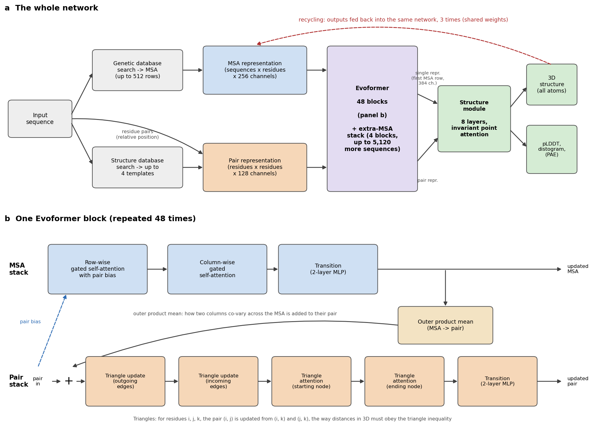
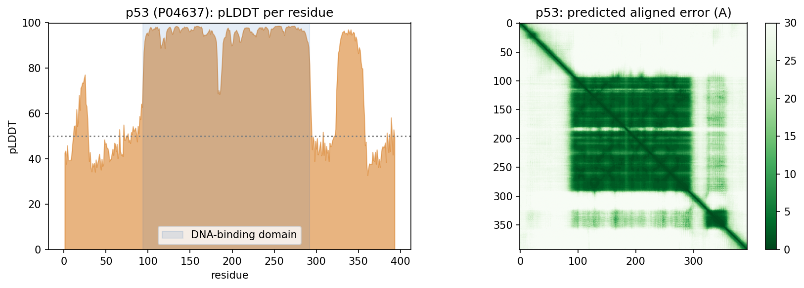
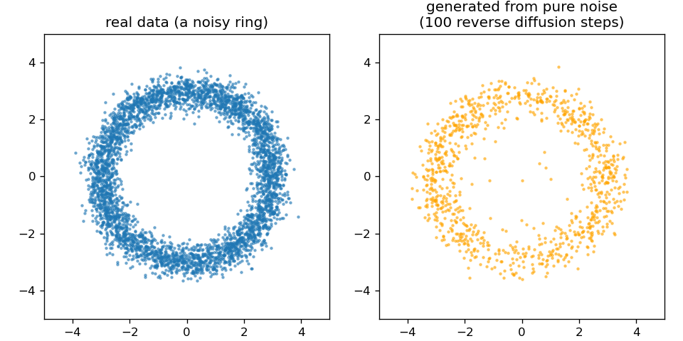

::: callout-note
**Sources for this page:** Arne Elofsson's AlphaFold lecture (*AlphaFold 2026, undervisning*) and diffusion-models lecture (`slides/Diffusion models (undervisning).pdf`), which this page follows; every paper named below is the primary source for its numbers, cited where it is used. Data and models are fetched live from the RCSB PDB, the [AlphaFold Protein Structure Database](https://alphafold.ebi.ac.uk/) (CC BY 4.0) and the ESM Atlas API. All figures were drawn or computed for this course, and every number from our own code was read back from the notebook's output. The "four regions" heuristic in @sec-s12-complexes is taken from the lecture; it has not yet been published as a paper.
:::

# Session 12: AlphaFold and Generative Models of Protein Structure

## Learning goals

By the end of this session you should be able to:

- explain why long-range information is essential for structure prediction, and how evolutionary covariation provided it;
- describe what AlphaFold2 represents internally (an MSA representation and a residue-pair representation that update each other, and a geometry-aware structure module) and why attention and pair representations suit proteins;
- interpret pLDDT and PAE correctly, and explain why confidence is not the same as correctness;
- explain why complexes are harder than single chains, and why a confident complex model does not show that two proteins interact in the cell;
- explain at a high level what a diffusion model does and what AlphaFold3 changed;
- say what current structure predictors cannot tell us.

In Session 6 we treated structure as the answer, and learned to inspect and compare it. Now we ask how that answer can be predicted from sequence. This session closes the course, and nearly every earlier session contributes a piece:

| From | Idea used in modern structure prediction |
|------------------------------------|------------------------------------|
| Sessions 4-5 | alignments and profiles: the evolutionary record of a family |
| Session 6 | structure comparison (TM-score), distance and contact maps, conformational states |
| Session 7 | nonlinear models, and secondary structure from local sequence |
| Session 8 | honest evaluation on proteins unlike the training data |
| Session 9 | training deep networks |
| Session 10 | pairwise maps treated as images, residual networks, invariance |
| Session 11 | attention and protein language models |

The opening question: **what information is missing if we try to predict a residue's structure from its local sequence alone?** Contacts and interactions with residues far away in the sequence. The rest of the session is about where that long-range information comes from, how AlphaFold2 learned to use it, and what we can trust in the result.

## Where does long-range structural information come from? {#sec-s12-af1}

### The folding problem

For many proteins the sequence determines the structure (Anfinsen, 1973, [*Science* 181:223](https://doi.org/10.1126/science.181.4096.223)), yet a protein cannot find that structure by trying every conformation: with even a few states per residue, a random search would take longer than the age of the universe, while real proteins fold in milliseconds to seconds (**Levinthal's paradox**, 1969). Dill & MacCallum ([*Science* 338:1042](https://doi.org/10.1126/science.1219021), 2012) summarised fifty years of work as three questions, the last of which is "can we devise a computer algorithm to predict protein structures from their sequences?"

### Three generations of structure prediction

1.  **Physics and templates (1970s onwards).** Simulate the atoms (molecular dynamics: possible only for small, fast-folding proteins, even on special-purpose computers); copy the structure of a relative (**homology modelling**), or find the known fold a sequence fits best (**threading**, Session 5's profile idea applied to structures); or assemble the chain from short fragments of known proteins with a knowledge-based energy function (**Rosetta**). Blind tests every two years since 1994, the **CASP** experiments (Moult et al. 1995, [*Proteins* 23:ii](https://doi.org/10.1002/prot.340230303)), showed steady progress for proteins with templates, and little for the rest.
2.  **Evolutionary restraints (2011-2019).** Coevolution in large protein families gave long-range contacts, then distances, cleaned up by deep networks (below).
3.  **End-to-end learned geometry (2020).** AlphaFold2 learned the whole path from alignments to atoms.

Local sequence is not enough: the same ten residues can be a strand in one protein and a helix in another (Session 7's chameleon sequences). What was missing was long-range information.

### Coevolution: long-range restraints from evolution

If two residues touch, a mutation in one is often compensated by a mutation in the other, so across a large family of homologs they **co-evolve**. The idea is old (Göbel et al. 1994, [*Proteins* 18:309](https://doi.org/10.1002/prot.340180402)); three things made it work two decades later:

1.  **Better statistics.** Simple correlation between two alignment columns is swamped by phylogeny and by indirect effects (A-B and B-C contacts make A and C look coupled). **Direct coupling analysis** (DCA; Weigt et al. 2009, [*PNAS* 106:67](https://doi.org/10.1073/pnas.0805923106); Morcos et al. 2011, [*PNAS* 108:E1293](https://doi.org/10.1073/pnas.1111471108)) fits one global statistical model to the whole alignment, the maximum-entropy model that reproduces its single-column and column-pair frequencies (Session 1), and separates direct couplings from indirect ones. Because those pairwise couplings capture epistasis, the same kind of model also predicts mutation effects better than an independent profile (EVmutation; Hopf et al. 2017, [*Nat. Biotechnol.* 35:128](https://doi.org/10.1038/nbt.3769)): the interactions Session 9 measured in GB1, learned from an alignment.
2.  **Bigger families.** Sequence databases grew far faster than structure databases, so families became large enough (hundreds to thousands of effective sequences).
3.  **Machine learning on top.** Contacts are not independent pixels. Helices give bands, strand pairs give lines along or across the diagonal, so a network that looks at a whole neighbourhood of the map, Session 10's convolution, can clean up the noisy coevolution signal. In the notebook, 3 × 3 windows centred on real contacts show only 146 of the 256 possible patterns, and a neighbouring pair is in contact 23-42% of the time when the centre pair is, against a base rate of 3.0%. The first discussion problem asks you to read these patterns, which is exactly what a learned **pair representation** exploits.

The figure shows the progress on one protein, the bacterial response regulator CheY, from an alignment of 11,084 homologs. Each method's 128 highest-scoring residue pairs (L = 128, the protein's length) are plotted over the true contacts. Precision rises from 0.49 (mutual information) to 0.73 (DCA), 0.89 (a deep-learning contact predictor) and 0.99 (the contacts in the AlphaFold2 model):

![Contact prediction for CheY (PDB 3CHY), computed in the notebook. Upper triangle: each method's 128 highest-scoring residue pairs (sequence separation of at least 6), blue if the pair is a true contact, red if not. Lower triangle, grey: the true contacts (Cβ atoms within 8 Å). The deep-learning panel uses the contact head of the ESM-2 language model (650M parameters), a stand-in for the contact predictors of 2017-2019, whose software no longer installs. Mutual information's false positives cluster in blocks, from phylogeny and conservation; DCA's are scattered.](figs/session12-contact-progress.png){width="100%"}

Contacts then became **distances**: AlphaFold 1 (Senior et al. 2020, [*Nature* 577:706](https://doi.org/10.1038/s41586-019-1923-7)) and trRosetta (Yang et al. 2020, [*PNAS* 117:1496](https://doi.org/10.1073/pnas.1914677117)) predicted distance distributions between residue pairs with deep residual networks and folded proteins by minimising against them. The blind CASP assessments show how sudden the change was:

{width="80%"}

From CASP9 to CASP11 (2010-2014), contact precision stayed around 20-27%; it reached 47% in CASP12 (2016) and more than 70% in CASP13 (2018). In CASP14, AlphaFold2 made contacts a by-product of predicting the whole structure directly.

::: {.callout-note collapse="true"}
#### Our own lineage: from PconsC to fold-and-dock

The Stockholm group (this course's teachers) contributed to this generation:

- **PconsC2** (Skwark, Raimondi, Michel & Elofsson, 2014, [*PLoS Comput Biol* 10:e1003889](https://doi.org/10.1371/journal.pcbi.1003889)) used "a deep learning approach to identify protein-like contact patterns": random forests applied iteratively over an 11 × 11 window of first-round predictions. It helped most for β-sheet proteins.
- **PconsFold** (Michel et al., 2014, [*Bioinformatics* 30:i482](https://doi.org/10.1093/bioinformatics/btu458)) folded proteins from these contacts, improving model TM-scores by 33% over EVfold. **PconsC3** (2017) predicted accurate contacts for "more than 4000" Pfam families of unknown structure.
- **RaptorX-Contact** (Wang et al. 2017, [*PLoS Comput Biol* 13:e1005324](https://doi.org/10.1371/journal.pcbi.1005324), Session 10) treated the whole contact map as an image for a deep residual network. **PconsC4** (Michel, Menéndez Hurtado & Elofsson, 2019, [*Bioinformatics* 35:2677](https://doi.org/10.1093/bioinformatics/bty1036)) made this fast and "hassle-free", with no GPU needed.
- **AlphaFold 1** (Senior et al. 2020, first shown at CASP13 in 2018; [*Nature* 577:706](https://doi.org/10.1038/s41586-019-1923-7)) and **trRosetta** (Yang et al., 2020, [*PNAS* 117:1496](https://doi.org/10.1073/pnas.1914677117)) predicted **distance distributions** (and, in trRosetta, orientations) instead of binary contacts. They folded by minimising against them. By CASP13 most single-domain proteins could be predicted "quite accurately".
:::

::: {.callout-note collapse="true"}
#### Docking before AlphaFold

Historically, complexes were predicted by docking separately determined or modelled components; modern models predict the chains and their interface jointly. For reference:

Docking asks how two proteins of known structure fit together. It followed its own path, with the same three routes.

- **Shape and physics.** Katchalski-Katzir et al. (1992, [*PNAS* 89:2195](https://doi.org/10.1073/pnas.89.6.2195)) put both proteins on a 3D grid. They scored shape complementarity for every relative translation at once with the fast Fourier transform (FFT). Rotations were sampled exhaustively. This became the standard engine:

  - **GRAMM** used low-resolution grids that tolerate errors in the structures (Vakser 1995, [*Protein Eng* 8:371](https://doi.org/10.1093/protein/8.4.371));
  - **ZDOCK** added electrostatics and desolvation (Chen, Li & Weng 2003, [*Proteins* 52:80](https://doi.org/10.1002/prot.10389)).

  All of them generate thousands of candidate poses, and the hard part is ranking them: the ranking problem again.

- **Data.** **HADDOCK** drives docking with experimental information, such as mutations or NMR data, marking the interface residues (Dominguez, Boelens & Bonvin 2003, [*J Am Chem Soc* 125:1731](https://doi.org/10.1021/ja026939x)).

- **Templates.** Complexes can also be modelled from a related complex of known structure. Templates "are available to model nearly all complexes of structurally characterized proteins" (Kundrotas, Zhu, Janin & Vakser 2012, [*PNAS* 109:9438](https://doi.org/10.1073/pnas.1200678109)). Petras Kundrotas, the first author, teaches on this course.

**CAPRI**, the Critical Assessment of PRedicted Interactions, has been docking's CASP since 2001 (Janin et al. 2003, [*Proteins* 52:2](https://doi.org/10.1002/prot.10381)). DockQ was developed to score its models (Basu & Wallner 2016, [*PLoS One* 11:e0161879](https://doi.org/10.1371/journal.pone.0161879)). Until 2018 the picture was clear. Targets with a template were predicted "very good to excellent", but for 11 difficult targets without one, "medium and high quality models \[were\] submitted for only 3" (Lensink et al. 2019, CASP13-CAPRI, [*Proteins* 87:1200](https://doi.org/10.1002/prot.25838)).

**Coevolution across an interface.** Residues in contact between two proteins co-evolve too, if you can pair up which sequence in one family interacts with which in the other. This is easy for bacterial proteins encoded next to each other, and hard in general. Ovchinnikov, Kamisetty & Baker (2014, [*eLife* 3:e02030](https://doi.org/10.7554/eLife.02030)) and Hopf et al. (2014, [*eLife* 3:e03430](https://doi.org/10.7554/eLife.03430)) used paired alignments to predict interfaces. Together with folding, this led to fold and dock:

- **Fold and dock.** Joining the alignments of two proteins lets the folding machinery predict how they bind. Pozzati et al. (2022, [*Bioinformatics* 38:954](https://doi.org/10.1093/bioinformatics/btab760)) did this with trRosetta, and their PconsDock score separated correct from incorrect models 98% of the time. With AlphaFold2 the same idea became FoldDock (@sec-s12-complexes): folding and docking had become one problem.
:::

#### Further reading

- Dill & MacCallum (2012), [The protein-folding problem, 50 years on](https://doi.org/10.1126/science.1219021)
- Morcos et al. (2011), [Direct-coupling analysis of residue coevolution captures native contacts across many protein families](https://doi.org/10.1073/pnas.1111471108)
- Skwark et al. (2014), [Improved contact predictions using the recognition of protein like contact patterns](https://doi.org/10.1371/journal.pcbi.1003889)

## How AlphaFold2 combines the course's ideas {#sec-s12-af2}

AlphaFold2 (Jumper et al. 2021, [*Nature* 596:583](https://doi.org/10.1038/s41586-021-03819-2)) was "the first computational method that can regularly predict protein structures with atomic accuracy even in cases in which no similar structure is known". At CASP14 its median backbone accuracy was 0.96 Å, against 2.8 Å for the next best method. It is trained end to end to map **sequence-derived, evolutionary and template information** (the target sequence, an alignment of its homologs, and optionally structures of relatives) to atomic coordinates. That distinguishes it from single-sequence methods such as ESMFold, below.

### The data flow

{width="100%"}

Two representations are carried through the whole network:

- the **MSA representation**: a vector for every residue of every aligned sequence;
- the **pair representation**: a vector for every pair of residues, a learned, much richer version of the contact and distance maps above (and of the distance map of β-globin in Session 6).

The **Evoformer** updates both, many times over. Three of its operations carry the main ideas:

- **MSA attention.** Within each aligned sequence, residues attend to each other (Session 11's attention, biased by the current pair representation); within each column, sequences attend to each other, so the network learns which homologs are informative for each position.
- **MSA → pair.** For every pair of columns, how the two columns vary together across the family updates the pair representation: a learned version of coevolution.
- **Triangle updates.** Pair (*i*, *j*) is updated with information passing through every third residue *k*. Residue-pair relationships are not independent: if *i* is close to *k* and *j* is close to *k*, that constrains how *i* and *j* can be related. The authors were inspired by geometric constraints such as the triangle inequality on distances, but the updates are learned operations, not rules that enforce it.

The **structure module** then builds coordinates. Each residue is a rigid **frame** (the position and orientation of its backbone), and **invariant point attention** reasons about the frames in 3D in a way that does not depend on how the whole protein happens to be rotated or translated, the invariance idea of Session 10, now in three dimensions. Finally, **recycling** runs the whole network again with its own outputs as extra inputs, refining the prediction a few times.

In short, AlphaFold2 kept the ingredients of the second generation (alignments, coevolution, contacts, distances, physical plausibility) and turned each into a learnable operation inside one network, trained on the final coordinates.

::: {.callout-note collapse="true"}
#### For reference: AlphaFold2 in detail

{width="100%"}

The numbers below are from the paper and its Supplementary Information.

**1. Inputs.** Three kinds of information go in.

- **An MSA.** Genetic databases are searched for homologs. At inference the network reads a representation of 512 rows: cluster centres of the alignment, plus template information added as extra rows. Up to 5,120 further sequences enter through a lighter **extra-MSA stack** (4 blocks, with a cheaper "global" column attention).
- **Templates.** Up to 4 structures of related proteins, found in the PDB. Only two of the five released models use them, and the network works well without them.
- **The sequence itself**, including the relative position of every pair of residues along the chain.

These are embedded into two representations that are carried through the whole network:

- the **MSA representation**: one 256-number vector for every residue in every sequence (sequences × residues × 256);
- the **pair representation**: one 128-number vector for every pair of residues (residues × residues × 128). This is a learned, much richer version of @sec-s12-af1's contact and distance maps.

**2. The Evoformer: 48 blocks.** Each block updates both representations and lets them talk to each other. In order (figure, panel b):

1.  **Row-wise gated self-attention with pair bias.** Within each aligned sequence, every residue attends to every other residue (Session 11's attention). The attention weights get a bias from the pair representation: what the network currently believes about residues i and j steers how much they attend to each other.
2.  **Column-wise gated self-attention.** Within each column, every sequence attends to every other sequence. The network learns which homologs are informative for this position.
3.  **MSA transition.** A small two-layer network applied to every vector.
4.  **Outer product mean.** For every pair of columns (i, j), the outer product of their vectors is averaged over all sequences and added to pair (i, j). This is the learned version of coevolution: how two columns vary together across the family.
5.  **Triangle multiplicative updates**, "outgoing" and "incoming" edges. Pair (i, j) is updated from the pairs (i, k) and (j, k) for every third residue k. In the authors' words, "many constraints must be satisfied including the triangle inequality on distances. On the basis of this intuition, we arrange the update operations on the pair representation in terms of triangles".
6.  **Triangle self-attention**, around the starting node and around the ending node. The same triangle idea with attention: pair (i, j) attends to all pairs (i, k), with a bias from pair (j, k).
7.  **Pair transition.** A two-layer network on every pair vector.

Every step is added to its input (residual connections, Session 10's ResNet idea) and uses layer normalisation. Dropout is applied during training. The MSA Transformer (Rao et al. 2021) used the same row-and-column attention at about the same time. The idea of learning directly from raw alignments had been explored in rawMSA (Mirabello & Wallner, 2019, [*PLoS One* 14:e0220182](https://doi.org/10.1371/journal.pone.0220182)).

**3. The structure module: 8 layers.** It turns the representations into coordinates. Its input is the pair representation, plus a **single representation**: the first row of the MSA representation (the target sequence), projected to 384 numbers per residue.

- Each residue is a **rigid frame**: the position and orientation of its backbone N, Cα and C atoms, as a rotation and a translation. All frames start at the origin with the same orientation, which the authors call "black hole initialisation".
- **Invariant point attention (IPA)** updates the single representation. It is attention that combines three terms: the residue vectors, the pair representation, and 3D points attached to each residue's current frame. Because distances between points do not change when the whole protein is rotated or moved, the result is **invariant** to global rotations and translations. The network cannot cheat by learning where proteins usually sit in space.
- After each layer, every frame is updated by a small rotation and translation. The 8 layers share their weights, like 8 steps of one refinement.
- Finally, 7 torsion angles per residue (backbone ω, φ, ψ and side-chain χ1-χ4) are predicted and turned into all-atom coordinates.

**4. Recycling.** The whole network is run again with its own outputs fed back as extra inputs: the predicted structure, the pair representation and the first MSA row. At inference it runs 4 times, that is, 3 recycles, with the same weights. Each pass refines the last.

**5. Training.**

- **The main loss is FAPE**, frame aligned point error. Every atom is compared with the true structure in the local frame of every residue, and errors are clamped at 10 Å. Unlike a global RMSD, this penalises wrong local geometry everywhere, and it cannot be satisfied by a mirror image.
- **Auxiliary losses** keep the intermediate representations meaningful:
  - a **distogram** head predicts binned residue-residue distances from the pair representation (64 bins, 2-22 Å): AlphaFold 1's output, now just a side task;
  - a **masked-MSA** head predicts residues hidden in the alignment (15%), like Session 11's BERT;
  - a **pLDDT** head learns to predict the model's own local accuracy (50 bins);
  - fine-tuning adds penalties for impossible geometry, such as clashes and bad bond lengths.
- **Data.** PDB structures released before 30 April 2018. The network was then used to predict about 350,000 sequences from Uniclust30, and these predictions were added to the training data (**self-distillation**).
- **Scale.** Training used crops of 256 residues, then 384 in fine-tuning, on 128 TPU v3 cores: about a week of initial training plus about four days of fine-tuning in the simplified protocol described in the paper.
- **PAE** was added by a further short fine-tuning, to the "pTM" models, with a head that predicts the aligned error between every pair of residues (64 bins, 0-31.5 Å).

**6. Five models.** Five networks were trained with different random seeds, two with templates and three without. All five are run, and the predictions are ranked by pLDDT.
:::

#### Further watching

[*Highly accurate protein structure prediction with AlphaFold*](https://www.youtube.com/watch?v=92j-7b-sRPw) (Simon Kohl, DeepMind), a detailed walk through AlphaFold2's architecture:

```{=html}
<div style="position:relative;padding-bottom:56.25%;height:0;overflow:hidden;max-width:100%;margin-bottom:1em;">
<iframe src="https://www.youtube.com/embed/92j-7b-sRPw" style="position:absolute;top:0;left:0;width:100%;height:100%;border:0;" allowfullscreen title="Highly accurate protein structure prediction with AlphaFold, Simon Kohl"></iframe>
</div>
```

### Confidence: pLDDT and PAE

AlphaFold2's confidence measures are as important as the structure itself, and they answer two different questions:

- **pLDDT** (0-100, per residue): *how trustworthy is the local structure around this residue?* Above 90 is very high, 70-90 confident, below 50 very low.
- **PAE** (predicted aligned error, per pair of residues): *if I align the model on residue (or region) A, how certain is the position of B relative to A?* Low PAE within a domain and high PAE between two domains means that each domain may be right while their relative orientation is unknown. This matters for multi-domain proteins, flexible regions and, below, complexes.

**Low pLDDT means low confidence, not necessarily disorder.** Intrinsic disorder is one common reason, but others are too little evolutionary information, several conformational states, an uncertain domain orientation, or simply the model's limits. And **confidence is not correctness**: a confidence score is the model's own estimate, learned from its training data. The second discussion problem tests how well pLDDT tracks the real error. Checking it on famous proteins is harder than it looks, because well-studied proteins are likely to have close relatives in the training data (Session 8).

**In the notebook.** The AlphaFold DB model of human β-globin (mean pLDDT 97.2) matches the crystal structure 4HHB with TM-score 0.988 and RMSD 0.51 Å. For p53, 30% of the residues have pLDDT below 50. The DNA-binding domain averages 95.3, while the N-terminal transactivation region (47.6) and the C-terminus (45.8) are not confident. For p53 that low confidence matches biology, since these regions are known from experiments to be intrinsically disordered:

{width="100%"}

**Scale and tools.** AlphaFold predicted almost the entire human proteome (Tunyasuvunakool et al. 2021, [*Nature* 596:590](https://doi.org/10.1038/s41586-021-03828-1)), and the AlphaFold Database made predicted structures available for essentially every protein in UniProt (Varadi et al. 2024, [*NAR* 52:D368](https://doi.org/10.1093/nar/gkad1011)). **ColabFold** (Mirdita et al. 2022, [*Nat Methods* 19:679](https://doi.org/10.1038/s41592-022-01488-1)) replaced the slow alignment search with MMseqs2 and put AlphaFold in a Colab notebook. **ESMFold** predicts from a single sequence, using the ESM-2 language model (Session 11) instead of an alignment; in the notebook it predicts Ephrin-A5 in seconds with TM-score 0.941 against the crystal structure (1SHW). In 2024, Demis Hassabis and John Jumper shared half of the [Nobel Prize in Chemistry](https://www.nobelprize.org/prizes/chemistry/2024/summary/) "for protein structure prediction"; the other half went to David Baker "for computational protein design".

**Known limits** (lecture). AlphaFold cannot tell whether a sequence folds at all, or how a mutation changes the structure. It may or may not find alternative conformational states. The arrangement of domains in large flexible or repeated proteins is often arbitrary. It "does not know what a membrane is". In a protein-DNA complex it can place another protein where the DNA should be.

## From single chains to interactions {#sec-s12-complexes}

### Complexes are harder

AlphaFold2 was trained on single chains, yet it can predict complexes when the chains are given together (FoldDock; Bryant, Pozzati & Elofsson 2022, [*Nat Commun* 13:1265](https://doi.org/10.1038/s41467-022-28865-w)). Later, AlphaFold-Multimer (Evans et al. 2021, [bioRxiv](https://doi.org/10.1101/2021.10.04.463034)) was retrained on complexes. Four points matter:

1.  **Paired evolutionary information helps interfaces.** Residues in contact across an interface co-evolve too, if the alignments of the two families can be paired (which sequence interacts with which).
2.  **Interfaces need their own confidence.** AlphaFold-Multimer introduced **ipTM**, a confidence score for the interfaces; FoldDock's **pDockQ** combines the interface pLDDT with the number of interface contacts. A model is compared with the true complex using **DockQ** (0 to 1; at least 0.23 counts as acceptable).
3.  **Interface confidence is harder than chain confidence.** Each chain can be right while their relative placement is wrong, which is exactly what the PAE between chains shows.
4.  **A plausible complex is not evidence of interaction.** A structure predictor can suggest **how** two supplied molecules could interact. It does not establish **whether** they interact in the cell, or when. That is one of the most important messages of this session.

Predicted complexes still lead to biology when combined with other evidence: all-against-all modelling of 14 fertilisation proteins pointed to "a pentameric complex involving sperm IZUMO1, SPACA6, TMEM81 and egg JUNO, CD9" at the egg-sperm fusion synapse (Elofsson et al. 2024, [*eLife* 13:RP93131](https://doi.org/10.7554/eLife.93131)).

### The ranking problem

Generating a good model has become easier than *knowing* which of your models is good: **sampling quality is not ranking quality.**

- **Antibody-antigen complexes** have no coevolution between the partners. On 110 complexes unseen in training, sampling 200 models per complex raised the average DockQ of the *best* model "from below 0.3 to above 0.5", but the models' own confidence often "cannot identify the best predicted structures", so the top-ranked model is much worse than the best one (Fromm, Ludaic & Elofsson 2026, [*Bioinformatics* 42:btag136](https://doi.org/10.1093/bioinformatics/btag136)).
- **Confidence depends on what you include.** Trimming a full-length construct to its interacting domains raises ipTM "even though the structure prediction of the interaction is unchanged"; **ipSAE** counts only residue pairs with good PAE and separates true from false complexes better (Dunbrack 2025, [bioRxiv](https://doi.org/10.1101/2025.02.10.637595)).

The common thread is Session 8's lesson on a grand scale: performance on examples similar to the training data says little about genuinely new ones, and confidence scores do not always know the difference.

### When can a complex prediction be trusted? A practical heuristic

The lecture sorts protein interactions into four regions. This is a heuristic for thinking about when to trust a complex prediction, not an established classification:

| Region | Character | Example | Current methods |
|------------------|------------------|------------------|------------------|
| I, tractable | Stable interfaces, strong coevolution | Obligate heterodimers (Ephrin-A5:EphB2) | Work well |
| II, ambiguity and competition | A plausible interface is easy; the right partner or stoichiometry is hard | Proteasome paralogs; Izumo1 and its competing partners | Struggle to rank the correct partner |
| III, missing coevolution | No joint selective pressure | Antibody-antigen, host-pathogen | AlphaFold3-class models help, partly through memorisation |
| IV, missing context or dynamics | Transient, conditional, disordered | p53 transactivation domain binding MDM2 | Static structure prediction is the wrong tool |

The lab tests this: one AlphaFold3 Server prediction per region, and a look at whether the model's confidence tracks how hard each problem really is.

#### Further reading

- Jumper et al. (2021), [Highly accurate protein structure prediction with AlphaFold](https://doi.org/10.1038/s41586-021-03819-2)
- Bryant, Pozzati & Elofsson (2022), [Improved prediction of protein-protein interactions using AlphaFold2](https://doi.org/10.1038/s41467-022-28865-w)
- Fromm, Ludaic & Elofsson (2026), [Evaluating deep learning based structure prediction methods on antibody-antigen complexes](https://doi.org/10.1093/bioinformatics/btag136)

## Generative structure modelling {#sec-s12-af3}

### Diffusion in one page

A **diffusion model** learns to generate data by learning to remove noise:

1.  **Forward process:** take real data and add a little Gaussian noise step by step, until only noise is left. No learning is needed.
2.  **Training:** show a network a noisy example and its step number, and train it to predict the noise that was added.
3.  **Generation:** start from pure noise and apply the network many times, removing a little noise each step.

{width="70%"}

The idea goes back to Sohl-Dickstein et al. (2015); Ho, Jain & Abbeel ([arXiv:2006.11239](https://arxiv.org/abs/2006.11239), 2020) made it practical, and it is behind image generators such as DALL-E. Two relatives in one sentence each: **flow matching** learns a smooth path from noise to data and needs fewer steps; a **variational autoencoder** generates by decoding samples from a learned low-dimensional space. The third discussion problem asks whether a diffusion model learns a distribution or memorises its training examples.

### AlphaFold3: what changed

AlphaFold3 (Abramson et al. 2024, [*Nature* 630:493](https://doi.org/10.1038/s41586-024-07487-w)) predicts "the joint structure of complexes including proteins, nucleic acids, small molecules, ions and modified residues". Conceptually, four things changed:

- **Broader chemistry.** Its published model was designed to represent proteins, nucleic acids, ligands, ions and modified residues jointly, with residues, nucleotides and single ligand atoms all as tokens.
- **A pair-focused trunk.** The **Pairformer** replaces the Evoformer and works mostly on the pair representation, much less on the alignment.
- **Generative coordinates.** A **diffusion module** replaces the structure module: it starts from random atom positions and denoises them, conditioned on the trunk.
- **All atoms at once**, which is what lets it handle any molecule made of atoms.

Diffusion brings sampling into structure prediction, with two consequences: many seeds can be tried (the ranking problem above), and the model can **hallucinate** plausible-looking structure in regions that should be disordered, which the authors had to counter in training. At CASP16, "AlphaFold3 performs slightly better for protein complexes. However, when massive sampling is applied to AlphaFold2, the difference disappears" (Elofsson 2026, [*Proteins* 94:154](https://doi.org/10.1002/prot.70044)).

#### Where the field is in 2026 (optional, and will age quickly)

**Open reproductions** followed quickly, because AlphaFold3 was released without training code:

- **Boltz-1**: fully open (MIT licence).

- **Boltz-2**: adds binding-affinity prediction, approaching free-energy perturbation "at least 1000× more computationally efficient".

- **Chai-1**: can run without alignments.

- **Protenix**.

- **OpenFold3**: preview release.

- **RoseTTAFold All-Atom** (Krishna et al. 2024, [*Science* 384:eadl2528](https://doi.org/10.1126/science.adl2528)) is an independent architecture.

- **RNA.** Ten methods were benchmarked on RNAs and RNA complexes not seen in training. AlphaFold3 and Boltz-1 lead, but "accuracy depends greatly on similarity to the training set", and the methods "recognize recurring motifs rather than generalize to novel RNA folds" (Ludaic & Elofsson 2026, [*NAR* 54:gkag813](https://doi.org/10.1093/nar/gkag813)).

The field moves fast. Three systems from 2026 show three different ways of moving beyond AlphaFold3.

- **ESMFold2** (Candido et al. 2026, [bioRxiv](https://doi.org/10.64898/2026.06.03.729735); Biohub; MIT licence, open weights). It joins a large protein language model, ESMC (the successor to Session 11's ESM-2), to an AlphaFold3-style diffusion structure module; the whole model has about 6.6 billion parameters. The original ESMFold was built for single chains. ESMFold2 predicts complexes of proteins, nucleic acids and ligands, from single sequences or with an optional alignment. The authors report that it "exceeds the performance of established methods for biomolecular complex prediction across benchmarks, including for the interactions of antibodies with their targets" (Candido et al. 2026). The notebook runs it on one complex from each of the four regions above, five seeds each (figure). For every complex the seed with the highest ipTM is a good model (DockQ 0.61-0.85). For the 1996 D1.3 antibody, though, three of five seeds put the antibody in the wrong place. No single ipTM threshold separates right from wrong across complexes: correct Fab : MHC-I models (ipTM 0.73) score below wrong D1.3 models (0.78).

  

- **IsoDDE**, the Isomorphic Labs Drug Design Engine (Isomorphic Labs 2026, [technical report](https://doi.org/10.5281/zenodo.19699685)). It is proprietary, from DeepMind's drug-discovery sister company. The company claims:

  - on the Runs N' Poses protein-ligand benchmark, more than double AlphaFold3's accuracy for the ligands least similar to the training data;
  - on 334 new antibody-antigen complexes, 2.3 times AlphaFold3 and 19.8 times Boltz-2 at high accuracy (DockQ \> 0.8);
  - binding-affinity predictions that can beat physics-based free-energy methods;
  - binding pockets found from sequence alone.

  There is no code, no model and no independent test, so these are claims, not results. Notice where the claimed gains are: on the examples unlike the training set, where AlphaFold3 is weakest.

- **OpenDDE (Company version)** (2026, [GitHub](https://github.com/aurekaresearch/OpenDDE), APache licence) is an an open-source, all-atom biomolecular foundation model that turns co-folding into a scalable engine for structure prediction, design, and optimization in drug discovery developed by Aureka Research.

  - Reported higher performance on AntiBody-Antigen complexes;

  - Almost 10x the number of training tokens compared with AlphaFold3

- **OpenDDE (Singel researcher version)** (2026, [GitHub](https://github.com/contact-ajmal/opendde), MIT licence) is a community project by a single developer, not affiliated with Isomorphic Labs. It is not a new model. It chains existing open tools behind one web interface:

  - AlphaFold3 for complexes;
  - P2Rank for pockets;
  - Boltz-2 for affinity;
  - ImmuneBuilder for antibodies;
  - ChEMBL and RDKit for known ligands;
  - a language-model assistant.

  It has no benchmarks of its own. It shows what an "engine" is: a pipeline of separate models, each of which can, and should, be evaluated on its own.

The contrast matters for science. Open tools such as ESMFold2, Boltz-2 and OpenFold3 can be tested by anyone, on data they have never seen. A closed system can only be judged by what its owners choose to report.

### Designing new proteins

The same generative machinery runs in reverse. A typical design pipeline:

1.  **RFdiffusion** (Watson et al. 2023, [*Nature* 620:1089](https://doi.org/10.1038/s41586-023-06415-8)) generates a new backbone, for example one that binds a chosen target surface;
2.  **ProteinMPNN** (Dauparas et al. 2022, [*Science* 378:49](https://doi.org/10.1126/science.add2187)) designs a sequence for that backbone;
3.  **AlphaFold2 or ESMFold** refolds the designed sequence, to check that it folds into the intended structure;
4.  **experiments** test whether it does, and whether it works. Refolding is a computational consistency check, not experimental validation. Hundreds of RFdiffusion designs were characterised in the lab, including an influenza-haemagglutinin binder whose cryo-EM structure was "nearly identical to the design model".

#### Further reading

- Abramson et al. (2024), [Accurate structure prediction of biomolecular interactions with AlphaFold 3](https://doi.org/10.1038/s41586-024-07487-w)
- Watson et al. (2023), [De novo design of protein structure and function with RFdiffusion](https://doi.org/10.1038/s41586-023-06415-8)
- Elofsson & Ben-Tal (2026), [What will be the future of computational biology for macromolecules in the era of AI?](https://doi.org/10.1371/journal.pcbi.1014467)

#### Further watching

[*Flow-Matching vs Diffusion Models explained side by side*](https://www.youtube.com/watch?v=firXjwZ_6KI) (AI Coffee Break with Letitia), used in the diffusion lecture:

```{=html}
<div style="position:relative;padding-bottom:56.25%;height:0;overflow:hidden;max-width:100%;margin-bottom:1em;">
<iframe src="https://www.youtube.com/embed/firXjwZ_6KI" style="position:absolute;top:0;left:0;width:100%;height:100%;border:0;" allowfullscreen title="Flow-Matching vs Diffusion Models explained side by side"></iframe>
</div>
```

## The course in one line

Alignment and evolution, plus neural networks, plus attention, plus pair representations, plus geometry: modern structure prediction. And the scientific warning that goes with it: **a model is a hypothesis with confidence estimates, not an experiment.**

## Check your understanding

```{=html}
<div id="session12-quiz"></div>
<script>
renderQuiz("session12-quiz", [
  {
    question: "Why do residues that are in contact in 3D tend to co-evolve across a protein family?",
    choices: [
      "A mutation at one residue that disturbs the contact is often compensated by a mutation at its partner, so the two change together",
      "Residues in contact are always identical",
      "Coevolution only happens in disordered regions",
      "Contacts are copied from a template structure"
    ],
    correctIndex: 0,
    explanation: "Global statistical models (DCA, plmDCA) then separate these direct couplings from indirect correlations."
  },
  {
    question: "In real contact maps, a neighbouring pair is in contact 23-42% of the time when the centre pair is, against a base rate of 3%. Which methods exploited this first?",
    choices: [
      "Predictors that look at a neighbourhood of the map: PconsC2's random forests over an 11x11 window, then deep residual CNNs",
      "Mutual information between single columns",
      "BLAST",
      "Secondary-structure predictors"
    ],
    correctIndex: 0,
    explanation: "A contact map is an image with strong local structure: Session 10's point, used by PconsC2 (2014), RaptorX-Contact (2017) and AlphaFold 1 (2018)."
  },
  {
    question: "An AlphaFold model has pLDDT above 90 in two domains but high predicted aligned error (PAE) between them. What should you conclude?",
    choices: [
      "Each domain is probably correct, but their relative placement is not reliable",
      "Both domains are wrong",
      "The whole model is correct",
      "The protein is intrinsically disordered"
    ],
    correctIndex: 0,
    explanation: "pLDDT is local; PAE measures the confidence in relative positions."
  },
  {
    question: "About 30% of p53's residues have pLDDT below 50 in the AlphaFold DB. What is the most likely explanation?",
    choices: [
      "Those regions are intrinsically disordered in the free protein; the DNA-binding domain itself is predicted with pLDDT ~95",
      "AlphaFold failed because p53 is too long",
      "p53 has no homologs",
      "The model was built without an alignment"
    ],
    correctIndex: 0,
    explanation: "Low pLDDT means low confidence. For p53 it matches regions known from experiments to be disordered (the transactivation domain folds only when bound to partners such as MDM2, Region IV); for other proteins low confidence can have other causes."
  },
  {
    question: "What did AlphaFold3 change compared with AlphaFold2?",
    choices: [
      "A Pairformer replaces the Evoformer, and a diffusion module generates raw atom coordinates, so ligands, nucleic acids and ions can be modelled",
      "It stopped using attention",
      "It predicts only secondary structure",
      "It no longer needs any training data"
    ],
    correctIndex: 0,
    explanation: "The diffusion module starts from random atom positions and denoises them, conditioned on the Pairformer's representation."
  },
  {
    question: "For antibody-antigen complexes, the best of 200 AlphaFold3 models has much higher DockQ than the top-ranked one. What does this show?",
    choices: [
      "Generating a correct model is easier than recognising it: the confidence score (ranking) is the bottleneck",
      "More sampling never helps",
      "Antibodies cannot be modelled at all",
      "DockQ is a poor measure"
    ],
    correctIndex: 0,
    explanation: "Fromm, Ludaic and Elofsson (2026); learned rankers and interface-specific scores such as ipSAE address this."
  },
  {
    question: "In the four-regions framework, why is an antibody-antigen complex (Region III) harder than an obligate heterodimer (Region I)?",
    choices: [
      "Antibody and antigen have not co-evolved, so the alignments carry no coevolutionary signal about the interface",
      "Antibodies are too large for AlphaFold",
      "Antigens are always disordered",
      "Region III complexes have no crystal structures"
    ],
    correctIndex: 0,
    explanation: "Without coevolution, the model must rely on learned structural patterns, and gains partly trace to memorisation."
  },
  {
    question: "How do RFdiffusion and ProteinMPNN divide the work of designing a new protein?",
    choices: [
      "RFdiffusion generates a new backbone by denoising; ProteinMPNN designs a sequence that should fold into it",
      "ProteinMPNN predicts structures, RFdiffusion aligns sequences",
      "Both only predict natural protein structures",
      "RFdiffusion designs the sequence and ProteinMPNN the backbone"
    ],
    correctIndex: 0,
    explanation: "Designs are then checked by refolding the sequence with AlphaFold2 or ESMFold, a computational consistency check, not experimental validation."
  },
  {
    question: "In the CheY contact maps on this page, mutual information reaches top-L precision 0.49 and DCA 0.73 from the same alignment. What does DCA do differently?",
    choices: [
      "It fits one global model to the whole alignment, which separates direct couplings from indirect correlations passed along chains of contacts",
      "It uses a larger alignment",
      "It uses the crystal structure",
      "It only looks at conserved columns"
    ],
    correctIndex: 0,
    explanation: "If A touches B and B touches C, A and C look correlated. A global (Potts) model explains that correlation through the A-B and B-C couplings."
  },
  {
    question: "Why is AlphaFold2's invariant point attention (IPA) built to be invariant to rotating and moving the whole protein?",
    choices: [
      "A protein's structure does not depend on where it sits in space, so the network should not waste effort learning, or be misled by, global position and orientation",
      "It makes the network faster on GPUs",
      "Proteins in crystals never rotate",
      "It is needed to read the MSA"
    ],
    correctIndex: 0,
    explanation: "IPA uses distances between points attached to residue frames, which do not change under global rotations and translations."
  },
  {
    question: "A region of an AlphaFold2 model has pLDDT below 50. Which conclusion is justified?",
    choices: [
      "The model is not confident about that region; disorder is one common reason, but too few homologs, several conformations or an uncertain domain orientation can also cause it",
      "The region is certainly intrinsically disordered",
      "The region has been shown experimentally to be unstructured",
      "The rest of the model must be wrong too"
    ],
    correctIndex: 0,
    explanation: "pLDDT is the model's own confidence estimate. Interpreting low confidence as disorder needs independent evidence."
  },
  {
    question: "AlphaFold3 returns a confident model (high ipTM) for two human proteins you submitted together. What does this establish?",
    choices: [
      "How the two proteins could interact, if they do; not whether they actually interact in the cell, or when",
      "That the two proteins interact in the cell",
      "That the interaction has been measured experimentally",
      "That no other partner can bind either protein"
    ],
    correctIndex: 0,
    explanation: "Structure predictors suggest HOW supplied molecules could fit together; WHETHER they interact needs other evidence. A model is a hypothesis with confidence estimates, not an experiment."
  }
]);
</script>
```

## The notebook

`notebooks/session12-alphafold-and-generative-models-in-code.ipynb` computes the numbers on this page:

1.  Contact prediction for CheY by mutual information and DCA, computed from an alignment, and compared with ESM-2 and AlphaFold2; 3 × 3 contact patterns in eight real structures.
2.  AlphaFold DB models of β-globin and p53 with pLDDT and PAE; the β-globin model against its crystal structure; ESMFold on Ephrin-A5; ESMFold2 models of five complexes scored with DockQ.
3.  The forward noising of a diffusion model, and a small diffusion model generating points from noise.

It runs on a CPU in a few minutes. Open it in [Google Colab](https://colab.research.google.com/github/ElofssonLab/kb8029-book/blob/main/notebooks/session12-alphafold-and-generative-models-in-code.ipynb).

## The lab

**Full lab:** adapted from the previous course's AlphaFold2 lab and the 2026 AlphaFold3 Server exercise. Your group runs one of four targets on the [AlphaFold Server](https://alphafoldserver.com), one per region of the four-regions heuristic on this page:

- Region I: Ephrin-A5 : EphB2 (1SHW);
- Region II: Izumo1 : Juno (5F4E);
- Region III: antibody : antigen (8TQ7);
- Region IV: p53 peptide : MDM2 (1YCR).

Work through [`notebooks/session12-lab.ipynb`](https://colab.research.google.com/github/ElofssonLab/kb8029-book/blob/main/notebooks/session12-lab.ipynb), replacing every `todo(...)` call with your own code:

1.  fetch your target's chain sequences from the PDB and submit them to the AlphaFold Server (20 jobs per day and account);
2.  read AlphaFold DB models: pLDDT, the PAE matrix, a hydrogen bond, which models are disordered, and how closely a model matches its crystal structure;
3.  load your AlphaFold Server result, plot its PAE heatmap, and compute pTM, ipTM and the interface score ipSAE;
4.  pool the class's results and compare ipTM with ipSAE across the four regions;
5.  superimpose your model on the crystal structure in PyMOL.

### Submitting this lab

This lab is administered through Canvas, not this book — see the course's Canvas page for the current quiz, deadline, and submission mechanism.

## What's next

The capstone project: predicting secondary structure, the problem this course met on Session 7, now with every tool from Sessions 5-12 at hand.